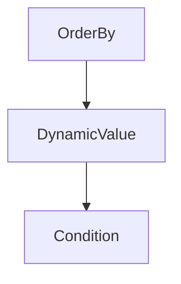

# Chapter 2: Chat Completions

Welcome to **Chapter 2: Chat Completions**. In this part of **OpenAI Python SDK Tutorial: Production API Patterns**, you will build an intuitive mental model first, then move into concrete implementation details and practical production tradeoffs.


Chat Completions remains important for existing systems even as new builds move to Responses-first flows.

## Basic Message-Based Request

```python
from openai import OpenAI

client = OpenAI()

completion = client.chat.completions.create(
    model="gpt-5.2",
    messages=[
        {"role": "developer", "content": "Be concise and structured."},
        {"role": "user", "content": "Explain exponential backoff in 2 bullets."}
    ]
)

print(completion.choices[0].message.content)
```

## Streaming Pattern

```python
stream = client.chat.completions.create(
    model="gpt-5.2",
    messages=[{"role": "user", "content": "List 5 SRE runbook checks."}],
    stream=True
)

for chunk in stream:
    delta = chunk.choices[0].delta
    if delta and delta.content:
        print(delta.content, end="", flush=True)
```

## When to Keep Chat Completions

- existing production systems with stable message middleware
- deeply integrated toolchains using current message schemas
- migration phases where Responses API adoption is incremental

## When to Prefer Responses

- new services
- multimodal and unified response flows
- systems that need cleaner forward compatibility with current OpenAI platform direction

## Summary

You can now support legacy/interoperable message workflows while planning Responses-first migration.

Next: [Chapter 3: Embeddings and Search](03-embeddings-search.md)

## Depth Expansion Playbook

## Source Code Walkthrough

### `examples/parsing_tools.py`

The `OrderBy` class in [`examples/parsing_tools.py`](https://github.com/openai/openai-python/blob/HEAD/examples/parsing_tools.py) handles a key part of this chapter's functionality:

```py


class OrderBy(str, Enum):
    asc = "asc"
    desc = "desc"


class DynamicValue(BaseModel):
    column_name: str


class Condition(BaseModel):
    column: str
    operator: Operator
    value: Union[str, int, DynamicValue]


class Query(BaseModel):
    table_name: Table
    columns: List[Column]
    conditions: List[Condition]
    order_by: OrderBy


client = OpenAI()

completion = client.chat.completions.parse(
    model="gpt-4o-2024-08-06",
    messages=[
        {
            "role": "system",
            "content": "You are a helpful assistant. The current date is August 6, 2024. You help users query for the data they are looking for by calling the query function.",
```

This class is important because it defines how OpenAI Python SDK Tutorial: Production API Patterns implements the patterns covered in this chapter.

### `examples/parsing_tools.py`

The `DynamicValue` class in [`examples/parsing_tools.py`](https://github.com/openai/openai-python/blob/HEAD/examples/parsing_tools.py) handles a key part of this chapter's functionality:

```py


class DynamicValue(BaseModel):
    column_name: str


class Condition(BaseModel):
    column: str
    operator: Operator
    value: Union[str, int, DynamicValue]


class Query(BaseModel):
    table_name: Table
    columns: List[Column]
    conditions: List[Condition]
    order_by: OrderBy


client = OpenAI()

completion = client.chat.completions.parse(
    model="gpt-4o-2024-08-06",
    messages=[
        {
            "role": "system",
            "content": "You are a helpful assistant. The current date is August 6, 2024. You help users query for the data they are looking for by calling the query function.",
        },
        {
            "role": "user",
            "content": "look up all my orders in november of last year that were fulfilled but not delivered on time",
        },
```

This class is important because it defines how OpenAI Python SDK Tutorial: Production API Patterns implements the patterns covered in this chapter.

### `examples/parsing_tools.py`

The `Condition` class in [`examples/parsing_tools.py`](https://github.com/openai/openai-python/blob/HEAD/examples/parsing_tools.py) handles a key part of this chapter's functionality:

```py


class Condition(BaseModel):
    column: str
    operator: Operator
    value: Union[str, int, DynamicValue]


class Query(BaseModel):
    table_name: Table
    columns: List[Column]
    conditions: List[Condition]
    order_by: OrderBy


client = OpenAI()

completion = client.chat.completions.parse(
    model="gpt-4o-2024-08-06",
    messages=[
        {
            "role": "system",
            "content": "You are a helpful assistant. The current date is August 6, 2024. You help users query for the data they are looking for by calling the query function.",
        },
        {
            "role": "user",
            "content": "look up all my orders in november of last year that were fulfilled but not delivered on time",
        },
    ],
    tools=[
        openai.pydantic_function_tool(Query),
    ],
```

This class is important because it defines how OpenAI Python SDK Tutorial: Production API Patterns implements the patterns covered in this chapter.


## How These Components Connect


