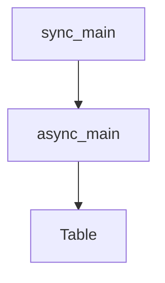

# Chapter 2: Chat Completions

Welcome to **Chapter 2: Chat Completions**. In this part of **OpenAI Python SDK Tutorial: Production API Patterns**, you will build an intuitive mental model first, then move into concrete implementation details and practical production tradeoffs.


Chat Completions remains important for existing systems even as new builds move to Responses-first flows.

## Basic Message-Based Request

```python
from openai import OpenAI

client = OpenAI()

completion = client.chat.completions.create(
    model="gpt-5.2",
    messages=[
        {"role": "developer", "content": "Be concise and structured."},
        {"role": "user", "content": "Explain exponential backoff in 2 bullets."}
    ]
)

print(completion.choices[0].message.content)
```

## Streaming Pattern

```python
stream = client.chat.completions.create(
    model="gpt-5.2",
    messages=[{"role": "user", "content": "List 5 SRE runbook checks."}],
    stream=True
)

for chunk in stream:
    delta = chunk.choices[0].delta
    if delta and delta.content:
        print(delta.content, end="", flush=True)
```

## When to Keep Chat Completions

- existing production systems with stable message middleware
- deeply integrated toolchains using current message schemas
- migration phases where Responses API adoption is incremental

## When to Prefer Responses

- new services
- multimodal and unified response flows
- systems that need cleaner forward compatibility with current OpenAI platform direction

## Summary

You can now support legacy/interoperable message workflows while planning Responses-first migration.

Next: [Chapter 3: Embeddings and Search](03-embeddings-search.md)

## Source Code Walkthrough

### `examples/azure_ad.py`

The `sync_main` function in [`examples/azure_ad.py`](https://github.com/openai/openai-python/blob/HEAD/examples/azure_ad.py) handles a key part of this chapter's functionality:

```py


def sync_main() -> None:
    from azure.identity import DefaultAzureCredential, get_bearer_token_provider

    token_provider: AzureADTokenProvider = get_bearer_token_provider(DefaultAzureCredential(), scopes)

    client = AzureOpenAI(
        api_version=api_version,
        azure_endpoint=endpoint,
        azure_ad_token_provider=token_provider,
    )

    completion = client.chat.completions.create(
        model=deployment_name,
        messages=[
            {
                "role": "user",
                "content": "How do I output all files in a directory using Python?",
            }
        ],
    )

    print(completion.to_json())


async def async_main() -> None:
    from azure.identity.aio import DefaultAzureCredential, get_bearer_token_provider

    token_provider: AsyncAzureADTokenProvider = get_bearer_token_provider(DefaultAzureCredential(), scopes)

    client = AsyncAzureOpenAI(
```

This function is important because it defines how OpenAI Python SDK Tutorial: Production API Patterns implements the patterns covered in this chapter.

### `examples/azure_ad.py`

The `async_main` function in [`examples/azure_ad.py`](https://github.com/openai/openai-python/blob/HEAD/examples/azure_ad.py) handles a key part of this chapter's functionality:

```py


async def async_main() -> None:
    from azure.identity.aio import DefaultAzureCredential, get_bearer_token_provider

    token_provider: AsyncAzureADTokenProvider = get_bearer_token_provider(DefaultAzureCredential(), scopes)

    client = AsyncAzureOpenAI(
        api_version=api_version,
        azure_endpoint=endpoint,
        azure_ad_token_provider=token_provider,
    )

    completion = await client.chat.completions.create(
        model=deployment_name,
        messages=[
            {
                "role": "user",
                "content": "How do I output all files in a directory using Python?",
            }
        ],
    )

    print(completion.to_json())


sync_main()

asyncio.run(async_main())

```

This function is important because it defines how OpenAI Python SDK Tutorial: Production API Patterns implements the patterns covered in this chapter.

### `examples/parsing_tools.py`

The `Table` class in [`examples/parsing_tools.py`](https://github.com/openai/openai-python/blob/HEAD/examples/parsing_tools.py) handles a key part of this chapter's functionality:

```py


class Table(str, Enum):
    orders = "orders"
    customers = "customers"
    products = "products"


class Column(str, Enum):
    id = "id"
    status = "status"
    expected_delivery_date = "expected_delivery_date"
    delivered_at = "delivered_at"
    shipped_at = "shipped_at"
    ordered_at = "ordered_at"
    canceled_at = "canceled_at"


class Operator(str, Enum):
    eq = "="
    gt = ">"
    lt = "<"
    le = "<="
    ge = ">="
    ne = "!="


class OrderBy(str, Enum):
    asc = "asc"
    desc = "desc"


```

This class is important because it defines how OpenAI Python SDK Tutorial: Production API Patterns implements the patterns covered in this chapter.


## How These Components Connect


