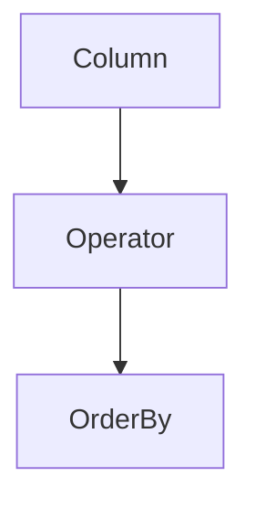

# Chapter 3: Embeddings and Search

Welcome to **Chapter 3: Embeddings and Search**. In this part of **OpenAI Python SDK Tutorial: Production API Patterns**, you will build an intuitive mental model first, then move into concrete implementation details and practical production tradeoffs.


Embeddings power retrieval quality in most production RAG systems.

## Create Embeddings

```python
from openai import OpenAI

client = OpenAI()

docs = [
    "Retry transient failures with exponential backoff.",
    "Use idempotency keys for side-effecting writes.",
    "Track p95 and p99 latency separately."
]

emb = client.embeddings.create(
    model="text-embedding-3-small",
    input=docs,
)

vectors = [row.embedding for row in emb.data]
print(len(vectors), len(vectors[0]))
```

## Retrieval Pipeline Blueprint

1. chunk source docs with semantic boundaries
2. generate embeddings and store vectors + metadata
3. retrieve top-k candidates by similarity
4. re-rank or filter by business constraints
5. pass compact context to generation layer

## Quality Controls

- maintain versioned chunking strategy
- keep source timestamps for freshness checks
- evaluate retrieval quality with labeled benchmark queries

## Summary

You now have the core pieces to build and evaluate a robust embeddings-backed retrieval system.

Next: [Chapter 4: Agents and Assistants](04-assistants-api.md)

## Source Code Walkthrough

### `examples/parsing_tools.py`

The `Column` class in [`examples/parsing_tools.py`](https://github.com/openai/openai-python/blob/HEAD/examples/parsing_tools.py) handles a key part of this chapter's functionality:

```py


class Column(str, Enum):
    id = "id"
    status = "status"
    expected_delivery_date = "expected_delivery_date"
    delivered_at = "delivered_at"
    shipped_at = "shipped_at"
    ordered_at = "ordered_at"
    canceled_at = "canceled_at"


class Operator(str, Enum):
    eq = "="
    gt = ">"
    lt = "<"
    le = "<="
    ge = ">="
    ne = "!="


class OrderBy(str, Enum):
    asc = "asc"
    desc = "desc"


class DynamicValue(BaseModel):
    column_name: str


class Condition(BaseModel):
    column: str
```

This class is important because it defines how OpenAI Python SDK Tutorial: Production API Patterns implements the patterns covered in this chapter.

### `examples/parsing_tools.py`

The `Operator` class in [`examples/parsing_tools.py`](https://github.com/openai/openai-python/blob/HEAD/examples/parsing_tools.py) handles a key part of this chapter's functionality:

```py


class Operator(str, Enum):
    eq = "="
    gt = ">"
    lt = "<"
    le = "<="
    ge = ">="
    ne = "!="


class OrderBy(str, Enum):
    asc = "asc"
    desc = "desc"


class DynamicValue(BaseModel):
    column_name: str


class Condition(BaseModel):
    column: str
    operator: Operator
    value: Union[str, int, DynamicValue]


class Query(BaseModel):
    table_name: Table
    columns: List[Column]
    conditions: List[Condition]
    order_by: OrderBy

```

This class is important because it defines how OpenAI Python SDK Tutorial: Production API Patterns implements the patterns covered in this chapter.

### `examples/parsing_tools.py`

The `OrderBy` class in [`examples/parsing_tools.py`](https://github.com/openai/openai-python/blob/HEAD/examples/parsing_tools.py) handles a key part of this chapter's functionality:

```py


class OrderBy(str, Enum):
    asc = "asc"
    desc = "desc"


class DynamicValue(BaseModel):
    column_name: str


class Condition(BaseModel):
    column: str
    operator: Operator
    value: Union[str, int, DynamicValue]


class Query(BaseModel):
    table_name: Table
    columns: List[Column]
    conditions: List[Condition]
    order_by: OrderBy


client = OpenAI()

completion = client.chat.completions.parse(
    model="gpt-4o-2024-08-06",
    messages=[
        {
            "role": "system",
            "content": "You are a helpful assistant. The current date is August 6, 2024. You help users query for the data they are looking for by calling the query function.",
```

This class is important because it defines how OpenAI Python SDK Tutorial: Production API Patterns implements the patterns covered in this chapter.


## How These Components Connect


