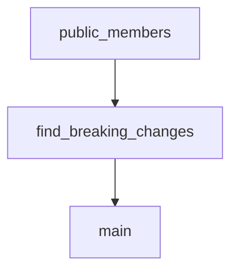

# Chapter 4: Agents and Assistants

Welcome to **Chapter 4: Agents and Assistants**. In this part of **OpenAI Python SDK Tutorial: Production API Patterns**, you will build an intuitive mental model first, then move into concrete implementation details and practical production tradeoffs.


This chapter focuses on transition strategy: operate existing assistants safely while moving toward current agent-platform patterns.

## Current State

- Assistants API is still usable in many systems.
- OpenAI platform docs indicate a target sunset timeline around **August 26, 2026**.
- New projects should evaluate Responses API + Agents patterns first.

## Existing Assistants Workflow (Legacy/Transition)

```python
from openai import OpenAI

client = OpenAI()

assistant = client.beta.assistants.create(
    model="gpt-5.2",
    name="Ops Assistant",
    instructions="Help with reliability planning and incident response."
)

thread = client.beta.threads.create()
client.beta.threads.messages.create(
    thread_id=thread.id,
    role="user",
    content="Draft a rollback checklist for a risky deployment."
)
```

## Migration Playbook

1. catalog Assistants API usage and tool dependencies
2. extract shared prompt/tool contracts
3. rebuild core flows on Responses/Agents primitives
4. run side-by-side output comparisons
5. cut over service by service

## Risk Controls During Migration

- avoid broad rewrites in one release
- pin SDK versions per service
- keep rollback path to known-good behavior
- monitor quality regressions with fixed eval sets

## Summary

You can now manage assistant-era systems while executing a controlled migration plan.

Next: [Chapter 5: Batch Processing](05-batch-processing.md)

## Depth Expansion Playbook

## Source Code Walkthrough

### `scripts/detect-breaking-changes.py`

The `public_members` function in [`scripts/detect-breaking-changes.py`](https://github.com/openai/openai-python/blob/HEAD/scripts/detect-breaking-changes.py) handles a key part of this chapter's functionality:

```py


def public_members(obj: griffe.Object | griffe.Alias) -> dict[str, griffe.Object | griffe.Alias]:
    if isinstance(obj, griffe.Alias):
        # ignore imports for now, they're technically part of the public API
        # but we don't have good preventative measures in place to prevent
        # changing them
        return {}

    return {name: value for name, value in obj.all_members.items() if not name.startswith("_")}


def find_breaking_changes(
    new_obj: griffe.Object | griffe.Alias,
    old_obj: griffe.Object | griffe.Alias,
    *,
    path: list[str],
) -> Iterator[Text | str]:
    new_members = public_members(new_obj)
    old_members = public_members(old_obj)

    for name, old_member in old_members.items():
        if isinstance(old_member, griffe.Alias) and len(path) > 2:
            # ignore imports in `/types/` for now, they're technically part of the public API
            # but we don't have good preventative measures in place to prevent changing them
            continue

        new_member = new_members.get(name)
        if new_member is None:
            cls_name = old_member.__class__.__name__
            yield Text(f"({cls_name})", style=Style(color="rgb(119, 119, 119)"))
            yield from [" " for _ in range(10 - len(cls_name))]
```

This function is important because it defines how OpenAI Python SDK Tutorial: Production API Patterns implements the patterns covered in this chapter.

### `scripts/detect-breaking-changes.py`

The `find_breaking_changes` function in [`scripts/detect-breaking-changes.py`](https://github.com/openai/openai-python/blob/HEAD/scripts/detect-breaking-changes.py) handles a key part of this chapter's functionality:

```py


def find_breaking_changes(
    new_obj: griffe.Object | griffe.Alias,
    old_obj: griffe.Object | griffe.Alias,
    *,
    path: list[str],
) -> Iterator[Text | str]:
    new_members = public_members(new_obj)
    old_members = public_members(old_obj)

    for name, old_member in old_members.items():
        if isinstance(old_member, griffe.Alias) and len(path) > 2:
            # ignore imports in `/types/` for now, they're technically part of the public API
            # but we don't have good preventative measures in place to prevent changing them
            continue

        new_member = new_members.get(name)
        if new_member is None:
            cls_name = old_member.__class__.__name__
            yield Text(f"({cls_name})", style=Style(color="rgb(119, 119, 119)"))
            yield from [" " for _ in range(10 - len(cls_name))]
            yield f" {'.'.join(path)}.{name}"
            yield "\n"
            continue

        yield from find_breaking_changes(new_member, old_member, path=[*path, name])


def main() -> None:
    try:
        against_ref = sys.argv[1]
```

This function is important because it defines how OpenAI Python SDK Tutorial: Production API Patterns implements the patterns covered in this chapter.

### `scripts/detect-breaking-changes.py`

The `main` function in [`scripts/detect-breaking-changes.py`](https://github.com/openai/openai-python/blob/HEAD/scripts/detect-breaking-changes.py) handles a key part of this chapter's functionality:

```py


def main() -> None:
    try:
        against_ref = sys.argv[1]
    except IndexError as err:
        raise RuntimeError("You must specify a base ref to run breaking change detection against") from err

    package = griffe.load(
        "openai",
        search_paths=[Path(__file__).parent.parent.joinpath("src")],
    )
    old_package = griffe.load_git(
        "openai",
        ref=against_ref,
        search_paths=["src"],
    )
    assert isinstance(package, griffe.Module)
    assert isinstance(old_package, griffe.Module)

    output = list(find_breaking_changes(package, old_package, path=["openai"]))
    if output:
        rich.print(Text("Breaking changes detected!", style=Style(color="rgb(165, 79, 87)")))
        rich.print()

        for text in output:
            rich.print(text, end="")

        sys.exit(1)


main()
```

This function is important because it defines how OpenAI Python SDK Tutorial: Production API Patterns implements the patterns covered in this chapter.


## How These Components Connect


