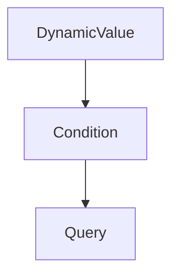

# Chapter 4: Agents and Assistants

Welcome to **Chapter 4: Agents and Assistants**. In this part of **OpenAI Python SDK Tutorial: Production API Patterns**, you will build an intuitive mental model first, then move into concrete implementation details and practical production tradeoffs.


This chapter focuses on transition strategy: operate existing assistants safely while moving toward current agent-platform patterns.

## Current State

- Assistants API is still usable in many systems.
- OpenAI platform docs indicate a target sunset timeline around **August 26, 2026**.
- New projects should evaluate Responses API + Agents patterns first.

## Existing Assistants Workflow (Legacy/Transition)

```python
from openai import OpenAI

client = OpenAI()

assistant = client.beta.assistants.create(
    model="gpt-5.2",
    name="Ops Assistant",
    instructions="Help with reliability planning and incident response."
)

thread = client.beta.threads.create()
client.beta.threads.messages.create(
    thread_id=thread.id,
    role="user",
    content="Draft a rollback checklist for a risky deployment."
)
```

## Migration Playbook

1. catalog Assistants API usage and tool dependencies
2. extract shared prompt/tool contracts
3. rebuild core flows on Responses/Agents primitives
4. run side-by-side output comparisons
5. cut over service by service

## Risk Controls During Migration

- avoid broad rewrites in one release
- pin SDK versions per service
- keep rollback path to known-good behavior
- monitor quality regressions with fixed eval sets

## Summary

You can now manage assistant-era systems while executing a controlled migration plan.

Next: [Chapter 5: Batch Processing](05-batch-processing.md)

## Source Code Walkthrough

### `examples/parsing_tools.py`

The `DynamicValue` class in [`examples/parsing_tools.py`](https://github.com/openai/openai-python/blob/HEAD/examples/parsing_tools.py) handles a key part of this chapter's functionality:

```py


class DynamicValue(BaseModel):
    column_name: str


class Condition(BaseModel):
    column: str
    operator: Operator
    value: Union[str, int, DynamicValue]


class Query(BaseModel):
    table_name: Table
    columns: List[Column]
    conditions: List[Condition]
    order_by: OrderBy


client = OpenAI()

completion = client.chat.completions.parse(
    model="gpt-4o-2024-08-06",
    messages=[
        {
            "role": "system",
            "content": "You are a helpful assistant. The current date is August 6, 2024. You help users query for the data they are looking for by calling the query function.",
        },
        {
            "role": "user",
            "content": "look up all my orders in november of last year that were fulfilled but not delivered on time",
        },
```

This class is important because it defines how OpenAI Python SDK Tutorial: Production API Patterns implements the patterns covered in this chapter.

### `examples/parsing_tools.py`

The `Condition` class in [`examples/parsing_tools.py`](https://github.com/openai/openai-python/blob/HEAD/examples/parsing_tools.py) handles a key part of this chapter's functionality:

```py


class Condition(BaseModel):
    column: str
    operator: Operator
    value: Union[str, int, DynamicValue]


class Query(BaseModel):
    table_name: Table
    columns: List[Column]
    conditions: List[Condition]
    order_by: OrderBy


client = OpenAI()

completion = client.chat.completions.parse(
    model="gpt-4o-2024-08-06",
    messages=[
        {
            "role": "system",
            "content": "You are a helpful assistant. The current date is August 6, 2024. You help users query for the data they are looking for by calling the query function.",
        },
        {
            "role": "user",
            "content": "look up all my orders in november of last year that were fulfilled but not delivered on time",
        },
    ],
    tools=[
        openai.pydantic_function_tool(Query),
    ],
```

This class is important because it defines how OpenAI Python SDK Tutorial: Production API Patterns implements the patterns covered in this chapter.

### `examples/parsing_tools.py`

The `Query` class in [`examples/parsing_tools.py`](https://github.com/openai/openai-python/blob/HEAD/examples/parsing_tools.py) handles a key part of this chapter's functionality:

```py


class Query(BaseModel):
    table_name: Table
    columns: List[Column]
    conditions: List[Condition]
    order_by: OrderBy


client = OpenAI()

completion = client.chat.completions.parse(
    model="gpt-4o-2024-08-06",
    messages=[
        {
            "role": "system",
            "content": "You are a helpful assistant. The current date is August 6, 2024. You help users query for the data they are looking for by calling the query function.",
        },
        {
            "role": "user",
            "content": "look up all my orders in november of last year that were fulfilled but not delivered on time",
        },
    ],
    tools=[
        openai.pydantic_function_tool(Query),
    ],
)

tool_call = (completion.choices[0].message.tool_calls or [])[0]
rich.print(tool_call.function)
assert isinstance(tool_call.function.parsed_arguments, Query)
print(tool_call.function.parsed_arguments.table_name)
```

This class is important because it defines how OpenAI Python SDK Tutorial: Production API Patterns implements the patterns covered in this chapter.


## How These Components Connect


