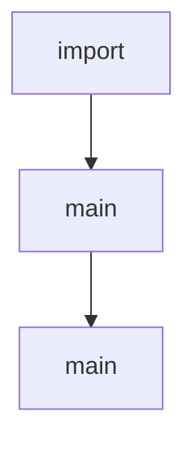

# Chapter 5: Batch Processing

Welcome to **Chapter 5: Batch Processing**. In this part of **OpenAI Python SDK Tutorial: Production API Patterns**, you will build an intuitive mental model first, then move into concrete implementation details and practical production tradeoffs.


Batch processing is useful for large asynchronous workloads where per-request latency is less important.

## Build Input File

```python
import json
from pathlib import Path

rows = [
    {
        "custom_id": "job-1",
        "method": "POST",
        "url": "/v1/responses",
        "body": {"model": "gpt-5.2", "input": "Summarize this incident report."}
    },
    {
        "custom_id": "job-2",
        "method": "POST",
        "url": "/v1/responses",
        "body": {"model": "gpt-5.2", "input": "Extract top 3 risks from this change plan."}
    }
]

path = Path("batch_input.jsonl")
with path.open("w", encoding="utf-8") as f:
    for row in rows:
        f.write(json.dumps(row) + "\n")
```

## Submit Batch

```python
from openai import OpenAI

client = OpenAI()

upload = client.files.create(file=open("batch_input.jsonl", "rb"), purpose="batch")
batch = client.batches.create(
    input_file_id=upload.id,
    endpoint="/v1/responses",
    completion_window="24h"
)
print(batch.id, batch.status)
```

## Operational Practices

- make `custom_id` deterministic for reconciliation
- shard very large jobs
- store both input and output artifacts
- alert on partial-failure rates

## Summary

You now have a scalable asynchronous processing pattern for bulk OpenAI workloads.

Next: [Chapter 6: Fine-Tuning](06-fine-tuning.md)

## Source Code Walkthrough

### `examples/parsing_tools.py`

The `import` interface in [`examples/parsing_tools.py`](https://github.com/openai/openai-python/blob/HEAD/examples/parsing_tools.py) handles a key part of this chapter's functionality:

```py
from enum import Enum
from typing import List, Union

import rich
from pydantic import BaseModel

import openai
from openai import OpenAI


class Table(str, Enum):
    orders = "orders"
    customers = "customers"
    products = "products"


class Column(str, Enum):
    id = "id"
    status = "status"
    expected_delivery_date = "expected_delivery_date"
    delivered_at = "delivered_at"
    shipped_at = "shipped_at"
    ordered_at = "ordered_at"
    canceled_at = "canceled_at"


class Operator(str, Enum):
    eq = "="
    gt = ">"
    lt = "<"
```

This interface is important because it defines how OpenAI Python SDK Tutorial: Production API Patterns implements the patterns covered in this chapter.

### `examples/image_stream.py`

The `main` function in [`examples/image_stream.py`](https://github.com/openai/openai-python/blob/HEAD/examples/image_stream.py) handles a key part of this chapter's functionality:

```py


def main() -> None:
    """Example of OpenAI image streaming with partial images."""
    stream = client.images.generate(
        model="gpt-image-1",
        prompt="A cute baby sea otter",
        n=1,
        size="1024x1024",
        stream=True,
        partial_images=3,
    )

    for event in stream:
        if event.type == "image_generation.partial_image":
            print(f"  Partial image {event.partial_image_index + 1}/3 received")
            print(f"   Size: {len(event.b64_json)} characters (base64)")

            # Save partial image to file
            filename = f"partial_{event.partial_image_index + 1}.png"
            image_data = base64.b64decode(event.b64_json)
            with open(filename, "wb") as f:
                f.write(image_data)
            print(f"   💾 Saved to: {Path(filename).resolve()}")

        elif event.type == "image_generation.completed":
            print(f"\n✅ Final image completed!")
            print(f"   Size: {len(event.b64_json)} characters (base64)")

            # Save final image to file
            filename = "final_image.png"
            image_data = base64.b64decode(event.b64_json)
```

This function is important because it defines how OpenAI Python SDK Tutorial: Production API Patterns implements the patterns covered in this chapter.

### `examples/responses_input_tokens.py`

The `main` function in [`examples/responses_input_tokens.py`](https://github.com/openai/openai-python/blob/HEAD/examples/responses_input_tokens.py) handles a key part of this chapter's functionality:

```py


def main() -> None:
    client = OpenAI()
    tools: List[ToolParam] = [
        {
            "type": "function",
            "name": "get_current_weather",
            "description": "Get current weather in a given location",
            "parameters": {
                "type": "object",
                "properties": {
                    "location": {
                        "type": "string",
                        "description": "City and state, e.g. San Francisco, CA",
                    },
                    "unit": {
                        "type": "string",
                        "enum": ["c", "f"],
                        "description": "Temperature unit to use",
                    },
                },
                "required": ["location", "unit"],
                "additionalProperties": False,
            },
            "strict": True,
        }
    ]

    input_items: List[ResponseInputItemParam] = [
        {
            "type": "message",
```

This function is important because it defines how OpenAI Python SDK Tutorial: Production API Patterns implements the patterns covered in this chapter.


## How These Components Connect


