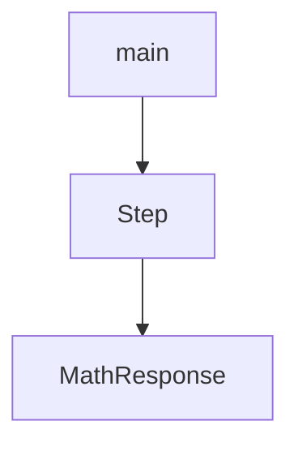

# Chapter 6: Fine-Tuning

Welcome to **Chapter 6: Fine-Tuning**. In this part of **OpenAI Python SDK Tutorial: Production API Patterns**, you will build an intuitive mental model first, then move into concrete implementation details and practical production tradeoffs.


Fine-tuning is valuable when prompt engineering alone cannot deliver consistent domain behavior.

## Dataset Quality Rules

- keep labels consistent and unambiguous
- remove contradictory samples
- include hard negatives and edge cases
- maintain a held-out evaluation set

## Job Submission Pattern

```python
from openai import OpenAI

client = OpenAI()

train_file = client.files.create(file=open("train.jsonl", "rb"), purpose="fine-tune")
job = client.fine_tuning.jobs.create(
    training_file=train_file.id,
    model="gpt-4.1-mini"
)
print(job.id, job.status)
```

## Evaluation Focus

Measure:

- task accuracy on held-out data
- failure-type distribution
- cost/latency impact vs base model
- regression risk on adjacent tasks

## Summary

You now have a pragmatic fine-tuning workflow from data curation to job monitoring and evaluation.

Next: [Chapter 7: Advanced Patterns](07-advanced-patterns.md)

## Depth Expansion Playbook

## Source Code Walkthrough

### `examples/responses_input_tokens.py`

The `main` function in [`examples/responses_input_tokens.py`](https://github.com/openai/openai-python/blob/HEAD/examples/responses_input_tokens.py) handles a key part of this chapter's functionality:

```py


def main() -> None:
    client = OpenAI()
    tools: List[ToolParam] = [
        {
            "type": "function",
            "name": "get_current_weather",
            "description": "Get current weather in a given location",
            "parameters": {
                "type": "object",
                "properties": {
                    "location": {
                        "type": "string",
                        "description": "City and state, e.g. San Francisco, CA",
                    },
                    "unit": {
                        "type": "string",
                        "enum": ["c", "f"],
                        "description": "Temperature unit to use",
                    },
                },
                "required": ["location", "unit"],
                "additionalProperties": False,
            },
            "strict": True,
        }
    ]

    input_items: List[ResponseInputItemParam] = [
        {
            "type": "message",
```

This function is important because it defines how OpenAI Python SDK Tutorial: Production API Patterns implements the patterns covered in this chapter.

### `examples/parsing_stream.py`

The `Step` class in [`examples/parsing_stream.py`](https://github.com/openai/openai-python/blob/HEAD/examples/parsing_stream.py) handles a key part of this chapter's functionality:

```py


class Step(BaseModel):
    explanation: str
    output: str


class MathResponse(BaseModel):
    steps: List[Step]
    final_answer: str


client = OpenAI()

with client.chat.completions.stream(
    model="gpt-4o-2024-08-06",
    messages=[
        {"role": "system", "content": "You are a helpful math tutor."},
        {"role": "user", "content": "solve 8x + 31 = 2"},
    ],
    response_format=MathResponse,
) as stream:
    for event in stream:
        if event.type == "content.delta":
            print(event.delta, end="", flush=True)
        elif event.type == "content.done":
            print("\n")
            if event.parsed is not None:
                print(f"answer: {event.parsed.final_answer}")
        elif event.type == "refusal.delta":
            print(event.delta, end="", flush=True)
        elif event.type == "refusal.done":
```

This class is important because it defines how OpenAI Python SDK Tutorial: Production API Patterns implements the patterns covered in this chapter.

### `examples/parsing_stream.py`

The `MathResponse` class in [`examples/parsing_stream.py`](https://github.com/openai/openai-python/blob/HEAD/examples/parsing_stream.py) handles a key part of this chapter's functionality:

```py


class MathResponse(BaseModel):
    steps: List[Step]
    final_answer: str


client = OpenAI()

with client.chat.completions.stream(
    model="gpt-4o-2024-08-06",
    messages=[
        {"role": "system", "content": "You are a helpful math tutor."},
        {"role": "user", "content": "solve 8x + 31 = 2"},
    ],
    response_format=MathResponse,
) as stream:
    for event in stream:
        if event.type == "content.delta":
            print(event.delta, end="", flush=True)
        elif event.type == "content.done":
            print("\n")
            if event.parsed is not None:
                print(f"answer: {event.parsed.final_answer}")
        elif event.type == "refusal.delta":
            print(event.delta, end="", flush=True)
        elif event.type == "refusal.done":
            print()

print("---------------")
rich.print(stream.get_final_completion())

```

This class is important because it defines how OpenAI Python SDK Tutorial: Production API Patterns implements the patterns covered in this chapter.


## How These Components Connect


