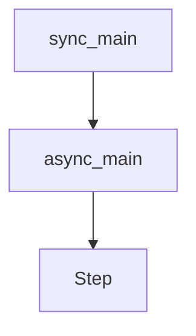

# Chapter 6: Fine-Tuning

Welcome to **Chapter 6: Fine-Tuning**. In this part of **OpenAI Python SDK Tutorial: Production API Patterns**, you will build an intuitive mental model first, then move into concrete implementation details and practical production tradeoffs.


Fine-tuning is valuable when prompt engineering alone cannot deliver consistent domain behavior.

## Dataset Quality Rules

- keep labels consistent and unambiguous
- remove contradictory samples
- include hard negatives and edge cases
- maintain a held-out evaluation set

## Job Submission Pattern

```python
from openai import OpenAI

client = OpenAI()

train_file = client.files.create(file=open("train.jsonl", "rb"), purpose="fine-tune")
job = client.fine_tuning.jobs.create(
    training_file=train_file.id,
    model="gpt-4.1-mini"
)
print(job.id, job.status)
```

## Evaluation Focus

Measure:

- task accuracy on held-out data
- failure-type distribution
- cost/latency impact vs base model
- regression risk on adjacent tasks

## Summary

You now have a pragmatic fine-tuning workflow from data curation to job monitoring and evaluation.

Next: [Chapter 7: Advanced Patterns](07-advanced-patterns.md)

## Source Code Walkthrough

### `examples/streaming.py`

The `sync_main` function in [`examples/streaming.py`](https://github.com/openai/openai-python/blob/HEAD/examples/streaming.py) handles a key part of this chapter's functionality:

```py


def sync_main() -> None:
    client = OpenAI()
    response = client.completions.create(
        model="gpt-3.5-turbo-instruct",
        prompt="1,2,3,",
        max_tokens=5,
        temperature=0,
        stream=True,
    )

    # You can manually control iteration over the response
    first = next(response)
    print(f"got response data: {first.to_json()}")

    # Or you could automatically iterate through all of data.
    # Note that the for loop will not exit until *all* of the data has been processed.
    for data in response:
        print(data.to_json())


async def async_main() -> None:
    client = AsyncOpenAI()
    response = await client.completions.create(
        model="gpt-3.5-turbo-instruct",
        prompt="1,2,3,",
        max_tokens=5,
        temperature=0,
        stream=True,
    )

```

This function is important because it defines how OpenAI Python SDK Tutorial: Production API Patterns implements the patterns covered in this chapter.

### `examples/streaming.py`

The `async_main` function in [`examples/streaming.py`](https://github.com/openai/openai-python/blob/HEAD/examples/streaming.py) handles a key part of this chapter's functionality:

```py


async def async_main() -> None:
    client = AsyncOpenAI()
    response = await client.completions.create(
        model="gpt-3.5-turbo-instruct",
        prompt="1,2,3,",
        max_tokens=5,
        temperature=0,
        stream=True,
    )

    # You can manually control iteration over the response.
    # In Python 3.10+ you can also use the `await anext(response)` builtin instead
    first = await response.__anext__()
    print(f"got response data: {first.to_json()}")

    # Or you could automatically iterate through all of data.
    # Note that the for loop will not exit until *all* of the data has been processed.
    async for data in response:
        print(data.to_json())


sync_main()

asyncio.run(async_main())

```

This function is important because it defines how OpenAI Python SDK Tutorial: Production API Patterns implements the patterns covered in this chapter.

### `examples/parsing_stream.py`

The `Step` class in [`examples/parsing_stream.py`](https://github.com/openai/openai-python/blob/HEAD/examples/parsing_stream.py) handles a key part of this chapter's functionality:

```py


class Step(BaseModel):
    explanation: str
    output: str


class MathResponse(BaseModel):
    steps: List[Step]
    final_answer: str


client = OpenAI()

with client.chat.completions.stream(
    model="gpt-4o-2024-08-06",
    messages=[
        {"role": "system", "content": "You are a helpful math tutor."},
        {"role": "user", "content": "solve 8x + 31 = 2"},
    ],
    response_format=MathResponse,
) as stream:
    for event in stream:
        if event.type == "content.delta":
            print(event.delta, end="", flush=True)
        elif event.type == "content.done":
            print("\n")
            if event.parsed is not None:
                print(f"answer: {event.parsed.final_answer}")
        elif event.type == "refusal.delta":
            print(event.delta, end="", flush=True)
        elif event.type == "refusal.done":
```

This class is important because it defines how OpenAI Python SDK Tutorial: Production API Patterns implements the patterns covered in this chapter.


## How These Components Connect


