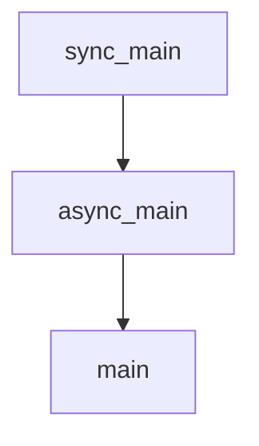

# Chapter 7: Advanced Patterns

Welcome to **Chapter 7: Advanced Patterns**. In this part of **OpenAI Python SDK Tutorial: Production API Patterns**, you will build an intuitive mental model first, then move into concrete implementation details and practical production tradeoffs.


Production systems need reliability and observability defaults, not optional add-ons.

## Retry Wrapper Pattern

```python
import random
import time
from openai import OpenAI

client = OpenAI(timeout=30.0)

def with_retry(fn, attempts=5):
    for i in range(1, attempts + 1):
        try:
            return fn()
        except Exception:
            if i == attempts:
                raise
            time.sleep(min(2 ** i, 20) + random.random())

resp = with_retry(lambda: client.responses.create(model="gpt-5.2", input="health check"))
print(resp.id)
```

## Observability Minimum Set

- request id
- model id
- latency
- token usage
- retry count
- error class

## Cost Control Tactics

- estimate token budgets before request
- cap max output size where possible
- cache deterministic intermediate artifacts
- route low-stakes requests to smaller/cheaper models

## Summary

You now have practical building blocks for resilient, cost-aware, and debuggable SDK services.

Next: [Chapter 8: Integration Examples](08-integration-examples.md)

## Depth Expansion Playbook

## Source Code Walkthrough

### `examples/streaming.py`

The `sync_main` function in [`examples/streaming.py`](https://github.com/openai/openai-python/blob/HEAD/examples/streaming.py) handles a key part of this chapter's functionality:

```py


def sync_main() -> None:
    client = OpenAI()
    response = client.completions.create(
        model="gpt-3.5-turbo-instruct",
        prompt="1,2,3,",
        max_tokens=5,
        temperature=0,
        stream=True,
    )

    # You can manually control iteration over the response
    first = next(response)
    print(f"got response data: {first.to_json()}")

    # Or you could automatically iterate through all of data.
    # Note that the for loop will not exit until *all* of the data has been processed.
    for data in response:
        print(data.to_json())


async def async_main() -> None:
    client = AsyncOpenAI()
    response = await client.completions.create(
        model="gpt-3.5-turbo-instruct",
        prompt="1,2,3,",
        max_tokens=5,
        temperature=0,
        stream=True,
    )

```

This function is important because it defines how OpenAI Python SDK Tutorial: Production API Patterns implements the patterns covered in this chapter.

### `examples/streaming.py`

The `async_main` function in [`examples/streaming.py`](https://github.com/openai/openai-python/blob/HEAD/examples/streaming.py) handles a key part of this chapter's functionality:

```py


async def async_main() -> None:
    client = AsyncOpenAI()
    response = await client.completions.create(
        model="gpt-3.5-turbo-instruct",
        prompt="1,2,3,",
        max_tokens=5,
        temperature=0,
        stream=True,
    )

    # You can manually control iteration over the response.
    # In Python 3.10+ you can also use the `await anext(response)` builtin instead
    first = await response.__anext__()
    print(f"got response data: {first.to_json()}")

    # Or you could automatically iterate through all of data.
    # Note that the for loop will not exit until *all* of the data has been processed.
    async for data in response:
        print(data.to_json())


sync_main()

asyncio.run(async_main())

```

This function is important because it defines how OpenAI Python SDK Tutorial: Production API Patterns implements the patterns covered in this chapter.

### `examples/text_to_speech.py`

The `main` function in [`examples/text_to_speech.py`](https://github.com/openai/openai-python/blob/HEAD/examples/text_to_speech.py) handles a key part of this chapter's functionality:

```py


async def main() -> None:
    start_time = time.time()

    async with openai.audio.speech.with_streaming_response.create(
        model="tts-1",
        voice="alloy",
        response_format="pcm",  # similar to WAV, but without a header chunk at the start.
        input="""I see skies of blue and clouds of white
                The bright blessed days, the dark sacred nights
                And I think to myself
                What a wonderful world""",
    ) as response:
        print(f"Time to first byte: {int((time.time() - start_time) * 1000)}ms")
        await LocalAudioPlayer().play(response)
        print(f"Time to play: {int((time.time() - start_time) * 1000)}ms")


if __name__ == "__main__":
    asyncio.run(main())

```

This function is important because it defines how OpenAI Python SDK Tutorial: Production API Patterns implements the patterns covered in this chapter.


## How These Components Connect


