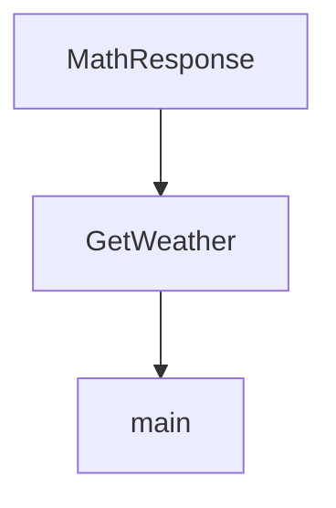

# Chapter 7: Advanced Patterns

Welcome to **Chapter 7: Advanced Patterns**. In this part of **OpenAI Python SDK Tutorial: Production API Patterns**, you will build an intuitive mental model first, then move into concrete implementation details and practical production tradeoffs.


Production systems need reliability and observability defaults, not optional add-ons.

## Retry Wrapper Pattern

```python
import random
import time
from openai import OpenAI

client = OpenAI(timeout=30.0)

def with_retry(fn, attempts=5):
    for i in range(1, attempts + 1):
        try:
            return fn()
        except Exception:
            if i == attempts:
                raise
            time.sleep(min(2 ** i, 20) + random.random())

resp = with_retry(lambda: client.responses.create(model="gpt-5.2", input="health check"))
print(resp.id)
```

## Observability Minimum Set

- request id
- model id
- latency
- token usage
- retry count
- error class

## Cost Control Tactics

- estimate token budgets before request
- cap max output size where possible
- cache deterministic intermediate artifacts
- route low-stakes requests to smaller/cheaper models

## Summary

You now have practical building blocks for resilient, cost-aware, and debuggable SDK services.

Next: [Chapter 8: Integration Examples](08-integration-examples.md)

## Source Code Walkthrough

### `examples/parsing_stream.py`

The `MathResponse` class in [`examples/parsing_stream.py`](https://github.com/openai/openai-python/blob/HEAD/examples/parsing_stream.py) handles a key part of this chapter's functionality:

```py


class MathResponse(BaseModel):
    steps: List[Step]
    final_answer: str


client = OpenAI()

with client.chat.completions.stream(
    model="gpt-4o-2024-08-06",
    messages=[
        {"role": "system", "content": "You are a helpful math tutor."},
        {"role": "user", "content": "solve 8x + 31 = 2"},
    ],
    response_format=MathResponse,
) as stream:
    for event in stream:
        if event.type == "content.delta":
            print(event.delta, end="", flush=True)
        elif event.type == "content.done":
            print("\n")
            if event.parsed is not None:
                print(f"answer: {event.parsed.final_answer}")
        elif event.type == "refusal.delta":
            print(event.delta, end="", flush=True)
        elif event.type == "refusal.done":
            print()

print("---------------")
rich.print(stream.get_final_completion())

```

This class is important because it defines how OpenAI Python SDK Tutorial: Production API Patterns implements the patterns covered in this chapter.

### `examples/parsing_tools_stream.py`

The `GetWeather` class in [`examples/parsing_tools_stream.py`](https://github.com/openai/openai-python/blob/HEAD/examples/parsing_tools_stream.py) handles a key part of this chapter's functionality:

```py


class GetWeather(BaseModel):
    city: str
    country: str


client = OpenAI()


with client.chat.completions.stream(
    model="gpt-4o-2024-08-06",
    messages=[
        {
            "role": "user",
            "content": "What's the weather like in SF and New York?",
        },
    ],
    tools=[
        # because we're using `.parse_stream()`, the returned tool calls
        # will be automatically deserialized into this `GetWeather` type
        openai.pydantic_function_tool(GetWeather, name="get_weather"),
    ],
    parallel_tool_calls=True,
) as stream:
    for event in stream:
        if event.type == "tool_calls.function.arguments.delta" or event.type == "tool_calls.function.arguments.done":
            rich.get_console().print(event, width=80)

print("----\n")
rich.print(stream.get_final_completion())

```

This class is important because it defines how OpenAI Python SDK Tutorial: Production API Patterns implements the patterns covered in this chapter.

### `examples/text_to_speech.py`

The `main` function in [`examples/text_to_speech.py`](https://github.com/openai/openai-python/blob/HEAD/examples/text_to_speech.py) handles a key part of this chapter's functionality:

```py


async def main() -> None:
    start_time = time.time()

    async with openai.audio.speech.with_streaming_response.create(
        model="tts-1",
        voice="alloy",
        response_format="pcm",  # similar to WAV, but without a header chunk at the start.
        input="""I see skies of blue and clouds of white
                The bright blessed days, the dark sacred nights
                And I think to myself
                What a wonderful world""",
    ) as response:
        print(f"Time to first byte: {int((time.time() - start_time) * 1000)}ms")
        await LocalAudioPlayer().play(response)
        print(f"Time to play: {int((time.time() - start_time) * 1000)}ms")


if __name__ == "__main__":
    asyncio.run(main())

```

This function is important because it defines how OpenAI Python SDK Tutorial: Production API Patterns implements the patterns covered in this chapter.


## How These Components Connect


