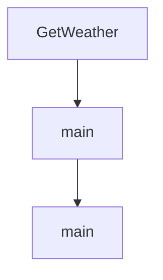

# Chapter 8: Integration Examples

Welcome to **Chapter 8: Integration Examples**. In this part of **OpenAI Python SDK Tutorial: Production API Patterns**, you will build an intuitive mental model first, then move into concrete implementation details and practical production tradeoffs.


This chapter maps core SDK features to service-level integration patterns.

## Example 1: FastAPI Summarization Endpoint

```python
from fastapi import FastAPI
from openai import OpenAI

app = FastAPI()
client = OpenAI()

@app.post("/summarize")
def summarize(payload: dict):
    text = payload.get("text", "")
    resp = client.responses.create(
        model="gpt-5.2",
        input=f"Summarize in 3 bullet points:\n\n{text}",
    )
    return {"summary": resp.output_text, "request_id": resp.id}
```

## Example 2: Retrieval-Enhanced Endpoint

- retrieve top-k context from embeddings index
- construct compact context block
- generate answer with citation fields
- return both answer and source metadata

## Example 3: Tool-Gated Action Endpoint

- classify requested action risk
- require explicit confirmation for destructive operations
- run tool with bounded timeout
- log inputs and outputs for audit

## Final Launch Checklist

- contract tests for request/response schemas
- regression eval set for output quality
- budget alerts and rate-limit handling
- incident runbook for degraded provider behavior

## Final Summary

You now have an end-to-end blueprint for shipping Python SDK integrations that are reliable, observable, and migration-ready.

Related:
- [tiktoken Tutorial](../tiktoken-tutorial/)
- [OpenAI Realtime Agents Tutorial](../openai-realtime-agents-tutorial/)
- [OpenAI Whisper Tutorial](../openai-whisper-tutorial/)

## Depth Expansion Playbook

## Source Code Walkthrough

### `examples/parsing_tools_stream.py`

The `GetWeather` class in [`examples/parsing_tools_stream.py`](https://github.com/openai/openai-python/blob/HEAD/examples/parsing_tools_stream.py) handles a key part of this chapter's functionality:

```py


class GetWeather(BaseModel):
    city: str
    country: str


client = OpenAI()


with client.chat.completions.stream(
    model="gpt-4o-2024-08-06",
    messages=[
        {
            "role": "user",
            "content": "What's the weather like in SF and New York?",
        },
    ],
    tools=[
        # because we're using `.parse_stream()`, the returned tool calls
        # will be automatically deserialized into this `GetWeather` type
        openai.pydantic_function_tool(GetWeather, name="get_weather"),
    ],
    parallel_tool_calls=True,
) as stream:
    for event in stream:
        if event.type == "tool_calls.function.arguments.delta" or event.type == "tool_calls.function.arguments.done":
            rich.get_console().print(event, width=80)

print("----\n")
rich.print(stream.get_final_completion())

```

This class is important because it defines how OpenAI Python SDK Tutorial: Production API Patterns implements the patterns covered in this chapter.

### `examples/speech_to_text.py`

The `main` function in [`examples/speech_to_text.py`](https://github.com/openai/openai-python/blob/HEAD/examples/speech_to_text.py) handles a key part of this chapter's functionality:

```py


async def main() -> None:
    print("Recording for the next 10 seconds...")
    recording = await Microphone(timeout=10).record()
    print("Recording complete")
    transcription = await openai.audio.transcriptions.create(
        model="whisper-1",
        file=recording,
    )

    print(transcription.text)


if __name__ == "__main__":
    asyncio.run(main())

```

This function is important because it defines how OpenAI Python SDK Tutorial: Production API Patterns implements the patterns covered in this chapter.

### `examples/audio.py`

The `main` function in [`examples/audio.py`](https://github.com/openai/openai-python/blob/HEAD/examples/audio.py) handles a key part of this chapter's functionality:

```py


def main() -> None:
    # Create text-to-speech audio file
    with openai.audio.speech.with_streaming_response.create(
        model="tts-1",
        voice="alloy",
        input="the quick brown fox jumped over the lazy dogs",
    ) as response:
        response.stream_to_file(speech_file_path)

    # Create transcription from audio file
    transcription = openai.audio.transcriptions.create(
        model="whisper-1",
        file=speech_file_path,
    )
    print(transcription.text)

    # Create translation from audio file
    translation = openai.audio.translations.create(
        model="whisper-1",
        file=speech_file_path,
    )
    print(translation.text)


if __name__ == "__main__":
    main()

```

This function is important because it defines how OpenAI Python SDK Tutorial: Production API Patterns implements the patterns covered in this chapter.


## How These Components Connect


