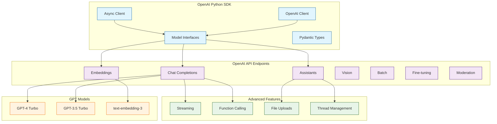

# OpenAI Python SDK Tutorial: Building with GPT, Embeddings & Assistants

> Master the official OpenAI Python library to build production AI applications with GPT models, embeddings, assistants, and more.

[](https://github.com/openai/openai-python)
[](https://opensource.org/licenses/MIT)
[](https://github.com/openai/openai-python)

## 🎯 What is the OpenAI Python SDK?

The **OpenAI Python SDK** is the official Python library for interacting with OpenAI's REST API. It provides convenient access to GPT models (including GPT-4, GPT-4 Turbo, GPT-3.5), embeddings, assistants, fine-tuning, and other OpenAI services with full type safety and async support.

### Key Features

| Feature | Description |
|:--------|:------------|
| **Chat Completions** | GPT-4, GPT-4 Turbo, GPT-3.5 for conversations and text generation |
| **Assistants API** | Persistent threads with code interpreter, file search, function calling |
| **Embeddings** | text-embedding-3 for semantic search and RAG applications |
| **Vision** | Analyze images with GPT-4 Vision |
| **Streaming** | Real-time token-by-token response streaming |
| **Function Calling** | Tool use and external API integration |
| **Batch Processing** | Cost-effective large-scale jobs with 50% discount |
| **Type Safety** | Full Pydantic models for requests and responses |

## Architecture Overview



## Tutorial Structure

> Status: This index is currently the published roadmap for the tutorial. Chapter pages are in progress.

| Chapter | Topic | What You'll Learn |
|:--------|:------|:------------------|
| **1. Getting Started (Planned)** | Setup | Installation, API keys, first GPT call, model selection |
| **2. Chat Completions (Planned)** | Core API | Messages, streaming, function calling, vision |
| **3. Embeddings & Search (Planned)** | Vectors | Text embeddings, similarity search, RAG foundations |
| **4. Assistants API (Planned)** | Agents | Persistent threads, code interpreter, file search |
| **5. Batch Processing (Planned)** | Scale | Batch API, cost optimization, large-scale jobs |
| **6. Fine-Tuning (Planned)** | Customization | Custom models, training data, evaluation |
| **7. Advanced Patterns (Planned)** | Production | Error handling, retries, caching, token management |
| **8. Integration Examples (Planned)** | Applications | RAG systems, chatbots, agent frameworks |

## Tech Stack

| Component | Technology |
|:----------|:-----------|
| **Language** | Python 3.9+ |
| **HTTP Client** | httpx (sync & async) |
| **Type Safety** | Pydantic V2 for validation |
| **Async Support** | asyncio, async/await |
| **Streaming** | Server-Sent Events (SSE) |
| **Common Integrations** | LangChain, LlamaIndex, FastAPI, Streamlit |

## What You'll Build

By the end of this tutorial, you'll be able to:

- **Build Chat Applications** with GPT-4 and streaming responses
- **Implement Function Calling** for tool use and external integrations
- **Create RAG Systems** using embeddings and similarity search
- **Deploy Assistants** with persistent threads and file access
- **Optimize Costs** with batch processing and efficient token usage
- **Fine-Tune Models** on custom datasets for domain-specific tasks
- **Handle Production Concerns** including errors, retries, and rate limiting
- **Integrate with Frameworks** like LangChain, LlamaIndex, and FastAPI

## Prerequisites

- **Python 3.9+** programming experience
- **OpenAI API key** (sign up at [platform.openai.com](https://platform.openai.com))
- **Basic understanding** of REST APIs and JSON
- **Familiarity with async/await** helpful for advanced chapters

## Related Tutorials

**Complementary:**
- [tiktoken Tutorial](../tiktoken-tutorial/) - Token counting and optimization
- [OpenAI Whisper Tutorial](../openai-whisper-tutorial/) - Speech recognition
- [Anthropic API Tutorial](../anthropic-code-tutorial/) - Alternative LLM provider

**Next Steps:**
- [LangChain Tutorial](../langchain-tutorial/) - LLM framework integration
- [LlamaIndex Tutorial](../llamaindex-tutorial/) - RAG and data connectors
- [OpenAI Realtime Agents Tutorial](../openai-realtime-agents-tutorial/) - Voice agents

## OpenAI SDK Features by Use Case

### Basic Chat
```python
from openai import OpenAI
client = OpenAI()

response = client.chat.completions.create(
    model="gpt-4-turbo",
    messages=[{"role": "user", "content": "Hello!"}]
)
```

### Streaming
```python
stream = client.chat.completions.create(
    model="gpt-4-turbo",
    messages=[{"role": "user", "content": "Tell me a story"}],
    stream=True
)
for chunk in stream:
    print(chunk.choices[0].delta.content)
```

### Function Calling
```python
tools = [{
    "type": "function",
    "function": {
        "name": "get_weather",
        "description": "Get current weather",
        "parameters": { ... }
    }
}]
```

### Assistants
```python
assistant = client.beta.assistants.create(
    model="gpt-4-turbo",
    tools=[{"type": "code_interpreter"}]
)
thread = client.beta.threads.create()
```

---

Ready to begin? Review the roadmap above while chapter pages are being finalized.

---

*Built with insights from the [OpenAI Python SDK repository](https://github.com/openai/openai-python) and OpenAI API documentation.*
