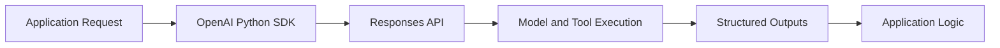

# OpenAI Python SDK Tutorial: Production API Patterns

> Learn how to build reliable Python integrations with `openai/openai-python` using Responses-first architecture, migration-safe patterns, and production operations.

## Why This Track Matters

The OpenAI Python SDK is the primary production interface for many backend AI systems. Correct architecture choices now reduce migration risk and improve reliability.

This track focuses on:

- Responses-first application design
- interoperability with legacy Chat Completions and Assistants-era systems
- batch, embeddings, and tool-call workflows in production
- migration planning aligned with official deprecation timelines

## Current Snapshot (Verified February 11, 2026)

- repository: [`openai/openai-python`](https://github.com/openai/openai-python)
- stars: about **29.9k**
- latest release: [`v2.20.0`](https://github.com/openai/openai-python/releases/tag/v2.20.0)
- development activity: active with recent releases
- project positioning in repo: official Python SDK for OpenAI API integrations

## Mental Model

## Chapter Guide

| Chapter | Key Question | Outcome |
|:--------|:-------------|:--------|
| [01 - Getting Started](01-getting-started.md) | How do I install and run first production-safe calls? | Working SDK baseline |
| [02 - Chat Completions](02-chat-completions.md) | When should I keep legacy chat patterns vs migrate? | Better interoperability decisions |
| [03 - Embeddings and Search](03-embeddings-search.md) | How do I build retrieval foundations in Python? | Retrieval-ready architecture baseline |
| [04 - Agents and Assistants](04-assistants-api.md) | How do I migrate Assistants-era systems safely? | Migration strategy and risk reduction |
| [05 - Batch Processing](05-batch-processing.md) | How do I run large async jobs with traceability? | Scalable batch workflow model |
| [06 - Fine-Tuning](06-fine-tuning.md) | How do I specialize model behavior responsibly? | Practical fine-tuning lifecycle |
| [07 - Advanced Patterns](07-advanced-patterns.md) | How do I harden reliability and observability? | Production readiness patterns |
| [08 - Integration Examples](08-integration-examples.md) | How do I embed SDK flows into real services? | Deployable integration playbook |

## What You Will Learn

- how to structure Python services around the Responses API
- how to keep legacy compatibility while migrating safely
- how to run batch and retrieval pipelines with operational controls
- how to align roadmap decisions with official API deprecation timelines

## Source References

- [openai/openai-python Repository](https://github.com/openai/openai-python)
- [openai/openai-python Releases](https://github.com/openai/openai-python/releases)
- [OpenAI API Deprecations](https://platform.openai.com/docs/deprecations)
- [Assistants Migration Guide](https://platform.openai.com/docs/assistants/how-it-works)

## Related Tutorials

- [OpenAI Realtime Agents Tutorial](../openai-realtime-agents-tutorial/)
- [tiktoken Tutorial](../tiktoken-tutorial/)
- [OpenAI Whisper Tutorial](../openai-whisper-tutorial/)
- [Vercel AI Tutorial](../vercel-ai-tutorial/)

---

Start with [Chapter 1: Getting Started](01-getting-started.md).
