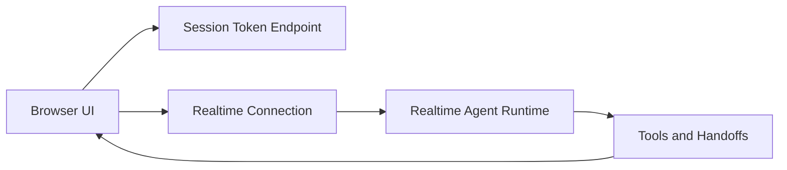

# Chapter 1: Getting Started

This chapter gets the official realtime demo running locally and establishes a baseline you can measure future changes against.

## Learning Goals

By the end of this chapter, you should be able to:

- run the official demo end to end
- explain the local components that participate in a realtime voice session
- validate microphone, session, and tool-call flow quickly
- identify the most common local setup failures

## Prerequisites

- Node.js 20+
- npm or pnpm
- OpenAI API access with Realtime capability
- modern browser with microphone permissions

## Local Setup

```bash
git clone https://github.com/openai/openai-realtime-agents.git
cd openai-realtime-agents
npm install
cp .env.sample .env
# add OPENAI_API_KEY
npm run dev
```

Open `http://localhost:3000` and run both built-in scenarios to compare orchestration behavior.

## Local Architecture Map



## First-Run Validation Checklist

1. session creation succeeds and short-lived credentials are returned
2. microphone capture starts and input meters move
3. model responses stream in text/audio without long stalls
4. tool calls appear in logs for scenarios that need external actions
5. agent handoffs are visible in timeline/transcript when using multi-agent scenarios

## Quick Health Commands

Use these while debugging startup problems:

```bash
node -v
npm -v
cat .env | rg OPENAI_API_KEY
npm run dev
```

## Common Setup Failures

| Failure | Most Likely Cause | First Fix |
|:--------|:------------------|:----------|
| 401/403 on session endpoint | missing or invalid API key | regenerate key, reload dev server |
| microphone appears silent | browser permission denied | re-enable mic permission and refresh |
| no realtime events | transport connection failed | inspect browser network and server logs |
| no tool/handoff activity | wrong scenario or config mismatch | rerun stock scenario before custom edits |

## Baseline Test Script

Before any customization, run this short baseline test:

- ask for a simple greeting and confirm low-latency response
- interrupt output mid-sentence and verify barge-in behavior
- trigger a scenario that requires tool invocation
- verify transcript coherence after handoff

If these four checks pass, your local environment is stable enough for deeper protocol work.

## Source References

- [openai/openai-realtime-agents Repository](https://github.com/openai/openai-realtime-agents)
- [OpenAI Realtime Guide](https://platform.openai.com/docs/guides/realtime)

## Summary

You now have a reproducible local baseline and a structured way to verify realtime session health.

Next: [Chapter 2: Realtime API Fundamentals](02-realtime-api-fundamentals.md)
