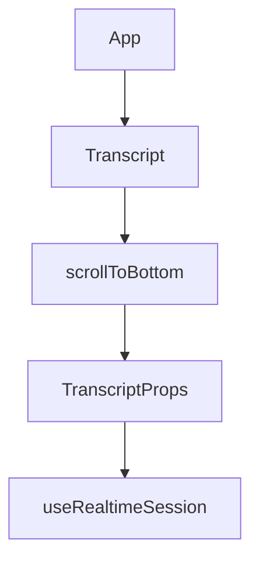

# Chapter 3: Voice Input Processing

Welcome to **Chapter 3: Voice Input Processing**. In this part of **OpenAI Realtime Agents Tutorial: Voice-First AI Systems**, you will build an intuitive mental model first, then move into concrete implementation details and practical production tradeoffs.


Input quality and turn-boundary accuracy are the biggest predictors of perceived voice-agent quality.

## Learning Goals

By the end of this chapter, you should be able to:

- design a robust audio input pipeline
- tune voice activity detection (VAD) for your environment
- handle interruption and partial-turn scenarios correctly
- track metrics that reveal input regressions early

## Input Pipeline Stages

1. microphone capture
2. buffering and chunk framing
3. optional preprocessing (normalization/noise reduction)
4. VAD-based turn detection
5. commit audio segment to session
6. begin response generation

## VAD Strategy Choices

| Mode | Best For | Risk |
|:-----|:---------|:-----|
| automatic VAD | consumer voice UX with minimal friction | clipping in noisy environments if tuned poorly |
| push-to-talk | controlled enterprise or noisy contexts | higher user interaction cost |
| hybrid | mixed environments and advanced clients | more implementation complexity |

## Interruption Handling (Barge-In)

When user speech starts while assistant is speaking:

- stop output quickly
- preserve minimal state needed for continuity
- commit new user input immediately
- avoid long blocking operations before acknowledgement

## Input Reliability Controls

- enforce expected sample format at ingestion
- cap maximum segment duration to prevent oversized turns
- detect prolonged silence and reset capture state gracefully
- log dropped frames and jitter indicators

## Quality Pitfalls

| Pitfall | User Impact | Mitigation |
|:--------|:------------|:-----------|
| aggressive VAD | clipped speech and repeated clarifications | relax sensitivity and add hysteresis |
| conservative VAD | laggy turn transitions | reduce release delay |
| no interruption support | assistant talks over user | prioritize barge-in cancellation path |
| poor noise handling | wrong intent extraction | add preprocessing and environment presets |

## Metrics to Track

- speech-start to commit latency
- clipped-turn rate
- interruption success rate
- speech-to-first-token latency
- retry rate after misunderstood turns

## Source References

- [OpenAI Realtime Guide](https://platform.openai.com/docs/guides/realtime)
- [openai/openai-realtime-agents Repository](https://github.com/openai/openai-realtime-agents)

## Summary

You now have a robust input architecture pattern that supports low-latency conversation without sacrificing turn accuracy.

Next: [Chapter 4: Conversational AI](04-conversational-ai.md)

## Depth Expansion Playbook

## Source Code Walkthrough

### `src/app/App.tsx`

The `App` function in [`src/app/App.tsx`](https://github.com/openai/openai-realtime-agents/blob/HEAD/src/app/App.tsx) handles a key part of this chapter's functionality:

```tsx
import { useHandleSessionHistory } from "./hooks/useHandleSessionHistory";

function App() {
  const searchParams = useSearchParams()!;

  // ---------------------------------------------------------------------
  // Codec selector – lets you toggle between wide-band Opus (48 kHz)
  // and narrow-band PCMU/PCMA (8 kHz) to hear what the agent sounds like on
  // a traditional phone line and to validate ASR / VAD behaviour under that
  // constraint.
  //
  // We read the `?codec=` query-param and rely on the `changePeerConnection`
  // hook (configured in `useRealtimeSession`) to set the preferred codec
  // before the offer/answer negotiation.
  // ---------------------------------------------------------------------
  const urlCodec = searchParams.get("codec") || "opus";

  // Agents SDK doesn't currently support codec selection so it is now forced 
  // via global codecPatch at module load 

  const {
    addTranscriptMessage,
    addTranscriptBreadcrumb,
  } = useTranscript();
  const { logClientEvent, logServerEvent } = useEvent();

  const [selectedAgentName, setSelectedAgentName] = useState<string>("");
  const [selectedAgentConfigSet, setSelectedAgentConfigSet] = useState<
    RealtimeAgent[] | null
  >(null);

  const audioElementRef = useRef<HTMLAudioElement | null>(null);
```

This function is important because it defines how OpenAI Realtime Agents Tutorial: Voice-First AI Systems implements the patterns covered in this chapter.

### `src/app/components/Transcript.tsx`

The `Transcript` function in [`src/app/components/Transcript.tsx`](https://github.com/openai/openai-realtime-agents/blob/HEAD/src/app/components/Transcript.tsx) handles a key part of this chapter's functionality:

```tsx
import React, { useEffect, useRef, useState } from "react";
import ReactMarkdown from "react-markdown";
import { TranscriptItem } from "@/app/types";
import Image from "next/image";
import { useTranscript } from "@/app/contexts/TranscriptContext";
import { DownloadIcon, ClipboardCopyIcon } from "@radix-ui/react-icons";
import { GuardrailChip } from "./GuardrailChip";

export interface TranscriptProps {
  userText: string;
  setUserText: (val: string) => void;
  onSendMessage: () => void;
  canSend: boolean;
  downloadRecording: () => void;
}

function Transcript({
  userText,
  setUserText,
  onSendMessage,
  canSend,
  downloadRecording,
}: TranscriptProps) {
  const { transcriptItems, toggleTranscriptItemExpand } = useTranscript();
  const transcriptRef = useRef<HTMLDivElement | null>(null);
  const [prevLogs, setPrevLogs] = useState<TranscriptItem[]>([]);
  const [justCopied, setJustCopied] = useState(false);
  const inputRef = useRef<HTMLInputElement | null>(null);

  function scrollToBottom() {
    if (transcriptRef.current) {
      transcriptRef.current.scrollTop = transcriptRef.current.scrollHeight;
```

This function is important because it defines how OpenAI Realtime Agents Tutorial: Voice-First AI Systems implements the patterns covered in this chapter.

### `src/app/components/Transcript.tsx`

The `scrollToBottom` function in [`src/app/components/Transcript.tsx`](https://github.com/openai/openai-realtime-agents/blob/HEAD/src/app/components/Transcript.tsx) handles a key part of this chapter's functionality:

```tsx
  const inputRef = useRef<HTMLInputElement | null>(null);

  function scrollToBottom() {
    if (transcriptRef.current) {
      transcriptRef.current.scrollTop = transcriptRef.current.scrollHeight;
    }
  }

  useEffect(() => {
    const hasNewMessage = transcriptItems.length > prevLogs.length;
    const hasUpdatedMessage = transcriptItems.some((newItem, index) => {
      const oldItem = prevLogs[index];
      return (
        oldItem &&
        (newItem.title !== oldItem.title || newItem.data !== oldItem.data)
      );
    });

    if (hasNewMessage || hasUpdatedMessage) {
      scrollToBottom();
    }

    setPrevLogs(transcriptItems);
  }, [transcriptItems]);

  // Autofocus on text box input on load
  useEffect(() => {
    if (canSend && inputRef.current) {
      inputRef.current.focus();
    }
  }, [canSend]);

```

This function is important because it defines how OpenAI Realtime Agents Tutorial: Voice-First AI Systems implements the patterns covered in this chapter.

### `src/app/components/Transcript.tsx`

The `TranscriptProps` interface in [`src/app/components/Transcript.tsx`](https://github.com/openai/openai-realtime-agents/blob/HEAD/src/app/components/Transcript.tsx) handles a key part of this chapter's functionality:

```tsx
import { GuardrailChip } from "./GuardrailChip";

export interface TranscriptProps {
  userText: string;
  setUserText: (val: string) => void;
  onSendMessage: () => void;
  canSend: boolean;
  downloadRecording: () => void;
}

function Transcript({
  userText,
  setUserText,
  onSendMessage,
  canSend,
  downloadRecording,
}: TranscriptProps) {
  const { transcriptItems, toggleTranscriptItemExpand } = useTranscript();
  const transcriptRef = useRef<HTMLDivElement | null>(null);
  const [prevLogs, setPrevLogs] = useState<TranscriptItem[]>([]);
  const [justCopied, setJustCopied] = useState(false);
  const inputRef = useRef<HTMLInputElement | null>(null);

  function scrollToBottom() {
    if (transcriptRef.current) {
      transcriptRef.current.scrollTop = transcriptRef.current.scrollHeight;
    }
  }

  useEffect(() => {
    const hasNewMessage = transcriptItems.length > prevLogs.length;
    const hasUpdatedMessage = transcriptItems.some((newItem, index) => {
```

This interface is important because it defines how OpenAI Realtime Agents Tutorial: Voice-First AI Systems implements the patterns covered in this chapter.


## How These Components Connect


