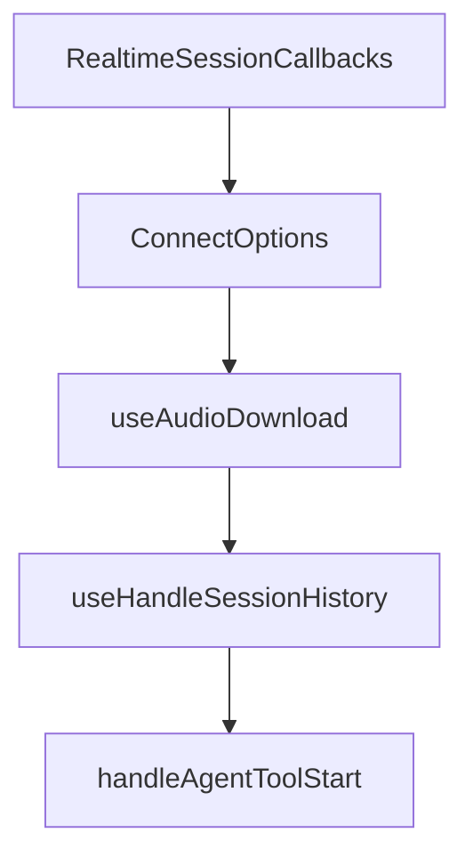

# Chapter 4: Conversational AI

Welcome to **Chapter 4: Conversational AI**. In this part of **OpenAI Realtime Agents Tutorial: Voice-First AI Systems**, you will build an intuitive mental model first, then move into concrete implementation details and practical production tradeoffs.


Great realtime conversation design is about policy, pacing, and recoverability, not just response quality.

## Learning Goals

By the end of this chapter, you should be able to:

- define turn-management rules for voice interactions
- structure prompt/policy layers to reduce regressions
- maintain bounded context in long sessions
- design graceful recovery paths for misunderstanding

## Turn Management Principles

- acknowledge quickly when operations may take time
- keep spoken responses concise and easy to parse
- ask one clarifying question at a time
- confirm risky actions before tool execution

## Policy Layering Model

Separate policy concerns so updates stay targeted:

1. interaction policy: tone, brevity, pacing
2. domain policy: workflow and business constraints
3. safety policy: prohibited actions/escalation triggers
4. tool policy: when and how external actions are allowed

## Context Management in Long Sessions

- summarize older turns into compact state
- maintain explicit slot state (intent, entities, pending actions)
- avoid replaying full transcript when compressed memory is sufficient
- track unresolved tasks independently of raw transcript

## Recovery Patterns

When confidence drops or user correction appears:

- restate interpreted intent
- ask for explicit confirmation
- avoid irreversible side effects
- fallback to human handoff where required

## Conversational Quality Checks

| Check | Why It Matters |
|:------|:---------------|
| interruption continuity | prevents broken conversation after barge-in |
| clarification rate | reveals understanding quality |
| task completion rate | measures practical utility |
| escalation correctness | protects user trust and safety |

## Evaluation Loop

Run weekly conversation evals using real transcripts:

1. sample high-friction sessions
2. classify failure category (policy, context, tool, latency)
3. apply smallest targeted change
4. rerun benchmark set before release

## Source References

- [openai/openai-realtime-agents Repository](https://github.com/openai/openai-realtime-agents)
- [OpenAI Realtime Guide](https://platform.openai.com/docs/guides/realtime)

## Summary

You now have a conversation-design framework that holds up under interruption, ambiguity, and production constraints.

Next: [Chapter 5: Function Calling](05-function-calling.md)

## Depth Expansion Playbook

## Source Code Walkthrough

### `src/app/hooks/useRealtimeSession.ts`

The `RealtimeSessionCallbacks` interface in [`src/app/hooks/useRealtimeSession.ts`](https://github.com/openai/openai-realtime-agents/blob/HEAD/src/app/hooks/useRealtimeSession.ts) handles a key part of this chapter's functionality:

```ts
import { SessionStatus } from '../types';

export interface RealtimeSessionCallbacks {
  onConnectionChange?: (status: SessionStatus) => void;
  onAgentHandoff?: (agentName: string) => void;
}

export interface ConnectOptions {
  getEphemeralKey: () => Promise<string>;
  initialAgents: RealtimeAgent[];
  audioElement?: HTMLAudioElement;
  extraContext?: Record<string, any>;
  outputGuardrails?: any[];
}

export function useRealtimeSession(callbacks: RealtimeSessionCallbacks = {}) {
  const sessionRef = useRef<RealtimeSession | null>(null);
  const [status, setStatus] = useState<
    SessionStatus
  >('DISCONNECTED');
  const { logClientEvent } = useEvent();

  const updateStatus = useCallback(
    (s: SessionStatus) => {
      setStatus(s);
      callbacks.onConnectionChange?.(s);
      logClientEvent({}, s);
    },
    [callbacks],
  );

  const { logServerEvent } = useEvent();
```

This interface is important because it defines how OpenAI Realtime Agents Tutorial: Voice-First AI Systems implements the patterns covered in this chapter.

### `src/app/hooks/useRealtimeSession.ts`

The `ConnectOptions` interface in [`src/app/hooks/useRealtimeSession.ts`](https://github.com/openai/openai-realtime-agents/blob/HEAD/src/app/hooks/useRealtimeSession.ts) handles a key part of this chapter's functionality:

```ts
}

export interface ConnectOptions {
  getEphemeralKey: () => Promise<string>;
  initialAgents: RealtimeAgent[];
  audioElement?: HTMLAudioElement;
  extraContext?: Record<string, any>;
  outputGuardrails?: any[];
}

export function useRealtimeSession(callbacks: RealtimeSessionCallbacks = {}) {
  const sessionRef = useRef<RealtimeSession | null>(null);
  const [status, setStatus] = useState<
    SessionStatus
  >('DISCONNECTED');
  const { logClientEvent } = useEvent();

  const updateStatus = useCallback(
    (s: SessionStatus) => {
      setStatus(s);
      callbacks.onConnectionChange?.(s);
      logClientEvent({}, s);
    },
    [callbacks],
  );

  const { logServerEvent } = useEvent();

  const historyHandlers = useHandleSessionHistory().current;

  function handleTransportEvent(event: any) {
    // Handle additional server events that aren't managed by the session
```

This interface is important because it defines how OpenAI Realtime Agents Tutorial: Voice-First AI Systems implements the patterns covered in this chapter.

### `src/app/hooks/useAudioDownload.ts`

The `useAudioDownload` function in [`src/app/hooks/useAudioDownload.ts`](https://github.com/openai/openai-realtime-agents/blob/HEAD/src/app/hooks/useAudioDownload.ts) handles a key part of this chapter's functionality:

```ts
import { convertWebMBlobToWav } from "../lib/audioUtils";

function useAudioDownload() {
  // Ref to store the MediaRecorder instance.
  const mediaRecorderRef = useRef<MediaRecorder | null>(null);
  // Ref to collect all recorded Blob chunks.
  const recordedChunksRef = useRef<Blob[]>([]);

  /**
   * Starts recording by combining the provided remote stream with
   * the microphone audio.
   * @param remoteStream - The remote MediaStream (e.g., from the audio element).
   */
  const startRecording = async (remoteStream: MediaStream) => {
    let micStream: MediaStream;
    try {
      micStream = await navigator.mediaDevices.getUserMedia({ audio: true });
    } catch (err) {
      console.error("Error getting microphone stream:", err);
      // Fallback to an empty MediaStream if microphone access fails.
      micStream = new MediaStream();
    }

    // Create an AudioContext to merge the streams.
    const audioContext = new AudioContext();
    const destination = audioContext.createMediaStreamDestination();

    // Connect the remote audio stream.
    try {
      const remoteSource = audioContext.createMediaStreamSource(remoteStream);
      remoteSource.connect(destination);
    } catch (err) {
```

This function is important because it defines how OpenAI Realtime Agents Tutorial: Voice-First AI Systems implements the patterns covered in this chapter.

### `src/app/hooks/useHandleSessionHistory.ts`

The `useHandleSessionHistory` function in [`src/app/hooks/useHandleSessionHistory.ts`](https://github.com/openai/openai-realtime-agents/blob/HEAD/src/app/hooks/useHandleSessionHistory.ts) handles a key part of this chapter's functionality:

```ts
import { useEvent } from "@/app/contexts/EventContext";

export function useHandleSessionHistory() {
  const {
    transcriptItems,
    addTranscriptBreadcrumb,
    addTranscriptMessage,
    updateTranscriptMessage,
    updateTranscriptItem,
  } = useTranscript();

  const { logServerEvent } = useEvent();

  /* ----------------------- helpers ------------------------- */

  const extractMessageText = (content: any[] = []): string => {
    if (!Array.isArray(content)) return "";

    return content
      .map((c) => {
        if (!c || typeof c !== "object") return "";
        if (c.type === "input_text") return c.text ?? "";
        if (c.type === "audio") return c.transcript ?? "";
        return "";
      })
      .filter(Boolean)
      .join("\n");
  };

  const extractFunctionCallByName = (name: string, content: any[] = []): any => {
    if (!Array.isArray(content)) return undefined;
    return content.find((c: any) => c.type === 'function_call' && c.name === name);
```

This function is important because it defines how OpenAI Realtime Agents Tutorial: Voice-First AI Systems implements the patterns covered in this chapter.


## How These Components Connect


