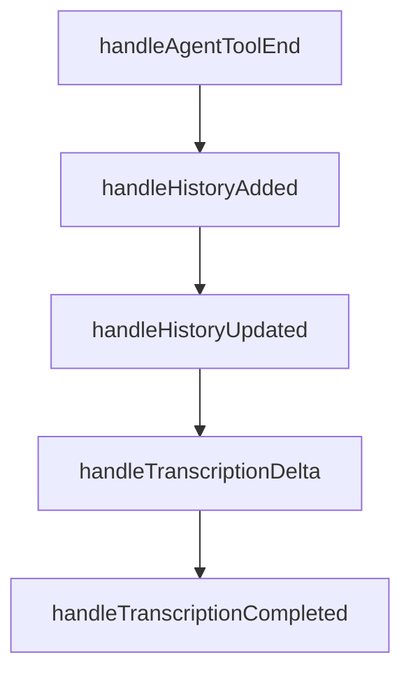

# Chapter 4: Conversational AI

Welcome to **Chapter 4: Conversational AI**. In this part of **OpenAI Realtime Agents Tutorial: Voice-First AI Systems**, you will build an intuitive mental model first, then move into concrete implementation details and practical production tradeoffs.


Great realtime conversation design is about policy, pacing, and recoverability, not just response quality.

## Learning Goals

By the end of this chapter, you should be able to:

- define turn-management rules for voice interactions
- structure prompt/policy layers to reduce regressions
- maintain bounded context in long sessions
- design graceful recovery paths for misunderstanding

## Turn Management Principles

- acknowledge quickly when operations may take time
- keep spoken responses concise and easy to parse
- ask one clarifying question at a time
- confirm risky actions before tool execution

## Policy Layering Model

Separate policy concerns so updates stay targeted:

1. interaction policy: tone, brevity, pacing
2. domain policy: workflow and business constraints
3. safety policy: prohibited actions/escalation triggers
4. tool policy: when and how external actions are allowed

## Context Management in Long Sessions

- summarize older turns into compact state
- maintain explicit slot state (intent, entities, pending actions)
- avoid replaying full transcript when compressed memory is sufficient
- track unresolved tasks independently of raw transcript

## Recovery Patterns

When confidence drops or user correction appears:

- restate interpreted intent
- ask for explicit confirmation
- avoid irreversible side effects
- fallback to human handoff where required

## Conversational Quality Checks

| Check | Why It Matters |
|:------|:---------------|
| interruption continuity | prevents broken conversation after barge-in |
| clarification rate | reveals understanding quality |
| task completion rate | measures practical utility |
| escalation correctness | protects user trust and safety |

## Evaluation Loop

Run weekly conversation evals using real transcripts:

1. sample high-friction sessions
2. classify failure category (policy, context, tool, latency)
3. apply smallest targeted change
4. rerun benchmark set before release

## Source References

- [openai/openai-realtime-agents Repository](https://github.com/openai/openai-realtime-agents)
- [OpenAI Realtime Guide](https://platform.openai.com/docs/guides/realtime)

## Summary

You now have a conversation-design framework that holds up under interruption, ambiguity, and production constraints.

Next: [Chapter 5: Function Calling](05-function-calling.md)

## Source Code Walkthrough

### `src/app/hooks/useHandleSessionHistory.ts`

The `handleAgentToolEnd` function in [`src/app/hooks/useHandleSessionHistory.ts`](https://github.com/openai/openai-realtime-agents/blob/HEAD/src/app/hooks/useHandleSessionHistory.ts) handles a key part of this chapter's functionality:

```ts
    );    
  }
  function handleAgentToolEnd(details: any, _agent: any, _functionCall: any, result: any) {
    const lastFunctionCall = extractFunctionCallByName(_functionCall.name, details?.context?.history);
    addTranscriptBreadcrumb(
      `function call result: ${lastFunctionCall?.name}`,
      maybeParseJson(result)
    );
  }

  function handleHistoryAdded(item: any) {
    console.log("[handleHistoryAdded] ", item);
    if (!item || item.type !== 'message') return;

    const { itemId, role, content = [] } = item;
    if (itemId && role) {
      const isUser = role === "user";
      let text = extractMessageText(content);

      if (isUser && !text) {
        text = "[Transcribing...]";
      }

      // If the guardrail has been tripped, this message is a message that gets sent to the 
      // assistant to correct it, so we add it as a breadcrumb instead of a message.
      const guardrailMessage = sketchilyDetectGuardrailMessage(text);
      if (guardrailMessage) {
        const failureDetails = JSON.parse(guardrailMessage);
        addTranscriptBreadcrumb('Output Guardrail Active', { details: failureDetails });
      } else {
        addTranscriptMessage(itemId, role, text);
      }
```

This function is important because it defines how OpenAI Realtime Agents Tutorial: Voice-First AI Systems implements the patterns covered in this chapter.

### `src/app/hooks/useHandleSessionHistory.ts`

The `handleHistoryAdded` function in [`src/app/hooks/useHandleSessionHistory.ts`](https://github.com/openai/openai-realtime-agents/blob/HEAD/src/app/hooks/useHandleSessionHistory.ts) handles a key part of this chapter's functionality:

```ts
  }

  function handleHistoryAdded(item: any) {
    console.log("[handleHistoryAdded] ", item);
    if (!item || item.type !== 'message') return;

    const { itemId, role, content = [] } = item;
    if (itemId && role) {
      const isUser = role === "user";
      let text = extractMessageText(content);

      if (isUser && !text) {
        text = "[Transcribing...]";
      }

      // If the guardrail has been tripped, this message is a message that gets sent to the 
      // assistant to correct it, so we add it as a breadcrumb instead of a message.
      const guardrailMessage = sketchilyDetectGuardrailMessage(text);
      if (guardrailMessage) {
        const failureDetails = JSON.parse(guardrailMessage);
        addTranscriptBreadcrumb('Output Guardrail Active', { details: failureDetails });
      } else {
        addTranscriptMessage(itemId, role, text);
      }
    }
  }

  function handleHistoryUpdated(items: any[]) {
    console.log("[handleHistoryUpdated] ", items);
    items.forEach((item: any) => {
      if (!item || item.type !== 'message') return;

```

This function is important because it defines how OpenAI Realtime Agents Tutorial: Voice-First AI Systems implements the patterns covered in this chapter.

### `src/app/hooks/useHandleSessionHistory.ts`

The `handleHistoryUpdated` function in [`src/app/hooks/useHandleSessionHistory.ts`](https://github.com/openai/openai-realtime-agents/blob/HEAD/src/app/hooks/useHandleSessionHistory.ts) handles a key part of this chapter's functionality:

```ts
  }

  function handleHistoryUpdated(items: any[]) {
    console.log("[handleHistoryUpdated] ", items);
    items.forEach((item: any) => {
      if (!item || item.type !== 'message') return;

      const { itemId, content = [] } = item;

      const text = extractMessageText(content);

      if (text) {
        updateTranscriptMessage(itemId, text, false);
      }
    });
  }

  function handleTranscriptionDelta(item: any) {
    const itemId = item.item_id;
    const deltaText = item.delta || "";
    if (itemId) {
      updateTranscriptMessage(itemId, deltaText, true);
    }
  }

  function handleTranscriptionCompleted(item: any) {
    // History updates don't reliably end in a completed item, 
    // so we need to handle finishing up when the transcription is completed.
    const itemId = item.item_id;
    const finalTranscript =
        !item.transcript || item.transcript === "\n"
        ? "[inaudible]"
```

This function is important because it defines how OpenAI Realtime Agents Tutorial: Voice-First AI Systems implements the patterns covered in this chapter.

### `src/app/hooks/useHandleSessionHistory.ts`

The `handleTranscriptionDelta` function in [`src/app/hooks/useHandleSessionHistory.ts`](https://github.com/openai/openai-realtime-agents/blob/HEAD/src/app/hooks/useHandleSessionHistory.ts) handles a key part of this chapter's functionality:

```ts
  }

  function handleTranscriptionDelta(item: any) {
    const itemId = item.item_id;
    const deltaText = item.delta || "";
    if (itemId) {
      updateTranscriptMessage(itemId, deltaText, true);
    }
  }

  function handleTranscriptionCompleted(item: any) {
    // History updates don't reliably end in a completed item, 
    // so we need to handle finishing up when the transcription is completed.
    const itemId = item.item_id;
    const finalTranscript =
        !item.transcript || item.transcript === "\n"
        ? "[inaudible]"
        : item.transcript;
    if (itemId) {
      updateTranscriptMessage(itemId, finalTranscript, false);
      // Use the ref to get the latest transcriptItems
      const transcriptItem = transcriptItems.find((i) => i.itemId === itemId);
      updateTranscriptItem(itemId, { status: 'DONE' });

      // If guardrailResult still pending, mark PASS.
      if (transcriptItem?.guardrailResult?.status === 'IN_PROGRESS') {
        updateTranscriptItem(itemId, {
          guardrailResult: {
            status: 'DONE',
            category: 'NONE',
            rationale: '',
          },
```

This function is important because it defines how OpenAI Realtime Agents Tutorial: Voice-First AI Systems implements the patterns covered in this chapter.


## How These Components Connect


