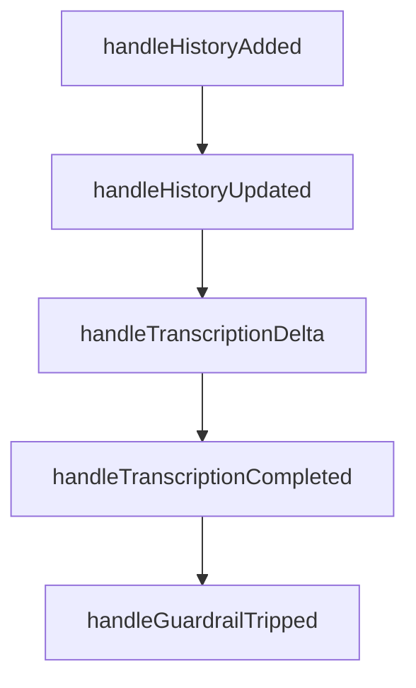

# Chapter 5: Function Calling

Welcome to **Chapter 5: Function Calling**. In this part of **OpenAI Realtime Agents Tutorial: Voice-First AI Systems**, you will build an intuitive mental model first, then move into concrete implementation details and practical production tradeoffs.


Function calling is where realtime agents move from conversation to action. It must be fast, safe, and auditable.

## Learning Goals

By the end of this chapter, you should be able to:

- implement a reliable tool-call lifecycle
- enforce schema and authorization checks before execution
- design robust error and timeout handling for realtime UX
- return structured outputs that improve downstream response quality

## Tool-Call Lifecycle

1. model emits tool request with arguments
2. gateway validates schema and authorization
3. tool executes with timeout and retry policy
4. structured result (or structured error) returns to session
5. assistant synthesizes user-facing response

## Tool Gateway Requirements

| Requirement | Purpose |
|:------------|:--------|
| strict argument validation | prevents malformed or unsafe calls |
| auth and policy checks | enforces user/tenant permissions |
| timeout budgeting | protects responsiveness |
| idempotency keys | reduces duplicate side effects on retries |
| structured logging | supports forensic debugging |

## Realtime-Specific UX Considerations

- acknowledge long-running tools immediately
- stream progress where possible
- provide deterministic fallback when tool backend is unavailable
- never leave the user without a completion/error state

## Recommended Result Contract

```json
{
  "status": "ok",
  "data": {"order_id": "123", "state": "shipped"},
  "confidence": 0.98,
  "trace_id": "tool-req-abc"
}
```

For errors, keep an explicit shape (`status`, `error_code`, `message`, `retryable`).

## High-Risk Anti-Patterns

- unrestricted tool access from model-generated arguments
- free-form text outputs instead of typed result envelopes
- silent tool failures without user-visible recovery
- long retries that block turn transitions

## Source References

- [openai/openai-realtime-agents Repository](https://github.com/openai/openai-realtime-agents)
- [OpenAI Realtime Guide](https://platform.openai.com/docs/guides/realtime)

## Summary

You now have a production-safe tool-calling blueprint for realtime agents with clear reliability and security controls.

Next: [Chapter 6: Voice Output](06-voice-output.md)

## Depth Expansion Playbook

## Source Code Walkthrough

### `src/app/hooks/useHandleSessionHistory.ts`

The `handleHistoryAdded` function in [`src/app/hooks/useHandleSessionHistory.ts`](https://github.com/openai/openai-realtime-agents/blob/HEAD/src/app/hooks/useHandleSessionHistory.ts) handles a key part of this chapter's functionality:

```ts
  }

  function handleHistoryAdded(item: any) {
    console.log("[handleHistoryAdded] ", item);
    if (!item || item.type !== 'message') return;

    const { itemId, role, content = [] } = item;
    if (itemId && role) {
      const isUser = role === "user";
      let text = extractMessageText(content);

      if (isUser && !text) {
        text = "[Transcribing...]";
      }

      // If the guardrail has been tripped, this message is a message that gets sent to the 
      // assistant to correct it, so we add it as a breadcrumb instead of a message.
      const guardrailMessage = sketchilyDetectGuardrailMessage(text);
      if (guardrailMessage) {
        const failureDetails = JSON.parse(guardrailMessage);
        addTranscriptBreadcrumb('Output Guardrail Active', { details: failureDetails });
      } else {
        addTranscriptMessage(itemId, role, text);
      }
    }
  }

  function handleHistoryUpdated(items: any[]) {
    console.log("[handleHistoryUpdated] ", items);
    items.forEach((item: any) => {
      if (!item || item.type !== 'message') return;

```

This function is important because it defines how OpenAI Realtime Agents Tutorial: Voice-First AI Systems implements the patterns covered in this chapter.

### `src/app/hooks/useHandleSessionHistory.ts`

The `handleHistoryUpdated` function in [`src/app/hooks/useHandleSessionHistory.ts`](https://github.com/openai/openai-realtime-agents/blob/HEAD/src/app/hooks/useHandleSessionHistory.ts) handles a key part of this chapter's functionality:

```ts
  }

  function handleHistoryUpdated(items: any[]) {
    console.log("[handleHistoryUpdated] ", items);
    items.forEach((item: any) => {
      if (!item || item.type !== 'message') return;

      const { itemId, content = [] } = item;

      const text = extractMessageText(content);

      if (text) {
        updateTranscriptMessage(itemId, text, false);
      }
    });
  }

  function handleTranscriptionDelta(item: any) {
    const itemId = item.item_id;
    const deltaText = item.delta || "";
    if (itemId) {
      updateTranscriptMessage(itemId, deltaText, true);
    }
  }

  function handleTranscriptionCompleted(item: any) {
    // History updates don't reliably end in a completed item, 
    // so we need to handle finishing up when the transcription is completed.
    const itemId = item.item_id;
    const finalTranscript =
        !item.transcript || item.transcript === "\n"
        ? "[inaudible]"
```

This function is important because it defines how OpenAI Realtime Agents Tutorial: Voice-First AI Systems implements the patterns covered in this chapter.

### `src/app/hooks/useHandleSessionHistory.ts`

The `handleTranscriptionDelta` function in [`src/app/hooks/useHandleSessionHistory.ts`](https://github.com/openai/openai-realtime-agents/blob/HEAD/src/app/hooks/useHandleSessionHistory.ts) handles a key part of this chapter's functionality:

```ts
  }

  function handleTranscriptionDelta(item: any) {
    const itemId = item.item_id;
    const deltaText = item.delta || "";
    if (itemId) {
      updateTranscriptMessage(itemId, deltaText, true);
    }
  }

  function handleTranscriptionCompleted(item: any) {
    // History updates don't reliably end in a completed item, 
    // so we need to handle finishing up when the transcription is completed.
    const itemId = item.item_id;
    const finalTranscript =
        !item.transcript || item.transcript === "\n"
        ? "[inaudible]"
        : item.transcript;
    if (itemId) {
      updateTranscriptMessage(itemId, finalTranscript, false);
      // Use the ref to get the latest transcriptItems
      const transcriptItem = transcriptItems.find((i) => i.itemId === itemId);
      updateTranscriptItem(itemId, { status: 'DONE' });

      // If guardrailResult still pending, mark PASS.
      if (transcriptItem?.guardrailResult?.status === 'IN_PROGRESS') {
        updateTranscriptItem(itemId, {
          guardrailResult: {
            status: 'DONE',
            category: 'NONE',
            rationale: '',
          },
```

This function is important because it defines how OpenAI Realtime Agents Tutorial: Voice-First AI Systems implements the patterns covered in this chapter.

### `src/app/hooks/useHandleSessionHistory.ts`

The `handleTranscriptionCompleted` function in [`src/app/hooks/useHandleSessionHistory.ts`](https://github.com/openai/openai-realtime-agents/blob/HEAD/src/app/hooks/useHandleSessionHistory.ts) handles a key part of this chapter's functionality:

```ts
  }

  function handleTranscriptionCompleted(item: any) {
    // History updates don't reliably end in a completed item, 
    // so we need to handle finishing up when the transcription is completed.
    const itemId = item.item_id;
    const finalTranscript =
        !item.transcript || item.transcript === "\n"
        ? "[inaudible]"
        : item.transcript;
    if (itemId) {
      updateTranscriptMessage(itemId, finalTranscript, false);
      // Use the ref to get the latest transcriptItems
      const transcriptItem = transcriptItems.find((i) => i.itemId === itemId);
      updateTranscriptItem(itemId, { status: 'DONE' });

      // If guardrailResult still pending, mark PASS.
      if (transcriptItem?.guardrailResult?.status === 'IN_PROGRESS') {
        updateTranscriptItem(itemId, {
          guardrailResult: {
            status: 'DONE',
            category: 'NONE',
            rationale: '',
          },
        });
      }
    }
  }

  function handleGuardrailTripped(details: any, _agent: any, guardrail: any) {
    console.log("[guardrail tripped]", details, _agent, guardrail);
    const moderation = extractModeration(guardrail.result.output.outputInfo);
```

This function is important because it defines how OpenAI Realtime Agents Tutorial: Voice-First AI Systems implements the patterns covered in this chapter.


## How These Components Connect


