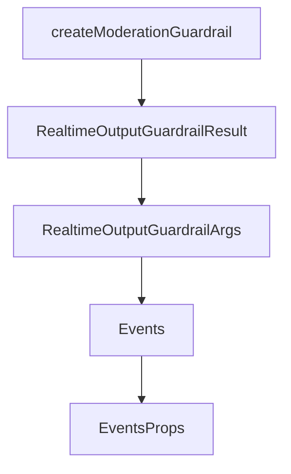

# Chapter 6: Voice Output

Welcome to **Chapter 6: Voice Output**. In this part of **OpenAI Realtime Agents Tutorial: Voice-First AI Systems**, you will build an intuitive mental model first, then move into concrete implementation details and practical production tradeoffs.


Voice output quality is primarily a timing and interaction problem. Good prosody helps, but responsiveness and interruption behavior matter more.

## Learning Goals

By the end of this chapter, you should be able to:

- design low-latency output streaming behavior
- handle barge-in cleanly without losing conversation continuity
- monitor core audio response metrics
- tune output policy for different use cases

## Output Pipeline

1. response deltas are generated
2. audio is synthesized/streamed
3. client buffers and plays frames
4. playback is interrupted or completed
5. session state is updated for next turn

## Voice UX Rules of Thumb

- prefer short, direct phrasing
- avoid dense list-heavy answers in speech mode
- announce long actions briefly before tool calls
- use natural checkpoint phrases for easier interruption

## Barge-In Behavior

When user speaks during playback:

- stop playback immediately
- mark current response state as interrupted
- prioritize next user input event path
- ensure transcript/state remains coherent after cutover

## Latency Targets (Product-Dependent)

| Metric | Why It Matters |
|:-------|:---------------|
| time to first audio | user perceived responsiveness |
| interruption stop latency | user sense of control |
| full response completion latency | overall task pacing |
| playback error rate | trust and reliability |

## Output Regression Signals

- rising interruption dissatisfaction despite stable model quality
- increased repeated-user prompts ("hello?", "are you there?")
- higher manual retry rates for basic interactions
- audible clipping or stutter under normal network conditions

## Source References

- [OpenAI Realtime Guide](https://platform.openai.com/docs/guides/realtime)
- [openai/openai-realtime-agents Repository](https://github.com/openai/openai-realtime-agents)

## Summary

You now understand how to tune voice output for perceived speed, clarity, and user control.

Next: [Chapter 7: Advanced Patterns](07-advanced-patterns.md)

## Depth Expansion Playbook

## Source Code Walkthrough

### `src/app/agentConfigs/guardrails.ts`

The `createModerationGuardrail` function in [`src/app/agentConfigs/guardrails.ts`](https://github.com/openai/openai-realtime-agents/blob/HEAD/src/app/agentConfigs/guardrails.ts) handles a key part of this chapter's functionality:

```ts

// Creates a guardrail bound to a specific company name for output moderation purposes. 
export function createModerationGuardrail(companyName: string) {
  return {
    name: 'moderation_guardrail',

    async execute({ agentOutput }: RealtimeOutputGuardrailArgs): Promise<RealtimeOutputGuardrailResult> {
      try {
        const res = await runGuardrailClassifier(agentOutput, companyName);
        const triggered = res.moderationCategory !== 'NONE';
        return {
          tripwireTriggered: triggered,
          outputInfo: res,
        };
      } catch {
        return {
          tripwireTriggered: false,
          outputInfo: { error: 'guardrail_failed' },
        };
      }
    },
  } as const;
}
```

This function is important because it defines how OpenAI Realtime Agents Tutorial: Voice-First AI Systems implements the patterns covered in this chapter.

### `src/app/agentConfigs/guardrails.ts`

The `RealtimeOutputGuardrailResult` interface in [`src/app/agentConfigs/guardrails.ts`](https://github.com/openai/openai-realtime-agents/blob/HEAD/src/app/agentConfigs/guardrails.ts) handles a key part of this chapter's functionality:

```ts
}

export interface RealtimeOutputGuardrailResult {
  tripwireTriggered: boolean;
  outputInfo: any;
}

export interface RealtimeOutputGuardrailArgs {
  agentOutput: string;
  agent?: any;
  context?: any;
}

// Creates a guardrail bound to a specific company name for output moderation purposes. 
export function createModerationGuardrail(companyName: string) {
  return {
    name: 'moderation_guardrail',

    async execute({ agentOutput }: RealtimeOutputGuardrailArgs): Promise<RealtimeOutputGuardrailResult> {
      try {
        const res = await runGuardrailClassifier(agentOutput, companyName);
        const triggered = res.moderationCategory !== 'NONE';
        return {
          tripwireTriggered: triggered,
          outputInfo: res,
        };
      } catch {
        return {
          tripwireTriggered: false,
          outputInfo: { error: 'guardrail_failed' },
        };
      }
```

This interface is important because it defines how OpenAI Realtime Agents Tutorial: Voice-First AI Systems implements the patterns covered in this chapter.

### `src/app/agentConfigs/guardrails.ts`

The `RealtimeOutputGuardrailArgs` interface in [`src/app/agentConfigs/guardrails.ts`](https://github.com/openai/openai-realtime-agents/blob/HEAD/src/app/agentConfigs/guardrails.ts) handles a key part of this chapter's functionality:

```ts
}

export interface RealtimeOutputGuardrailArgs {
  agentOutput: string;
  agent?: any;
  context?: any;
}

// Creates a guardrail bound to a specific company name for output moderation purposes. 
export function createModerationGuardrail(companyName: string) {
  return {
    name: 'moderation_guardrail',

    async execute({ agentOutput }: RealtimeOutputGuardrailArgs): Promise<RealtimeOutputGuardrailResult> {
      try {
        const res = await runGuardrailClassifier(agentOutput, companyName);
        const triggered = res.moderationCategory !== 'NONE';
        return {
          tripwireTriggered: triggered,
          outputInfo: res,
        };
      } catch {
        return {
          tripwireTriggered: false,
          outputInfo: { error: 'guardrail_failed' },
        };
      }
    },
  } as const;
}
```

This interface is important because it defines how OpenAI Realtime Agents Tutorial: Voice-First AI Systems implements the patterns covered in this chapter.

### `src/app/components/Events.tsx`

The `Events` function in [`src/app/components/Events.tsx`](https://github.com/openai/openai-realtime-agents/blob/HEAD/src/app/components/Events.tsx) handles a key part of this chapter's functionality:

```tsx
import { LoggedEvent } from "@/app/types";

export interface EventsProps {
  isExpanded: boolean;
}

function Events({ isExpanded }: EventsProps) {
  const [prevEventLogs, setPrevEventLogs] = useState<LoggedEvent[]>([]);
  const eventLogsContainerRef = useRef<HTMLDivElement | null>(null);

  const { loggedEvents, toggleExpand } = useEvent();

  const getDirectionArrow = (direction: string) => {
    if (direction === "client") return { symbol: "▲", color: "#7f5af0" };
    if (direction === "server") return { symbol: "▼", color: "#2cb67d" };
    return { symbol: "•", color: "#555" };
  };

  useEffect(() => {
    const hasNewEvent = loggedEvents.length > prevEventLogs.length;

    if (isExpanded && hasNewEvent && eventLogsContainerRef.current) {
      eventLogsContainerRef.current.scrollTop =
        eventLogsContainerRef.current.scrollHeight;
    }

    setPrevEventLogs(loggedEvents);
  }, [loggedEvents, isExpanded]);

  return (
    <div
      className={
```

This function is important because it defines how OpenAI Realtime Agents Tutorial: Voice-First AI Systems implements the patterns covered in this chapter.


## How These Components Connect


