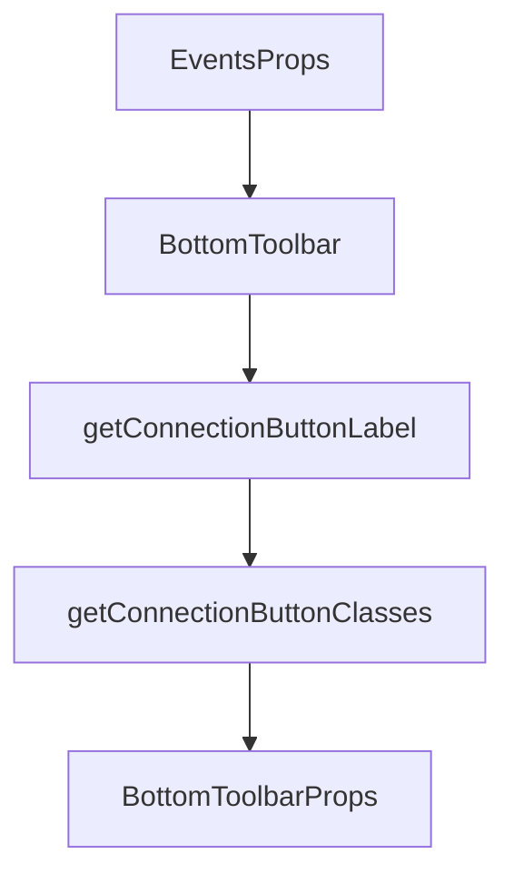

# Chapter 7: Advanced Patterns

Welcome to **Chapter 7: Advanced Patterns**. In this part of **OpenAI Realtime Agents Tutorial: Voice-First AI Systems**, you will build an intuitive mental model first, then move into concrete implementation details and practical production tradeoffs.


This chapter covers the two flagship orchestration patterns from the official repository and when to use each.

## Learning Goals

By the end of this chapter, you should be able to:

- implement chat-supervisor architecture intentionally
- implement sequential specialist handoff architecture
- choose pattern based on operational constraints
- avoid common multi-agent orchestration failures

## Pattern 1: Chat-Supervisor

### Design

- a fast realtime front agent handles immediate user interaction
- a stronger reasoning-focused backend agent handles complex planning/tool decisions

### Benefits

- preserves responsiveness on routine turns
- enables deeper reasoning only when needed
- helps teams migrate from text-agent systems incrementally

### Risks

- cross-agent state drift if context handoff is sloppy
- over-routing to supervisor increases latency and cost

## Pattern 2: Sequential Handoff

### Design

- specialist realtime agents own distinct domains (for example billing, support, auth)
- explicit transfer rules route conversations across specialists

### Benefits

- tighter prompts and tools per domain
- clearer ownership and easier debugging
- lower instruction collisions

### Risks

- too many specialists increase routing complexity
- weak handoff contracts can create repetitive clarification loops

## Decision Matrix

| Constraint | Prefer Chat-Supervisor | Prefer Sequential Handoff |
|:-----------|:-----------------------|:--------------------------|
| migrating from a strong text agent | yes | maybe |
| strict domain boundaries | maybe | yes |
| minimal orchestration complexity | yes | no |
| high specialist compliance requirements | no | yes |

## Operational Guardrails

- define explicit handoff contracts (what context transfers)
- log handoff reasons and outcomes for every transfer
- cap max handoff depth per conversation
- add fallback to a generalist recovery path

## Source References

- [openai/openai-realtime-agents Repository](https://github.com/openai/openai-realtime-agents)
- [OpenAI Agents JavaScript SDK](https://github.com/openai/openai-agents-js)

## Summary

You now have a practical framework for choosing and operating multi-agent realtime orchestration patterns.

Next: [Chapter 8: Production Deployment](08-production-deployment.md)

## Source Code Walkthrough

### `src/app/components/Events.tsx`

The `EventsProps` interface in [`src/app/components/Events.tsx`](https://github.com/openai/openai-realtime-agents/blob/HEAD/src/app/components/Events.tsx) handles a key part of this chapter's functionality:

```tsx
import { LoggedEvent } from "@/app/types";

export interface EventsProps {
  isExpanded: boolean;
}

function Events({ isExpanded }: EventsProps) {
  const [prevEventLogs, setPrevEventLogs] = useState<LoggedEvent[]>([]);
  const eventLogsContainerRef = useRef<HTMLDivElement | null>(null);

  const { loggedEvents, toggleExpand } = useEvent();

  const getDirectionArrow = (direction: string) => {
    if (direction === "client") return { symbol: "▲", color: "#7f5af0" };
    if (direction === "server") return { symbol: "▼", color: "#2cb67d" };
    return { symbol: "•", color: "#555" };
  };

  useEffect(() => {
    const hasNewEvent = loggedEvents.length > prevEventLogs.length;

    if (isExpanded && hasNewEvent && eventLogsContainerRef.current) {
      eventLogsContainerRef.current.scrollTop =
        eventLogsContainerRef.current.scrollHeight;
    }

    setPrevEventLogs(loggedEvents);
  }, [loggedEvents, isExpanded]);

  return (
    <div
      className={
```

This interface is important because it defines how OpenAI Realtime Agents Tutorial: Voice-First AI Systems implements the patterns covered in this chapter.

### `src/app/components/BottomToolbar.tsx`

The `BottomToolbar` function in [`src/app/components/BottomToolbar.tsx`](https://github.com/openai/openai-realtime-agents/blob/HEAD/src/app/components/BottomToolbar.tsx) handles a key part of this chapter's functionality:

```tsx
import { SessionStatus } from "@/app/types";

interface BottomToolbarProps {
  sessionStatus: SessionStatus;
  onToggleConnection: () => void;
  isPTTActive: boolean;
  setIsPTTActive: (val: boolean) => void;
  isPTTUserSpeaking: boolean;
  handleTalkButtonDown: () => void;
  handleTalkButtonUp: () => void;
  isEventsPaneExpanded: boolean;
  setIsEventsPaneExpanded: (val: boolean) => void;
  isAudioPlaybackEnabled: boolean;
  setIsAudioPlaybackEnabled: (val: boolean) => void;
  codec: string;
  onCodecChange: (newCodec: string) => void;
}

function BottomToolbar({
  sessionStatus,
  onToggleConnection,
  isPTTActive,
  setIsPTTActive,
  isPTTUserSpeaking,
  handleTalkButtonDown,
  handleTalkButtonUp,
  isEventsPaneExpanded,
  setIsEventsPaneExpanded,
  isAudioPlaybackEnabled,
  setIsAudioPlaybackEnabled,
  codec,
  onCodecChange,
```

This function is important because it defines how OpenAI Realtime Agents Tutorial: Voice-First AI Systems implements the patterns covered in this chapter.

### `src/app/components/BottomToolbar.tsx`

The `getConnectionButtonLabel` function in [`src/app/components/BottomToolbar.tsx`](https://github.com/openai/openai-realtime-agents/blob/HEAD/src/app/components/BottomToolbar.tsx) handles a key part of this chapter's functionality:

```tsx
  };

  function getConnectionButtonLabel() {
    if (isConnected) return "Disconnect";
    if (isConnecting) return "Connecting...";
    return "Connect";
  }

  function getConnectionButtonClasses() {
    const baseClasses = "text-white text-base p-2 w-36 rounded-md h-full";
    const cursorClass = isConnecting ? "cursor-not-allowed" : "cursor-pointer";

    if (isConnected) {
      // Connected -> label "Disconnect" -> red
      return `bg-red-600 hover:bg-red-700 ${cursorClass} ${baseClasses}`;
    }
    // Disconnected or connecting -> label is either "Connect" or "Connecting" -> black
    return `bg-black hover:bg-gray-900 ${cursorClass} ${baseClasses}`;
  }

  return (
    <div className="p-4 flex flex-row items-center justify-center gap-x-8">
      <button
        onClick={onToggleConnection}
        className={getConnectionButtonClasses()}
        disabled={isConnecting}
      >
        {getConnectionButtonLabel()}
      </button>

      <div className="flex flex-row items-center gap-2">
        <input
```

This function is important because it defines how OpenAI Realtime Agents Tutorial: Voice-First AI Systems implements the patterns covered in this chapter.

### `src/app/components/BottomToolbar.tsx`

The `getConnectionButtonClasses` function in [`src/app/components/BottomToolbar.tsx`](https://github.com/openai/openai-realtime-agents/blob/HEAD/src/app/components/BottomToolbar.tsx) handles a key part of this chapter's functionality:

```tsx
  }

  function getConnectionButtonClasses() {
    const baseClasses = "text-white text-base p-2 w-36 rounded-md h-full";
    const cursorClass = isConnecting ? "cursor-not-allowed" : "cursor-pointer";

    if (isConnected) {
      // Connected -> label "Disconnect" -> red
      return `bg-red-600 hover:bg-red-700 ${cursorClass} ${baseClasses}`;
    }
    // Disconnected or connecting -> label is either "Connect" or "Connecting" -> black
    return `bg-black hover:bg-gray-900 ${cursorClass} ${baseClasses}`;
  }

  return (
    <div className="p-4 flex flex-row items-center justify-center gap-x-8">
      <button
        onClick={onToggleConnection}
        className={getConnectionButtonClasses()}
        disabled={isConnecting}
      >
        {getConnectionButtonLabel()}
      </button>

      <div className="flex flex-row items-center gap-2">
        <input
          id="push-to-talk"
          type="checkbox"
          checked={isPTTActive}
          onChange={(e) => setIsPTTActive(e.target.checked)}
          disabled={!isConnected}
          className="w-4 h-4"
```

This function is important because it defines how OpenAI Realtime Agents Tutorial: Voice-First AI Systems implements the patterns covered in this chapter.


## How These Components Connect


