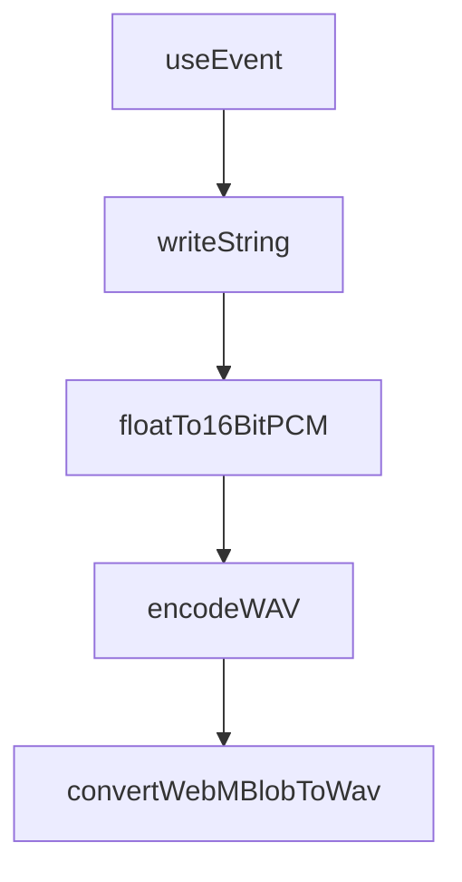

# Chapter 8: Production Deployment

Welcome to **Chapter 8: Production Deployment**. In this part of **OpenAI Realtime Agents Tutorial: Voice-First AI Systems**, you will build an intuitive mental model first, then move into concrete implementation details and practical production tradeoffs.


This chapter converts a successful demo into a production-grade voice-agent system with clear reliability, security, and migration controls.

## Learning Goals

By the end of this chapter, you should be able to:

- define a production readiness checklist for realtime agents
- operate rollout/rollback safely with measurable gates
- monitor latency, quality, and security signals together
- keep realtime integrations resilient to API evolution

## Production Readiness Checklist

Before broad launch, verify:

- short-lived credentials are enforced for client sessions
- server-side tool authorization and audit logging are in place
- reconnect, retry, and timeout policies are tested
- voice latency and interruption SLOs are defined
- rollback procedures are rehearsed with owners assigned

## Core SLO Signals

| Area | Metrics |
|:-----|:--------|
| session health | creation success rate, reconnect success rate |
| voice responsiveness | time to first audio, interruption stop latency |
| tool reliability | tool success rate, timeout/error frequency |
| quality outcomes | task completion rate, clarification loop rate |
| safety/security | blocked unsafe actions, auth anomalies |

## Rollout Plan

1. internal pilot with full debug telemetry
2. canary release to small external segment
3. compare SLOs against baseline weekly
4. expand gradually by tenant/use-case risk tier
5. auto-pause rollout when critical SLOs breach

## Incident Taxonomy

| Incident Class | First Action |
|:---------------|:-------------|
| transport instability | fail over region/path and reduce concurrency |
| tool backend outage | disable affected tools and activate fallback response path |
| auth/session failure spike | rotate credentials and enforce stricter issuance policy |
| model/service degradation | route to validated backup config and reduce optional workloads |

## Migration Discipline

Because realtime interfaces evolve quickly:

- pin SDK/dependency versions
- maintain contract tests for event handlers
- track deprecations with explicit calendar dates
- budget time for periodic migration rehearsals

As of official deprecation docs, the Realtime beta interface shutdown date is listed as **February 27, 2026**, so production systems should remain GA-aligned.

## Source References

- [OpenAI API Deprecations](https://platform.openai.com/docs/deprecations)
- [OpenAI Realtime Guide](https://platform.openai.com/docs/guides/realtime)
- [openai/openai-realtime-agents Repository](https://github.com/openai/openai-realtime-agents)

## Final Summary

You now have an end-to-end operating model for production realtime voice agents, from security posture to latency SLOs and migration resilience.

Related:
- [OpenAI Python SDK Tutorial](../openai-python-sdk-tutorial/)
- [OpenAI Whisper Tutorial](../openai-whisper-tutorial/)
- [Swarm Tutorial](../swarm-tutorial/)

## Depth Expansion Playbook

## Source Code Walkthrough

### `src/app/contexts/EventContext.tsx`

The `useEvent` function in [`src/app/contexts/EventContext.tsx`](https://github.com/openai/openai-realtime-agents/blob/HEAD/src/app/contexts/EventContext.tsx) handles a key part of this chapter's functionality:

```tsx
};

export function useEvent() {
  const context = useContext(EventContext);
  if (!context) {
    throw new Error("useEvent must be used within an EventProvider");
  }
  return context;
}
```

This function is important because it defines how OpenAI Realtime Agents Tutorial: Voice-First AI Systems implements the patterns covered in this chapter.

### `src/app/lib/audioUtils.ts`

The `writeString` function in [`src/app/lib/audioUtils.ts`](https://github.com/openai/openai-realtime-agents/blob/HEAD/src/app/lib/audioUtils.ts) handles a key part of this chapter's functionality:

```ts
 * Writes a string into a DataView at the given offset.
 */
export function writeString(view: DataView, offset: number, str: string) {
  for (let i = 0; i < str.length; i++) {
    view.setUint8(offset + i, str.charCodeAt(i));
  }
}

/**
 * Converts a Float32Array to 16-bit PCM in a DataView.
 */
export function floatTo16BitPCM(output: DataView, offset: number, input: Float32Array) {
  for (let i = 0; i < input.length; i++, offset += 2) {
    const s = Math.max(-1, Math.min(1, input[i]));
    output.setInt16(offset, s < 0 ? s * 0x8000 : s * 0x7FFF, true);
  }
}

/**
 * Encodes a Float32Array as a WAV file.
 */
export function encodeWAV(samples: Float32Array, sampleRate: number): ArrayBuffer {
  const buffer = new ArrayBuffer(44 + samples.length * 2);
  const view = new DataView(buffer);

  // RIFF identifier
  writeString(view, 0, "RIFF");
  // file length minus RIFF identifier length and file description length
  view.setUint32(4, 36 + samples.length * 2, true);
  // RIFF type
  writeString(view, 8, "WAVE");
  // format chunk identifier
```

This function is important because it defines how OpenAI Realtime Agents Tutorial: Voice-First AI Systems implements the patterns covered in this chapter.

### `src/app/lib/audioUtils.ts`

The `floatTo16BitPCM` function in [`src/app/lib/audioUtils.ts`](https://github.com/openai/openai-realtime-agents/blob/HEAD/src/app/lib/audioUtils.ts) handles a key part of this chapter's functionality:

```ts
 * Converts a Float32Array to 16-bit PCM in a DataView.
 */
export function floatTo16BitPCM(output: DataView, offset: number, input: Float32Array) {
  for (let i = 0; i < input.length; i++, offset += 2) {
    const s = Math.max(-1, Math.min(1, input[i]));
    output.setInt16(offset, s < 0 ? s * 0x8000 : s * 0x7FFF, true);
  }
}

/**
 * Encodes a Float32Array as a WAV file.
 */
export function encodeWAV(samples: Float32Array, sampleRate: number): ArrayBuffer {
  const buffer = new ArrayBuffer(44 + samples.length * 2);
  const view = new DataView(buffer);

  // RIFF identifier
  writeString(view, 0, "RIFF");
  // file length minus RIFF identifier length and file description length
  view.setUint32(4, 36 + samples.length * 2, true);
  // RIFF type
  writeString(view, 8, "WAVE");
  // format chunk identifier
  writeString(view, 12, "fmt ");
  // format chunk length
  view.setUint32(16, 16, true);
  // sample format (raw)
  view.setUint16(20, 1, true);
  // channel count - forcing mono here by averaging channels
  view.setUint16(22, 1, true);
  // sample rate
  view.setUint32(24, sampleRate, true);
```

This function is important because it defines how OpenAI Realtime Agents Tutorial: Voice-First AI Systems implements the patterns covered in this chapter.

### `src/app/lib/audioUtils.ts`

The `encodeWAV` function in [`src/app/lib/audioUtils.ts`](https://github.com/openai/openai-realtime-agents/blob/HEAD/src/app/lib/audioUtils.ts) handles a key part of this chapter's functionality:

```ts
 * Encodes a Float32Array as a WAV file.
 */
export function encodeWAV(samples: Float32Array, sampleRate: number): ArrayBuffer {
  const buffer = new ArrayBuffer(44 + samples.length * 2);
  const view = new DataView(buffer);

  // RIFF identifier
  writeString(view, 0, "RIFF");
  // file length minus RIFF identifier length and file description length
  view.setUint32(4, 36 + samples.length * 2, true);
  // RIFF type
  writeString(view, 8, "WAVE");
  // format chunk identifier
  writeString(view, 12, "fmt ");
  // format chunk length
  view.setUint32(16, 16, true);
  // sample format (raw)
  view.setUint16(20, 1, true);
  // channel count - forcing mono here by averaging channels
  view.setUint16(22, 1, true);
  // sample rate
  view.setUint32(24, sampleRate, true);
  // byte rate (sample rate * block align)
  view.setUint32(28, sampleRate * 2, true);
  // block align (channel count * bytes per sample)
  view.setUint16(32, 2, true);
  // bits per sample
  view.setUint16(34, 16, true);
  // data chunk identifier
  writeString(view, 36, "data");
  // data chunk length
  view.setUint32(40, samples.length * 2, true);
```

This function is important because it defines how OpenAI Realtime Agents Tutorial: Voice-First AI Systems implements the patterns covered in this chapter.


## How These Components Connect


