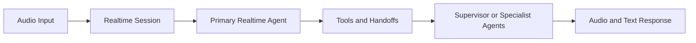

# OpenAI Realtime Agents Tutorial: Voice-First AI Systems

> Learn how to build low-latency voice agents with `openai/openai-realtime-agents`, including realtime session design, tool orchestration, and production rollout patterns.

## Why This Track Matters

Realtime voice agents require different engineering discipline than text-only bots: latency budgets, interruption handling, session resilience, and tool safety all become first-class concerns.

This track focuses on:

- architecture patterns from the official OpenAI realtime agent demos
- reliable voice input/output and turn-management behavior
- tool-calling and handoff patterns for specialized agent roles
- migration-safe implementation aligned with current Realtime deprecations

## Current Snapshot (auto-updated)

- repository: [`openai/openai-realtime-agents`](https://github.com/openai/openai-realtime-agents)
- stars: about **6.8k**
- release status: no tagged releases at this time (main-branch reference implementation)
- development activity: active with recent updates
- project positioning in repo: demonstration patterns for advanced Realtime agent orchestration

## Mental Model

## Chapter Guide

| Chapter | Key Question | Outcome |
|:--------|:-------------|:--------|
| [01 - Getting Started](01-getting-started.md) | How do I run the official demos quickly? | Working realtime baseline |
| [02 - Realtime API Fundamentals](02-realtime-api-fundamentals.md) | How do sessions, events, and transports work? | Correct protocol mental model |
| [03 - Voice Input Processing](03-voice-input-processing.md) | How do I manage VAD and interruption cleanly? | Better low-latency input handling |
| [04 - Conversational AI](04-conversational-ai.md) | How do I keep dialogue coherent under realtime constraints? | Stable conversational behavior |
| [05 - Function Calling](05-function-calling.md) | How do realtime agents call tools safely? | Tool orchestration strategy |
| [06 - Voice Output](06-voice-output.md) | How do I stream speech responses effectively? | Production voice-response baseline |
| [07 - Advanced Patterns](07-advanced-patterns.md) | How do chat-supervisor and sequential-handoff patterns differ? | Better architecture tradeoff decisions |
| [08 - Production Deployment](08-production-deployment.md) | How do I run voice agents with reliability/security controls? | Operations-ready deployment plan |

## What You Will Learn

- how to implement robust realtime voice-agent session flows
- how to design specialist/supervisor handoffs and tool execution loops
- how to manage latency, interruption, and recovery in production voice systems
- how to align implementations with current GA Realtime guidance and beta deprecation timelines

## Source References

- [openai/openai-realtime-agents Repository](https://github.com/openai/openai-realtime-agents)
- [OpenAI Realtime API Guide](https://platform.openai.com/docs/guides/realtime)
- [OpenAI API Deprecations](https://platform.openai.com/docs/deprecations)
- [OpenAI Agents JavaScript SDK](https://github.com/openai/openai-agents-js)

## Related Tutorials

- [OpenAI Python SDK Tutorial](../openai-python-sdk-tutorial/)
- [OpenAI Whisper Tutorial](../openai-whisper-tutorial/)
- [Swarm Tutorial](../swarm-tutorial/)
- [Vercel AI Tutorial](../vercel-ai-tutorial/)

---

Start with [Chapter 1: Getting Started](01-getting-started.md).

## Navigation & Backlinks

- [Start Here: Chapter 1: Getting Started](01-getting-started.md)
- [Back to Main Catalog](../../README.md#-tutorial-catalog)
- [Browse A-Z Tutorial Directory](../../discoverability/tutorial-directory.md)
- [Search by Intent](../../discoverability/query-hub.md)
- [Explore Category Hubs](../../README.md#category-hubs)

## Full Chapter Map

1. [Chapter 1: Getting Started](01-getting-started.md)
2. [Chapter 2: Realtime API Fundamentals](02-realtime-api-fundamentals.md)
3. [Chapter 3: Voice Input Processing](03-voice-input-processing.md)
4. [Chapter 4: Conversational AI](04-conversational-ai.md)
5. [Chapter 5: Function Calling](05-function-calling.md)
6. [Chapter 6: Voice Output](06-voice-output.md)
7. [Chapter 7: Advanced Patterns](07-advanced-patterns.md)
8. [Chapter 8: Production Deployment](08-production-deployment.md)

*Generated by [AI Codebase Knowledge Builder](https://github.com/The-Pocket/Tutorial-Codebase-Knowledge)*
