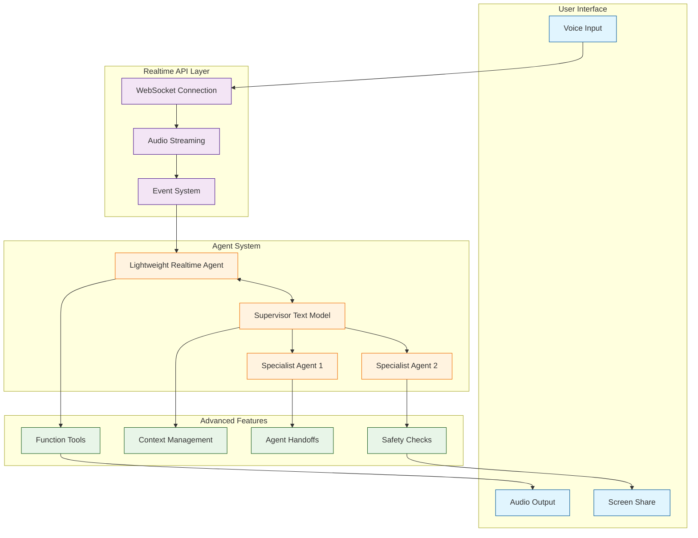

# OpenAI Realtime Agents Tutorial: Voice-First AI Assistants

> Build advanced voice agents with OpenAI's Realtime API featuring low-latency conversations, agent orchestration, and multimodal interactions.

[](https://github.com/openai/openai-realtime-agents)
[](https://opensource.org/licenses/MIT)
[](https://github.com/openai/openai-realtime-agents)

## 🎯 What are OpenAI Realtime Agents?

**OpenAI Realtime Agents** is a demonstration repository showcasing advanced agentic patterns built on OpenAI's Realtime API. It demonstrates how to build voice-first AI systems with agent coordination, intelligent handoffs, and multimodal capabilities for low-latency conversational experiences.

### Key Features

| Feature | Description |
|:--------|:------------|
| **Chat-Supervisor Pattern** | Lightweight realtime agent delegates complex tasks to text models |
| **Sequential Handoff** | Multiple specialized agents transfer control based on user intent |
| **Low-Latency Voice** | Real-time audio streaming with <1s response times |
| **Agent Orchestration** | Dynamic agent switching and context management |
| **Function Calling** | Tool integration during voice conversations |
| **Safety Guardrails** | Output validation and escalation to reasoning models |

## Architecture Overview



## Tutorial Structure

> Status: This index is currently the published roadmap for the tutorial. Chapter pages are in progress.

| Chapter | Topic | What You'll Learn |
|:--------|:------|:------------------|
| **1. Getting Started (Planned)** | Setup | Installation, first voice agent, architecture overview |
| **2. Realtime API Fundamentals (Planned)** | Protocol | WebSocket, audio streaming, event-driven patterns |
| **3. Voice Input Processing (Planned)** | Audio | Capture, VAD (Voice Activity Detection), transcription |
| **4. Conversational AI (Planned)** | Interaction | Turn-taking, interruption handling, context management |
| **5. Function Calling (Planned)** | Tools | Real-time tool use, async execution, response synthesis |
| **6. Voice Output (Planned)** | Speech | TTS integration, audio streaming, emotional expression |
| **7. Advanced Patterns (Planned)** | Orchestration | Chat-supervisor, sequential handoff, multi-agent systems |
| **8. Production Deployment (Planned)** | Operations | WebRTC infrastructure, latency optimization, scaling |

## Tech Stack

| Component | Technology |
|:----------|:-----------|
| **Language** | TypeScript / Next.js |
| **Realtime API** | WebSocket, Server-Sent Events |
| **Audio** | WebRTC, Web Audio API |
| **Agents** | OpenAI Agents SDK (Python/JS) |
| **Frontend** | React, Next.js App Router |
| **Deployment** | Vercel, cloud platforms |

## What You'll Build

By the end of this tutorial, you'll be able to:

- **Build Voice Agents** with real-time audio streaming
- **Implement Agent Patterns** including chat-supervisor and sequential handoff
- **Handle Conversations** with turn-taking and interruption support
- **Integrate Tools** that execute during voice conversations
- **Manage Context** across agent transitions
- **Deploy Production Systems** with low-latency voice interaction
- **Add Safety Guardrails** for sensitive or high-stakes decisions
- **Optimize Latency** for sub-second response times

## Prerequisites

- **TypeScript/JavaScript** programming experience
- **OpenAI API key** with Realtime API access
- **Basic understanding** of WebSockets and audio
- **React/Next.js** familiarity helpful for examples

## Related Tutorials

**Prerequisites:**
- [OpenAI Whisper Tutorial](../openai-whisper-tutorial/) - Speech recognition foundations
- [OpenAI Python SDK Tutorial](../openai-python-sdk-tutorial/) - OpenAI API basics

**Complementary:**
- [OpenAI Swarm Tutorial](../swarm-tutorial/) - Multi-agent orchestration patterns

**Next Steps:**
- Building voice-enabled applications
- Real-time multimodal AI systems

## Agent Patterns Demonstrated

### 1. Chat-Supervisor Pattern

**Use Case:** Balance responsiveness with intelligence

```
┌─────────────────────────────────────────┐
│ Lightweight Realtime Agent              │
│ • Handles simple queries instantly      │
│ • Manages voice interaction             │
│ • Delegates complex tasks to supervisor │
└─────────────────────────────────────────┘
              ↓ (Complex task)
┌─────────────────────────────────────────┐
│ Supervisor Text Model (GPT-4)           │
│ • Processes complex reasoning           │
│ • Returns guidance to realtime agent    │
└─────────────────────────────────────────┘
```

**Benefits:**
- Low latency for common queries
- Intelligence for complex tasks
- Cost optimization (use smaller model for routine interactions)

### 2. Sequential Handoff Pattern

**Use Case:** Customer service with specialized agents

```
User Voice Input
      ↓
Triage Agent (determines intent)
      ↓
   ┌──┴──┬────────┬──────────┐
   ↓     ↓        ↓          ↓
Support Sales Billing  Technical
Agent   Agent  Agent    Agent
```

**Benefits:**
- Specialized expertise per domain
- Clear handoff points
- Maintains conversation context

## Performance Characteristics

| Metric | Target | Notes |
|:-------|:-------|:------|
| **Response Latency** | <1 second | Audio generation start time |
| **Interruption Handling** | <300ms | Detect and switch |
| **Agent Handoff** | <2 seconds | Context transfer overhead |
| **Audio Quality** | 24kHz+ | Clear voice synthesis |

---

Ready to begin? Review the roadmap above while chapter pages are being finalized.

---

*Built with insights from the [OpenAI Realtime Agents repository](https://github.com/openai/openai-realtime-agents) and Realtime API documentation.*
