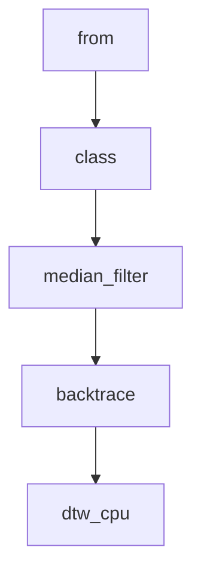

# Chapter 1: Getting Started

Welcome to **Chapter 1: Getting Started**. In this part of **OpenAI Whisper Tutorial: Speech Recognition and Translation**, you will build an intuitive mental model first, then move into concrete implementation details and practical production tradeoffs.


This chapter sets up Whisper locally and validates the baseline transcription workflow.

## Install Dependencies

```bash
python3 -m venv .venv
source .venv/bin/activate
pip install --upgrade pip
pip install -U openai-whisper
```

Install `ffmpeg` using your platform package manager (required for most audio inputs).

## Quick CLI Test

```bash
whisper sample_audio.wav --model turbo
```

If the model downloads and transcription completes, your baseline setup is working.

## Quick Python Test

```python
import whisper

model = whisper.load_model("turbo")
result = model.transcribe("sample_audio.wav")
print(result["text"])
```

## Model Selection Snapshot

| Model | Typical Use |
|:------|:------------|
| tiny/base | Fast, resource-limited environments |
| small/medium | Balanced quality and speed |
| large | Highest quality, high compute cost |
| turbo | Fast transcription-focused workflows |

## Important Constraint

The official README notes that `turbo` is not trained for translation tasks. Use multilingual non-turbo models when you need speech-to-English translation.

## Summary

You now have a working Whisper setup and know how to choose a baseline model for your environment.

Next: [Chapter 2: Model Architecture](02-model-architecture.md)

## What Problem Does This Solve?

Most teams struggle here because the hard part is not writing more code, but deciding clear boundaries for `whisper`, `venv`, `model` so behavior stays predictable as complexity grows.

In practical terms, this chapter helps you avoid three common failures:

- coupling core logic too tightly to one implementation path
- missing the handoff boundaries between setup, execution, and validation
- shipping changes without clear rollback or observability strategy

After working through this chapter, you should be able to reason about `Chapter 1: Getting Started` as an operating subsystem inside **OpenAI Whisper Tutorial: Speech Recognition and Translation**, with explicit contracts for inputs, state transitions, and outputs.

Use the implementation notes around `install`, `sample_audio`, `turbo` as your checklist when adapting these patterns to your own repository.

## How it Works Under the Hood

Under the hood, `Chapter 1: Getting Started` usually follows a repeatable control path:

1. **Context bootstrap**: initialize runtime config and prerequisites for `whisper`.
2. **Input normalization**: shape incoming data so `venv` receives stable contracts.
3. **Core execution**: run the main logic branch and propagate intermediate state through `model`.
4. **Policy and safety checks**: enforce limits, auth scopes, and failure boundaries.
5. **Output composition**: return canonical result payloads for downstream consumers.
6. **Operational telemetry**: emit logs/metrics needed for debugging and performance tuning.

When debugging, walk this sequence in order and confirm each stage has explicit success/failure conditions.

## Source Walkthrough

Use the following upstream sources to verify implementation details while reading this chapter:

- [openai/whisper repository](https://github.com/openai/whisper)
  Why it matters: authoritative reference on `openai/whisper repository` (github.com).

Suggested trace strategy:
- search upstream code for `whisper` and `venv` to map concrete implementation paths
- compare docs claims against actual runtime/config code before reusing patterns in production

## Chapter Connections

- [Tutorial Index](README.md)
- [Next Chapter: Chapter 2: Model Architecture](02-model-architecture.md)
- [Main Catalog](../../README.md#-tutorial-catalog)
- [A-Z Tutorial Directory](../../discoverability/tutorial-directory.md)

## Depth Expansion Playbook

## Source Code Walkthrough

### `whisper/timing.py`

The `from` class in [`whisper/timing.py`](https://github.com/openai/whisper/blob/HEAD/whisper/timing.py) handles a key part of this chapter's functionality:

```py
import subprocess
import warnings
from dataclasses import dataclass
from typing import TYPE_CHECKING, List

import numba
import numpy as np
import torch
import torch.nn.functional as F

from .audio import HOP_LENGTH, SAMPLE_RATE, TOKENS_PER_SECOND
from .tokenizer import Tokenizer

if TYPE_CHECKING:
    from .model import Whisper


def median_filter(x: torch.Tensor, filter_width: int):
    """Apply a median filter of width `filter_width` along the last dimension of `x`"""
    pad_width = filter_width // 2
    if x.shape[-1] <= pad_width:
        # F.pad requires the padding width to be smaller than the input dimension
        return x

    if (ndim := x.ndim) <= 2:
        # `F.pad` does not support 1D or 2D inputs for reflect padding but supports 3D and 4D
        x = x[None, None, :]

    assert (
        filter_width > 0 and filter_width % 2 == 1
    ), "`filter_width` should be an odd number"

```

This class is important because it defines how OpenAI Whisper Tutorial: Speech Recognition and Translation implements the patterns covered in this chapter.

### `whisper/timing.py`

The `class` class in [`whisper/timing.py`](https://github.com/openai/whisper/blob/HEAD/whisper/timing.py) handles a key part of this chapter's functionality:

```py
import subprocess
import warnings
from dataclasses import dataclass
from typing import TYPE_CHECKING, List

import numba
import numpy as np
import torch
import torch.nn.functional as F

from .audio import HOP_LENGTH, SAMPLE_RATE, TOKENS_PER_SECOND
from .tokenizer import Tokenizer

if TYPE_CHECKING:
    from .model import Whisper


def median_filter(x: torch.Tensor, filter_width: int):
    """Apply a median filter of width `filter_width` along the last dimension of `x`"""
    pad_width = filter_width // 2
    if x.shape[-1] <= pad_width:
        # F.pad requires the padding width to be smaller than the input dimension
        return x

    if (ndim := x.ndim) <= 2:
        # `F.pad` does not support 1D or 2D inputs for reflect padding but supports 3D and 4D
        x = x[None, None, :]

    assert (
        filter_width > 0 and filter_width % 2 == 1
    ), "`filter_width` should be an odd number"

```

This class is important because it defines how OpenAI Whisper Tutorial: Speech Recognition and Translation implements the patterns covered in this chapter.

### `whisper/timing.py`

The `median_filter` function in [`whisper/timing.py`](https://github.com/openai/whisper/blob/HEAD/whisper/timing.py) handles a key part of this chapter's functionality:

```py


def median_filter(x: torch.Tensor, filter_width: int):
    """Apply a median filter of width `filter_width` along the last dimension of `x`"""
    pad_width = filter_width // 2
    if x.shape[-1] <= pad_width:
        # F.pad requires the padding width to be smaller than the input dimension
        return x

    if (ndim := x.ndim) <= 2:
        # `F.pad` does not support 1D or 2D inputs for reflect padding but supports 3D and 4D
        x = x[None, None, :]

    assert (
        filter_width > 0 and filter_width % 2 == 1
    ), "`filter_width` should be an odd number"

    result = None
    x = F.pad(x, (filter_width // 2, filter_width // 2, 0, 0), mode="reflect")
    if x.is_cuda:
        try:
            from .triton_ops import median_filter_cuda

            result = median_filter_cuda(x, filter_width)
        except (RuntimeError, subprocess.CalledProcessError):
            warnings.warn(
                "Failed to launch Triton kernels, likely due to missing CUDA toolkit; "
                "falling back to a slower median kernel implementation..."
            )

    if result is None:
        # sort() is faster than torch.median (https://github.com/pytorch/pytorch/issues/51450)
```

This function is important because it defines how OpenAI Whisper Tutorial: Speech Recognition and Translation implements the patterns covered in this chapter.

### `whisper/timing.py`

The `backtrace` function in [`whisper/timing.py`](https://github.com/openai/whisper/blob/HEAD/whisper/timing.py) handles a key part of this chapter's functionality:

```py

@numba.jit(nopython=True)
def backtrace(trace: np.ndarray):
    i = trace.shape[0] - 1
    j = trace.shape[1] - 1
    trace[0, :] = 2
    trace[:, 0] = 1

    result = []
    while i > 0 or j > 0:
        result.append((i - 1, j - 1))

        if trace[i, j] == 0:
            i -= 1
            j -= 1
        elif trace[i, j] == 1:
            i -= 1
        elif trace[i, j] == 2:
            j -= 1
        else:
            raise ValueError("Unexpected trace[i, j]")

    result = np.array(result)
    return result[::-1, :].T


@numba.jit(nopython=True, parallel=True)
def dtw_cpu(x: np.ndarray):
    N, M = x.shape
    cost = np.ones((N + 1, M + 1), dtype=np.float32) * np.inf
    trace = -np.ones((N + 1, M + 1), dtype=np.float32)

```

This function is important because it defines how OpenAI Whisper Tutorial: Speech Recognition and Translation implements the patterns covered in this chapter.


## How These Components Connect


