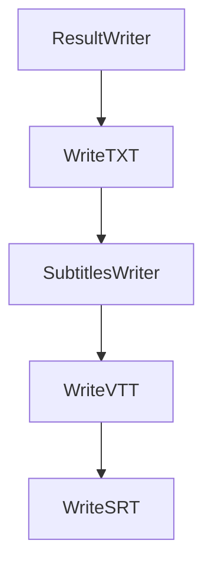

# Chapter 1: Getting Started

Welcome to **Chapter 1: Getting Started**. In this part of **OpenAI Whisper Tutorial: Speech Recognition and Translation**, you will build an intuitive mental model first, then move into concrete implementation details and practical production tradeoffs.


This chapter sets up Whisper locally and validates the baseline transcription workflow.

## Install Dependencies

```bash
python3 -m venv .venv
source .venv/bin/activate
pip install --upgrade pip
pip install -U openai-whisper
```

Install `ffmpeg` using your platform package manager (required for most audio inputs).

## Quick CLI Test

```bash
whisper sample_audio.wav --model turbo
```

If the model downloads and transcription completes, your baseline setup is working.

## Quick Python Test

```python
import whisper

model = whisper.load_model("turbo")
result = model.transcribe("sample_audio.wav")
print(result["text"])
```

## Model Selection Snapshot

| Model | Typical Use |
|:------|:------------|
| tiny/base | Fast, resource-limited environments |
| small/medium | Balanced quality and speed |
| large | Highest quality, high compute cost |
| turbo | Fast transcription-focused workflows |

## Important Constraint

The official README notes that `turbo` is not trained for translation tasks. Use multilingual non-turbo models when you need speech-to-English translation.

## Summary

You now have a working Whisper setup and know how to choose a baseline model for your environment.

Next: [Chapter 2: Model Architecture](02-model-architecture.md)

## What Problem Does This Solve?

Most teams struggle here because the hard part is not writing more code, but deciding clear boundaries for `whisper`, `venv`, `model` so behavior stays predictable as complexity grows.

In practical terms, this chapter helps you avoid three common failures:

- coupling core logic too tightly to one implementation path
- missing the handoff boundaries between setup, execution, and validation
- shipping changes without clear rollback or observability strategy

After working through this chapter, you should be able to reason about `Chapter 1: Getting Started` as an operating subsystem inside **OpenAI Whisper Tutorial: Speech Recognition and Translation**, with explicit contracts for inputs, state transitions, and outputs.

Use the implementation notes around `install`, `sample_audio`, `turbo` as your checklist when adapting these patterns to your own repository.

## How it Works Under the Hood

Under the hood, `Chapter 1: Getting Started` usually follows a repeatable control path:

1. **Context bootstrap**: initialize runtime config and prerequisites for `whisper`.
2. **Input normalization**: shape incoming data so `venv` receives stable contracts.
3. **Core execution**: run the main logic branch and propagate intermediate state through `model`.
4. **Policy and safety checks**: enforce limits, auth scopes, and failure boundaries.
5. **Output composition**: return canonical result payloads for downstream consumers.
6. **Operational telemetry**: emit logs/metrics needed for debugging and performance tuning.

When debugging, walk this sequence in order and confirm each stage has explicit success/failure conditions.

## Source Walkthrough

Use the following upstream sources to verify implementation details while reading this chapter:

- [openai/whisper repository](https://github.com/openai/whisper)
  Why it matters: authoritative reference on `openai/whisper repository` (github.com).

Suggested trace strategy:
- search upstream code for `whisper` and `venv` to map concrete implementation paths
- compare docs claims against actual runtime/config code before reusing patterns in production

## Chapter Connections

- [Tutorial Index](README.md)
- [Next Chapter: Chapter 2: Model Architecture](02-model-architecture.md)
- [Main Catalog](../../README.md#-tutorial-catalog)
- [A-Z Tutorial Directory](../../discoverability/tutorial-directory.md)

## Source Code Walkthrough

### `whisper/utils.py`

The `ResultWriter` class in [`whisper/utils.py`](https://github.com/openai/whisper/blob/HEAD/whisper/utils.py) handles a key part of this chapter's functionality:

```py


class ResultWriter:
    extension: str

    def __init__(self, output_dir: str):
        self.output_dir = output_dir

    def __call__(
        self, result: dict, audio_path: str, options: Optional[dict] = None, **kwargs
    ):
        audio_basename = os.path.basename(audio_path)
        audio_basename = os.path.splitext(audio_basename)[0]
        output_path = os.path.join(
            self.output_dir, audio_basename + "." + self.extension
        )

        with open(output_path, "w", encoding="utf-8") as f:
            self.write_result(result, file=f, options=options, **kwargs)

    def write_result(
        self, result: dict, file: TextIO, options: Optional[dict] = None, **kwargs
    ):
        raise NotImplementedError


class WriteTXT(ResultWriter):
    extension: str = "txt"

    def write_result(
        self, result: dict, file: TextIO, options: Optional[dict] = None, **kwargs
    ):
```

This class is important because it defines how OpenAI Whisper Tutorial: Speech Recognition and Translation implements the patterns covered in this chapter.

### `whisper/utils.py`

The `WriteTXT` class in [`whisper/utils.py`](https://github.com/openai/whisper/blob/HEAD/whisper/utils.py) handles a key part of this chapter's functionality:

```py


class WriteTXT(ResultWriter):
    extension: str = "txt"

    def write_result(
        self, result: dict, file: TextIO, options: Optional[dict] = None, **kwargs
    ):
        for segment in result["segments"]:
            print(segment["text"].strip(), file=file, flush=True)


class SubtitlesWriter(ResultWriter):
    always_include_hours: bool
    decimal_marker: str

    def iterate_result(
        self,
        result: dict,
        options: Optional[dict] = None,
        *,
        max_line_width: Optional[int] = None,
        max_line_count: Optional[int] = None,
        highlight_words: bool = False,
        max_words_per_line: Optional[int] = None,
    ):
        options = options or {}
        max_line_width = max_line_width or options.get("max_line_width")
        max_line_count = max_line_count or options.get("max_line_count")
        highlight_words = highlight_words or options.get("highlight_words", False)
        max_words_per_line = max_words_per_line or options.get("max_words_per_line")
        preserve_segments = max_line_count is None or max_line_width is None
```

This class is important because it defines how OpenAI Whisper Tutorial: Speech Recognition and Translation implements the patterns covered in this chapter.

### `whisper/utils.py`

The `SubtitlesWriter` class in [`whisper/utils.py`](https://github.com/openai/whisper/blob/HEAD/whisper/utils.py) handles a key part of this chapter's functionality:

```py


class SubtitlesWriter(ResultWriter):
    always_include_hours: bool
    decimal_marker: str

    def iterate_result(
        self,
        result: dict,
        options: Optional[dict] = None,
        *,
        max_line_width: Optional[int] = None,
        max_line_count: Optional[int] = None,
        highlight_words: bool = False,
        max_words_per_line: Optional[int] = None,
    ):
        options = options or {}
        max_line_width = max_line_width or options.get("max_line_width")
        max_line_count = max_line_count or options.get("max_line_count")
        highlight_words = highlight_words or options.get("highlight_words", False)
        max_words_per_line = max_words_per_line or options.get("max_words_per_line")
        preserve_segments = max_line_count is None or max_line_width is None
        max_line_width = max_line_width or 1000
        max_words_per_line = max_words_per_line or 1000

        def iterate_subtitles():
            line_len = 0
            line_count = 1
            # the next subtitle to yield (a list of word timings with whitespace)
            subtitle: List[dict] = []
            last: float = get_start(result["segments"]) or 0.0
            for segment in result["segments"]:
```

This class is important because it defines how OpenAI Whisper Tutorial: Speech Recognition and Translation implements the patterns covered in this chapter.

### `whisper/utils.py`

The `WriteVTT` class in [`whisper/utils.py`](https://github.com/openai/whisper/blob/HEAD/whisper/utils.py) handles a key part of this chapter's functionality:

```py


class WriteVTT(SubtitlesWriter):
    extension: str = "vtt"
    always_include_hours: bool = False
    decimal_marker: str = "."

    def write_result(
        self, result: dict, file: TextIO, options: Optional[dict] = None, **kwargs
    ):
        print("WEBVTT\n", file=file)
        for start, end, text in self.iterate_result(result, options, **kwargs):
            print(f"{start} --> {end}\n{text}\n", file=file, flush=True)


class WriteSRT(SubtitlesWriter):
    extension: str = "srt"
    always_include_hours: bool = True
    decimal_marker: str = ","

    def write_result(
        self, result: dict, file: TextIO, options: Optional[dict] = None, **kwargs
    ):
        for i, (start, end, text) in enumerate(
            self.iterate_result(result, options, **kwargs), start=1
        ):
            print(f"{i}\n{start} --> {end}\n{text}\n", file=file, flush=True)


class WriteTSV(ResultWriter):
    """
    Write a transcript to a file in TSV (tab-separated values) format containing lines like:
```

This class is important because it defines how OpenAI Whisper Tutorial: Speech Recognition and Translation implements the patterns covered in this chapter.


## How These Components Connect


