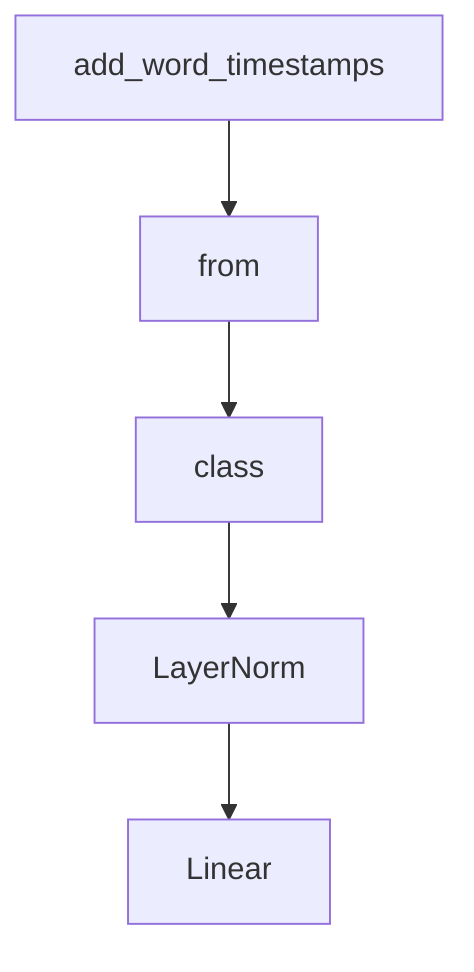

# Chapter 2: Model Architecture

Welcome to **Chapter 2: Model Architecture**. In this part of **OpenAI Whisper Tutorial: Speech Recognition and Translation**, you will build an intuitive mental model first, then move into concrete implementation details and practical production tradeoffs.


Understanding Whisper internals helps explain its strengths and limitations.

## High-Level Design

Whisper uses a transformer encoder-decoder setup:

1. audio is converted to log-Mel spectrogram features
2. encoder processes acoustic representation
3. decoder predicts token sequences conditioned on encoder states

## Multitask Token Strategy

Whisper uses special tokens to steer behavior for:

- transcription
- translation
- language identification
- timestamp prediction

This unified token-driven design replaces many separate ASR pipeline stages.

## Why This Matters Operationally

- a single model can handle multiple speech tasks
- prompt/token settings influence behavior directly
- decoding configuration affects latency and output style

## Sliding Window Behavior

The standard transcription API processes longer audio with sliding windows, which can introduce boundary artifacts if segmentation and stitching are not handled carefully.

## Practical Implications

| Architectural Trait | Operational Effect |
|:--------------------|:-------------------|
| Unified multitask decoder | Flexible but sensitive to token/config choices |
| Large model family | Strong quality/speed tradeoff control |
| Windowed inference | Requires careful chunk handling for long recordings |

## Summary

You now understand the core mechanics behind Whisper's multilingual and multitask behavior.

Next: [Chapter 3: Audio Preprocessing](03-audio-preprocessing.md)

## What Problem Does This Solve?

Most teams struggle here because the hard part is not writing more code, but deciding clear boundaries for core abstractions in this chapter so behavior stays predictable as complexity grows.

In practical terms, this chapter helps you avoid three common failures:

- coupling core logic too tightly to one implementation path
- missing the handoff boundaries between setup, execution, and validation
- shipping changes without clear rollback or observability strategy

After working through this chapter, you should be able to reason about `Chapter 2: Model Architecture` as an operating subsystem inside **OpenAI Whisper Tutorial: Speech Recognition and Translation**, with explicit contracts for inputs, state transitions, and outputs.

Use the implementation notes around execution and reliability details as your checklist when adapting these patterns to your own repository.

## How it Works Under the Hood

Under the hood, `Chapter 2: Model Architecture` usually follows a repeatable control path:

1. **Context bootstrap**: initialize runtime config and prerequisites for `core component`.
2. **Input normalization**: shape incoming data so `execution layer` receives stable contracts.
3. **Core execution**: run the main logic branch and propagate intermediate state through `state model`.
4. **Policy and safety checks**: enforce limits, auth scopes, and failure boundaries.
5. **Output composition**: return canonical result payloads for downstream consumers.
6. **Operational telemetry**: emit logs/metrics needed for debugging and performance tuning.

When debugging, walk this sequence in order and confirm each stage has explicit success/failure conditions.

## Source Walkthrough

Use the following upstream sources to verify implementation details while reading this chapter:

- [openai/whisper repository](https://github.com/openai/whisper)
  Why it matters: authoritative reference on `openai/whisper repository` (github.com).

Suggested trace strategy:
- search upstream code for `Model` and `Architecture` to map concrete implementation paths
- compare docs claims against actual runtime/config code before reusing patterns in production

## Chapter Connections

- [Tutorial Index](README.md)
- [Previous Chapter: Chapter 1: Getting Started](01-getting-started.md)
- [Next Chapter: Chapter 3: Audio Preprocessing](03-audio-preprocessing.md)
- [Main Catalog](../../README.md#-tutorial-catalog)
- [A-Z Tutorial Directory](../../discoverability/tutorial-directory.md)

## Depth Expansion Playbook

## Source Code Walkthrough

### `whisper/timing.py`

The `add_word_timestamps` function in [`whisper/timing.py`](https://github.com/openai/whisper/blob/HEAD/whisper/timing.py) handles a key part of this chapter's functionality:

```py


def add_word_timestamps(
    *,
    segments: List[dict],
    model: "Whisper",
    tokenizer: Tokenizer,
    mel: torch.Tensor,
    num_frames: int,
    prepend_punctuations: str = "\"'“¿([{-",
    append_punctuations: str = "\"'.。,，!！?？:：”)]}、",
    last_speech_timestamp: float,
    **kwargs,
):
    if len(segments) == 0:
        return

    text_tokens_per_segment = [
        [token for token in segment["tokens"] if token < tokenizer.eot]
        for segment in segments
    ]

    text_tokens = list(itertools.chain.from_iterable(text_tokens_per_segment))
    alignment = find_alignment(model, tokenizer, text_tokens, mel, num_frames, **kwargs)
    word_durations = np.array([t.end - t.start for t in alignment])
    word_durations = word_durations[word_durations.nonzero()]
    median_duration = np.median(word_durations) if len(word_durations) > 0 else 0.0
    median_duration = min(0.7, float(median_duration))
    max_duration = median_duration * 2

    # hack: truncate long words at sentence boundaries.
    # a better segmentation algorithm based on VAD should be able to replace this.
```

This function is important because it defines how OpenAI Whisper Tutorial: Speech Recognition and Translation implements the patterns covered in this chapter.

### `whisper/model.py`

The `from` class in [`whisper/model.py`](https://github.com/openai/whisper/blob/HEAD/whisper/model.py) handles a key part of this chapter's functionality:

```py
import base64
import gzip
from contextlib import contextmanager
from dataclasses import dataclass
from typing import Dict, Iterable, Optional, Tuple

import numpy as np
import torch
import torch.nn.functional as F
from torch import Tensor, nn

from .decoding import decode as decode_function
from .decoding import detect_language as detect_language_function
from .transcribe import transcribe as transcribe_function

try:
    from torch.nn.functional import scaled_dot_product_attention

    SDPA_AVAILABLE = True
except (ImportError, RuntimeError, OSError):
    scaled_dot_product_attention = None
    SDPA_AVAILABLE = False


@dataclass
class ModelDimensions:
    n_mels: int
    n_audio_ctx: int
    n_audio_state: int
    n_audio_head: int
    n_audio_layer: int
    n_vocab: int
```

This class is important because it defines how OpenAI Whisper Tutorial: Speech Recognition and Translation implements the patterns covered in this chapter.

### `whisper/model.py`

The `class` class in [`whisper/model.py`](https://github.com/openai/whisper/blob/HEAD/whisper/model.py) handles a key part of this chapter's functionality:

```py
import gzip
from contextlib import contextmanager
from dataclasses import dataclass
from typing import Dict, Iterable, Optional, Tuple

import numpy as np
import torch
import torch.nn.functional as F
from torch import Tensor, nn

from .decoding import decode as decode_function
from .decoding import detect_language as detect_language_function
from .transcribe import transcribe as transcribe_function

try:
    from torch.nn.functional import scaled_dot_product_attention

    SDPA_AVAILABLE = True
except (ImportError, RuntimeError, OSError):
    scaled_dot_product_attention = None
    SDPA_AVAILABLE = False


@dataclass
class ModelDimensions:
    n_mels: int
    n_audio_ctx: int
    n_audio_state: int
    n_audio_head: int
    n_audio_layer: int
    n_vocab: int
    n_text_ctx: int
```

This class is important because it defines how OpenAI Whisper Tutorial: Speech Recognition and Translation implements the patterns covered in this chapter.

### `whisper/model.py`

The `LayerNorm` class in [`whisper/model.py`](https://github.com/openai/whisper/blob/HEAD/whisper/model.py) handles a key part of this chapter's functionality:

```py


class LayerNorm(nn.LayerNorm):
    def forward(self, x: Tensor) -> Tensor:
        return super().forward(x.float()).type(x.dtype)


class Linear(nn.Linear):
    def forward(self, x: Tensor) -> Tensor:
        return F.linear(
            x,
            self.weight.to(x.dtype),
            None if self.bias is None else self.bias.to(x.dtype),
        )


class Conv1d(nn.Conv1d):
    def _conv_forward(
        self, x: Tensor, weight: Tensor, bias: Optional[Tensor]
    ) -> Tensor:
        return super()._conv_forward(
            x, weight.to(x.dtype), None if bias is None else bias.to(x.dtype)
        )


def sinusoids(length, channels, max_timescale=10000):
    """Returns sinusoids for positional embedding"""
    assert channels % 2 == 0
    log_timescale_increment = np.log(max_timescale) / (channels // 2 - 1)
    inv_timescales = torch.exp(-log_timescale_increment * torch.arange(channels // 2))
    scaled_time = torch.arange(length)[:, np.newaxis] * inv_timescales[np.newaxis, :]
    return torch.cat([torch.sin(scaled_time), torch.cos(scaled_time)], dim=1)
```

This class is important because it defines how OpenAI Whisper Tutorial: Speech Recognition and Translation implements the patterns covered in this chapter.


## How These Components Connect


