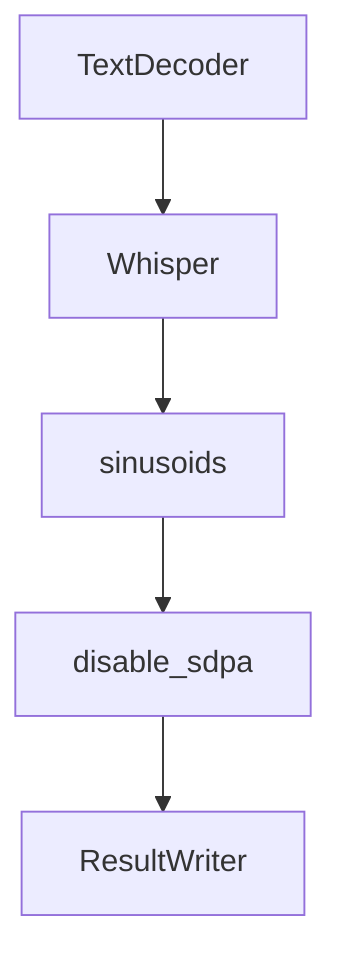

# Chapter 3: Audio Preprocessing

Welcome to **Chapter 3: Audio Preprocessing**. In this part of **OpenAI Whisper Tutorial: Speech Recognition and Translation**, you will build an intuitive mental model first, then move into concrete implementation details and practical production tradeoffs.


Input quality is often the biggest lever for transcription quality.

## Core Preprocessing Steps

1. decode source media reliably
2. normalize sample rate/channel layout
3. remove long silence where appropriate
4. segment long recordings into manageable chunks

## Why Segmentation Matters

Long, unsegmented audio increases latency and can reduce coherence around topic transitions. Segmenting with overlap often improves both throughput and quality.

## Noise and Channel Considerations

- apply gentle denoising for severe background noise
- prefer close-talk microphone capture when possible
- monitor clipping and low-SNR audio

## Preprocessing Checklist

| Check | Target |
|:------|:-------|
| Decoding reliability | No missing/corrupt audio frames |
| Segment length | Predictable, bounded chunk sizes |
| Overlap policy | Enough context to avoid word truncation |
| Silence policy | Remove dead air but preserve speaker pauses |

## Pitfalls

- over-aggressive noise reduction harming speech intelligibility
- inconsistent segmentation causing duplicate or dropped text
- mixing wildly different audio domains in one pipeline without adaptation

## Summary

You now have a repeatable preprocessing pipeline that improves both quality and runtime stability.

Next: [Chapter 4: Transcription and Translation](04-transcription-translation.md)

## What Problem Does This Solve?

Most teams struggle here because the hard part is not writing more code, but deciding clear boundaries for core abstractions in this chapter so behavior stays predictable as complexity grows.

In practical terms, this chapter helps you avoid three common failures:

- coupling core logic too tightly to one implementation path
- missing the handoff boundaries between setup, execution, and validation
- shipping changes without clear rollback or observability strategy

After working through this chapter, you should be able to reason about `Chapter 3: Audio Preprocessing` as an operating subsystem inside **OpenAI Whisper Tutorial: Speech Recognition and Translation**, with explicit contracts for inputs, state transitions, and outputs.

Use the implementation notes around execution and reliability details as your checklist when adapting these patterns to your own repository.

## How it Works Under the Hood

Under the hood, `Chapter 3: Audio Preprocessing` usually follows a repeatable control path:

1. **Context bootstrap**: initialize runtime config and prerequisites for `core component`.
2. **Input normalization**: shape incoming data so `execution layer` receives stable contracts.
3. **Core execution**: run the main logic branch and propagate intermediate state through `state model`.
4. **Policy and safety checks**: enforce limits, auth scopes, and failure boundaries.
5. **Output composition**: return canonical result payloads for downstream consumers.
6. **Operational telemetry**: emit logs/metrics needed for debugging and performance tuning.

When debugging, walk this sequence in order and confirm each stage has explicit success/failure conditions.

## Source Walkthrough

Use the following upstream sources to verify implementation details while reading this chapter:

- [openai/whisper repository](https://github.com/openai/whisper)
  Why it matters: authoritative reference on `openai/whisper repository` (github.com).

Suggested trace strategy:
- search upstream code for `Audio` and `Preprocessing` to map concrete implementation paths
- compare docs claims against actual runtime/config code before reusing patterns in production

## Chapter Connections

- [Tutorial Index](README.md)
- [Previous Chapter: Chapter 2: Model Architecture](02-model-architecture.md)
- [Next Chapter: Chapter 4: Transcription and Translation](04-transcription-translation.md)
- [Main Catalog](../../README.md#-tutorial-catalog)
- [A-Z Tutorial Directory](../../discoverability/tutorial-directory.md)

## Depth Expansion Playbook

## Source Code Walkthrough

### `whisper/model.py`

The `TextDecoder` class in [`whisper/model.py`](https://github.com/openai/whisper/blob/HEAD/whisper/model.py) handles a key part of this chapter's functionality:

```py


class TextDecoder(nn.Module):
    def __init__(
        self, n_vocab: int, n_ctx: int, n_state: int, n_head: int, n_layer: int
    ):
        super().__init__()

        self.token_embedding = nn.Embedding(n_vocab, n_state)
        self.positional_embedding = nn.Parameter(torch.empty(n_ctx, n_state))

        self.blocks: Iterable[ResidualAttentionBlock] = nn.ModuleList(
            [
                ResidualAttentionBlock(n_state, n_head, cross_attention=True)
                for _ in range(n_layer)
            ]
        )
        self.ln = LayerNorm(n_state)

        mask = torch.empty(n_ctx, n_ctx).fill_(-np.inf).triu_(1)
        self.register_buffer("mask", mask, persistent=False)

    def forward(self, x: Tensor, xa: Tensor, kv_cache: Optional[dict] = None):
        """
        x : torch.LongTensor, shape = (batch_size, <= n_ctx)
            the text tokens
        xa : torch.Tensor, shape = (batch_size, n_audio_ctx, n_audio_state)
            the encoded audio features to be attended on
        """
        offset = next(iter(kv_cache.values())).shape[1] if kv_cache else 0
        x = (
            self.token_embedding(x)
```

This class is important because it defines how OpenAI Whisper Tutorial: Speech Recognition and Translation implements the patterns covered in this chapter.

### `whisper/model.py`

The `Whisper` class in [`whisper/model.py`](https://github.com/openai/whisper/blob/HEAD/whisper/model.py) handles a key part of this chapter's functionality:

```py


class Whisper(nn.Module):
    def __init__(self, dims: ModelDimensions):
        super().__init__()
        self.dims = dims
        self.encoder = AudioEncoder(
            self.dims.n_mels,
            self.dims.n_audio_ctx,
            self.dims.n_audio_state,
            self.dims.n_audio_head,
            self.dims.n_audio_layer,
        )
        self.decoder = TextDecoder(
            self.dims.n_vocab,
            self.dims.n_text_ctx,
            self.dims.n_text_state,
            self.dims.n_text_head,
            self.dims.n_text_layer,
        )
        # use the last half among the decoder layers for time alignment by default;
        # to use a specific set of heads, see `set_alignment_heads()` below.
        all_heads = torch.zeros(
            self.dims.n_text_layer, self.dims.n_text_head, dtype=torch.bool
        )
        all_heads[self.dims.n_text_layer // 2 :] = True
        self.register_buffer("alignment_heads", all_heads.to_sparse(), persistent=False)

    def set_alignment_heads(self, dump: bytes):
        array = np.frombuffer(
            gzip.decompress(base64.b85decode(dump)), dtype=bool
        ).copy()
```

This class is important because it defines how OpenAI Whisper Tutorial: Speech Recognition and Translation implements the patterns covered in this chapter.

### `whisper/model.py`

The `sinusoids` function in [`whisper/model.py`](https://github.com/openai/whisper/blob/HEAD/whisper/model.py) handles a key part of this chapter's functionality:

```py


def sinusoids(length, channels, max_timescale=10000):
    """Returns sinusoids for positional embedding"""
    assert channels % 2 == 0
    log_timescale_increment = np.log(max_timescale) / (channels // 2 - 1)
    inv_timescales = torch.exp(-log_timescale_increment * torch.arange(channels // 2))
    scaled_time = torch.arange(length)[:, np.newaxis] * inv_timescales[np.newaxis, :]
    return torch.cat([torch.sin(scaled_time), torch.cos(scaled_time)], dim=1)


@contextmanager
def disable_sdpa():
    prev_state = MultiHeadAttention.use_sdpa
    try:
        MultiHeadAttention.use_sdpa = False
        yield
    finally:
        MultiHeadAttention.use_sdpa = prev_state


class MultiHeadAttention(nn.Module):
    use_sdpa = True

    def __init__(self, n_state: int, n_head: int):
        super().__init__()
        self.n_head = n_head
        self.query = Linear(n_state, n_state)
        self.key = Linear(n_state, n_state, bias=False)
        self.value = Linear(n_state, n_state)
        self.out = Linear(n_state, n_state)

```

This function is important because it defines how OpenAI Whisper Tutorial: Speech Recognition and Translation implements the patterns covered in this chapter.

### `whisper/model.py`

The `disable_sdpa` function in [`whisper/model.py`](https://github.com/openai/whisper/blob/HEAD/whisper/model.py) handles a key part of this chapter's functionality:

```py

@contextmanager
def disable_sdpa():
    prev_state = MultiHeadAttention.use_sdpa
    try:
        MultiHeadAttention.use_sdpa = False
        yield
    finally:
        MultiHeadAttention.use_sdpa = prev_state


class MultiHeadAttention(nn.Module):
    use_sdpa = True

    def __init__(self, n_state: int, n_head: int):
        super().__init__()
        self.n_head = n_head
        self.query = Linear(n_state, n_state)
        self.key = Linear(n_state, n_state, bias=False)
        self.value = Linear(n_state, n_state)
        self.out = Linear(n_state, n_state)

    def forward(
        self,
        x: Tensor,
        xa: Optional[Tensor] = None,
        mask: Optional[Tensor] = None,
        kv_cache: Optional[dict] = None,
    ):
        q = self.query(x)

        if kv_cache is None or xa is None or self.key not in kv_cache:
```

This function is important because it defines how OpenAI Whisper Tutorial: Speech Recognition and Translation implements the patterns covered in this chapter.


## How These Components Connect


