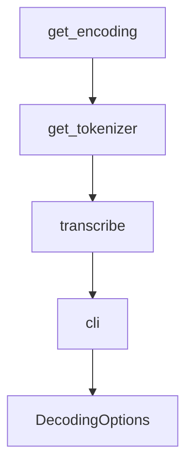

# Chapter 4: Transcription and Translation

Welcome to **Chapter 4: Transcription and Translation**. In this part of **OpenAI Whisper Tutorial: Speech Recognition and Translation**, you will build an intuitive mental model first, then move into concrete implementation details and practical production tradeoffs.


This chapter covers the two highest-value tasks: transcription and speech-to-English translation.

## Basic Transcription

```python
import whisper

model = whisper.load_model("small")
result = model.transcribe("meeting.wav")
print(result["text"])
```

## Translation Workflow

For non-English speech to English text, use a multilingual model and task override:

```python
result = model.transcribe("speech.wav", task="translate")
```

The official README warns that `turbo` is not translation-focused, so prefer other multilingual models when translation quality matters.

## Language Detection

Lower-level APIs allow explicit language detection and decoding control. This is useful for analytics pipelines that need language metadata.

## Timestamps and Subtitles

Whisper can produce segment timing data that supports subtitle generation and aligned transcript experiences.

## Evaluation Tips

- track WER/CER by language/domain
- review difficult audio categories separately
- compare model choices against real workload latency budgets

## Summary

You can now run robust transcription and translation workflows with explicit model/task choices.

Next: [Chapter 5: Fine-Tuning and Adaptation](05-fine-tuning.md)

## What Problem Does This Solve?

Most teams struggle here because the hard part is not writing more code, but deciding clear boundaries for `model`, `result`, `whisper` so behavior stays predictable as complexity grows.

In practical terms, this chapter helps you avoid three common failures:

- coupling core logic too tightly to one implementation path
- missing the handoff boundaries between setup, execution, and validation
- shipping changes without clear rollback or observability strategy

After working through this chapter, you should be able to reason about `Chapter 4: Transcription and Translation` as an operating subsystem inside **OpenAI Whisper Tutorial: Speech Recognition and Translation**, with explicit contracts for inputs, state transitions, and outputs.

Use the implementation notes around `transcribe`, `load_model`, `small` as your checklist when adapting these patterns to your own repository.

## How it Works Under the Hood

Under the hood, `Chapter 4: Transcription and Translation` usually follows a repeatable control path:

1. **Context bootstrap**: initialize runtime config and prerequisites for `model`.
2. **Input normalization**: shape incoming data so `result` receives stable contracts.
3. **Core execution**: run the main logic branch and propagate intermediate state through `whisper`.
4. **Policy and safety checks**: enforce limits, auth scopes, and failure boundaries.
5. **Output composition**: return canonical result payloads for downstream consumers.
6. **Operational telemetry**: emit logs/metrics needed for debugging and performance tuning.

When debugging, walk this sequence in order and confirm each stage has explicit success/failure conditions.

## Source Walkthrough

Use the following upstream sources to verify implementation details while reading this chapter:

- [openai/whisper repository](https://github.com/openai/whisper)
  Why it matters: authoritative reference on `openai/whisper repository` (github.com).

Suggested trace strategy:
- search upstream code for `model` and `result` to map concrete implementation paths
- compare docs claims against actual runtime/config code before reusing patterns in production

## Chapter Connections

- [Tutorial Index](README.md)
- [Previous Chapter: Chapter 3: Audio Preprocessing](03-audio-preprocessing.md)
- [Next Chapter: Chapter 5: Fine-Tuning and Adaptation](05-fine-tuning.md)
- [Main Catalog](../../README.md#-tutorial-catalog)
- [A-Z Tutorial Directory](../../discoverability/tutorial-directory.md)

## Source Code Walkthrough

### `whisper/tokenizer.py`

The `get_encoding` function in [`whisper/tokenizer.py`](https://github.com/openai/whisper/blob/HEAD/whisper/tokenizer.py) handles a key part of this chapter's functionality:

```py

@lru_cache(maxsize=None)
def get_encoding(name: str = "gpt2", num_languages: int = 99):
    vocab_path = os.path.join(os.path.dirname(__file__), "assets", f"{name}.tiktoken")
    ranks = {
        base64.b64decode(token): int(rank)
        for token, rank in (line.split() for line in open(vocab_path) if line)
    }
    n_vocab = len(ranks)
    special_tokens = {}

    specials = [
        "<|endoftext|>",
        "<|startoftranscript|>",
        *[f"<|{lang}|>" for lang in list(LANGUAGES.keys())[:num_languages]],
        "<|translate|>",
        "<|transcribe|>",
        "<|startoflm|>",
        "<|startofprev|>",
        "<|nospeech|>",
        "<|notimestamps|>",
        *[f"<|{i * 0.02:.2f}|>" for i in range(1501)],
    ]

    for token in specials:
        special_tokens[token] = n_vocab
        n_vocab += 1

    return tiktoken.Encoding(
        name=os.path.basename(vocab_path),
        explicit_n_vocab=n_vocab,
        pat_str=r"""'s|'t|'re|'ve|'m|'ll|'d| ?\p{L}+| ?\p{N}+| ?[^\s\p{L}\p{N}]+|\s+(?!\S)|\s+""",
```

This function is important because it defines how OpenAI Whisper Tutorial: Speech Recognition and Translation implements the patterns covered in this chapter.

### `whisper/tokenizer.py`

The `get_tokenizer` function in [`whisper/tokenizer.py`](https://github.com/openai/whisper/blob/HEAD/whisper/tokenizer.py) handles a key part of this chapter's functionality:

```py

@lru_cache(maxsize=None)
def get_tokenizer(
    multilingual: bool,
    *,
    num_languages: int = 99,
    language: Optional[str] = None,
    task: Optional[str] = None,  # Literal["transcribe", "translate", None]
) -> Tokenizer:
    if language is not None:
        language = language.lower()
        if language not in LANGUAGES:
            if language in TO_LANGUAGE_CODE:
                language = TO_LANGUAGE_CODE[language]
            else:
                raise ValueError(f"Unsupported language: {language}")

    if multilingual:
        encoding_name = "multilingual"
        language = language or "en"
        task = task or "transcribe"
    else:
        encoding_name = "gpt2"
        language = None
        task = None

    encoding = get_encoding(name=encoding_name, num_languages=num_languages)

    return Tokenizer(
        encoding=encoding, num_languages=num_languages, language=language, task=task
    )

```

This function is important because it defines how OpenAI Whisper Tutorial: Speech Recognition and Translation implements the patterns covered in this chapter.

### `whisper/transcribe.py`

The `transcribe` function in [`whisper/transcribe.py`](https://github.com/openai/whisper/blob/HEAD/whisper/transcribe.py) handles a key part of this chapter's functionality:

```py


def transcribe(
    model: "Whisper",
    audio: Union[str, np.ndarray, torch.Tensor],
    *,
    verbose: Optional[bool] = None,
    temperature: Union[float, Tuple[float, ...]] = (0.0, 0.2, 0.4, 0.6, 0.8, 1.0),
    compression_ratio_threshold: Optional[float] = 2.4,
    logprob_threshold: Optional[float] = -1.0,
    no_speech_threshold: Optional[float] = 0.6,
    condition_on_previous_text: bool = True,
    initial_prompt: Optional[str] = None,
    carry_initial_prompt: bool = False,
    word_timestamps: bool = False,
    prepend_punctuations: str = "\"'“¿([{-",
    append_punctuations: str = "\"'.。,，!！?？:：”)]}、",
    clip_timestamps: Union[str, List[float]] = "0",
    hallucination_silence_threshold: Optional[float] = None,
    **decode_options,
):
    """
    Transcribe an audio file using Whisper

    Parameters
    ----------
    model: Whisper
        The Whisper model instance

    audio: Union[str, np.ndarray, torch.Tensor]
        The path to the audio file to open, or the audio waveform

```

This function is important because it defines how OpenAI Whisper Tutorial: Speech Recognition and Translation implements the patterns covered in this chapter.

### `whisper/transcribe.py`

The `cli` function in [`whisper/transcribe.py`](https://github.com/openai/whisper/blob/HEAD/whisper/transcribe.py) handles a key part of this chapter's functionality:

```py
    prepend_punctuations: str = "\"'“¿([{-",
    append_punctuations: str = "\"'.。,，!！?？:：”)]}、",
    clip_timestamps: Union[str, List[float]] = "0",
    hallucination_silence_threshold: Optional[float] = None,
    **decode_options,
):
    """
    Transcribe an audio file using Whisper

    Parameters
    ----------
    model: Whisper
        The Whisper model instance

    audio: Union[str, np.ndarray, torch.Tensor]
        The path to the audio file to open, or the audio waveform

    verbose: bool
        Whether to display the text being decoded to the console. If True, displays all the details,
        If False, displays minimal details. If None, does not display anything

    temperature: Union[float, Tuple[float, ...]]
        Temperature for sampling. It can be a tuple of temperatures, which will be successively used
        upon failures according to either `compression_ratio_threshold` or `logprob_threshold`.

    compression_ratio_threshold: float
        If the gzip compression ratio is above this value, treat as failed

    logprob_threshold: float
        If the average log probability over sampled tokens is below this value, treat as failed

    no_speech_threshold: float
```

This function is important because it defines how OpenAI Whisper Tutorial: Speech Recognition and Translation implements the patterns covered in this chapter.


## How These Components Connect


