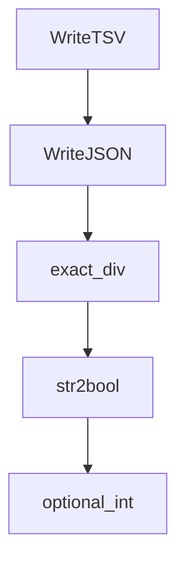

# Chapter 4: Transcription and Translation

Welcome to **Chapter 4: Transcription and Translation**. In this part of **OpenAI Whisper Tutorial: Speech Recognition and Translation**, you will build an intuitive mental model first, then move into concrete implementation details and practical production tradeoffs.


This chapter covers the two highest-value tasks: transcription and speech-to-English translation.

## Basic Transcription

```python
import whisper

model = whisper.load_model("small")
result = model.transcribe("meeting.wav")
print(result["text"])
```

## Translation Workflow

For non-English speech to English text, use a multilingual model and task override:

```python
result = model.transcribe("speech.wav", task="translate")
```

The official README warns that `turbo` is not translation-focused, so prefer other multilingual models when translation quality matters.

## Language Detection

Lower-level APIs allow explicit language detection and decoding control. This is useful for analytics pipelines that need language metadata.

## Timestamps and Subtitles

Whisper can produce segment timing data that supports subtitle generation and aligned transcript experiences.

## Evaluation Tips

- track WER/CER by language/domain
- review difficult audio categories separately
- compare model choices against real workload latency budgets

## Summary

You can now run robust transcription and translation workflows with explicit model/task choices.

Next: [Chapter 5: Fine-Tuning and Adaptation](05-fine-tuning.md)

## What Problem Does This Solve?

Most teams struggle here because the hard part is not writing more code, but deciding clear boundaries for `model`, `result`, `whisper` so behavior stays predictable as complexity grows.

In practical terms, this chapter helps you avoid three common failures:

- coupling core logic too tightly to one implementation path
- missing the handoff boundaries between setup, execution, and validation
- shipping changes without clear rollback or observability strategy

After working through this chapter, you should be able to reason about `Chapter 4: Transcription and Translation` as an operating subsystem inside **OpenAI Whisper Tutorial: Speech Recognition and Translation**, with explicit contracts for inputs, state transitions, and outputs.

Use the implementation notes around `transcribe`, `load_model`, `small` as your checklist when adapting these patterns to your own repository.

## How it Works Under the Hood

Under the hood, `Chapter 4: Transcription and Translation` usually follows a repeatable control path:

1. **Context bootstrap**: initialize runtime config and prerequisites for `model`.
2. **Input normalization**: shape incoming data so `result` receives stable contracts.
3. **Core execution**: run the main logic branch and propagate intermediate state through `whisper`.
4. **Policy and safety checks**: enforce limits, auth scopes, and failure boundaries.
5. **Output composition**: return canonical result payloads for downstream consumers.
6. **Operational telemetry**: emit logs/metrics needed for debugging and performance tuning.

When debugging, walk this sequence in order and confirm each stage has explicit success/failure conditions.

## Source Walkthrough

Use the following upstream sources to verify implementation details while reading this chapter:

- [openai/whisper repository](https://github.com/openai/whisper)
  Why it matters: authoritative reference on `openai/whisper repository` (github.com).

Suggested trace strategy:
- search upstream code for `model` and `result` to map concrete implementation paths
- compare docs claims against actual runtime/config code before reusing patterns in production

## Chapter Connections

- [Tutorial Index](README.md)
- [Previous Chapter: Chapter 3: Audio Preprocessing](03-audio-preprocessing.md)
- [Next Chapter: Chapter 5: Fine-Tuning and Adaptation](05-fine-tuning.md)
- [Main Catalog](../../README.md#-tutorial-catalog)
- [A-Z Tutorial Directory](../../discoverability/tutorial-directory.md)

## Depth Expansion Playbook

## Source Code Walkthrough

### `whisper/utils.py`

The `WriteTSV` class in [`whisper/utils.py`](https://github.com/openai/whisper/blob/HEAD/whisper/utils.py) handles a key part of this chapter's functionality:

```py


class WriteTSV(ResultWriter):
    """
    Write a transcript to a file in TSV (tab-separated values) format containing lines like:
    <start time in integer milliseconds>\t<end time in integer milliseconds>\t<transcript text>

    Using integer milliseconds as start and end times means there's no chance of interference from
    an environment setting a language encoding that causes the decimal in a floating point number
    to appear as a comma; also is faster and more efficient to parse & store, e.g., in C++.
    """

    extension: str = "tsv"

    def write_result(
        self, result: dict, file: TextIO, options: Optional[dict] = None, **kwargs
    ):
        print("start", "end", "text", sep="\t", file=file)
        for segment in result["segments"]:
            print(round(1000 * segment["start"]), file=file, end="\t")
            print(round(1000 * segment["end"]), file=file, end="\t")
            print(segment["text"].strip().replace("\t", " "), file=file, flush=True)


class WriteJSON(ResultWriter):
    extension: str = "json"

    def write_result(
        self, result: dict, file: TextIO, options: Optional[dict] = None, **kwargs
    ):
        json.dump(result, file)

```

This class is important because it defines how OpenAI Whisper Tutorial: Speech Recognition and Translation implements the patterns covered in this chapter.

### `whisper/utils.py`

The `WriteJSON` class in [`whisper/utils.py`](https://github.com/openai/whisper/blob/HEAD/whisper/utils.py) handles a key part of this chapter's functionality:

```py


class WriteJSON(ResultWriter):
    extension: str = "json"

    def write_result(
        self, result: dict, file: TextIO, options: Optional[dict] = None, **kwargs
    ):
        json.dump(result, file)


def get_writer(
    output_format: str, output_dir: str
) -> Callable[[dict, TextIO, dict], None]:
    writers = {
        "txt": WriteTXT,
        "vtt": WriteVTT,
        "srt": WriteSRT,
        "tsv": WriteTSV,
        "json": WriteJSON,
    }

    if output_format == "all":
        all_writers = [writer(output_dir) for writer in writers.values()]

        def write_all(
            result: dict, file: TextIO, options: Optional[dict] = None, **kwargs
        ):
            for writer in all_writers:
                writer(result, file, options, **kwargs)

        return write_all
```

This class is important because it defines how OpenAI Whisper Tutorial: Speech Recognition and Translation implements the patterns covered in this chapter.

### `whisper/utils.py`

The `exact_div` function in [`whisper/utils.py`](https://github.com/openai/whisper/blob/HEAD/whisper/utils.py) handles a key part of this chapter's functionality:

```py


def exact_div(x, y):
    assert x % y == 0
    return x // y


def str2bool(string):
    str2val = {"True": True, "False": False}
    if string in str2val:
        return str2val[string]
    else:
        raise ValueError(f"Expected one of {set(str2val.keys())}, got {string}")


def optional_int(string):
    return None if string == "None" else int(string)


def optional_float(string):
    return None if string == "None" else float(string)


def compression_ratio(text) -> float:
    text_bytes = text.encode("utf-8")
    return len(text_bytes) / len(zlib.compress(text_bytes))


def format_timestamp(
    seconds: float, always_include_hours: bool = False, decimal_marker: str = "."
):
    assert seconds >= 0, "non-negative timestamp expected"
```

This function is important because it defines how OpenAI Whisper Tutorial: Speech Recognition and Translation implements the patterns covered in this chapter.

### `whisper/utils.py`

The `str2bool` function in [`whisper/utils.py`](https://github.com/openai/whisper/blob/HEAD/whisper/utils.py) handles a key part of this chapter's functionality:

```py


def str2bool(string):
    str2val = {"True": True, "False": False}
    if string in str2val:
        return str2val[string]
    else:
        raise ValueError(f"Expected one of {set(str2val.keys())}, got {string}")


def optional_int(string):
    return None if string == "None" else int(string)


def optional_float(string):
    return None if string == "None" else float(string)


def compression_ratio(text) -> float:
    text_bytes = text.encode("utf-8")
    return len(text_bytes) / len(zlib.compress(text_bytes))


def format_timestamp(
    seconds: float, always_include_hours: bool = False, decimal_marker: str = "."
):
    assert seconds >= 0, "non-negative timestamp expected"
    milliseconds = round(seconds * 1000.0)

    hours = milliseconds // 3_600_000
    milliseconds -= hours * 3_600_000

```

This function is important because it defines how OpenAI Whisper Tutorial: Speech Recognition and Translation implements the patterns covered in this chapter.


## How These Components Connect


