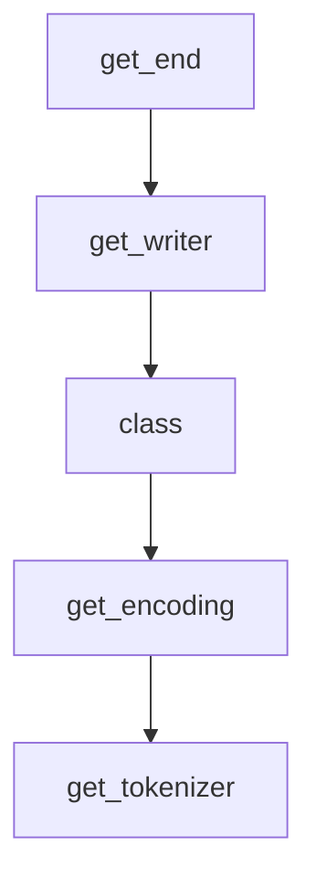

# Chapter 5: Fine-Tuning and Adaptation

Welcome to **Chapter 5: Fine-Tuning and Adaptation**. In this part of **OpenAI Whisper Tutorial: Speech Recognition and Translation**, you will build an intuitive mental model first, then move into concrete implementation details and practical production tradeoffs.


This chapter explains what is practical today when domain-specific performance is required.

## Reality Check

The official Whisper repository is primarily focused on inference and reference usage, not a turnkey fine-tuning product workflow.

For many teams, better results come first from:

- improved preprocessing
- smarter segmentation
- better model-size selection
- domain-aware post-processing

## Adaptation Strategies

1. **Lexicon correction layer** for domain terms and names
2. **Context-aware post-editing** with an LLM
3. **Confidence-triggered human review** for critical domains
4. **Selective retraining** with community/custom pipelines when justified

## When to Consider Custom Training

Consider it only when:

- domain error rates remain unacceptable after pipeline optimization
- you can curate high-quality labeled speech data
- you can maintain a reproducible training and evaluation stack

## Risks

- expensive training and infra complexity
- fragile gains if data quality is inconsistent
- regression risk across languages/accents not represented in training

## Summary

You now have a realistic adaptation path that starts with low-risk pipeline improvements before costly retraining.

Next: [Chapter 6: Advanced Features](06-advanced-features.md)

## What Problem Does This Solve?

Most teams struggle here because the hard part is not writing more code, but deciding clear boundaries for core abstractions in this chapter so behavior stays predictable as complexity grows.

In practical terms, this chapter helps you avoid three common failures:

- coupling core logic too tightly to one implementation path
- missing the handoff boundaries between setup, execution, and validation
- shipping changes without clear rollback or observability strategy

After working through this chapter, you should be able to reason about `Chapter 5: Fine-Tuning and Adaptation` as an operating subsystem inside **OpenAI Whisper Tutorial: Speech Recognition and Translation**, with explicit contracts for inputs, state transitions, and outputs.

Use the implementation notes around execution and reliability details as your checklist when adapting these patterns to your own repository.

## How it Works Under the Hood

Under the hood, `Chapter 5: Fine-Tuning and Adaptation` usually follows a repeatable control path:

1. **Context bootstrap**: initialize runtime config and prerequisites for `core component`.
2. **Input normalization**: shape incoming data so `execution layer` receives stable contracts.
3. **Core execution**: run the main logic branch and propagate intermediate state through `state model`.
4. **Policy and safety checks**: enforce limits, auth scopes, and failure boundaries.
5. **Output composition**: return canonical result payloads for downstream consumers.
6. **Operational telemetry**: emit logs/metrics needed for debugging and performance tuning.

When debugging, walk this sequence in order and confirm each stage has explicit success/failure conditions.

## Source Walkthrough

Use the following upstream sources to verify implementation details while reading this chapter:

- [openai/whisper repository](https://github.com/openai/whisper)
  Why it matters: authoritative reference on `openai/whisper repository` (github.com).

Suggested trace strategy:
- search upstream code for `Fine-Tuning` and `and` to map concrete implementation paths
- compare docs claims against actual runtime/config code before reusing patterns in production

## Chapter Connections

- [Tutorial Index](README.md)
- [Previous Chapter: Chapter 4: Transcription and Translation](04-transcription-translation.md)
- [Next Chapter: Chapter 6: Advanced Features](06-advanced-features.md)
- [Main Catalog](../../README.md#-tutorial-catalog)
- [A-Z Tutorial Directory](../../discoverability/tutorial-directory.md)

## Depth Expansion Playbook

## Source Code Walkthrough

### `whisper/utils.py`

The `get_end` function in [`whisper/utils.py`](https://github.com/openai/whisper/blob/HEAD/whisper/utils.py) handles a key part of this chapter's functionality:

```py


def get_end(segments: List[dict]) -> Optional[float]:
    return next(
        (w["end"] for s in reversed(segments) for w in reversed(s["words"])),
        segments[-1]["end"] if segments else None,
    )


class ResultWriter:
    extension: str

    def __init__(self, output_dir: str):
        self.output_dir = output_dir

    def __call__(
        self, result: dict, audio_path: str, options: Optional[dict] = None, **kwargs
    ):
        audio_basename = os.path.basename(audio_path)
        audio_basename = os.path.splitext(audio_basename)[0]
        output_path = os.path.join(
            self.output_dir, audio_basename + "." + self.extension
        )

        with open(output_path, "w", encoding="utf-8") as f:
            self.write_result(result, file=f, options=options, **kwargs)

    def write_result(
        self, result: dict, file: TextIO, options: Optional[dict] = None, **kwargs
    ):
        raise NotImplementedError

```

This function is important because it defines how OpenAI Whisper Tutorial: Speech Recognition and Translation implements the patterns covered in this chapter.

### `whisper/utils.py`

The `get_writer` function in [`whisper/utils.py`](https://github.com/openai/whisper/blob/HEAD/whisper/utils.py) handles a key part of this chapter's functionality:

```py


def get_writer(
    output_format: str, output_dir: str
) -> Callable[[dict, TextIO, dict], None]:
    writers = {
        "txt": WriteTXT,
        "vtt": WriteVTT,
        "srt": WriteSRT,
        "tsv": WriteTSV,
        "json": WriteJSON,
    }

    if output_format == "all":
        all_writers = [writer(output_dir) for writer in writers.values()]

        def write_all(
            result: dict, file: TextIO, options: Optional[dict] = None, **kwargs
        ):
            for writer in all_writers:
                writer(result, file, options, **kwargs)

        return write_all

    return writers[output_format](output_dir)

```

This function is important because it defines how OpenAI Whisper Tutorial: Speech Recognition and Translation implements the patterns covered in this chapter.

### `whisper/tokenizer.py`

The `class` class in [`whisper/tokenizer.py`](https://github.com/openai/whisper/blob/HEAD/whisper/tokenizer.py) handles a key part of this chapter's functionality:

```py
import os
import string
from dataclasses import dataclass, field
from functools import cached_property, lru_cache
from typing import Dict, List, Optional, Tuple

import tiktoken

LANGUAGES = {
    "en": "english",
    "zh": "chinese",
    "de": "german",
    "es": "spanish",
    "ru": "russian",
    "ko": "korean",
    "fr": "french",
    "ja": "japanese",
    "pt": "portuguese",
    "tr": "turkish",
    "pl": "polish",
    "ca": "catalan",
    "nl": "dutch",
    "ar": "arabic",
    "sv": "swedish",
    "it": "italian",
    "id": "indonesian",
    "hi": "hindi",
    "fi": "finnish",
    "vi": "vietnamese",
    "he": "hebrew",
    "uk": "ukrainian",
    "el": "greek",
```

This class is important because it defines how OpenAI Whisper Tutorial: Speech Recognition and Translation implements the patterns covered in this chapter.

### `whisper/tokenizer.py`

The `get_encoding` function in [`whisper/tokenizer.py`](https://github.com/openai/whisper/blob/HEAD/whisper/tokenizer.py) handles a key part of this chapter's functionality:

```py

@lru_cache(maxsize=None)
def get_encoding(name: str = "gpt2", num_languages: int = 99):
    vocab_path = os.path.join(os.path.dirname(__file__), "assets", f"{name}.tiktoken")
    ranks = {
        base64.b64decode(token): int(rank)
        for token, rank in (line.split() for line in open(vocab_path) if line)
    }
    n_vocab = len(ranks)
    special_tokens = {}

    specials = [
        "<|endoftext|>",
        "<|startoftranscript|>",
        *[f"<|{lang}|>" for lang in list(LANGUAGES.keys())[:num_languages]],
        "<|translate|>",
        "<|transcribe|>",
        "<|startoflm|>",
        "<|startofprev|>",
        "<|nospeech|>",
        "<|notimestamps|>",
        *[f"<|{i * 0.02:.2f}|>" for i in range(1501)],
    ]

    for token in specials:
        special_tokens[token] = n_vocab
        n_vocab += 1

    return tiktoken.Encoding(
        name=os.path.basename(vocab_path),
        explicit_n_vocab=n_vocab,
        pat_str=r"""'s|'t|'re|'ve|'m|'ll|'d| ?\p{L}+| ?\p{N}+| ?[^\s\p{L}\p{N}]+|\s+(?!\S)|\s+""",
```

This function is important because it defines how OpenAI Whisper Tutorial: Speech Recognition and Translation implements the patterns covered in this chapter.


## How These Components Connect


