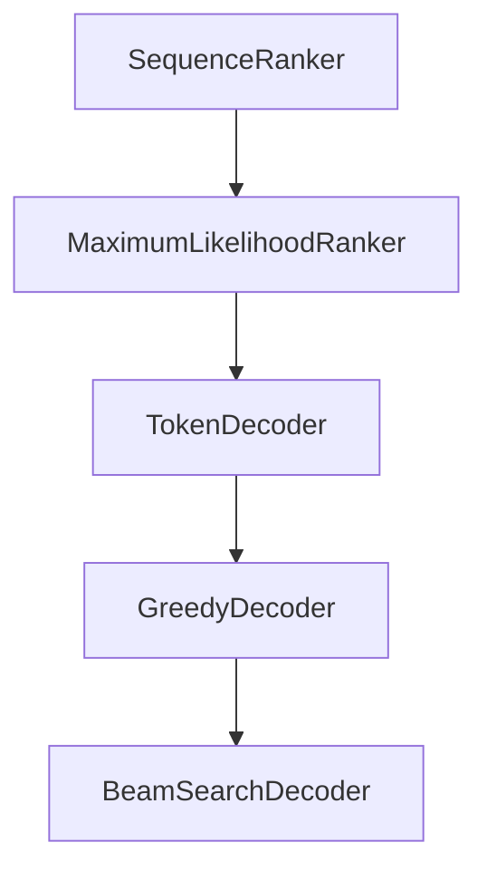

# Chapter 6: Advanced Features

Welcome to **Chapter 6: Advanced Features**. In this part of **OpenAI Whisper Tutorial: Speech Recognition and Translation**, you will build an intuitive mental model first, then move into concrete implementation details and practical production tradeoffs.


Whisper becomes far more useful when combined with downstream enrichment layers.

## Word and Segment Timing

Whisper supports timestamp-centric workflows that enable:

- subtitle generation
- transcript navigation
- clip-level search and indexing

## Speaker Diarization Integration

Whisper itself does not perform full diarization. Production stacks often pair it with diarization tools to assign text spans to speakers.

## Confidence and QA Pipelines

Common pattern:

1. produce transcript + timing metadata
2. run confidence heuristics or secondary scoring
3. route low-confidence spans to review

## Structured Transcript Outputs

Prefer explicit schema output for downstream consumers:

```json
{
  "segments": [
    {"start": 0.0, "end": 2.4, "speaker": "A", "text": "Hello"}
  ]
}
```

This avoids brittle text parsing in later systems.

## Summary

You now understand how to extend Whisper into richer, production-friendly transcript products.

Next: [Chapter 7: Performance Optimization](07-performance-optimization.md)

## What Problem Does This Solve?

Most teams struggle here because the hard part is not writing more code, but deciding clear boundaries for `segments`, `start`, `speaker` so behavior stays predictable as complexity grows.

In practical terms, this chapter helps you avoid three common failures:

- coupling core logic too tightly to one implementation path
- missing the handoff boundaries between setup, execution, and validation
- shipping changes without clear rollback or observability strategy

After working through this chapter, you should be able to reason about `Chapter 6: Advanced Features` as an operating subsystem inside **OpenAI Whisper Tutorial: Speech Recognition and Translation**, with explicit contracts for inputs, state transitions, and outputs.

Use the implementation notes around `text`, `Hello` as your checklist when adapting these patterns to your own repository.

## How it Works Under the Hood

Under the hood, `Chapter 6: Advanced Features` usually follows a repeatable control path:

1. **Context bootstrap**: initialize runtime config and prerequisites for `segments`.
2. **Input normalization**: shape incoming data so `start` receives stable contracts.
3. **Core execution**: run the main logic branch and propagate intermediate state through `speaker`.
4. **Policy and safety checks**: enforce limits, auth scopes, and failure boundaries.
5. **Output composition**: return canonical result payloads for downstream consumers.
6. **Operational telemetry**: emit logs/metrics needed for debugging and performance tuning.

When debugging, walk this sequence in order and confirm each stage has explicit success/failure conditions.

## Source Walkthrough

Use the following upstream sources to verify implementation details while reading this chapter:

- [openai/whisper repository](https://github.com/openai/whisper)
  Why it matters: authoritative reference on `openai/whisper repository` (github.com).

Suggested trace strategy:
- search upstream code for `segments` and `start` to map concrete implementation paths
- compare docs claims against actual runtime/config code before reusing patterns in production

## Chapter Connections

- [Tutorial Index](README.md)
- [Previous Chapter: Chapter 5: Fine-Tuning and Adaptation](05-fine-tuning.md)
- [Next Chapter: Chapter 7: Performance Optimization](07-performance-optimization.md)
- [Main Catalog](../../README.md#-tutorial-catalog)
- [A-Z Tutorial Directory](../../discoverability/tutorial-directory.md)

## Depth Expansion Playbook

## Source Code Walkthrough

### `whisper/decoding.py`

The `SequenceRanker` class in [`whisper/decoding.py`](https://github.com/openai/whisper/blob/HEAD/whisper/decoding.py) handles a key part of this chapter's functionality:

```py


class SequenceRanker:
    def rank(
        self, tokens: List[List[Tensor]], sum_logprobs: List[List[float]]
    ) -> List[int]:
        """
        Given a list of groups of samples and their cumulative log probabilities,
        return the indices of the samples in each group to select as the final result
        """
        raise NotImplementedError


class MaximumLikelihoodRanker(SequenceRanker):
    """
    Select the sample with the highest log probabilities, penalized using either
    a simple length normalization or Google NMT paper's length penalty
    """

    def __init__(self, length_penalty: Optional[float]):
        self.length_penalty = length_penalty

    def rank(self, tokens: List[List[Tensor]], sum_logprobs: List[List[float]]):
        def scores(logprobs, lengths):
            result = []
            for logprob, length in zip(logprobs, lengths):
                if self.length_penalty is None:
                    penalty = length
                else:
                    # from the Google NMT paper
                    penalty = ((5 + length) / 6) ** self.length_penalty
                result.append(logprob / penalty)
```

This class is important because it defines how OpenAI Whisper Tutorial: Speech Recognition and Translation implements the patterns covered in this chapter.

### `whisper/decoding.py`

The `MaximumLikelihoodRanker` class in [`whisper/decoding.py`](https://github.com/openai/whisper/blob/HEAD/whisper/decoding.py) handles a key part of this chapter's functionality:

```py


class MaximumLikelihoodRanker(SequenceRanker):
    """
    Select the sample with the highest log probabilities, penalized using either
    a simple length normalization or Google NMT paper's length penalty
    """

    def __init__(self, length_penalty: Optional[float]):
        self.length_penalty = length_penalty

    def rank(self, tokens: List[List[Tensor]], sum_logprobs: List[List[float]]):
        def scores(logprobs, lengths):
            result = []
            for logprob, length in zip(logprobs, lengths):
                if self.length_penalty is None:
                    penalty = length
                else:
                    # from the Google NMT paper
                    penalty = ((5 + length) / 6) ** self.length_penalty
                result.append(logprob / penalty)
            return result

        # get the sequence with the highest score
        lengths = [[len(t) for t in s] for s in tokens]
        return [np.argmax(scores(p, l)) for p, l in zip(sum_logprobs, lengths)]


class TokenDecoder:
    def reset(self):
        """Initialize any stateful variables for decoding a new sequence"""

```

This class is important because it defines how OpenAI Whisper Tutorial: Speech Recognition and Translation implements the patterns covered in this chapter.

### `whisper/decoding.py`

The `TokenDecoder` class in [`whisper/decoding.py`](https://github.com/openai/whisper/blob/HEAD/whisper/decoding.py) handles a key part of this chapter's functionality:

```py


class TokenDecoder:
    def reset(self):
        """Initialize any stateful variables for decoding a new sequence"""

    def update(
        self, tokens: Tensor, logits: Tensor, sum_logprobs: Tensor
    ) -> Tuple[Tensor, bool]:
        """Specify how to select the next token, based on the current trace and logits

        Parameters
        ----------
        tokens : Tensor, shape = (n_batch, current_sequence_length)
            all tokens in the context so far, including the prefix and sot_sequence tokens

        logits : Tensor, shape = (n_batch, vocab_size)
            per-token logits of the probability distribution at the current step

        sum_logprobs : Tensor, shape = (n_batch)
            cumulative log probabilities for each sequence

        Returns
        -------
        tokens : Tensor, shape = (n_batch, current_sequence_length + 1)
            the tokens, appended with the selected next token

        completed : bool
            True if all sequences has reached the end of text

        """
        raise NotImplementedError
```

This class is important because it defines how OpenAI Whisper Tutorial: Speech Recognition and Translation implements the patterns covered in this chapter.

### `whisper/decoding.py`

The `GreedyDecoder` class in [`whisper/decoding.py`](https://github.com/openai/whisper/blob/HEAD/whisper/decoding.py) handles a key part of this chapter's functionality:

```py


class GreedyDecoder(TokenDecoder):
    def __init__(self, temperature: float, eot: int):
        self.temperature = temperature
        self.eot = eot

    def update(
        self, tokens: Tensor, logits: Tensor, sum_logprobs: Tensor
    ) -> Tuple[Tensor, bool]:
        if self.temperature == 0:
            next_tokens = logits.argmax(dim=-1)
        else:
            next_tokens = Categorical(logits=logits / self.temperature).sample()

        logprobs = F.log_softmax(logits.float(), dim=-1)
        current_logprobs = logprobs[torch.arange(logprobs.shape[0]), next_tokens]
        sum_logprobs += current_logprobs * (tokens[:, -1] != self.eot)

        next_tokens[tokens[:, -1] == self.eot] = self.eot
        tokens = torch.cat([tokens, next_tokens[:, None]], dim=-1)

        completed = (tokens[:, -1] == self.eot).all()
        return tokens, completed

    def finalize(self, tokens: Tensor, sum_logprobs: Tensor):
        # make sure each sequence has at least one EOT token at the end
        tokens = F.pad(tokens, (0, 1), value=self.eot)
        return tokens, sum_logprobs.tolist()


class BeamSearchDecoder(TokenDecoder):
```

This class is important because it defines how OpenAI Whisper Tutorial: Speech Recognition and Translation implements the patterns covered in this chapter.


## How These Components Connect


