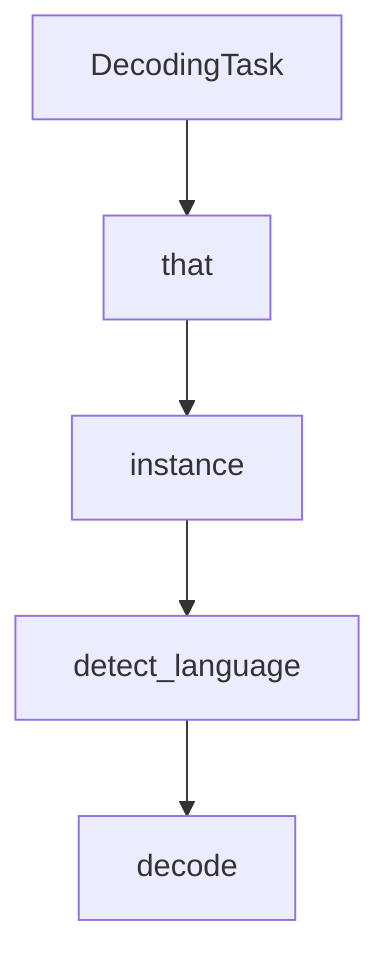

# Chapter 7: Performance Optimization

Welcome to **Chapter 7: Performance Optimization**. In this part of **OpenAI Whisper Tutorial: Speech Recognition and Translation**, you will build an intuitive mental model first, then move into concrete implementation details and practical production tradeoffs.


Whisper performance tuning is mainly about model choice, hardware, and batching strategy.

## High-Leverage Controls

- choose smallest model meeting your quality threshold
- run GPU acceleration where available
- batch short clips when latency budget allows
- pre-segment long recordings to reduce idle compute

## Throughput vs Latency Tradeoff

| Goal | Strategy |
|:-----|:---------|
| Lowest latency | smaller model, minimal batching |
| Highest throughput | larger batch sizes, asynchronous workers |
| Best quality | larger model and stronger preprocessing |

## Hardware Notes

- CPU-only paths are viable for low-volume workloads
- GPU paths improve throughput substantially for medium/large models
- monitor memory headroom; model swaps can cause instability under load

## Quantization and Alternate Runtimes

For constrained environments, evaluate optimized runtimes (such as whisper.cpp ecosystems) and quantized models while validating quality regressions on your own data.

## Summary

You can now tune Whisper for your target latency, cost, and quality envelope.

Next: [Chapter 8: Production Deployment](08-production-deployment.md)

## What Problem Does This Solve?

Most teams struggle here because the hard part is not writing more code, but deciding clear boundaries for core abstractions in this chapter so behavior stays predictable as complexity grows.

In practical terms, this chapter helps you avoid three common failures:

- coupling core logic too tightly to one implementation path
- missing the handoff boundaries between setup, execution, and validation
- shipping changes without clear rollback or observability strategy

After working through this chapter, you should be able to reason about `Chapter 7: Performance Optimization` as an operating subsystem inside **OpenAI Whisper Tutorial: Speech Recognition and Translation**, with explicit contracts for inputs, state transitions, and outputs.

Use the implementation notes around execution and reliability details as your checklist when adapting these patterns to your own repository.

## How it Works Under the Hood

Under the hood, `Chapter 7: Performance Optimization` usually follows a repeatable control path:

1. **Context bootstrap**: initialize runtime config and prerequisites for `core component`.
2. **Input normalization**: shape incoming data so `execution layer` receives stable contracts.
3. **Core execution**: run the main logic branch and propagate intermediate state through `state model`.
4. **Policy and safety checks**: enforce limits, auth scopes, and failure boundaries.
5. **Output composition**: return canonical result payloads for downstream consumers.
6. **Operational telemetry**: emit logs/metrics needed for debugging and performance tuning.

When debugging, walk this sequence in order and confirm each stage has explicit success/failure conditions.

## Source Walkthrough

Use the following upstream sources to verify implementation details while reading this chapter:

- [openai/whisper repository](https://github.com/openai/whisper)
  Why it matters: authoritative reference on `openai/whisper repository` (github.com).

Suggested trace strategy:
- search upstream code for `Performance` and `Optimization` to map concrete implementation paths
- compare docs claims against actual runtime/config code before reusing patterns in production

## Chapter Connections

- [Tutorial Index](README.md)
- [Previous Chapter: Chapter 6: Advanced Features](06-advanced-features.md)
- [Next Chapter: Chapter 8: Production Deployment](08-production-deployment.md)
- [Main Catalog](../../README.md#-tutorial-catalog)
- [A-Z Tutorial Directory](../../discoverability/tutorial-directory.md)

## Depth Expansion Playbook

## Source Code Walkthrough

### `whisper/decoding.py`

The `DecodingTask` class in [`whisper/decoding.py`](https://github.com/openai/whisper/blob/HEAD/whisper/decoding.py) handles a key part of this chapter's functionality:

```py


class DecodingTask:
    inference: Inference
    sequence_ranker: SequenceRanker
    decoder: TokenDecoder
    logit_filters: List[LogitFilter]

    def __init__(self, model: "Whisper", options: DecodingOptions):
        self.model = model

        language = options.language or "en"
        tokenizer = get_tokenizer(
            model.is_multilingual,
            num_languages=model.num_languages,
            language=language,
            task=options.task,
        )
        self.tokenizer: Tokenizer = tokenizer
        self.options: DecodingOptions = self._verify_options(options)

        self.n_group: int = options.beam_size or options.best_of or 1
        self.n_ctx: int = model.dims.n_text_ctx
        self.sample_len: int = options.sample_len or model.dims.n_text_ctx // 2

        self.sot_sequence: Tuple[int] = tokenizer.sot_sequence
        if self.options.without_timestamps:
            self.sot_sequence = tokenizer.sot_sequence_including_notimestamps

        self.initial_tokens: Tuple[int] = self._get_initial_tokens()
        self.sample_begin: int = len(self.initial_tokens)
        self.sot_index: int = self.initial_tokens.index(tokenizer.sot)
```

This class is important because it defines how OpenAI Whisper Tutorial: Speech Recognition and Translation implements the patterns covered in this chapter.

### `whisper/decoding.py`

The `that` class in [`whisper/decoding.py`](https://github.com/openai/whisper/blob/HEAD/whisper/decoding.py) handles a key part of this chapter's functionality:

```py
    task: str = "transcribe"

    # language that the audio is in; uses detected language if None
    language: Optional[str] = None

    # sampling-related options
    temperature: float = 0.0
    sample_len: Optional[int] = None  # maximum number of tokens to sample
    best_of: Optional[int] = None  # number of independent sample trajectories, if t > 0
    beam_size: Optional[int] = None  # number of beams in beam search, if t == 0
    patience: Optional[float] = None  # patience in beam search (arxiv:2204.05424)

    # "alpha" in Google NMT, or None for length norm, when ranking generations
    # to select which to return among the beams or best-of-N samples
    length_penalty: Optional[float] = None

    # text or tokens to feed as the prompt or the prefix; for more info:
    # https://github.com/openai/whisper/discussions/117#discussioncomment-3727051
    prompt: Optional[Union[str, List[int]]] = None  # for the previous context
    prefix: Optional[Union[str, List[int]]] = None  # to prefix the current context

    # list of tokens ids (or comma-separated token ids) to suppress
    # "-1" will suppress a set of symbols as defined in `tokenizer.non_speech_tokens()`
    suppress_tokens: Optional[Union[str, Iterable[int]]] = "-1"
    suppress_blank: bool = True  # this will suppress blank outputs

    # timestamp sampling options
    without_timestamps: bool = False  # use <|notimestamps|> to sample text tokens only
    max_initial_timestamp: Optional[float] = 1.0

    # implementation details
    fp16: bool = True  # use fp16 for most of the calculation
```

This class is important because it defines how OpenAI Whisper Tutorial: Speech Recognition and Translation implements the patterns covered in this chapter.

### `whisper/decoding.py`

The `instance` class in [`whisper/decoding.py`](https://github.com/openai/whisper/blob/HEAD/whisper/decoding.py) handles a key part of this chapter's functionality:

```py
            prefix_tokens = (
                self.tokenizer.encode(" " + prefix.strip())
                if isinstance(prefix, str)
                else prefix
            )
            if self.sample_len is not None:
                max_prefix_len = self.n_ctx // 2 - self.sample_len
                prefix_tokens = prefix_tokens[-max_prefix_len:]
            tokens = tokens + prefix_tokens

        if prompt := self.options.prompt:
            prompt_tokens = (
                self.tokenizer.encode(" " + prompt.strip())
                if isinstance(prompt, str)
                else prompt
            )
            tokens = (
                [self.tokenizer.sot_prev]
                + prompt_tokens[-(self.n_ctx // 2 - 1) :]
                + tokens
            )

        return tuple(tokens)

    def _get_suppress_tokens(self) -> Tuple[int]:
        suppress_tokens = self.options.suppress_tokens

        if isinstance(suppress_tokens, str):
            suppress_tokens = [int(t) for t in suppress_tokens.split(",")]

        if -1 in suppress_tokens:
            suppress_tokens = [t for t in suppress_tokens if t >= 0]
```

This class is important because it defines how OpenAI Whisper Tutorial: Speech Recognition and Translation implements the patterns covered in this chapter.

### `whisper/decoding.py`

The `detect_language` function in [`whisper/decoding.py`](https://github.com/openai/whisper/blob/HEAD/whisper/decoding.py) handles a key part of this chapter's functionality:

```py

@torch.no_grad()
def detect_language(
    model: "Whisper", mel: Tensor, tokenizer: Tokenizer = None
) -> Tuple[Tensor, List[dict]]:
    """
    Detect the spoken language in the audio, and return them as list of strings, along with the ids
    of the most probable language tokens and the probability distribution over all language tokens.
    This is performed outside the main decode loop in order to not interfere with kv-caching.

    Returns
    -------
    language_tokens : Tensor, shape = (n_audio,)
        ids of the most probable language tokens, which appears after the startoftranscript token.
    language_probs : List[Dict[str, float]], length = n_audio
        list of dictionaries containing the probability distribution over all languages.
    """
    if tokenizer is None:
        tokenizer = get_tokenizer(
            model.is_multilingual, num_languages=model.num_languages
        )
    if (
        tokenizer.language is None
        or tokenizer.language_token not in tokenizer.sot_sequence
    ):
        raise ValueError(
            "This model doesn't have language tokens so it can't perform lang id"
        )

    single = mel.ndim == 2
    if single:
        mel = mel.unsqueeze(0)
```

This function is important because it defines how OpenAI Whisper Tutorial: Speech Recognition and Translation implements the patterns covered in this chapter.


## How These Components Connect


