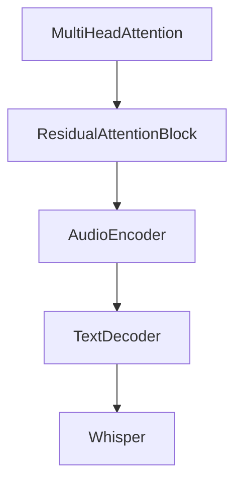

# Chapter 7: Performance Optimization

Welcome to **Chapter 7: Performance Optimization**. In this part of **OpenAI Whisper Tutorial: Speech Recognition and Translation**, you will build an intuitive mental model first, then move into concrete implementation details and practical production tradeoffs.


Whisper performance tuning is mainly about model choice, hardware, and batching strategy.

## High-Leverage Controls

- choose smallest model meeting your quality threshold
- run GPU acceleration where available
- batch short clips when latency budget allows
- pre-segment long recordings to reduce idle compute

## Throughput vs Latency Tradeoff

| Goal | Strategy |
|:-----|:---------|
| Lowest latency | smaller model, minimal batching |
| Highest throughput | larger batch sizes, asynchronous workers |
| Best quality | larger model and stronger preprocessing |

## Hardware Notes

- CPU-only paths are viable for low-volume workloads
- GPU paths improve throughput substantially for medium/large models
- monitor memory headroom; model swaps can cause instability under load

## Quantization and Alternate Runtimes

For constrained environments, evaluate optimized runtimes (such as whisper.cpp ecosystems) and quantized models while validating quality regressions on your own data.

## Summary

You can now tune Whisper for your target latency, cost, and quality envelope.

Next: [Chapter 8: Production Deployment](08-production-deployment.md)

## What Problem Does This Solve?

Most teams struggle here because the hard part is not writing more code, but deciding clear boundaries for core abstractions in this chapter so behavior stays predictable as complexity grows.

In practical terms, this chapter helps you avoid three common failures:

- coupling core logic too tightly to one implementation path
- missing the handoff boundaries between setup, execution, and validation
- shipping changes without clear rollback or observability strategy

After working through this chapter, you should be able to reason about `Chapter 7: Performance Optimization` as an operating subsystem inside **OpenAI Whisper Tutorial: Speech Recognition and Translation**, with explicit contracts for inputs, state transitions, and outputs.

Use the implementation notes around execution and reliability details as your checklist when adapting these patterns to your own repository.

## How it Works Under the Hood

Under the hood, `Chapter 7: Performance Optimization` usually follows a repeatable control path:

1. **Context bootstrap**: initialize runtime config and prerequisites for `core component`.
2. **Input normalization**: shape incoming data so `execution layer` receives stable contracts.
3. **Core execution**: run the main logic branch and propagate intermediate state through `state model`.
4. **Policy and safety checks**: enforce limits, auth scopes, and failure boundaries.
5. **Output composition**: return canonical result payloads for downstream consumers.
6. **Operational telemetry**: emit logs/metrics needed for debugging and performance tuning.

When debugging, walk this sequence in order and confirm each stage has explicit success/failure conditions.

## Source Walkthrough

Use the following upstream sources to verify implementation details while reading this chapter:

- [openai/whisper repository](https://github.com/openai/whisper)
  Why it matters: authoritative reference on `openai/whisper repository` (github.com).

Suggested trace strategy:
- search upstream code for `Performance` and `Optimization` to map concrete implementation paths
- compare docs claims against actual runtime/config code before reusing patterns in production

## Chapter Connections

- [Tutorial Index](README.md)
- [Previous Chapter: Chapter 6: Advanced Features](06-advanced-features.md)
- [Next Chapter: Chapter 8: Production Deployment](08-production-deployment.md)
- [Main Catalog](../../README.md#-tutorial-catalog)
- [A-Z Tutorial Directory](../../discoverability/tutorial-directory.md)

## Source Code Walkthrough

### `whisper/model.py`

The `MultiHeadAttention` class in [`whisper/model.py`](https://github.com/openai/whisper/blob/HEAD/whisper/model.py) handles a key part of this chapter's functionality:

```py
@contextmanager
def disable_sdpa():
    prev_state = MultiHeadAttention.use_sdpa
    try:
        MultiHeadAttention.use_sdpa = False
        yield
    finally:
        MultiHeadAttention.use_sdpa = prev_state


class MultiHeadAttention(nn.Module):
    use_sdpa = True

    def __init__(self, n_state: int, n_head: int):
        super().__init__()
        self.n_head = n_head
        self.query = Linear(n_state, n_state)
        self.key = Linear(n_state, n_state, bias=False)
        self.value = Linear(n_state, n_state)
        self.out = Linear(n_state, n_state)

    def forward(
        self,
        x: Tensor,
        xa: Optional[Tensor] = None,
        mask: Optional[Tensor] = None,
        kv_cache: Optional[dict] = None,
    ):
        q = self.query(x)

        if kv_cache is None or xa is None or self.key not in kv_cache:
            # hooks, if installed (i.e. kv_cache is not None), will prepend the cached kv tensors;
```

This class is important because it defines how OpenAI Whisper Tutorial: Speech Recognition and Translation implements the patterns covered in this chapter.

### `whisper/model.py`

The `ResidualAttentionBlock` class in [`whisper/model.py`](https://github.com/openai/whisper/blob/HEAD/whisper/model.py) handles a key part of this chapter's functionality:

```py


class ResidualAttentionBlock(nn.Module):
    def __init__(self, n_state: int, n_head: int, cross_attention: bool = False):
        super().__init__()

        self.attn = MultiHeadAttention(n_state, n_head)
        self.attn_ln = LayerNorm(n_state)

        self.cross_attn = (
            MultiHeadAttention(n_state, n_head) if cross_attention else None
        )
        self.cross_attn_ln = LayerNorm(n_state) if cross_attention else None

        n_mlp = n_state * 4
        self.mlp = nn.Sequential(
            Linear(n_state, n_mlp), nn.GELU(), Linear(n_mlp, n_state)
        )
        self.mlp_ln = LayerNorm(n_state)

    def forward(
        self,
        x: Tensor,
        xa: Optional[Tensor] = None,
        mask: Optional[Tensor] = None,
        kv_cache: Optional[dict] = None,
    ):
        x = x + self.attn(self.attn_ln(x), mask=mask, kv_cache=kv_cache)[0]
        if self.cross_attn:
            x = x + self.cross_attn(self.cross_attn_ln(x), xa, kv_cache=kv_cache)[0]
        x = x + self.mlp(self.mlp_ln(x))
        return x
```

This class is important because it defines how OpenAI Whisper Tutorial: Speech Recognition and Translation implements the patterns covered in this chapter.

### `whisper/model.py`

The `AudioEncoder` class in [`whisper/model.py`](https://github.com/openai/whisper/blob/HEAD/whisper/model.py) handles a key part of this chapter's functionality:

```py


class AudioEncoder(nn.Module):
    def __init__(
        self, n_mels: int, n_ctx: int, n_state: int, n_head: int, n_layer: int
    ):
        super().__init__()
        self.conv1 = Conv1d(n_mels, n_state, kernel_size=3, padding=1)
        self.conv2 = Conv1d(n_state, n_state, kernel_size=3, stride=2, padding=1)
        self.register_buffer("positional_embedding", sinusoids(n_ctx, n_state))

        self.blocks: Iterable[ResidualAttentionBlock] = nn.ModuleList(
            [ResidualAttentionBlock(n_state, n_head) for _ in range(n_layer)]
        )
        self.ln_post = LayerNorm(n_state)

    def forward(self, x: Tensor):
        """
        x : torch.Tensor, shape = (batch_size, n_mels, n_ctx)
            the mel spectrogram of the audio
        """
        x = F.gelu(self.conv1(x))
        x = F.gelu(self.conv2(x))
        x = x.permute(0, 2, 1)

        assert x.shape[1:] == self.positional_embedding.shape, "incorrect audio shape"
        x = (x + self.positional_embedding).to(x.dtype)

        for block in self.blocks:
            x = block(x)

        x = self.ln_post(x)
```

This class is important because it defines how OpenAI Whisper Tutorial: Speech Recognition and Translation implements the patterns covered in this chapter.

### `whisper/model.py`

The `TextDecoder` class in [`whisper/model.py`](https://github.com/openai/whisper/blob/HEAD/whisper/model.py) handles a key part of this chapter's functionality:

```py


class TextDecoder(nn.Module):
    def __init__(
        self, n_vocab: int, n_ctx: int, n_state: int, n_head: int, n_layer: int
    ):
        super().__init__()

        self.token_embedding = nn.Embedding(n_vocab, n_state)
        self.positional_embedding = nn.Parameter(torch.empty(n_ctx, n_state))

        self.blocks: Iterable[ResidualAttentionBlock] = nn.ModuleList(
            [
                ResidualAttentionBlock(n_state, n_head, cross_attention=True)
                for _ in range(n_layer)
            ]
        )
        self.ln = LayerNorm(n_state)

        mask = torch.empty(n_ctx, n_ctx).fill_(-np.inf).triu_(1)
        self.register_buffer("mask", mask, persistent=False)

    def forward(self, x: Tensor, xa: Tensor, kv_cache: Optional[dict] = None):
        """
        x : torch.LongTensor, shape = (batch_size, <= n_ctx)
            the text tokens
        xa : torch.Tensor, shape = (batch_size, n_audio_ctx, n_audio_state)
            the encoded audio features to be attended on
        """
        offset = next(iter(kv_cache.values())).shape[1] if kv_cache else 0
        x = (
            self.token_embedding(x)
```

This class is important because it defines how OpenAI Whisper Tutorial: Speech Recognition and Translation implements the patterns covered in this chapter.


## How These Components Connect


