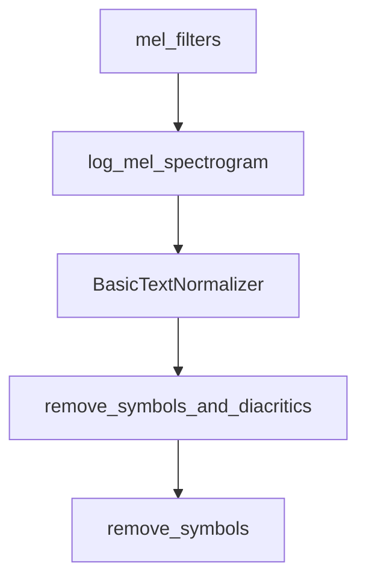

# Chapter 8: Production Deployment

Welcome to **Chapter 8: Production Deployment**. In this part of **OpenAI Whisper Tutorial: Speech Recognition and Translation**, you will build an intuitive mental model first, then move into concrete implementation details and practical production tradeoffs.


This chapter converts Whisper workflows into reliable production services.

## Service Architecture Pattern

1. ingestion service accepts audio/video
2. preprocessing workers normalize and segment
3. transcription workers run Whisper inference
4. post-processing layer enriches + validates output
5. storage/index layer serves search and playback UX

## Reliability Controls

- queue-based backpressure
- idempotent job IDs
- retry with bounded attempts
- dead-letter handling for malformed media

## Observability

Track:

- job latency by media duration
- error rate by codec/source
- model-specific WER/CER trends
- human-correction rate for critical workloads

## Governance and Security

- define transcript retention policy
- classify sensitive audio domains
- redact PII where required
- enforce regional data handling constraints when applicable

## Final Summary

You now have a full operational playbook for deploying Whisper from prototype to production.

Related:
- [Whisper.cpp Tutorial](../whisper-cpp-tutorial/)
- [OpenAI Realtime Agents Tutorial](../openai-realtime-agents-tutorial/)
- [OpenAI Python SDK Tutorial](../openai-python-sdk-tutorial/)

## What Problem Does This Solve?

Most teams struggle here because the hard part is not writing more code, but deciding clear boundaries for core abstractions in this chapter so behavior stays predictable as complexity grows.

In practical terms, this chapter helps you avoid three common failures:

- coupling core logic too tightly to one implementation path
- missing the handoff boundaries between setup, execution, and validation
- shipping changes without clear rollback or observability strategy

After working through this chapter, you should be able to reason about `Chapter 8: Production Deployment` as an operating subsystem inside **OpenAI Whisper Tutorial: Speech Recognition and Translation**, with explicit contracts for inputs, state transitions, and outputs.

Use the implementation notes around execution and reliability details as your checklist when adapting these patterns to your own repository.

## How it Works Under the Hood

Under the hood, `Chapter 8: Production Deployment` usually follows a repeatable control path:

1. **Context bootstrap**: initialize runtime config and prerequisites for `core component`.
2. **Input normalization**: shape incoming data so `execution layer` receives stable contracts.
3. **Core execution**: run the main logic branch and propagate intermediate state through `state model`.
4. **Policy and safety checks**: enforce limits, auth scopes, and failure boundaries.
5. **Output composition**: return canonical result payloads for downstream consumers.
6. **Operational telemetry**: emit logs/metrics needed for debugging and performance tuning.

When debugging, walk this sequence in order and confirm each stage has explicit success/failure conditions.

## Source Walkthrough

Use the following upstream sources to verify implementation details while reading this chapter:

- [openai/whisper repository](https://github.com/openai/whisper)
  Why it matters: authoritative reference on `openai/whisper repository` (github.com).

Suggested trace strategy:
- search upstream code for `Production` and `Deployment` to map concrete implementation paths
- compare docs claims against actual runtime/config code before reusing patterns in production

## Chapter Connections

- [Tutorial Index](README.md)
- [Previous Chapter: Chapter 7: Performance Optimization](07-performance-optimization.md)
- [Main Catalog](../../README.md#-tutorial-catalog)
- [A-Z Tutorial Directory](../../discoverability/tutorial-directory.md)

## Depth Expansion Playbook

## Source Code Walkthrough

### `whisper/audio.py`

The `mel_filters` function in [`whisper/audio.py`](https://github.com/openai/whisper/blob/HEAD/whisper/audio.py) handles a key part of this chapter's functionality:

```py

@lru_cache(maxsize=None)
def mel_filters(device, n_mels: int) -> torch.Tensor:
    """
    load the mel filterbank matrix for projecting STFT into a Mel spectrogram.
    Allows decoupling librosa dependency; saved using:

        np.savez_compressed(
            "mel_filters.npz",
            mel_80=librosa.filters.mel(sr=16000, n_fft=400, n_mels=80),
            mel_128=librosa.filters.mel(sr=16000, n_fft=400, n_mels=128),
        )
    """
    assert n_mels in {80, 128}, f"Unsupported n_mels: {n_mels}"

    filters_path = os.path.join(os.path.dirname(__file__), "assets", "mel_filters.npz")
    with np.load(filters_path, allow_pickle=False) as f:
        return torch.from_numpy(f[f"mel_{n_mels}"]).to(device)


def log_mel_spectrogram(
    audio: Union[str, np.ndarray, torch.Tensor],
    n_mels: int = 80,
    padding: int = 0,
    device: Optional[Union[str, torch.device]] = None,
):
    """
    Compute the log-Mel spectrogram of

    Parameters
    ----------
    audio: Union[str, np.ndarray, torch.Tensor], shape = (*)
```

This function is important because it defines how OpenAI Whisper Tutorial: Speech Recognition and Translation implements the patterns covered in this chapter.

### `whisper/audio.py`

The `log_mel_spectrogram` function in [`whisper/audio.py`](https://github.com/openai/whisper/blob/HEAD/whisper/audio.py) handles a key part of this chapter's functionality:

```py


def log_mel_spectrogram(
    audio: Union[str, np.ndarray, torch.Tensor],
    n_mels: int = 80,
    padding: int = 0,
    device: Optional[Union[str, torch.device]] = None,
):
    """
    Compute the log-Mel spectrogram of

    Parameters
    ----------
    audio: Union[str, np.ndarray, torch.Tensor], shape = (*)
        The path to audio or either a NumPy array or Tensor containing the audio waveform in 16 kHz

    n_mels: int
        The number of Mel-frequency filters, only 80 and 128 are supported

    padding: int
        Number of zero samples to pad to the right

    device: Optional[Union[str, torch.device]]
        If given, the audio tensor is moved to this device before STFT

    Returns
    -------
    torch.Tensor, shape = (n_mels, n_frames)
        A Tensor that contains the Mel spectrogram
    """
    if not torch.is_tensor(audio):
        if isinstance(audio, str):
```

This function is important because it defines how OpenAI Whisper Tutorial: Speech Recognition and Translation implements the patterns covered in this chapter.

### `whisper/normalizers/basic.py`

The `BasicTextNormalizer` class in [`whisper/normalizers/basic.py`](https://github.com/openai/whisper/blob/HEAD/whisper/normalizers/basic.py) handles a key part of this chapter's functionality:

```py


class BasicTextNormalizer:
    def __init__(self, remove_diacritics: bool = False, split_letters: bool = False):
        self.clean = (
            remove_symbols_and_diacritics if remove_diacritics else remove_symbols
        )
        self.split_letters = split_letters

    def __call__(self, s: str):
        s = s.lower()
        s = re.sub(r"[<\[][^>\]]*[>\]]", "", s)  # remove words between brackets
        s = re.sub(r"\(([^)]+?)\)", "", s)  # remove words between parenthesis
        s = self.clean(s).lower()

        if self.split_letters:
            s = " ".join(regex.findall(r"\X", s, regex.U))

        s = re.sub(
            r"\s+", " ", s
        )  # replace any successive whitespace characters with a space

        return s

```

This class is important because it defines how OpenAI Whisper Tutorial: Speech Recognition and Translation implements the patterns covered in this chapter.

### `whisper/normalizers/basic.py`

The `remove_symbols_and_diacritics` function in [`whisper/normalizers/basic.py`](https://github.com/openai/whisper/blob/HEAD/whisper/normalizers/basic.py) handles a key part of this chapter's functionality:

```py


def remove_symbols_and_diacritics(s: str, keep=""):
    """
    Replace any other markers, symbols, and punctuations with a space,
    and drop any diacritics (category 'Mn' and some manual mappings)
    """
    return "".join(
        (
            c
            if c in keep
            else (
                ADDITIONAL_DIACRITICS[c]
                if c in ADDITIONAL_DIACRITICS
                else (
                    ""
                    if unicodedata.category(c) == "Mn"
                    else " " if unicodedata.category(c)[0] in "MSP" else c
                )
            )
        )
        for c in unicodedata.normalize("NFKD", s)
    )


def remove_symbols(s: str):
    """
    Replace any other markers, symbols, punctuations with a space, keeping diacritics
    """
    return "".join(
        " " if unicodedata.category(c)[0] in "MSP" else c
        for c in unicodedata.normalize("NFKC", s)
```

This function is important because it defines how OpenAI Whisper Tutorial: Speech Recognition and Translation implements the patterns covered in this chapter.


## How These Components Connect


