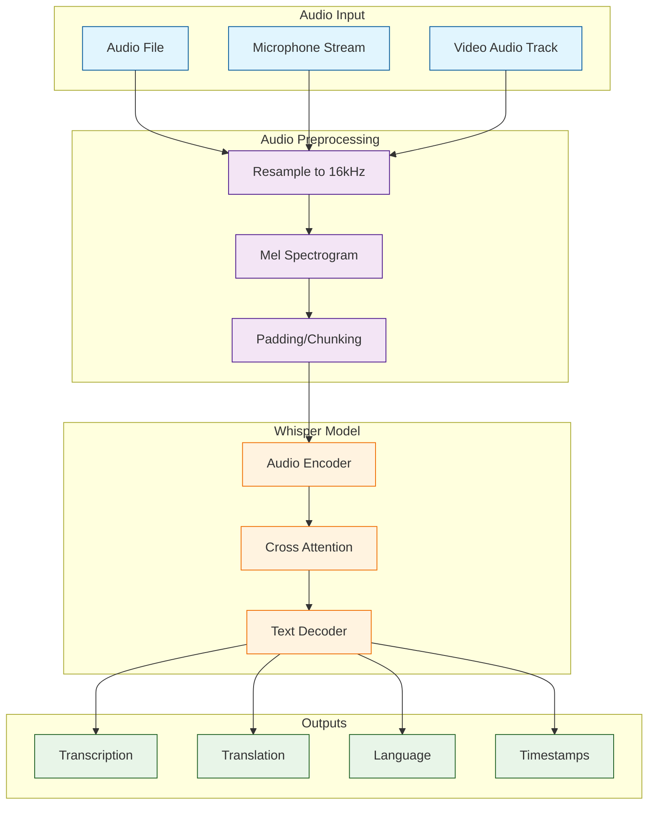

# OpenAI Whisper Tutorial: Speech Recognition with Deep Learning

> Master OpenAI's Whisper model for robust, multilingual speech recognition, transcription, and translation.

## 🎯 What is OpenAI Whisper?

**Whisper** is a general-purpose speech recognition model trained on 680,000 hours of multilingual and multitask supervised data. It provides robust automatic speech recognition (ASR), speech translation, and language identification through a unified transformer architecture.

### Key Features

| Feature | Description |
|:--------|:------------|
| **Multilingual** | Supports 99+ languages with high accuracy |
| **Multi-task** | Transcription, translation, language detection, VAD |
| **Multiple Models** | 6 model sizes (tiny → large) with speed/accuracy tradeoffs |
| **Zero-shot Transfer** | Works on diverse audio without fine-tuning |
| **Word-level Timestamps** | Precise temporal alignment for subtitles |
| **Robust** | Handles accents, background noise, technical jargon |

## Architecture Overview

## Tutorial Structure

> Status: This index is currently the published roadmap for the tutorial. Chapter pages are in progress.

| Chapter | Topic | What You'll Learn |
|:--------|:------|:------------------|
| **1. Getting Started (Planned)** | Installation | Setup, first transcription, model selection guide |
| **2. Model Architecture (Planned)** | Internals | Encoder-decoder transformer, mel-spectrograms, attention |
| **3. Audio Preprocessing (Planned)** | Input | WAV/MP3 handling, resampling, noise reduction, VAD |
| **4. Transcription & Translation (Planned)** | Core Features | Multilingual transcription, translation mode, timestamps |
| **5. Fine-Tuning (Planned)** | Customization | Domain adaptation, custom datasets, language-specific models |
| **6. Advanced Features (Planned)** | Capabilities | Speaker diarization, word-level timing, confidence scores |
| **7. Performance Optimization (Planned)** | Speed | GPU acceleration, batching, quantization, FP16 |
| **8. Production Deployment (Planned)** | Operations | API serving, streaming, caching, monitoring |

## Tech Stack

| Component | Technology |
|:----------|:-----------|
| **Language** | Python 3.8+ |
| **ML Framework** | PyTorch 1.10+ |
| **Audio Processing** | librosa, ffmpeg, soundfile |
| **Model Arch** | Transformer encoder-decoder |
| **Deployment** | FastAPI, Docker, CUDA (optional) |
| **Model Sizes** | tiny (39M) → large (1550M params) |

## What You'll Learn

By the end of this tutorial, you'll be able to:

- **Transcribe Audio** in 99+ languages with high accuracy
- **Translate Speech** from any language to English
- **Detect Languages** automatically from audio
- **Generate Subtitles** with word-level timestamps
- **Fine-tune Models** on custom datasets for domain-specific accuracy
- **Optimize Performance** with GPU acceleration and quantization
- **Deploy Production APIs** with FastAPI, Docker, and cloud platforms
- **Handle Edge Cases** including background noise, accents, and technical content

## Prerequisites

- **Python** programming experience
- **Basic ML concepts** (transformers, embeddings) helpful but not required
- **Audio fundamentals** (sampling rates, formats) covered in Chapter 3
- **Command-line** experience for installation and testing

## Related Tutorials

**Complementary:**
- [Whisper.cpp Tutorial](../whisper-cpp-tutorial/) - C++ implementation for edge devices

**Next Steps:**
- [OpenAI Realtime Agents Tutorial](../openai-realtime-agents-tutorial/) - Voice-first AI agents
- [OpenAI Python SDK Tutorial](../openai-python-sdk-tutorial/) - Integrating with OpenAI APIs

## Whisper Python vs. Whisper.cpp

| Aspect | Whisper (Python - This Tutorial) | Whisper.cpp |
|:-------|:--------------------------------|:------------|
| **Language** | Python + PyTorch | C++ with GGML |
| **Target Use Case** | ML research, API services, cloud deployment | Edge devices, mobile apps, embedded systems |
| **Flexibility** | Easy fine-tuning, custom models, experiments | High performance, low resource usage |
| **Dependencies** | Heavy (PyTorch, CUDA) | Minimal (pure C++) |
| **Fine-tuning** | ✅ Native support | ❌ Use converted models |
| **GPU Support** | ✅ CUDA, MPS, ROCm | ✅ CUDA, Metal, OpenCL |
| **Deployment** | Cloud servers, containers | Raspberry Pi, iOS, Android, WASM |
| **Learning Curve** | Easier for Python developers | Requires C++ knowledge |
| **Best For** | Production APIs, batch processing, research | Offline apps, real-time on low-power devices |

**When to use Python Whisper:** API services, batch transcription, fine-tuning, research
**When to use Whisper.cpp:** Mobile apps, edge devices, offline usage, minimal dependencies

---

Ready to begin? Review the roadmap above while chapter pages are being finalized.

---

*Built with insights from the [OpenAI Whisper repository](https://github.com/openai/whisper) and OpenAI research papers.*
