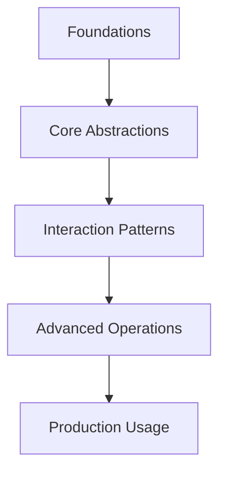

# OpenAI Whisper Tutorial: Speech Recognition and Translation

> Build robust transcription pipelines with Whisper, from local experiments to production deployment.

## Why This Track Matters

Whisper is the most widely deployed open-source speech recognition model, and understanding how to use it effectively — from audio preprocessing to production deployment — is essential for building robust transcription pipelines.

This track focuses on:
- transcribing and translating audio with Whisper's multilingual model family
- preprocessing audio for optimal recognition accuracy
- optimizing Whisper for throughput with batching and hardware acceleration
- deploying Whisper as a production service with observability and retry strategies

## What Whisper is

Whisper is an open-source speech model family trained for multilingual transcription, language identification, and speech-to-English translation.

The official repository provides:

- command-line and Python usage paths
- multiple model sizes (tiny to large, plus turbo variant)
- implementation details for tokenization and decoding behavior

## Key Practical Notes

- Whisper requires `ffmpeg` for audio decoding in most workflows.
- The `turbo` model is optimized for fast transcription but is not recommended for translation tasks.
- Accuracy and speed vary significantly by language, audio quality, and hardware.

## Chapter Guide

| Chapter | Topic | What You Will Learn |
|:--------|:------|:--------------------|
| [1. Getting Started](01-getting-started.md) | Setup | Install Whisper, verify dependencies, and run first transcription |
| [2. Model Architecture](02-model-architecture.md) | Internals | Encoder-decoder design and multitask token behavior |
| [3. Audio Preprocessing](03-audio-preprocessing.md) | Input Quality | Resampling, normalization, segmentation, and noise handling |
| [4. Transcription and Translation](04-transcription-translation.md) | Core Tasks | Language detection, transcription, translation, and timestamps |
| [5. Fine-Tuning and Adaptation](05-fine-tuning.md) | Customization | Practical adaptation strategies and limits of official tooling |
| [6. Advanced Features](06-advanced-features.md) | Extensions | Word timestamps, diarization integrations, confidence workflows |
| [7. Performance Optimization](07-performance-optimization.md) | Throughput | Model sizing, batching, hardware acceleration, and quantization |
| [8. Production Deployment](08-production-deployment.md) | Operations | Service design, observability, retry strategy, and governance |

## Prerequisites

- Python experience
- Basic familiarity with audio formats/sample rates
- Comfort with command-line tooling

## Related Tutorials

**Complementary:**
- [Whisper.cpp Tutorial](../whisper-cpp-tutorial/) - edge/embedded deployments
- [OpenAI Realtime Agents Tutorial](../openai-realtime-agents-tutorial/) - voice interaction systems

**Next Steps:**
- [OpenAI Python SDK Tutorial](../openai-python-sdk-tutorial/) - broader platform integrations

---

Ready to begin? Start with [Chapter 1: Getting Started](01-getting-started.md).

---

*Built with references from the official [openai/whisper repository](https://github.com/openai/whisper), model card, and paper resources linked there.*

## Navigation & Backlinks

- [Start Here: Chapter 1: Getting Started](01-getting-started.md)
- [Back to Main Catalog](../../README.md#-tutorial-catalog)
- [Browse A-Z Tutorial Directory](../../discoverability/tutorial-directory.md)
- [Search by Intent](../../discoverability/query-hub.md)
- [Explore Category Hubs](../../README.md#category-hubs)

## Full Chapter Map

1. [Chapter 1: Getting Started](01-getting-started.md)
2. [Chapter 2: Model Architecture](02-model-architecture.md)
3. [Chapter 3: Audio Preprocessing](03-audio-preprocessing.md)
4. [Chapter 4: Transcription and Translation](04-transcription-translation.md)
5. [Chapter 5: Fine-Tuning and Adaptation](05-fine-tuning.md)
6. [Chapter 6: Advanced Features](06-advanced-features.md)
7. [Chapter 7: Performance Optimization](07-performance-optimization.md)
8. [Chapter 8: Production Deployment](08-production-deployment.md)

## Current Snapshot (auto-updated)

- repository: [openai/whisper](https://github.com/openai/whisper)
- stars: about **76K**
- project positioning: open-source multilingual speech recognition model from OpenAI

## What You Will Learn

- how Whisper's encoder-decoder architecture and multitask token system work
- how to preprocess audio with resampling, normalization, and segmentation
- how to optimize Whisper performance with model sizing, batching, and quantization
- how to deploy Whisper as a production service with proper observability and governance

## Source References

- [openai/whisper repository](https://github.com/openai/whisper)

## Mental Model

*Generated by [AI Codebase Knowledge Builder](https://github.com/The-Pocket/Tutorial-Codebase-Knowledge)*
