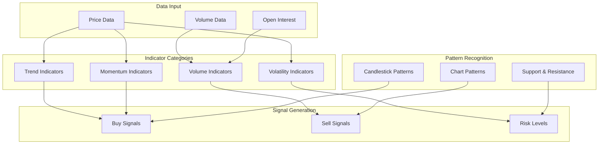
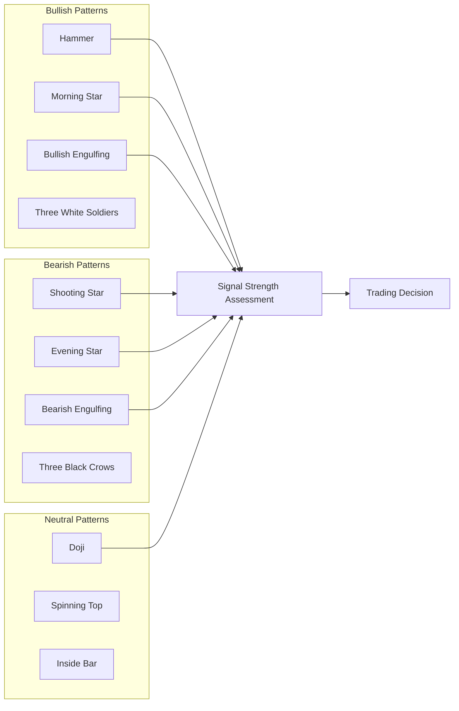

# Chapter 3: Technical Analysis

This chapter covers technical analysis with OpenBB, including technical indicators, charting, pattern recognition, and building complete analysis workflows. You'll learn how to use OpenBB's powerful analytical tools to identify trends, momentum, and trading signals.

## 🎯 What You'll Learn

- Core technical indicators (moving averages, RSI, MACD)
- Advanced charting with OpenBB
- Candlestick and chart pattern recognition
- Building multi-indicator analysis workflows
- Custom indicator development

## 📊 Technical Analysis Framework

Technical analysis uses historical price and volume data to forecast future price movements:



### Indicator Categories

| Category | Purpose | Key Indicators | Best For |
|:---------|:--------|:---------------|:---------|
| **Trend** | Identify direction | SMA, EMA, ADX | Trend following |
| **Momentum** | Measure speed of change | RSI, MACD, Stochastic | Reversals, timing |
| **Volatility** | Measure price range | Bollinger Bands, ATR | Risk sizing |
| **Volume** | Confirm price moves | OBV, VWAP, A/D Line | Confirmation |

## 📈 Trend Indicators

### Moving Averages

```python
from openbb import obb
import pandas as pd
import numpy as np

# Fetch historical data
data = obb.equity.price.historical(
    "AAPL",
    start_date="2023-01-01",
    end_date="2023-12-31",
    provider="polygon"
)
df = data.to_dataframe()

# Simple Moving Average (SMA)
sma_data = obb.technical.sma(
    data=df,
    target="close",
    length=20
)
print("SMA(20):", sma_data.tail())

# Exponential Moving Average (EMA)
ema_data = obb.technical.ema(
    data=df,
    target="close",
    length=12
)
print("EMA(12):", ema_data.tail())

# Multiple moving averages for crossover strategy
def moving_average_crossover(df: pd.DataFrame) -> pd.DataFrame:
    """Calculate moving average crossover signals"""
    result = df.copy()

    # Short-term and long-term EMAs
    result['ema_12'] = result['close'].ewm(span=12, adjust=False).mean()
    result['ema_26'] = result['close'].ewm(span=26, adjust=False).mean()

    # Golden cross / death cross signals
    result['signal'] = np.where(
        result['ema_12'] > result['ema_26'], 1, -1
    )
    result['crossover'] = result['signal'].diff()

    return result

signals = moving_average_crossover(df)
golden_crosses = signals[signals['crossover'] == 2]
death_crosses = signals[signals['crossover'] == -2]

print(f"Golden Crosses: {len(golden_crosses)}")
print(f"Death Crosses: {len(death_crosses)}")
```

### Average Directional Index (ADX)

```python
# ADX for trend strength measurement
adx_data = obb.technical.adx(
    data=df,
    length=14
)
print("ADX:", adx_data.tail())

def interpret_adx(adx_value: float) -> str:
    """Interpret ADX value for trend strength"""
    if adx_value < 20:
        return "Weak or no trend"
    elif adx_value < 40:
        return "Moderate trend"
    elif adx_value < 60:
        return "Strong trend"
    else:
        return "Very strong trend"

# Analyze current trend strength
latest_adx = adx_data['adx'].iloc[-1]
print(f"ADX: {latest_adx:.2f} - {interpret_adx(latest_adx)}")
```

## 📉 Momentum Indicators

### Relative Strength Index (RSI)

```python
# Calculate RSI
rsi_data = obb.technical.rsi(
    data=df,
    target="close",
    length=14
)
print("RSI:", rsi_data.tail())

class RSIAnalyzer:
    """Analyze RSI for trading signals"""

    def __init__(self, overbought: float = 70, oversold: float = 30):
        self.overbought = overbought
        self.oversold = oversold

    def analyze(self, df: pd.DataFrame, rsi_col: str = "rsi") -> dict:
        """Generate RSI analysis report"""
        current_rsi = df[rsi_col].iloc[-1]

        analysis = {
            "current_rsi": round(current_rsi, 2),
            "condition": self._get_condition(current_rsi),
            "signal": self._get_signal(df, rsi_col),
            "divergence": self._check_divergence(df, rsi_col),
        }
        return analysis

    def _get_condition(self, rsi: float) -> str:
        if rsi >= self.overbought:
            return "Overbought"
        elif rsi <= self.oversold:
            return "Oversold"
        else:
            return "Neutral"

    def _get_signal(self, df: pd.DataFrame, rsi_col: str) -> str:
        rsi = df[rsi_col]
        if rsi.iloc[-1] < self.oversold and rsi.iloc[-2] >= self.oversold:
            return "Buy - RSI entering oversold zone"
        elif rsi.iloc[-1] > self.overbought and rsi.iloc[-2] <= self.overbought:
            return "Sell - RSI entering overbought zone"
        return "Hold"

    def _check_divergence(self, df: pd.DataFrame, rsi_col: str) -> str:
        # Compare price and RSI trends over last 10 periods
        price_trend = df['close'].iloc[-10:].pct_change().sum()
        rsi_trend = df[rsi_col].iloc[-10:].diff().sum()

        if price_trend > 0 and rsi_trend < 0:
            return "Bearish divergence detected"
        elif price_trend < 0 and rsi_trend > 0:
            return "Bullish divergence detected"
        return "No divergence"

# Usage
analyzer = RSIAnalyzer()
rsi_report = analyzer.analyze(rsi_data)
for key, value in rsi_report.items():
    print(f"  {key}: {value}")
```

### MACD (Moving Average Convergence Divergence)

```python
# Calculate MACD
macd_data = obb.technical.macd(
    data=df,
    target="close",
    fast=12,
    slow=26,
    signal=9
)
print("MACD:", macd_data.tail())

def analyze_macd(df: pd.DataFrame) -> dict:
    """Comprehensive MACD analysis"""
    macd_line = df['macd'].iloc[-1]
    signal_line = df['macd_signal'].iloc[-1]
    histogram = df['macd_histogram'].iloc[-1]

    # Determine crossover
    prev_macd = df['macd'].iloc[-2]
    prev_signal = df['macd_signal'].iloc[-2]

    crossover = "None"
    if prev_macd <= prev_signal and macd_line > signal_line:
        crossover = "Bullish crossover"
    elif prev_macd >= prev_signal and macd_line < signal_line:
        crossover = "Bearish crossover"

    return {
        "macd_line": round(macd_line, 4),
        "signal_line": round(signal_line, 4),
        "histogram": round(histogram, 4),
        "trend": "Bullish" if macd_line > signal_line else "Bearish",
        "momentum": "Increasing" if histogram > 0 else "Decreasing",
        "crossover": crossover,
    }

macd_report = analyze_macd(macd_data)
for key, value in macd_report.items():
    print(f"  {key}: {value}")
```

### Stochastic Oscillator

```python
# Calculate Stochastic Oscillator
stoch_data = obb.technical.stoch(
    data=df,
    fast_k=14,
    slow_d=3
)
print("Stochastic:", stoch_data.tail())

def stochastic_signal(k_value: float, d_value: float) -> str:
    """Generate signal from stochastic oscillator"""
    if k_value > 80 and d_value > 80:
        return "Overbought - potential reversal down"
    elif k_value < 20 and d_value < 20:
        return "Oversold - potential reversal up"
    elif k_value > d_value and k_value < 50:
        return "Bullish crossover in neutral zone"
    elif k_value < d_value and k_value > 50:
        return "Bearish crossover in neutral zone"
    return "Neutral"
```

## 📊 Volatility Indicators

### Bollinger Bands

```python
# Calculate Bollinger Bands
bbands = obb.technical.bbands(
    data=df,
    target="close",
    length=20,
    std=2
)
print("Bollinger Bands:", bbands.tail())

class BollingerBandAnalyzer:
    """Analyze price action relative to Bollinger Bands"""

    def analyze(self, df: pd.DataFrame) -> dict:
        """Generate Bollinger Band analysis"""
        close = df['close'].iloc[-1]
        upper = df['bb_upper'].iloc[-1]
        lower = df['bb_lower'].iloc[-1]
        middle = df['bb_middle'].iloc[-1]
        bandwidth = (upper - lower) / middle

        # Calculate %B (position within bands)
        percent_b = (close - lower) / (upper - lower)

        return {
            "close": round(close, 2),
            "upper_band": round(upper, 2),
            "middle_band": round(middle, 2),
            "lower_band": round(lower, 2),
            "bandwidth": round(bandwidth, 4),
            "percent_b": round(percent_b, 4),
            "position": self._get_position(percent_b),
            "squeeze": bandwidth < 0.05,
        }

    def _get_position(self, percent_b: float) -> str:
        if percent_b > 1.0:
            return "Above upper band - overbought"
        elif percent_b > 0.8:
            return "Near upper band"
        elif percent_b > 0.2:
            return "Within bands - neutral"
        elif percent_b > 0.0:
            return "Near lower band"
        else:
            return "Below lower band - oversold"

bb_analyzer = BollingerBandAnalyzer()
bb_report = bb_analyzer.analyze(bbands)
for key, value in bb_report.items():
    print(f"  {key}: {value}")
```

### Average True Range (ATR)

```python
# Calculate ATR for volatility measurement
atr_data = obb.technical.atr(
    data=df,
    length=14
)
print("ATR:", atr_data.tail())

def position_sizing_with_atr(
    account_value: float,
    risk_percent: float,
    atr_value: float,
    atr_multiplier: float = 2.0
) -> dict:
    """Calculate position size using ATR-based stop loss"""
    risk_amount = account_value * (risk_percent / 100)
    stop_distance = atr_value * atr_multiplier
    shares = int(risk_amount / stop_distance)

    return {
        "account_value": account_value,
        "risk_percent": risk_percent,
        "risk_amount": round(risk_amount, 2),
        "atr": round(atr_value, 2),
        "stop_distance": round(stop_distance, 2),
        "position_size_shares": shares,
    }

# Example: $100K account, 1% risk per trade
latest_atr = atr_data['atr'].iloc[-1]
sizing = position_sizing_with_atr(100000, 1.0, latest_atr)
for key, value in sizing.items():
    print(f"  {key}: {value}")
```

## 📈 Volume Indicators

### On-Balance Volume (OBV) and VWAP

```python
# On-Balance Volume
obv_data = obb.technical.obv(data=df)
print("OBV:", obv_data.tail())

# Volume Weighted Average Price
vwap_data = obb.technical.vwap(data=df)
print("VWAP:", vwap_data.tail())

def volume_analysis(df: pd.DataFrame) -> dict:
    """Analyze volume patterns"""
    avg_volume = df['volume'].rolling(20).mean().iloc[-1]
    current_volume = df['volume'].iloc[-1]
    volume_ratio = current_volume / avg_volume

    # Volume trend analysis
    volume_sma_5 = df['volume'].rolling(5).mean().iloc[-1]
    volume_sma_20 = df['volume'].rolling(20).mean().iloc[-1]

    return {
        "current_volume": int(current_volume),
        "avg_volume_20d": int(avg_volume),
        "volume_ratio": round(volume_ratio, 2),
        "volume_trend": "Increasing" if volume_sma_5 > volume_sma_20 else "Decreasing",
        "interpretation": (
            "High volume confirms trend" if volume_ratio > 1.5
            else "Normal volume" if volume_ratio > 0.7
            else "Low volume - trend may weaken"
        ),
    }

vol_report = volume_analysis(df)
for key, value in vol_report.items():
    print(f"  {key}: {value}")
```

## 🕯️ Candlestick Pattern Recognition



### Pattern Detection

```python
class CandlestickPatternDetector:
    """Detect common candlestick patterns"""

    def __init__(self, df: pd.DataFrame):
        self.df = df.copy()
        self.patterns = []

    def detect_all(self) -> list:
        """Run all pattern detectors"""
        self.patterns = []
        self._detect_doji()
        self._detect_hammer()
        self._detect_engulfing()
        self._detect_morning_evening_star()
        return self.patterns

    def _detect_doji(self):
        """Detect Doji patterns (open ~= close)"""
        for i in range(len(self.df)):
            row = self.df.iloc[i]
            body = abs(row['close'] - row['open'])
            total_range = row['high'] - row['low']

            if total_range > 0 and body / total_range < 0.1:
                self.patterns.append({
                    "date": self.df.index[i],
                    "pattern": "Doji",
                    "type": "neutral",
                    "confidence": round(1 - (body / total_range), 2),
                })

    def _detect_hammer(self):
        """Detect Hammer patterns (bullish reversal)"""
        for i in range(1, len(self.df)):
            row = self.df.iloc[i]
            prev = self.df.iloc[i - 1]
            body = abs(row['close'] - row['open'])
            lower_shadow = min(row['open'], row['close']) - row['low']
            upper_shadow = row['high'] - max(row['open'], row['close'])

            if (lower_shadow > 2 * body and
                upper_shadow < body * 0.5 and
                prev['close'] < prev['open']):
                self.patterns.append({
                    "date": self.df.index[i],
                    "pattern": "Hammer",
                    "type": "bullish",
                    "confidence": 0.7,
                })

    def _detect_engulfing(self):
        """Detect Bullish and Bearish Engulfing patterns"""
        for i in range(1, len(self.df)):
            curr = self.df.iloc[i]
            prev = self.df.iloc[i - 1]

            # Bullish Engulfing
            if (prev['close'] < prev['open'] and
                curr['close'] > curr['open'] and
                curr['open'] <= prev['close'] and
                curr['close'] >= prev['open']):
                self.patterns.append({
                    "date": self.df.index[i],
                    "pattern": "Bullish Engulfing",
                    "type": "bullish",
                    "confidence": 0.75,
                })

            # Bearish Engulfing
            if (prev['close'] > prev['open'] and
                curr['close'] < curr['open'] and
                curr['open'] >= prev['close'] and
                curr['close'] <= prev['open']):
                self.patterns.append({
                    "date": self.df.index[i],
                    "pattern": "Bearish Engulfing",
                    "type": "bearish",
                    "confidence": 0.75,
                })

    def _detect_morning_evening_star(self):
        """Detect Morning Star and Evening Star patterns"""
        for i in range(2, len(self.df)):
            first = self.df.iloc[i - 2]
            second = self.df.iloc[i - 1]
            third = self.df.iloc[i]
            second_body = abs(second['close'] - second['open'])
            first_body = abs(first['close'] - first['open'])

            # Morning Star (bullish)
            if (first['close'] < first['open'] and
                second_body < first_body * 0.3 and
                third['close'] > third['open'] and
                third['close'] > (first['open'] + first['close']) / 2):
                self.patterns.append({
                    "date": self.df.index[i],
                    "pattern": "Morning Star",
                    "type": "bullish",
                    "confidence": 0.8,
                })

            # Evening Star (bearish)
            if (first['close'] > first['open'] and
                second_body < first_body * 0.3 and
                third['close'] < third['open'] and
                third['close'] < (first['open'] + first['close']) / 2):
                self.patterns.append({
                    "date": self.df.index[i],
                    "pattern": "Evening Star",
                    "type": "bearish",
                    "confidence": 0.8,
                })

    def summary(self) -> pd.DataFrame:
        """Return pattern summary as DataFrame"""
        if not self.patterns:
            self.detect_all()
        return pd.DataFrame(self.patterns)

# Usage
detector = CandlestickPatternDetector(df)
patterns = detector.detect_all()

print(f"\nDetected {len(patterns)} patterns:")
for p in patterns[-5:]:
    print(f"  {p['date']}: {p['pattern']} ({p['type']}) - confidence: {p['confidence']}")
```

## 🔧 Multi-Indicator Analysis Engine

### Building a Complete Analysis Workflow

```python
class TechnicalAnalysisEngine:
    """Complete technical analysis engine combining multiple indicators"""

    def __init__(self, symbol: str, start_date: str, end_date: str):
        self.symbol = symbol
        self.start_date = start_date
        self.end_date = end_date
        self.df = None
        self.signals = {}

    def load_data(self):
        """Load historical price data"""
        data = obb.equity.price.historical(
            self.symbol,
            start_date=self.start_date,
            end_date=self.end_date,
            provider="polygon"
        )
        self.df = data.to_dataframe()
        return self

    def add_trend_indicators(self):
        """Add trend-following indicators"""
        self.df['sma_20'] = self.df['close'].rolling(20).mean()
        self.df['sma_50'] = self.df['close'].rolling(50).mean()
        self.df['ema_12'] = self.df['close'].ewm(span=12).mean()
        self.df['ema_26'] = self.df['close'].ewm(span=26).mean()

        # Trend signal
        self.signals['trend'] = (
            "Bullish" if self.df['sma_20'].iloc[-1] > self.df['sma_50'].iloc[-1]
            else "Bearish"
        )
        return self

    def add_momentum_indicators(self):
        """Add momentum indicators"""
        # RSI
        delta = self.df['close'].diff()
        gain = delta.where(delta > 0, 0).rolling(14).mean()
        loss = (-delta.where(delta < 0, 0)).rolling(14).mean()
        rs = gain / loss
        self.df['rsi'] = 100 - (100 / (1 + rs))

        # MACD
        self.df['macd'] = self.df['ema_12'] - self.df['ema_26']
        self.df['macd_signal'] = self.df['macd'].ewm(span=9).mean()
        self.df['macd_hist'] = self.df['macd'] - self.df['macd_signal']

        # Momentum signals
        rsi_val = self.df['rsi'].iloc[-1]
        self.signals['rsi_condition'] = (
            "Overbought" if rsi_val > 70
            else "Oversold" if rsi_val < 30
            else "Neutral"
        )
        self.signals['macd_trend'] = (
            "Bullish" if self.df['macd'].iloc[-1] > self.df['macd_signal'].iloc[-1]
            else "Bearish"
        )
        return self

    def add_volatility_indicators(self):
        """Add volatility indicators"""
        # Bollinger Bands
        self.df['bb_middle'] = self.df['close'].rolling(20).mean()
        bb_std = self.df['close'].rolling(20).std()
        self.df['bb_upper'] = self.df['bb_middle'] + 2 * bb_std
        self.df['bb_lower'] = self.df['bb_middle'] - 2 * bb_std

        # ATR
        high_low = self.df['high'] - self.df['low']
        high_close = abs(self.df['high'] - self.df['close'].shift())
        low_close = abs(self.df['low'] - self.df['close'].shift())
        tr = pd.concat([high_low, high_close, low_close], axis=1).max(axis=1)
        self.df['atr'] = tr.rolling(14).mean()

        # Volatility signal
        bandwidth = (
            (self.df['bb_upper'].iloc[-1] - self.df['bb_lower'].iloc[-1])
            / self.df['bb_middle'].iloc[-1]
        )
        self.signals['volatility'] = (
            "High" if bandwidth > 0.1
            else "Low (squeeze)" if bandwidth < 0.03
            else "Normal"
        )
        return self

    def generate_report(self) -> dict:
        """Generate comprehensive technical analysis report"""
        latest = self.df.iloc[-1]

        report = {
            "symbol": self.symbol,
            "date": str(self.df.index[-1]),
            "price": round(latest['close'], 2),
            "signals": self.signals,
            "indicators": {
                "sma_20": round(latest.get('sma_20', 0), 2),
                "sma_50": round(latest.get('sma_50', 0), 2),
                "rsi": round(latest.get('rsi', 0), 2),
                "macd": round(latest.get('macd', 0), 4),
                "atr": round(latest.get('atr', 0), 2),
            },
            "recommendation": self._overall_signal(),
        }
        return report

    def _overall_signal(self) -> str:
        """Calculate overall signal from all indicators"""
        bullish = sum(1 for v in self.signals.values() if v == "Bullish")
        bearish = sum(1 for v in self.signals.values() if v == "Bearish")

        if bullish > bearish + 1:
            return "Strong Buy"
        elif bullish > bearish:
            return "Buy"
        elif bearish > bullish + 1:
            return "Strong Sell"
        elif bearish > bullish:
            return "Sell"
        return "Hold"

# Usage
engine = TechnicalAnalysisEngine("AAPL", "2023-01-01", "2023-12-31")
report = (
    engine
    .load_data()
    .add_trend_indicators()
    .add_momentum_indicators()
    .add_volatility_indicators()
    .generate_report()
)

print(f"\nTechnical Analysis Report for {report['symbol']}")
print(f"Date: {report['date']}")
print(f"Price: ${report['price']}")
print(f"\nSignals:")
for key, value in report['signals'].items():
    print(f"  {key}: {value}")
print(f"\nOverall Recommendation: {report['recommendation']}")
```

## 📊 Support and Resistance Detection

```python
class SupportResistanceDetector:
    """Detect support and resistance levels from price data"""

    def __init__(self, df: pd.DataFrame, window: int = 20):
        self.df = df.copy()
        self.window = window

    def find_levels(self, num_levels: int = 5) -> dict:
        """Find key support and resistance levels"""
        pivots = self._find_pivot_points()
        current_price = self.df['close'].iloc[-1]

        support_levels = sorted(
            [p for p in pivots if p < current_price],
            reverse=True
        )[:num_levels]

        resistance_levels = sorted(
            [p for p in pivots if p > current_price]
        )[:num_levels]

        return {
            "current_price": round(current_price, 2),
            "support": [round(s, 2) for s in support_levels],
            "resistance": [round(r, 2) for r in resistance_levels],
        }

    def _find_pivot_points(self) -> list:
        """Find pivot highs and lows"""
        pivots = []
        for i in range(self.window, len(self.df) - self.window):
            # Pivot high
            if self.df['high'].iloc[i] == self.df['high'].iloc[
                i - self.window:i + self.window + 1
            ].max():
                pivots.append(self.df['high'].iloc[i])

            # Pivot low
            if self.df['low'].iloc[i] == self.df['low'].iloc[
                i - self.window:i + self.window + 1
            ].min():
                pivots.append(self.df['low'].iloc[i])

        return pivots

    def fibonacci_retracement(self) -> dict:
        """Calculate Fibonacci retracement levels"""
        high = self.df['high'].max()
        low = self.df['low'].min()
        diff = high - low

        levels = {
            "0.0%": round(high, 2),
            "23.6%": round(high - 0.236 * diff, 2),
            "38.2%": round(high - 0.382 * diff, 2),
            "50.0%": round(high - 0.500 * diff, 2),
            "61.8%": round(high - 0.618 * diff, 2),
            "78.6%": round(high - 0.786 * diff, 2),
            "100.0%": round(low, 2),
        }
        return levels

# Usage
sr_detector = SupportResistanceDetector(df)
levels = sr_detector.find_levels()
print("Support & Resistance Levels:")
print(f"  Current Price: ${levels['current_price']}")
print(f"  Support: {levels['support']}")
print(f"  Resistance: {levels['resistance']}")

fib_levels = sr_detector.fibonacci_retracement()
print("\nFibonacci Retracement:")
for level, price in fib_levels.items():
    print(f"  {level}: ${price}")
```

## 🎯 Best Practices

### Technical Analysis Guidelines

1. **Multiple Timeframe Analysis**
   - Confirm signals across daily, weekly, and monthly charts
   - Use higher timeframes for trend, lower for entry timing

2. **Indicator Confluence**
   - Combine indicators from different categories
   - Avoid redundancy (e.g., RSI and Stochastic measure similar things)

3. **Volume Confirmation**
   - Validate price breakouts with above-average volume
   - Be cautious of moves on declining volume

4. **Risk Management**
   - Always use stop losses based on ATR or support levels
   - Size positions relative to account risk tolerance

### Indicator Selection Guide

| Market Condition | Recommended Indicators | Avoid |
|:-----------------|:----------------------|:------|
| **Trending** | EMA crossover, ADX, MACD | Oscillators for entries |
| **Range-bound** | RSI, Stochastic, Bollinger Bands | Trend-following signals |
| **Volatile** | ATR, Bollinger Bands, Keltner | Tight stop losses |
| **Low volatility** | Bollinger squeeze, Volume | Breakout strategies premature |

## 🏆 Achievement Unlocked!

Congratulations! You've mastered:

- ✅ Trend indicators: SMA, EMA, ADX
- ✅ Momentum indicators: RSI, MACD, Stochastic
- ✅ Volatility indicators: Bollinger Bands, ATR
- ✅ Volume analysis: OBV, VWAP
- ✅ Candlestick pattern recognition
- ✅ Multi-indicator analysis engine
- ✅ Support and resistance detection

## 🚀 What's Next?

Ready to analyze company fundamentals? Let's explore [Chapter 4: Fundamental Analysis](04-quantitative-analysis.md) to learn about financial statements, ratios, and valuation models.

---

**Practice what you've learned:**
1. Run a multi-indicator analysis on your favorite stock
2. Backtest a moving average crossover strategy
3. Detect candlestick patterns on recent price data
4. Calculate Fibonacci retracement levels for a trending stock
5. Build a custom indicator combining RSI and Bollinger Bands

*Built with insights from the [OpenBB](https://github.com/OpenBB-finance/OpenBB) project.*
