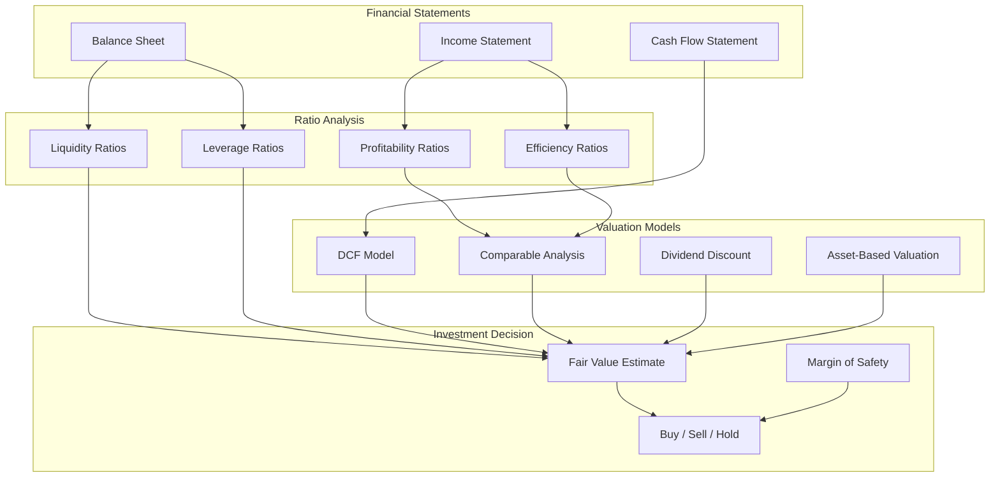

# Chapter 4: Fundamental Analysis

Welcome to **Chapter 4: Fundamental Analysis**. In this part of **OpenBB Tutorial: Complete Guide to Investment Research Platform**, you will build an intuitive mental model first, then move into concrete implementation details and practical production tradeoffs.


This chapter dives into fundamental analysis with OpenBB, covering financial statement analysis, ratio calculations, valuation models, and building comprehensive company evaluation frameworks. You'll learn how to assess a company's intrinsic value using quantitative methods.

## 🎯 What You'll Learn

- Financial statement retrieval and analysis
- Key financial ratio calculations
- Discounted Cash Flow (DCF) valuation
- Comparable company analysis
- Earnings quality assessment and screening

## 📊 Fundamental Analysis Framework

Fundamental analysis evaluates a company's financial health and intrinsic value:



## 📑 Financial Statement Analysis

### Retrieving Financial Statements

```python
from openbb import obb
import pandas as pd
import numpy as np
from typing import Dict, List, Optional

# Fetch all three financial statements
def get_financial_statements(symbol: str, period: str = "annual", limit: int = 5) -> dict:
    """Retrieve all financial statements for a company"""

    income_stmt = obb.equity.fundamental.income(
        symbol, period=period, limit=limit
    )
    balance_sheet = obb.equity.fundamental.balance(
        symbol, period=period, limit=limit
    )
    cash_flow = obb.equity.fundamental.cash(
        symbol, period=period, limit=limit
    )

    return {
        "income_statement": income_stmt.to_dataframe(),
        "balance_sheet": balance_sheet.to_dataframe(),
        "cash_flow": cash_flow.to_dataframe(),
    }

# Usage
statements = get_financial_statements("AAPL")
for name, df in statements.items():
    print(f"\n{name.upper()}:")
    print(df.head())
```

### Income Statement Analysis

```python
class IncomeStatementAnalyzer:
    """Analyze income statement trends and margins"""

    def __init__(self, df: pd.DataFrame):
        self.df = df.copy()

    def calculate_margins(self) -> pd.DataFrame:
        """Calculate key profitability margins"""
        margins = pd.DataFrame(index=self.df.index)

        margins['gross_margin'] = (
            self.df['gross_profit'] / self.df['revenue'] * 100
        )
        margins['operating_margin'] = (
            self.df['operating_income'] / self.df['revenue'] * 100
        )
        margins['net_margin'] = (
            self.df['net_income'] / self.df['revenue'] * 100
        )
        margins['ebitda_margin'] = (
            self.df['ebitda'] / self.df['revenue'] * 100
        )

        return margins.round(2)

    def revenue_growth(self) -> pd.Series:
        """Calculate year-over-year revenue growth"""
        return self.df['revenue'].pct_change(-1).mul(100).round(2)

    def expense_breakdown(self) -> pd.DataFrame:
        """Break down expenses as percentage of revenue"""
        breakdown = pd.DataFrame(index=self.df.index)

        breakdown['cogs_pct'] = (
            self.df['cost_of_revenue'] / self.df['revenue'] * 100
        )
        breakdown['sga_pct'] = (
            self.df['selling_general_and_admin'] / self.df['revenue'] * 100
        )
        breakdown['rd_pct'] = (
            self.df['research_and_development'] / self.df['revenue'] * 100
        )

        return breakdown.round(2)

    def summary(self) -> dict:
        """Generate income statement summary"""
        latest = self.df.iloc[0]
        margins = self.calculate_margins().iloc[0]
        growth = self.revenue_growth()

        return {
            "revenue": f"${latest['revenue'] / 1e9:.2f}B",
            "net_income": f"${latest['net_income'] / 1e9:.2f}B",
            "gross_margin": f"{margins['gross_margin']}%",
            "operating_margin": f"{margins['operating_margin']}%",
            "net_margin": f"{margins['net_margin']}%",
            "revenue_growth_yoy": f"{growth.iloc[0]}%",
        }

# Usage
income_analyzer = IncomeStatementAnalyzer(statements['income_statement'])
print("Income Statement Summary:")
for key, value in income_analyzer.summary().items():
    print(f"  {key}: {value}")
```

### Balance Sheet Analysis

```python
class BalanceSheetAnalyzer:
    """Analyze balance sheet health and structure"""

    def __init__(self, df: pd.DataFrame):
        self.df = df.copy()

    def liquidity_ratios(self) -> dict:
        """Calculate liquidity ratios"""
        latest = self.df.iloc[0]

        current_ratio = latest['total_current_assets'] / latest['total_current_liabilities']
        quick_ratio = (
            (latest['total_current_assets'] - latest.get('inventory', 0))
            / latest['total_current_liabilities']
        )
        cash_ratio = (
            latest['cash_and_equivalents'] / latest['total_current_liabilities']
        )

        return {
            "current_ratio": round(current_ratio, 2),
            "quick_ratio": round(quick_ratio, 2),
            "cash_ratio": round(cash_ratio, 2),
            "working_capital": f"${(latest['total_current_assets'] - latest['total_current_liabilities']) / 1e9:.2f}B",
        }

    def leverage_ratios(self) -> dict:
        """Calculate leverage and solvency ratios"""
        latest = self.df.iloc[0]

        debt_to_equity = latest['total_debt'] / latest['total_equity']
        debt_to_assets = latest['total_debt'] / latest['total_assets']
        equity_multiplier = latest['total_assets'] / latest['total_equity']

        return {
            "debt_to_equity": round(debt_to_equity, 2),
            "debt_to_assets": round(debt_to_assets, 2),
            "equity_multiplier": round(equity_multiplier, 2),
            "total_debt": f"${latest['total_debt'] / 1e9:.2f}B",
            "total_equity": f"${latest['total_equity'] / 1e9:.2f}B",
        }

    def asset_composition(self) -> dict:
        """Analyze asset composition"""
        latest = self.df.iloc[0]
        total_assets = latest['total_assets']

        return {
            "total_assets": f"${total_assets / 1e9:.2f}B",
            "current_assets_pct": f"{latest['total_current_assets'] / total_assets * 100:.1f}%",
            "cash_pct": f"{latest['cash_and_equivalents'] / total_assets * 100:.1f}%",
            "ppe_pct": f"{latest.get('property_plant_equipment', 0) / total_assets * 100:.1f}%",
            "goodwill_pct": f"{latest.get('goodwill', 0) / total_assets * 100:.1f}%",
        }

# Usage
bs_analyzer = BalanceSheetAnalyzer(statements['balance_sheet'])

print("Liquidity Ratios:")
for key, value in bs_analyzer.liquidity_ratios().items():
    print(f"  {key}: {value}")

print("\nLeverage Ratios:")
for key, value in bs_analyzer.leverage_ratios().items():
    print(f"  {key}: {value}")
```

## 📊 Financial Ratio Dashboard

### Comprehensive Ratio Calculation

```python
class FinancialRatioCalculator:
    """Calculate comprehensive financial ratios"""

    def __init__(self, income: pd.DataFrame, balance: pd.DataFrame, cash_flow: pd.DataFrame):
        self.income = income.iloc[0]
        self.balance = balance.iloc[0]
        self.cash_flow = cash_flow.iloc[0]

    def profitability_ratios(self) -> dict:
        """Calculate profitability ratios"""
        return {
            "return_on_equity": round(
                self.income['net_income'] / self.balance['total_equity'] * 100, 2
            ),
            "return_on_assets": round(
                self.income['net_income'] / self.balance['total_assets'] * 100, 2
            ),
            "return_on_invested_capital": round(
                self.income['operating_income']
                / (self.balance['total_equity'] + self.balance['total_debt']) * 100, 2
            ),
            "gross_margin": round(
                self.income['gross_profit'] / self.income['revenue'] * 100, 2
            ),
            "operating_margin": round(
                self.income['operating_income'] / self.income['revenue'] * 100, 2
            ),
            "net_margin": round(
                self.income['net_income'] / self.income['revenue'] * 100, 2
            ),
        }

    def efficiency_ratios(self) -> dict:
        """Calculate efficiency ratios"""
        return {
            "asset_turnover": round(
                self.income['revenue'] / self.balance['total_assets'], 2
            ),
            "inventory_turnover": round(
                self.income['cost_of_revenue'] / self.balance.get('inventory', 1), 2
            ),
            "receivables_turnover": round(
                self.income['revenue'] / self.balance.get('accounts_receivable', 1), 2
            ),
            "days_sales_outstanding": round(
                self.balance.get('accounts_receivable', 0) / self.income['revenue'] * 365, 1
            ),
        }

    def valuation_ratios(self, market_cap: float, share_price: float, shares_outstanding: float) -> dict:
        """Calculate valuation ratios"""
        eps = self.income['net_income'] / shares_outstanding
        book_value_per_share = self.balance['total_equity'] / shares_outstanding
        fcf_per_share = self.cash_flow['free_cash_flow'] / shares_outstanding

        return {
            "pe_ratio": round(share_price / eps, 2),
            "price_to_book": round(share_price / book_value_per_share, 2),
            "price_to_sales": round(market_cap / self.income['revenue'], 2),
            "price_to_fcf": round(share_price / fcf_per_share, 2),
            "ev_to_ebitda": round(
                (market_cap + self.balance['total_debt'] - self.balance['cash_and_equivalents'])
                / self.income['ebitda'], 2
            ),
            "earnings_yield": round(eps / share_price * 100, 2),
        }

    def dupont_analysis(self) -> dict:
        """Perform DuPont decomposition of ROE"""
        net_margin = self.income['net_income'] / self.income['revenue']
        asset_turnover = self.income['revenue'] / self.balance['total_assets']
        equity_multiplier = self.balance['total_assets'] / self.balance['total_equity']
        roe = net_margin * asset_turnover * equity_multiplier

        return {
            "net_margin": round(net_margin * 100, 2),
            "asset_turnover": round(asset_turnover, 2),
            "equity_multiplier": round(equity_multiplier, 2),
            "roe_decomposed": round(roe * 100, 2),
        }

# Usage
ratio_calc = FinancialRatioCalculator(
    statements['income_statement'],
    statements['balance_sheet'],
    statements['cash_flow']
)

print("Profitability Ratios:")
for key, value in ratio_calc.profitability_ratios().items():
    print(f"  {key}: {value}%")

print("\nDuPont Analysis:")
for key, value in ratio_calc.dupont_analysis().items():
    print(f"  {key}: {value}")
```

### Ratio Comparison Table

| Ratio Category | Ratio | Strong | Average | Weak |
|:---------------|:------|:-------|:--------|:-----|
| **Profitability** | ROE | > 20% | 10-20% | < 10% |
| **Profitability** | Net Margin | > 15% | 5-15% | < 5% |
| **Liquidity** | Current Ratio | > 2.0 | 1.0-2.0 | < 1.0 |
| **Liquidity** | Quick Ratio | > 1.5 | 0.8-1.5 | < 0.8 |
| **Leverage** | Debt/Equity | < 0.5 | 0.5-1.5 | > 1.5 |
| **Efficiency** | Asset Turnover | > 1.0 | 0.5-1.0 | < 0.5 |
| **Valuation** | P/E Ratio | < 15 | 15-25 | > 25 |

## 📈 Valuation Models

### Discounted Cash Flow (DCF) Model


```python
class DCFModel:
    """Discounted Cash Flow valuation model"""

    def __init__(
        self,
        symbol: str,
        fcf_history: list,
        growth_rate: float = 0.10,
        terminal_growth: float = 0.03,
        discount_rate: float = 0.10,
        projection_years: int = 5,
    ):
        self.symbol = symbol
        self.fcf_history = fcf_history
        self.growth_rate = growth_rate
        self.terminal_growth = terminal_growth
        self.discount_rate = discount_rate
        self.projection_years = projection_years

    def project_cash_flows(self) -> list:
        """Project future free cash flows"""
        base_fcf = self.fcf_history[-1]
        projected = []

        for year in range(1, self.projection_years + 1):
            # Gradually decrease growth rate toward terminal rate
            year_growth = self.growth_rate - (
                (self.growth_rate - self.terminal_growth)
                * (year / self.projection_years)
            )
            base_fcf = base_fcf * (1 + year_growth)
            projected.append({
                "year": year,
                "growth_rate": round(year_growth * 100, 2),
                "fcf": round(base_fcf, 2),
            })

        return projected

    def calculate_terminal_value(self, final_fcf: float) -> float:
        """Calculate terminal value using Gordon Growth Model"""
        terminal_fcf = final_fcf * (1 + self.terminal_growth)
        return terminal_fcf / (self.discount_rate - self.terminal_growth)

    def calculate_present_values(self, projected_fcf: list) -> list:
        """Discount projected cash flows to present value"""
        pv_list = []
        for item in projected_fcf:
            pv = item['fcf'] / (1 + self.discount_rate) ** item['year']
            pv_list.append({
                "year": item['year'],
                "fcf": item['fcf'],
                "present_value": round(pv, 2),
            })
        return pv_list

    def calculate_fair_value(
        self,
        shares_outstanding: float,
        net_debt: float
    ) -> dict:
        """Calculate fair value per share"""
        projected = self.project_cash_flows()
        pv_fcfs = self.calculate_present_values(projected)

        # Sum of discounted cash flows
        sum_pv = sum(item['present_value'] for item in pv_fcfs)

        # Terminal value
        final_fcf = projected[-1]['fcf']
        terminal_value = self.calculate_terminal_value(final_fcf)
        pv_terminal = terminal_value / (1 + self.discount_rate) ** self.projection_years

        # Enterprise value
        enterprise_value = sum_pv + pv_terminal

        # Equity value
        equity_value = enterprise_value - net_debt

        # Fair value per share
        fair_value = equity_value / shares_outstanding

        return {
            "projected_fcfs": pv_fcfs,
            "sum_pv_fcf": round(sum_pv / 1e9, 2),
            "terminal_value": round(pv_terminal / 1e9, 2),
            "enterprise_value": round(enterprise_value / 1e9, 2),
            "net_debt": round(net_debt / 1e9, 2),
            "equity_value": round(equity_value / 1e9, 2),
            "shares_outstanding": f"{shares_outstanding / 1e9:.2f}B",
            "fair_value_per_share": round(fair_value, 2),
        }

    def sensitivity_analysis(
        self,
        shares_outstanding: float,
        net_debt: float,
        growth_range: list = None,
        discount_range: list = None,
    ) -> pd.DataFrame:
        """Run sensitivity analysis on key assumptions"""
        if growth_range is None:
            growth_range = [0.05, 0.08, 0.10, 0.12, 0.15]
        if discount_range is None:
            discount_range = [0.08, 0.09, 0.10, 0.11, 0.12]

        results = {}
        for gr in growth_range:
            row = {}
            for dr in discount_range:
                self.growth_rate = gr
                self.discount_rate = dr
                valuation = self.calculate_fair_value(shares_outstanding, net_debt)
                row[f"WACC {dr*100:.0f}%"] = valuation['fair_value_per_share']
            results[f"Growth {gr*100:.0f}%"] = row

        return pd.DataFrame(results).T

# Usage
dcf = DCFModel(
    symbol="AAPL",
    fcf_history=[90e9, 92e9, 99e9, 111e9],
    growth_rate=0.10,
    terminal_growth=0.025,
    discount_rate=0.10,
    projection_years=5,
)

valuation = dcf.calculate_fair_value(
    shares_outstanding=15.5e9,
    net_debt=50e9
)

print("DCF Valuation Results:")
for key, value in valuation.items():
    if key != "projected_fcfs":
        print(f"  {key}: {value}")

# Sensitivity analysis
sensitivity = dcf.sensitivity_analysis(
    shares_outstanding=15.5e9,
    net_debt=50e9
)
print("\nSensitivity Analysis (Fair Value Per Share):")
print(sensitivity)
```

### Comparable Company Analysis

```python
class ComparableAnalysis:
    """Comparable company (comps) valuation analysis"""

    def __init__(self, target_symbol: str, peer_symbols: list):
        self.target = target_symbol
        self.peers = peer_symbols

    def gather_metrics(self) -> pd.DataFrame:
        """Gather valuation metrics for target and peers"""
        all_symbols = [self.target] + self.peers
        metrics_list = []

        for symbol in all_symbols:
            try:
                profile = obb.equity.profile(symbol).to_dataframe().iloc[0]
                ratios = obb.equity.fundamental.ratios(symbol).to_dataframe().iloc[0]

                metrics_list.append({
                    "symbol": symbol,
                    "market_cap": profile.get('market_cap', 0),
                    "pe_ratio": ratios.get('pe_ratio', 0),
                    "ev_to_ebitda": ratios.get('ev_to_ebitda', 0),
                    "price_to_book": ratios.get('price_to_book', 0),
                    "price_to_sales": ratios.get('price_to_sales', 0),
                    "roe": ratios.get('return_on_equity', 0),
                    "revenue_growth": ratios.get('revenue_growth', 0),
                })
            except Exception as e:
                print(f"Error fetching data for {symbol}: {e}")

        return pd.DataFrame(metrics_list)

    def calculate_implied_value(
        self,
        peer_metrics: pd.DataFrame,
        target_financials: dict
    ) -> dict:
        """Calculate implied value based on peer multiples"""
        # Filter out the target from peer metrics
        peers = peer_metrics[peer_metrics['symbol'] != self.target]

        median_pe = peers['pe_ratio'].median()
        median_ev_ebitda = peers['ev_to_ebitda'].median()
        median_ps = peers['price_to_sales'].median()

        implied_values = {
            "pe_implied": round(
                median_pe * target_financials['eps'], 2
            ),
            "ev_ebitda_implied": round(
                (median_ev_ebitda * target_financials['ebitda']
                 - target_financials['net_debt'])
                / target_financials['shares_outstanding'], 2
            ),
            "ps_implied": round(
                median_ps * target_financials['revenue']
                / target_financials['shares_outstanding'], 2
            ),
        }

        implied_values['average_implied'] = round(
            np.mean(list(implied_values.values())), 2
        )

        return {
            "peer_medians": {
                "pe_ratio": round(median_pe, 2),
                "ev_to_ebitda": round(median_ev_ebitda, 2),
                "price_to_sales": round(median_ps, 2),
            },
            "implied_values": implied_values,
        }

# Usage
comps = ComparableAnalysis(
    target_symbol="AAPL",
    peer_symbols=["MSFT", "GOOGL", "META", "AMZN"]
)

metrics = comps.gather_metrics()
print("Comparable Company Metrics:")
print(metrics.to_string(index=False))

target_fins = {
    "eps": 6.42,
    "ebitda": 130e9,
    "revenue": 383e9,
    "net_debt": 50e9,
    "shares_outstanding": 15.5e9,
}

implied = comps.calculate_implied_value(metrics, target_fins)
print("\nImplied Valuations:")
for key, value in implied['implied_values'].items():
    print(f"  {key}: ${value}")
```

## 📋 Earnings Quality Assessment

```python
class EarningsQualityAnalyzer:
    """Assess the quality of reported earnings"""

    def __init__(self, income: pd.DataFrame, cash_flow: pd.DataFrame, balance: pd.DataFrame):
        self.income = income
        self.cash_flow = cash_flow
        self.balance = balance

    def accrual_ratio(self) -> float:
        """Calculate accrual ratio (lower is better)"""
        net_income = self.income.iloc[0]['net_income']
        operating_cf = self.cash_flow.iloc[0]['operating_cash_flow']
        total_assets = self.balance.iloc[0]['total_assets']

        return round((net_income - operating_cf) / total_assets * 100, 2)

    def cash_flow_quality(self) -> dict:
        """Assess cash flow quality relative to earnings"""
        latest = {
            "net_income": self.income.iloc[0]['net_income'],
            "operating_cf": self.cash_flow.iloc[0]['operating_cash_flow'],
            "fcf": self.cash_flow.iloc[0]['free_cash_flow'],
            "capex": self.cash_flow.iloc[0]['capital_expenditure'],
        }

        cf_to_ni = latest['operating_cf'] / latest['net_income']
        fcf_to_ni = latest['fcf'] / latest['net_income']

        return {
            "cf_to_net_income": round(cf_to_ni, 2),
            "fcf_to_net_income": round(fcf_to_ni, 2),
            "quality": (
                "High" if cf_to_ni > 1.2
                else "Good" if cf_to_ni > 0.8
                else "Questionable" if cf_to_ni > 0.5
                else "Poor"
            ),
            "capex_intensity": round(
                abs(latest['capex']) / latest['operating_cf'] * 100, 2
            ),
        }

    def revenue_consistency(self) -> dict:
        """Analyze revenue growth consistency"""
        revenues = self.income['revenue']
        growth_rates = revenues.pct_change(-1).dropna()

        return {
            "avg_growth": round(growth_rates.mean() * 100, 2),
            "growth_std": round(growth_rates.std() * 100, 2),
            "consistency_score": round(
                growth_rates.mean() / growth_rates.std() if growth_rates.std() > 0 else 0, 2
            ),
            "positive_growth_years": int((growth_rates > 0).sum()),
            "total_years": len(growth_rates),
        }

    def full_assessment(self) -> dict:
        """Run complete earnings quality assessment"""
        accrual = self.accrual_ratio()
        cf_quality = self.cash_flow_quality()
        consistency = self.revenue_consistency()

        # Overall score (0-100)
        score = 50  # baseline
        score += 15 if accrual < 5 else -10 if accrual > 15 else 0
        score += 15 if cf_quality['cf_to_net_income'] > 1.0 else -10
        score += 10 if consistency['consistency_score'] > 1.0 else -5
        score += 10 if cf_quality['quality'] in ['High', 'Good'] else -10

        return {
            "accrual_ratio": f"{accrual}%",
            "cash_flow_quality": cf_quality,
            "revenue_consistency": consistency,
            "overall_score": min(max(score, 0), 100),
            "rating": (
                "Excellent" if score >= 80
                else "Good" if score >= 60
                else "Fair" if score >= 40
                else "Poor"
            ),
        }

# Usage
eq_analyzer = EarningsQualityAnalyzer(
    statements['income_statement'],
    statements['cash_flow'],
    statements['balance_sheet']
)

assessment = eq_analyzer.full_assessment()
print("Earnings Quality Assessment:")
print(f"  Overall Score: {assessment['overall_score']}/100")
print(f"  Rating: {assessment['rating']}")
print(f"  Accrual Ratio: {assessment['accrual_ratio']}")
```

## 🔍 Stock Screening

### Fundamental Screening Engine

```python
class FundamentalScreener:
    """Screen stocks based on fundamental criteria"""

    def __init__(self, universe: list):
        self.universe = universe
        self.results = []

    def screen(self, criteria: dict) -> pd.DataFrame:
        """Screen stocks against fundamental criteria"""
        for symbol in self.universe:
            try:
                ratios = obb.equity.fundamental.ratios(symbol).to_dataframe().iloc[0]
                profile = obb.equity.profile(symbol).to_dataframe().iloc[0]

                stock_data = {
                    "symbol": symbol,
                    "market_cap": profile.get('market_cap', 0),
                    "pe_ratio": ratios.get('pe_ratio', 0),
                    "roe": ratios.get('return_on_equity', 0),
                    "debt_to_equity": ratios.get('debt_to_equity', 0),
                    "current_ratio": ratios.get('current_ratio', 0),
                    "revenue_growth": ratios.get('revenue_growth', 0),
                    "dividend_yield": ratios.get('dividend_yield', 0),
                }

                # Apply criteria filters
                passes = True
                for metric, (min_val, max_val) in criteria.items():
                    value = stock_data.get(metric, 0)
                    if value is None:
                        passes = False
                        break
                    if min_val is not None and value < min_val:
                        passes = False
                        break
                    if max_val is not None and value > max_val:
                        passes = False
                        break

                if passes:
                    self.results.append(stock_data)

            except Exception as e:
                print(f"Skipping {symbol}: {e}")

        return pd.DataFrame(self.results)

# Usage - Value stock screening criteria
screener = FundamentalScreener(
    universe=["AAPL", "MSFT", "GOOGL", "AMZN", "META", "NVDA",
              "JPM", "JNJ", "PG", "KO", "WMT", "DIS"]
)

value_criteria = {
    "pe_ratio": (0, 25),           # P/E between 0 and 25
    "roe": (0.10, None),           # ROE above 10%
    "debt_to_equity": (None, 1.5), # D/E below 1.5
    "current_ratio": (1.0, None),  # Current ratio above 1.0
}

results = screener.screen(value_criteria)
print("Value Stock Screen Results:")
print(results.to_string(index=False))
```

### Screening Strategy Templates

| Strategy | Key Criteria | Target |
|:---------|:-------------|:-------|
| **Value Investing** | Low P/E, Low P/B, High dividend yield | Undervalued stocks |
| **Growth Investing** | High revenue growth, High ROE, High margins | Fast-growing companies |
| **Quality Investing** | High ROIC, Low debt, Consistent earnings | Financially strong companies |
| **Dividend Income** | High yield, Low payout ratio, Dividend growth | Reliable income generators |
| **GARP** | Moderate P/E, Above-avg growth, Reasonable valuation | Growth at a reasonable price |

## 🎯 Best Practices

### Fundamental Analysis Guidelines

1. **Use Multiple Valuation Methods**
   - Cross-reference DCF, comps, and asset-based valuations
   - No single model captures complete reality

2. **Analyze Trends, Not Snapshots**
   - Compare ratios over 5+ years of history
   - Look for improvement or deterioration in trends

3. **Industry Context Matters**
   - Compare ratios to industry peers, not the market average
   - Capital-intensive industries naturally carry more debt

4. **Quality Over Quantity**
   - Focus on free cash flow over reported earnings
   - Verify earnings quality with cash flow analysis

5. **Margin of Safety**
   - Always demand a discount to estimated fair value
   - Account for uncertainty in assumptions

## 🏆 Achievement Unlocked!

Congratulations! You've mastered:

- ✅ Financial statement retrieval and analysis
- ✅ Comprehensive ratio calculations (profitability, liquidity, leverage)
- ✅ DCF valuation modeling with sensitivity analysis
- ✅ Comparable company analysis
- ✅ Earnings quality assessment
- ✅ Fundamental stock screening

## 🚀 What's Next?

Ready to manage portfolios? Let's explore [Chapter 5: Portfolio Management](05-portfolio-management.md) to learn about portfolio construction, optimization, and risk analysis.

---

**Practice what you've learned:**
1. Build a DCF model for a company you follow
2. Run a comparable analysis across an industry sector
3. Assess earnings quality for the FAANG stocks
4. Create a custom stock screener for your investment style
5. Perform a DuPont analysis to decompose ROE

*Built with insights from the [OpenBB](https://github.com/OpenBB-finance/OpenBB) project.*

## What Problem Does This Solve?

Most teams struggle here because the hard part is not writing more code, but deciding clear boundaries for `self`, `round`, `latest` so behavior stays predictable as complexity grows.

In practical terms, this chapter helps you avoid three common failures:

- coupling core logic too tightly to one implementation path
- missing the handoff boundaries between setup, execution, and validation
- shipping changes without clear rollback or observability strategy

After working through this chapter, you should be able to reason about `Chapter 4: Fundamental Analysis` as an operating subsystem inside **OpenBB Tutorial: Complete Guide to Investment Research Platform**, with explicit contracts for inputs, state transitions, and outputs.

Use the implementation notes around `income`, `print`, `revenue` as your checklist when adapting these patterns to your own repository.

## How it Works Under the Hood

Under the hood, `Chapter 4: Fundamental Analysis` usually follows a repeatable control path:

1. **Context bootstrap**: initialize runtime config and prerequisites for `self`.
2. **Input normalization**: shape incoming data so `round` receives stable contracts.
3. **Core execution**: run the main logic branch and propagate intermediate state through `latest`.
4. **Policy and safety checks**: enforce limits, auth scopes, and failure boundaries.
5. **Output composition**: return canonical result payloads for downstream consumers.
6. **Operational telemetry**: emit logs/metrics needed for debugging and performance tuning.

When debugging, walk this sequence in order and confirm each stage has explicit success/failure conditions.

## Source Walkthrough

Use the following upstream sources to verify implementation details while reading this chapter:

- [GitHub Repository](https://github.com/OpenBB-finance/OpenBB)
  Why it matters: authoritative reference on `GitHub Repository` (github.com).
- [Extension Marketplace](https://github.com/OpenBB-finance/OpenBB/tree/develop/openbb_platform/extensions)
  Why it matters: authoritative reference on `Extension Marketplace` (github.com).
- [AI Codebase Knowledge Builder](https://github.com/johnxie/awesome-code-docs)
  Why it matters: authoritative reference on `AI Codebase Knowledge Builder` (github.com).

Suggested trace strategy:
- search upstream code for `self` and `round` to map concrete implementation paths
- compare docs claims against actual runtime/config code before reusing patterns in production

## Chapter Connections

- [Tutorial Index](index.md)
- [Previous Chapter: Chapter 3: Technical Analysis](03-technical-analysis.md)
- [Next Chapter: Chapter 5: Portfolio Management](05-portfolio-management.md)
- [Main Catalog](../../README.md#-tutorial-catalog)
- [A-Z Tutorial Directory](../../discoverability/tutorial-directory.md)
