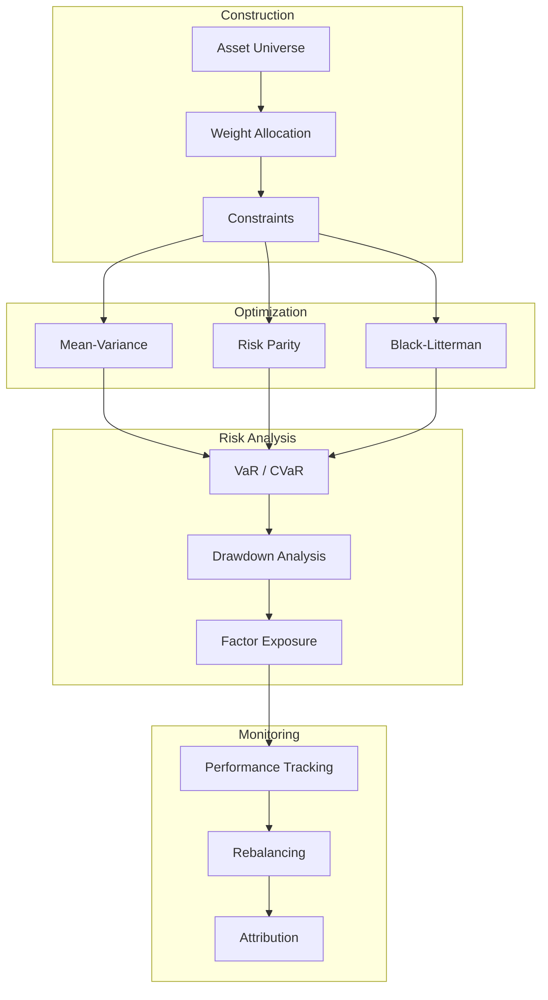
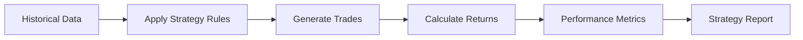

# Chapter 5: Portfolio Management

Welcome to **Chapter 5: Portfolio Management**. In this part of **OpenBB Tutorial: Complete Guide to Investment Research Platform**, you will build an intuitive mental model first, then move into concrete implementation details and practical production tradeoffs.


This chapter covers portfolio construction, optimization, risk analysis, and backtesting with OpenBB. You'll learn how to build diversified portfolios, apply Modern Portfolio Theory, measure risk, and validate strategies against historical data.

## 🎯 What You'll Learn

- Portfolio construction and weight allocation
- Mean-Variance Optimization (MVO)
- Risk metrics: VaR, CVaR, Sharpe ratio, drawdowns
- Portfolio backtesting and performance attribution
- Rebalancing strategies

## 📊 Portfolio Management Framework



## 📈 Portfolio Construction

### Building a Portfolio

```python
from openbb import obb
import pandas as pd
import numpy as np
from typing import Dict, List, Optional
from dataclasses import dataclass, field

@dataclass
class Position:
    """Represents a single portfolio position"""
    symbol: str
    shares: float
    cost_basis: float
    current_price: float = 0.0

    @property
    def market_value(self) -> float:
        return self.shares * self.current_price

    @property
    def cost_value(self) -> float:
        return self.shares * self.cost_basis

    @property
    def pnl(self) -> float:
        return self.market_value - self.cost_value

    @property
    def pnl_percent(self) -> float:
        if self.cost_value == 0:
            return 0.0
        return (self.pnl / self.cost_value) * 100


class Portfolio:
    """Portfolio management class"""

    def __init__(self, name: str, cash: float = 0.0):
        self.name = name
        self.cash = cash
        self.positions: Dict[str, Position] = {}
        self.transactions: List[dict] = []

    def add_position(self, symbol: str, shares: float, price: float):
        """Add or increase a position"""
        cost = shares * price
        if cost > self.cash:
            raise ValueError(f"Insufficient cash: ${self.cash:.2f} < ${cost:.2f}")

        if symbol in self.positions:
            existing = self.positions[symbol]
            total_shares = existing.shares + shares
            avg_cost = (
                (existing.cost_basis * existing.shares + price * shares)
                / total_shares
            )
            existing.shares = total_shares
            existing.cost_basis = avg_cost
        else:
            self.positions[symbol] = Position(symbol, shares, price)

        self.cash -= cost
        self.transactions.append({
            "action": "BUY",
            "symbol": symbol,
            "shares": shares,
            "price": price,
            "total": cost,
        })

    def remove_position(self, symbol: str, shares: float, price: float):
        """Sell shares from a position"""
        if symbol not in self.positions:
            raise ValueError(f"No position in {symbol}")

        position = self.positions[symbol]
        if shares > position.shares:
            raise ValueError(f"Insufficient shares: {position.shares} < {shares}")

        position.shares -= shares
        self.cash += shares * price

        if position.shares == 0:
            del self.positions[symbol]

        self.transactions.append({
            "action": "SELL",
            "symbol": symbol,
            "shares": shares,
            "price": price,
            "total": shares * price,
        })

    def update_prices(self):
        """Update current prices from market data"""
        for symbol, position in self.positions.items():
            quote = obb.equity.price.quote(symbol).to_dataframe()
            position.current_price = float(quote['last_price'].iloc[0])

    def total_value(self) -> float:
        """Calculate total portfolio value"""
        return self.cash + sum(
            p.market_value for p in self.positions.values()
        )

    def weights(self) -> dict:
        """Calculate current portfolio weights"""
        total = self.total_value()
        weights = {"cash": round(self.cash / total * 100, 2)}
        for symbol, position in self.positions.items():
            weights[symbol] = round(position.market_value / total * 100, 2)
        return weights

    def summary(self) -> pd.DataFrame:
        """Generate portfolio summary"""
        rows = []
        for symbol, pos in self.positions.items():
            rows.append({
                "Symbol": symbol,
                "Shares": pos.shares,
                "Cost Basis": round(pos.cost_basis, 2),
                "Current Price": round(pos.current_price, 2),
                "Market Value": round(pos.market_value, 2),
                "P&L": round(pos.pnl, 2),
                "P&L %": round(pos.pnl_percent, 2),
                "Weight %": round(
                    pos.market_value / self.total_value() * 100, 2
                ),
            })
        return pd.DataFrame(rows)

# Usage
portfolio = Portfolio("Growth Portfolio", cash=100000)
portfolio.add_position("AAPL", 50, 175.00)
portfolio.add_position("MSFT", 30, 380.00)
portfolio.add_position("GOOGL", 20, 140.00)
portfolio.add_position("NVDA", 15, 480.00)
portfolio.add_position("AMZN", 25, 155.00)

portfolio.update_prices()
print(f"Portfolio: {portfolio.name}")
print(f"Total Value: ${portfolio.total_value():,.2f}")
print(f"Cash: ${portfolio.cash:,.2f}")
print(f"\nWeights: {portfolio.weights()}")
print(f"\nHoldings:")
print(portfolio.summary().to_string(index=False))
```

## 📊 Portfolio Optimization

### Mean-Variance Optimization

```python
class MeanVarianceOptimizer:
    """Optimize portfolio weights using Modern Portfolio Theory"""

    def __init__(self, symbols: list, start_date: str, end_date: str):
        self.symbols = symbols
        self.returns = self._fetch_returns(start_date, end_date)

    def _fetch_returns(self, start_date: str, end_date: str) -> pd.DataFrame:
        """Fetch and calculate returns for all assets"""
        prices = pd.DataFrame()
        for symbol in self.symbols:
            data = obb.equity.price.historical(
                symbol, start_date=start_date, end_date=end_date
            ).to_dataframe()
            prices[symbol] = data['close']

        return prices.pct_change().dropna()

    def expected_returns(self) -> np.ndarray:
        """Calculate annualized expected returns"""
        return self.returns.mean().values * 252

    def covariance_matrix(self) -> np.ndarray:
        """Calculate annualized covariance matrix"""
        return self.returns.cov().values * 252

    def portfolio_performance(self, weights: np.ndarray) -> tuple:
        """Calculate portfolio return and risk for given weights"""
        mu = self.expected_returns()
        cov = self.covariance_matrix()

        port_return = np.dot(weights, mu)
        port_risk = np.sqrt(np.dot(weights.T, np.dot(cov, weights)))
        sharpe = port_return / port_risk if port_risk > 0 else 0

        return port_return, port_risk, sharpe

    def optimize_sharpe(self, risk_free_rate: float = 0.04) -> dict:
        """Find the maximum Sharpe ratio portfolio"""
        from scipy.optimize import minimize

        n = len(self.symbols)
        mu = self.expected_returns()
        cov = self.covariance_matrix()

        def neg_sharpe(weights):
            port_return = np.dot(weights, mu)
            port_risk = np.sqrt(np.dot(weights.T, np.dot(cov, weights)))
            return -(port_return - risk_free_rate) / port_risk

        constraints = [{"type": "eq", "fun": lambda w: np.sum(w) - 1}]
        bounds = [(0, 1) for _ in range(n)]
        initial_weights = np.array([1 / n] * n)

        result = minimize(
            neg_sharpe,
            initial_weights,
            method="SLSQP",
            bounds=bounds,
            constraints=constraints,
        )

        optimal_weights = result.x
        ret, risk, sharpe = self.portfolio_performance(optimal_weights)

        return {
            "weights": {
                self.symbols[i]: round(optimal_weights[i] * 100, 2)
                for i in range(n)
            },
            "expected_return": round(ret * 100, 2),
            "expected_risk": round(risk * 100, 2),
            "sharpe_ratio": round(sharpe, 3),
        }

    def optimize_min_variance(self) -> dict:
        """Find the minimum variance portfolio"""
        from scipy.optimize import minimize

        n = len(self.symbols)
        cov = self.covariance_matrix()

        def portfolio_variance(weights):
            return np.dot(weights.T, np.dot(cov, weights))

        constraints = [{"type": "eq", "fun": lambda w: np.sum(w) - 1}]
        bounds = [(0, 1) for _ in range(n)]
        initial_weights = np.array([1 / n] * n)

        result = minimize(
            portfolio_variance,
            initial_weights,
            method="SLSQP",
            bounds=bounds,
            constraints=constraints,
        )

        optimal_weights = result.x
        ret, risk, sharpe = self.portfolio_performance(optimal_weights)

        return {
            "weights": {
                self.symbols[i]: round(optimal_weights[i] * 100, 2)
                for i in range(n)
            },
            "expected_return": round(ret * 100, 2),
            "expected_risk": round(risk * 100, 2),
            "sharpe_ratio": round(sharpe, 3),
        }

    def efficient_frontier(self, num_points: int = 50) -> pd.DataFrame:
        """Generate the efficient frontier"""
        from scipy.optimize import minimize

        n = len(self.symbols)
        mu = self.expected_returns()
        cov = self.covariance_matrix()

        target_returns = np.linspace(mu.min(), mu.max(), num_points)
        frontier = []

        for target in target_returns:
            constraints = [
                {"type": "eq", "fun": lambda w: np.sum(w) - 1},
                {"type": "eq", "fun": lambda w, t=target: np.dot(w, mu) - t},
            ]
            bounds = [(0, 1) for _ in range(n)]

            result = minimize(
                lambda w: np.dot(w.T, np.dot(cov, w)),
                np.array([1 / n] * n),
                method="SLSQP",
                bounds=bounds,
                constraints=constraints,
            )

            if result.success:
                risk = np.sqrt(result.fun)
                frontier.append({
                    "return": round(target * 100, 2),
                    "risk": round(risk * 100, 2),
                })

        return pd.DataFrame(frontier)

# Usage
optimizer = MeanVarianceOptimizer(
    symbols=["AAPL", "MSFT", "GOOGL", "AMZN", "JPM", "JNJ", "PG"],
    start_date="2022-01-01",
    end_date="2023-12-31",
)

max_sharpe = optimizer.optimize_sharpe()
print("Maximum Sharpe Ratio Portfolio:")
print(f"  Expected Return: {max_sharpe['expected_return']}%")
print(f"  Expected Risk: {max_sharpe['expected_risk']}%")
print(f"  Sharpe Ratio: {max_sharpe['sharpe_ratio']}")
print(f"  Weights:")
for symbol, weight in max_sharpe['weights'].items():
    print(f"    {symbol}: {weight}%")

min_var = optimizer.optimize_min_variance()
print("\nMinimum Variance Portfolio:")
print(f"  Expected Return: {min_var['expected_return']}%")
print(f"  Expected Risk: {min_var['expected_risk']}%")
print(f"  Sharpe Ratio: {min_var['sharpe_ratio']}")
```

### Risk Parity Allocation

```python
class RiskParityOptimizer:
    """Equal risk contribution portfolio allocation"""

    def __init__(self, returns: pd.DataFrame):
        self.returns = returns
        self.cov = returns.cov().values * 252

    def risk_contribution(self, weights: np.ndarray) -> np.ndarray:
        """Calculate each asset's risk contribution"""
        port_risk = np.sqrt(np.dot(weights.T, np.dot(self.cov, weights)))
        marginal_risk = np.dot(self.cov, weights) / port_risk
        return weights * marginal_risk

    def optimize(self) -> dict:
        """Find risk parity weights"""
        from scipy.optimize import minimize

        n = len(self.returns.columns)
        target_risk = 1.0 / n

        def objective(weights):
            rc = self.risk_contribution(weights)
            total_risk = rc.sum()
            rc_pct = rc / total_risk
            return np.sum((rc_pct - target_risk) ** 2)

        constraints = [{"type": "eq", "fun": lambda w: np.sum(w) - 1}]
        bounds = [(0.01, 1) for _ in range(n)]

        result = minimize(
            objective,
            np.array([1 / n] * n),
            method="SLSQP",
            bounds=bounds,
            constraints=constraints,
        )

        weights = result.x
        rc = self.risk_contribution(weights)

        return {
            "weights": {
                self.returns.columns[i]: round(weights[i] * 100, 2)
                for i in range(n)
            },
            "risk_contributions": {
                self.returns.columns[i]: round(rc[i] / rc.sum() * 100, 2)
                for i in range(n)
            },
        }

# Usage
rp_optimizer = RiskParityOptimizer(optimizer.returns)
rp_result = rp_optimizer.optimize()
print("Risk Parity Portfolio:")
for symbol, weight in rp_result['weights'].items():
    rc = rp_result['risk_contributions'][symbol]
    print(f"  {symbol}: Weight={weight}%, Risk Contribution={rc}%")
```

## 📉 Risk Analysis

### Value at Risk (VaR) and Conditional VaR

```python
class RiskAnalyzer:
    """Comprehensive portfolio risk analysis"""

    def __init__(self, returns: pd.Series):
        self.returns = returns

    def var_historical(self, confidence: float = 0.95) -> float:
        """Historical Value at Risk"""
        return -np.percentile(self.returns, (1 - confidence) * 100)

    def var_parametric(self, confidence: float = 0.95) -> float:
        """Parametric (normal distribution) VaR"""
        from scipy.stats import norm
        z = norm.ppf(confidence)
        return -(self.returns.mean() - z * self.returns.std())

    def cvar(self, confidence: float = 0.95) -> float:
        """Conditional VaR (Expected Shortfall)"""
        var = self.var_historical(confidence)
        return -self.returns[self.returns <= -var].mean()

    def max_drawdown(self) -> dict:
        """Calculate maximum drawdown"""
        cumulative = (1 + self.returns).cumprod()
        peak = cumulative.expanding().max()
        drawdown = (cumulative - peak) / peak

        max_dd = drawdown.min()
        max_dd_end = drawdown.idxmin()

        # Find the peak before the max drawdown
        peak_date = cumulative[:max_dd_end].idxmax()

        return {
            "max_drawdown": round(max_dd * 100, 2),
            "peak_date": str(peak_date),
            "trough_date": str(max_dd_end),
        }

    def performance_metrics(self, risk_free_rate: float = 0.04) -> dict:
        """Calculate key performance metrics"""
        annual_return = self.returns.mean() * 252
        annual_vol = self.returns.std() * np.sqrt(252)
        sharpe = (annual_return - risk_free_rate) / annual_vol

        # Sortino ratio (downside deviation only)
        downside = self.returns[self.returns < 0]
        downside_vol = downside.std() * np.sqrt(252)
        sortino = (annual_return - risk_free_rate) / downside_vol

        # Calmar ratio
        dd = self.max_drawdown()
        calmar = annual_return / abs(dd['max_drawdown'] / 100)

        return {
            "annual_return": round(annual_return * 100, 2),
            "annual_volatility": round(annual_vol * 100, 2),
            "sharpe_ratio": round(sharpe, 3),
            "sortino_ratio": round(sortino, 3),
            "calmar_ratio": round(calmar, 3),
            "var_95": round(self.var_historical(0.95) * 100, 2),
            "cvar_95": round(self.cvar(0.95) * 100, 2),
            "max_drawdown": f"{dd['max_drawdown']}%",
            "skewness": round(self.returns.skew(), 3),
            "kurtosis": round(self.returns.kurtosis(), 3),
        }

    def full_report(self, risk_free_rate: float = 0.04) -> dict:
        """Generate complete risk report"""
        metrics = self.performance_metrics(risk_free_rate)
        drawdown = self.max_drawdown()

        return {
            "performance": metrics,
            "drawdown": drawdown,
            "var_analysis": {
                "var_90": round(self.var_historical(0.90) * 100, 2),
                "var_95": round(self.var_historical(0.95) * 100, 2),
                "var_99": round(self.var_historical(0.99) * 100, 2),
                "cvar_95": round(self.cvar(0.95) * 100, 2),
            },
        }

# Usage
# Create portfolio returns from weights
weights = np.array([0.30, 0.25, 0.20, 0.15, 0.05, 0.03, 0.02])
portfolio_returns = optimizer.returns.dot(weights)

risk_analyzer = RiskAnalyzer(portfolio_returns)
report = risk_analyzer.full_report()

print("Risk Report:")
print("\nPerformance Metrics:")
for key, value in report['performance'].items():
    print(f"  {key}: {value}")

print("\nValue at Risk:")
for key, value in report['var_analysis'].items():
    print(f"  {key}: {value}%")
```

### Risk Metrics Reference

| Metric | Description | Good Value | Warning |
|:-------|:-----------|:-----------|:--------|
| **Sharpe Ratio** | Risk-adjusted return | > 1.0 | < 0.5 |
| **Sortino Ratio** | Downside risk-adjusted | > 1.5 | < 0.8 |
| **Max Drawdown** | Largest peak-to-trough | < -15% | > -30% |
| **VaR (95%)** | Daily loss threshold | < 2% | > 4% |
| **CVaR (95%)** | Expected loss beyond VaR | < 3% | > 5% |
| **Calmar Ratio** | Return / Max Drawdown | > 1.0 | < 0.5 |

## 🔄 Backtesting

### Strategy Backtester



```python
class Backtester:
    """Backtest portfolio strategies"""

    def __init__(
        self,
        symbols: list,
        start_date: str,
        end_date: str,
        initial_capital: float = 100000,
    ):
        self.symbols = symbols
        self.initial_capital = initial_capital
        self.prices = self._fetch_prices(start_date, end_date)
        self.returns = self.prices.pct_change().dropna()

    def _fetch_prices(self, start_date: str, end_date: str) -> pd.DataFrame:
        """Fetch historical prices"""
        prices = pd.DataFrame()
        for symbol in self.symbols:
            data = obb.equity.price.historical(
                symbol, start_date=start_date, end_date=end_date
            ).to_dataframe()
            prices[symbol] = data['close']
        return prices

    def equal_weight(self) -> pd.Series:
        """Backtest equal-weight strategy"""
        weights = np.array([1 / len(self.symbols)] * len(self.symbols))
        return (self.returns * weights).sum(axis=1)

    def momentum_strategy(self, lookback: int = 60, top_n: int = 3) -> pd.Series:
        """Backtest momentum strategy (top N performers)"""
        portfolio_returns = pd.Series(0.0, index=self.returns.index)

        for i in range(lookback, len(self.returns)):
            # Calculate momentum scores
            momentum = self.returns.iloc[i - lookback:i].sum()
            top_assets = momentum.nlargest(top_n).index.tolist()

            # Equal weight among top momentum assets
            daily_return = self.returns.iloc[i][top_assets].mean()
            portfolio_returns.iloc[i] = daily_return

        return portfolio_returns

    def rebalanced_strategy(
        self,
        target_weights: dict,
        rebalance_freq: str = "M",
    ) -> pd.Series:
        """Backtest strategy with periodic rebalancing"""
        weights = np.array([target_weights[s] for s in self.symbols])
        daily_returns = (self.returns * weights).sum(axis=1)

        # Simulate drift and rebalancing
        portfolio_value = pd.Series(
            self.initial_capital, index=self.returns.index
        )
        current_weights = weights.copy()

        for i in range(1, len(self.returns)):
            # Update weights based on daily returns
            asset_values = current_weights * (1 + self.returns.iloc[i].values)
            total = asset_values.sum()
            current_weights = asset_values / total

            portfolio_value.iloc[i] = portfolio_value.iloc[i - 1] * total

            # Rebalance on first day of period
            date = self.returns.index[i]
            if rebalance_freq == "M" and date.day <= 5:
                current_weights = weights.copy()
            elif rebalance_freq == "Q" and date.month % 3 == 1 and date.day <= 5:
                current_weights = weights.copy()

        return portfolio_value.pct_change().dropna()

    def compare_strategies(self) -> pd.DataFrame:
        """Compare multiple strategies"""
        strategies = {
            "Equal Weight": self.equal_weight(),
            "Momentum Top 3": self.momentum_strategy(top_n=3),
        }

        comparison = []
        for name, returns in strategies.items():
            analyzer = RiskAnalyzer(returns)
            metrics = analyzer.performance_metrics()
            metrics['strategy'] = name
            comparison.append(metrics)

        return pd.DataFrame(comparison).set_index('strategy')

# Usage
backtester = Backtester(
    symbols=["AAPL", "MSFT", "GOOGL", "AMZN", "JPM", "JNJ", "PG"],
    start_date="2022-01-01",
    end_date="2023-12-31",
    initial_capital=100000,
)

comparison = backtester.compare_strategies()
print("Strategy Comparison:")
print(comparison.to_string())
```

## 🔄 Rebalancing Strategies

```python
class RebalancingEngine:
    """Manage portfolio rebalancing"""

    def __init__(self, portfolio: Portfolio, target_weights: dict):
        self.portfolio = portfolio
        self.target_weights = target_weights

    def drift_analysis(self) -> pd.DataFrame:
        """Analyze weight drift from targets"""
        current = self.portfolio.weights()
        rows = []

        for symbol in self.target_weights:
            target = self.target_weights[symbol]
            actual = current.get(symbol, 0)
            drift = actual - target

            rows.append({
                "symbol": symbol,
                "target_weight": target,
                "actual_weight": actual,
                "drift": round(drift, 2),
                "needs_rebalance": abs(drift) > 5.0,  # 5% threshold
            })

        return pd.DataFrame(rows)

    def generate_trades(self, threshold: float = 5.0) -> list:
        """Generate rebalancing trades"""
        total_value = self.portfolio.total_value()
        current = self.portfolio.weights()
        trades = []

        for symbol, target in self.target_weights.items():
            actual = current.get(symbol, 0)
            drift = actual - target

            if abs(drift) > threshold:
                target_value = total_value * (target / 100)
                current_value = total_value * (actual / 100)
                trade_value = target_value - current_value

                position = self.portfolio.positions.get(symbol)
                price = position.current_price if position else 0

                if price > 0:
                    shares = int(trade_value / price)
                    trades.append({
                        "symbol": symbol,
                        "action": "BUY" if shares > 0 else "SELL",
                        "shares": abs(shares),
                        "price": price,
                        "trade_value": round(abs(shares * price), 2),
                    })

        return trades

    def calendar_rebalance(self, frequency: str = "quarterly") -> dict:
        """Determine if calendar-based rebalance is due"""
        from datetime import datetime

        today = datetime.now()
        rebalance_due = False

        if frequency == "monthly":
            rebalance_due = today.day <= 5
        elif frequency == "quarterly":
            rebalance_due = today.month % 3 == 1 and today.day <= 5
        elif frequency == "annually":
            rebalance_due = today.month == 1 and today.day <= 5

        return {
            "frequency": frequency,
            "rebalance_due": rebalance_due,
            "drift_analysis": self.drift_analysis().to_dict('records'),
            "trades": self.generate_trades() if rebalance_due else [],
        }

# Usage
target_weights = {
    "AAPL": 25.0,
    "MSFT": 20.0,
    "GOOGL": 15.0,
    "NVDA": 15.0,
    "AMZN": 15.0,
}

rebalancer = RebalancingEngine(portfolio, target_weights)
drift = rebalancer.drift_analysis()
print("Portfolio Drift Analysis:")
print(drift.to_string(index=False))

trades = rebalancer.generate_trades()
if trades:
    print("\nRebalancing Trades:")
    for trade in trades:
        print(f"  {trade['action']} {trade['shares']} {trade['symbol']} @ ${trade['price']}")
else:
    print("\nNo rebalancing needed - all weights within threshold")
```

## 📊 Performance Attribution

```python
class PerformanceAttribution:
    """Analyze sources of portfolio performance"""

    def __init__(self, portfolio_returns: pd.Series, benchmark_returns: pd.Series,
                 asset_returns: pd.DataFrame, portfolio_weights: dict,
                 benchmark_weights: dict):
        self.portfolio_returns = portfolio_returns
        self.benchmark_returns = benchmark_returns
        self.asset_returns = asset_returns
        self.portfolio_weights = portfolio_weights
        self.benchmark_weights = benchmark_weights

    def brinson_attribution(self) -> dict:
        """Brinson-Fachler performance attribution"""
        allocation_effect = {}
        selection_effect = {}

        for asset in self.portfolio_weights:
            wp = self.portfolio_weights.get(asset, 0)
            wb = self.benchmark_weights.get(asset, 0)
            rp = self.asset_returns[asset].mean() * 252
            rb = self.benchmark_returns.mean() * 252

            # Allocation effect: being over/underweight in the right sectors
            allocation_effect[asset] = round((wp - wb) * (rb) * 100, 4)

            # Selection effect: picking better assets within sectors
            selection_effect[asset] = round(wb * (rp - rb) * 100, 4)

        total_allocation = sum(allocation_effect.values())
        total_selection = sum(selection_effect.values())

        return {
            "allocation_effect": allocation_effect,
            "selection_effect": selection_effect,
            "total_allocation": round(total_allocation, 4),
            "total_selection": round(total_selection, 4),
            "active_return": round(total_allocation + total_selection, 4),
        }

    def tracking_error(self) -> float:
        """Calculate annualized tracking error"""
        active_returns = self.portfolio_returns - self.benchmark_returns
        return round(active_returns.std() * np.sqrt(252) * 100, 2)

    def information_ratio(self) -> float:
        """Calculate information ratio"""
        active_return = (
            (self.portfolio_returns.mean() - self.benchmark_returns.mean()) * 252
        )
        te = self.tracking_error() / 100
        return round(active_return / te, 3) if te > 0 else 0.0

# Usage
# Assuming benchmark is equal-weight
benchmark_returns = optimizer.returns.mean(axis=1)
port_weights = {s: w/100 for s, w in max_sharpe['weights'].items()}
bench_weights = {s: 1/len(optimizer.symbols) for s in optimizer.symbols}

attribution = PerformanceAttribution(
    portfolio_returns=portfolio_returns,
    benchmark_returns=benchmark_returns,
    asset_returns=optimizer.returns,
    portfolio_weights=port_weights,
    benchmark_weights=bench_weights,
)

brinson = attribution.brinson_attribution()
print("Performance Attribution (Brinson):")
print(f"  Total Allocation Effect: {brinson['total_allocation']}%")
print(f"  Total Selection Effect: {brinson['total_selection']}%")
print(f"  Active Return: {brinson['active_return']}%")
print(f"  Tracking Error: {attribution.tracking_error()}%")
print(f"  Information Ratio: {attribution.information_ratio()}")
```

## 🎯 Best Practices

### Portfolio Management Guidelines

1. **Diversification**
   - Spread risk across uncorrelated assets
   - Include multiple asset classes and geographies

2. **Rebalancing Discipline**
   - Set clear rebalancing thresholds (e.g., 5% drift)
   - Consider tax implications of rebalancing trades

3. **Risk Budgeting**
   - Allocate risk, not just capital
   - Monitor concentration and tail risks

4. **Benchmark Alignment**
   - Choose an appropriate benchmark for your strategy
   - Track active risk and information ratio

5. **Transaction Costs**
   - Account for commissions and market impact
   - Use threshold-based rebalancing to minimize trading

## 🏆 Achievement Unlocked!

Congratulations! You've mastered:

- ✅ Portfolio construction and position management
- ✅ Mean-Variance and Risk Parity optimization
- ✅ Risk metrics: VaR, CVaR, Sharpe, Sortino, Calmar
- ✅ Strategy backtesting and comparison
- ✅ Rebalancing strategies and drift analysis
- ✅ Brinson performance attribution

## 🚀 What's Next?

Ready to build custom data integrations? Let's explore [Chapter 6: Custom Data Sources](06-research-automation.md) to learn about building custom data providers and API integrations.

---

**Practice what you've learned:**
1. Construct a portfolio and optimize its weights
2. Run a backtest comparing equal-weight vs. momentum strategies
3. Calculate VaR and CVaR for your portfolio
4. Implement a rebalancing engine with drift thresholds
5. Perform Brinson attribution against a benchmark

*Built with insights from the [OpenBB](https://github.com/OpenBB-finance/OpenBB) project.*

## What Problem Does This Solve?

Most teams struggle here because the hard part is not writing more code, but deciding clear boundaries for `self`, `weights`, `returns` so behavior stays predictable as complexity grows.

In practical terms, this chapter helps you avoid three common failures:

- coupling core logic too tightly to one implementation path
- missing the handoff boundaries between setup, execution, and validation
- shipping changes without clear rollback or observability strategy

After working through this chapter, you should be able to reason about `Chapter 5: Portfolio Management` as an operating subsystem inside **OpenBB Tutorial: Complete Guide to Investment Research Platform**, with explicit contracts for inputs, state transitions, and outputs.

Use the implementation notes around `symbol`, `round`, `print` as your checklist when adapting these patterns to your own repository.

## How it Works Under the Hood

Under the hood, `Chapter 5: Portfolio Management` usually follows a repeatable control path:

1. **Context bootstrap**: initialize runtime config and prerequisites for `self`.
2. **Input normalization**: shape incoming data so `weights` receives stable contracts.
3. **Core execution**: run the main logic branch and propagate intermediate state through `returns`.
4. **Policy and safety checks**: enforce limits, auth scopes, and failure boundaries.
5. **Output composition**: return canonical result payloads for downstream consumers.
6. **Operational telemetry**: emit logs/metrics needed for debugging and performance tuning.

When debugging, walk this sequence in order and confirm each stage has explicit success/failure conditions.

## Source Walkthrough

Use the following upstream sources to verify implementation details while reading this chapter:

- [GitHub Repository](https://github.com/OpenBB-finance/OpenBB)
  Why it matters: authoritative reference on `GitHub Repository` (github.com).
- [Extension Marketplace](https://github.com/OpenBB-finance/OpenBB/tree/develop/openbb_platform/extensions)
  Why it matters: authoritative reference on `Extension Marketplace` (github.com).
- [AI Codebase Knowledge Builder](https://github.com/johnxie/awesome-code-docs)
  Why it matters: authoritative reference on `AI Codebase Knowledge Builder` (github.com).

Suggested trace strategy:
- search upstream code for `self` and `weights` to map concrete implementation paths
- compare docs claims against actual runtime/config code before reusing patterns in production

## Chapter Connections

- [Tutorial Index](index.md)
- [Previous Chapter: Chapter 4: Fundamental Analysis](04-quantitative-analysis.md)
- [Next Chapter: Chapter 6: Custom Data Sources](06-research-automation.md)
- [Main Catalog](../../README.md#-tutorial-catalog)
- [A-Z Tutorial Directory](../../discoverability/tutorial-directory.md)
