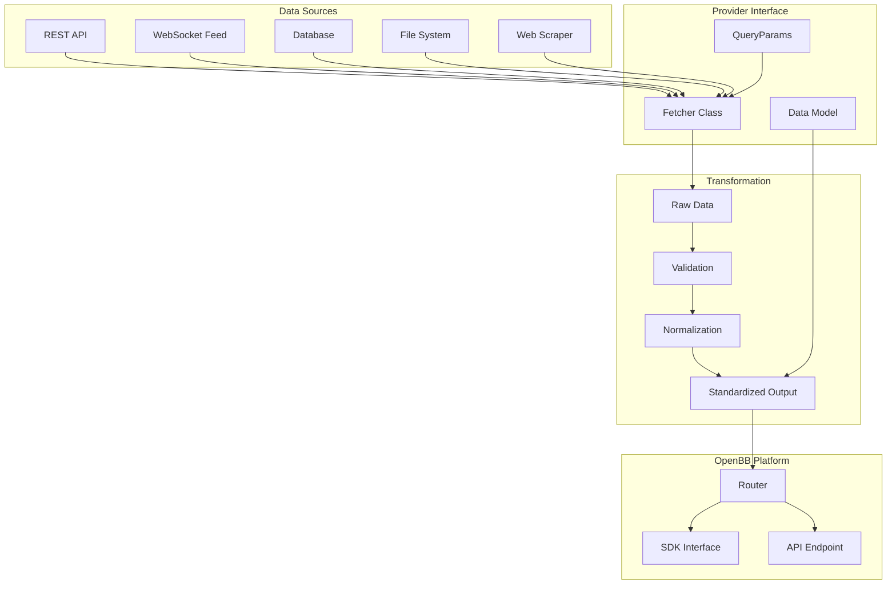
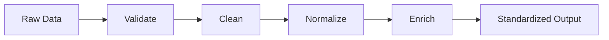

# Chapter 6: Custom Data Sources

This chapter covers building custom data providers for OpenBB, integrating with external APIs, creating data pipelines, and extending the platform with your own data sources. You'll learn how to plug any financial or alternative data feed into the OpenBB ecosystem.

## 🎯 What You'll Learn

- OpenBB provider architecture and extension system
- Building custom data providers from scratch
- Integrating with REST APIs, WebSockets, and databases
- Data transformation and standardization
- Automated research workflows with custom sources

## 📊 Provider Architecture

OpenBB uses a modular provider system that standardizes how data is fetched, transformed, and delivered:



### Provider Component Overview

| Component | Purpose | Example |
|:----------|:--------|:--------|
| **QueryParams** | Define input parameters | Symbol, date range, interval |
| **Data Model** | Define output schema | OHLCV fields, types, validation |
| **Fetcher** | Fetch and transform data | API call, parsing, mapping |
| **Router** | Register with OpenBB | Endpoint path, provider name |

## 🔧 Building a Custom Provider

### Provider Project Structure

```bash
openbb-custom-provider/
├── openbb_custom_provider/
│   ├── __init__.py
│   ├── models/
│   │   ├── __init__.py
│   │   ├── stock_quote.py
│   │   └── economic_data.py
│   ├── utils/
│   │   ├── __init__.py
│   │   └── helpers.py
│   └── provider.py
├── pyproject.toml
├── setup.py
└── tests/
    ├── __init__.py
    └── test_provider.py
```

### Defining Data Models

```python
"""Custom data models for the provider"""
from datetime import datetime
from typing import Optional, List
from pydantic import BaseModel, Field


class CustomStockQuoteQueryParams(BaseModel):
    """Query parameters for stock quote endpoint"""
    symbol: str = Field(description="Stock ticker symbol")
    source: Optional[str] = Field(
        default="primary",
        description="Data source to use"
    )


class CustomStockQuoteData(BaseModel):
    """Data model for stock quote response"""
    symbol: str = Field(description="Ticker symbol")
    last_price: float = Field(description="Last traded price")
    open_price: float = Field(description="Opening price")
    high_price: float = Field(description="High price")
    low_price: float = Field(description="Low price")
    volume: int = Field(description="Trading volume")
    change: float = Field(description="Price change")
    change_percent: float = Field(description="Price change percentage")
    timestamp: datetime = Field(description="Quote timestamp")
    market_cap: Optional[float] = Field(
        default=None, description="Market capitalization"
    )


class CustomEconomicDataQueryParams(BaseModel):
    """Query parameters for economic data"""
    indicator: str = Field(description="Economic indicator code")
    country: str = Field(default="US", description="Country code")
    start_date: Optional[str] = Field(default=None, description="Start date")
    end_date: Optional[str] = Field(default=None, description="End date")
    frequency: Optional[str] = Field(
        default="monthly",
        description="Data frequency: daily, weekly, monthly, quarterly"
    )


class CustomEconomicDataPoint(BaseModel):
    """Data model for a single economic data point"""
    date: datetime = Field(description="Observation date")
    value: float = Field(description="Indicator value")
    indicator: str = Field(description="Indicator name")
    country: str = Field(description="Country code")
    unit: Optional[str] = Field(default=None, description="Unit of measure")
```

### Implementing the Fetcher

```python
"""Custom data fetcher implementation"""
import requests
import pandas as pd
from typing import Any, Dict, List, Optional
from datetime import datetime


class CustomDataFetcher:
    """Fetch data from custom API sources"""

    BASE_URL = "https://api.example.com/v1"

    def __init__(self, api_key: str):
        self.api_key = api_key
        self.session = requests.Session()
        self.session.headers.update({
            "Authorization": f"Bearer {api_key}",
            "Content-Type": "application/json",
        })

    def fetch_stock_quote(
        self, params: "CustomStockQuoteQueryParams"
    ) -> List["CustomStockQuoteData"]:
        """Fetch stock quote data"""
        url = f"{self.BASE_URL}/quotes/{params.symbol}"

        response = self.session.get(url, timeout=30)
        response.raise_for_status()
        raw_data = response.json()

        # Transform API response to our data model
        return [
            CustomStockQuoteData(
                symbol=params.symbol,
                last_price=raw_data["price"],
                open_price=raw_data["open"],
                high_price=raw_data["dayHigh"],
                low_price=raw_data["dayLow"],
                volume=raw_data["volume"],
                change=raw_data["change"],
                change_percent=raw_data["changePercent"],
                timestamp=datetime.fromisoformat(raw_data["timestamp"]),
                market_cap=raw_data.get("marketCap"),
            )
        ]

    def fetch_economic_data(
        self, params: "CustomEconomicDataQueryParams"
    ) -> List["CustomEconomicDataPoint"]:
        """Fetch economic indicator data"""
        url = f"{self.BASE_URL}/economics/{params.indicator}"
        query_params = {
            "country": params.country,
            "frequency": params.frequency,
        }
        if params.start_date:
            query_params["start"] = params.start_date
        if params.end_date:
            query_params["end"] = params.end_date

        response = self.session.get(url, params=query_params, timeout=30)
        response.raise_for_status()
        raw_data = response.json()

        return [
            CustomEconomicDataPoint(
                date=datetime.fromisoformat(point["date"]),
                value=point["value"],
                indicator=params.indicator,
                country=params.country,
                unit=point.get("unit"),
            )
            for point in raw_data["observations"]
        ]
```

### Registering the Provider

```python
"""Register custom provider with OpenBB"""
from openbb_core.provider.abstract.provider import Provider
from openbb_custom_provider.models.stock_quote import (
    CustomStockQuoteFetcher,
)
from openbb_custom_provider.models.economic_data import (
    CustomEconomicDataFetcher,
)


custom_provider = Provider(
    name="custom_provider",
    website="https://api.example.com",
    description="Custom financial data provider",
    credentials=["api_key"],
    fetcher_dict={
        "StockQuote": CustomStockQuoteFetcher,
        "EconomicData": CustomEconomicDataFetcher,
    },
)
```

### Provider Configuration

```toml
# pyproject.toml
[project]
name = "openbb-custom-provider"
version = "1.0.0"
description = "Custom data provider for OpenBB Platform"
requires-python = ">=3.8"
dependencies = [
    "openbb-core>=1.0.0",
    "requests>=2.28.0",
    "pydantic>=2.0.0",
]

[project.entry-points."openbb_provider_extension"]
custom_provider = "openbb_custom_provider.provider:custom_provider"

[tool.setuptools.packages.find]
where = ["."]
include = ["openbb_custom_provider*"]
```

## 🌐 API Integration Patterns

### REST API Integration

```python
class RESTDataProvider:
    """Generic REST API data provider"""

    def __init__(self, base_url: str, api_key: str):
        self.base_url = base_url
        self.api_key = api_key
        self.session = requests.Session()

    def _make_request(
        self,
        endpoint: str,
        params: Optional[dict] = None,
        method: str = "GET"
    ) -> dict:
        """Make authenticated API request"""
        url = f"{self.base_url}/{endpoint}"
        headers = {"Authorization": f"Bearer {self.api_key}"}

        try:
            if method == "GET":
                response = self.session.get(
                    url, params=params, headers=headers, timeout=30
                )
            elif method == "POST":
                response = self.session.post(
                    url, json=params, headers=headers, timeout=30
                )
            else:
                raise ValueError(f"Unsupported method: {method}")

            response.raise_for_status()
            return response.json()

        except requests.exceptions.HTTPError as e:
            if e.response.status_code == 429:
                return self._handle_rate_limit(endpoint, params, method)
            raise

    def _handle_rate_limit(self, endpoint, params, method) -> dict:
        """Handle rate limit with exponential backoff"""
        import time
        for attempt in range(3):
            wait = 2 ** attempt
            time.sleep(wait)
            try:
                return self._make_request(endpoint, params, method)
            except requests.exceptions.HTTPError:
                continue
        raise Exception("Rate limit exceeded after retries")

    def get_historical_prices(
        self, symbol: str, start: str, end: str
    ) -> pd.DataFrame:
        """Fetch historical price data"""
        data = self._make_request(
            f"stocks/{symbol}/history",
            params={"start": start, "end": end}
        )

        df = pd.DataFrame(data["prices"])
        df['date'] = pd.to_datetime(df['date'])
        df = df.set_index('date').sort_index()

        # Standardize column names
        column_map = {
            "o": "open", "h": "high", "l": "low",
            "c": "close", "v": "volume"
        }
        df = df.rename(columns=column_map)
        return df
```

### WebSocket Integration for Real-Time Data

```python
import asyncio
import websockets
import json
from typing import Callable

class WebSocketDataFeed:
    """Real-time data feed via WebSocket"""

    def __init__(self, url: str, api_key: str):
        self.url = url
        self.api_key = api_key
        self.callbacks: Dict[str, List[Callable]] = {}
        self.running = False

    def subscribe(self, symbol: str, callback: Callable):
        """Subscribe to real-time updates for a symbol"""
        if symbol not in self.callbacks:
            self.callbacks[symbol] = []
        self.callbacks[symbol].append(callback)

    async def connect(self):
        """Establish WebSocket connection and process messages"""
        self.running = True

        async with websockets.connect(
            self.url,
            extra_headers={"Authorization": f"Bearer {self.api_key}"}
        ) as ws:
            # Subscribe to symbols
            for symbol in self.callbacks:
                await ws.send(json.dumps({
                    "action": "subscribe",
                    "symbol": symbol,
                }))

            # Process incoming messages
            while self.running:
                try:
                    message = await asyncio.wait_for(ws.recv(), timeout=30)
                    data = json.loads(message)
                    symbol = data.get("symbol")

                    if symbol in self.callbacks:
                        for callback in self.callbacks[symbol]:
                            callback(data)

                except asyncio.TimeoutError:
                    # Send heartbeat
                    await ws.send(json.dumps({"action": "ping"}))
                except websockets.exceptions.ConnectionClosed:
                    print("Connection closed, reconnecting...")
                    break

    def stop(self):
        """Stop the WebSocket feed"""
        self.running = False

# Usage
feed = WebSocketDataFeed(
    url="wss://stream.example.com/v1/realtime",
    api_key="your_api_key"
)

def on_quote(data):
    print(f"  {data['symbol']}: ${data['price']} ({data['change_pct']}%)")

feed.subscribe("AAPL", on_quote)
feed.subscribe("MSFT", on_quote)

# Run the feed
# asyncio.run(feed.connect())
```

### Database Integration

```python
import sqlite3
from contextlib import contextmanager

class DatabaseProvider:
    """Serve data from a local database"""

    def __init__(self, db_path: str):
        self.db_path = db_path
        self._initialize_db()

    def _initialize_db(self):
        """Create tables if they don't exist"""
        with self._connect() as conn:
            conn.execute("""
                CREATE TABLE IF NOT EXISTS price_history (
                    symbol TEXT NOT NULL,
                    date TEXT NOT NULL,
                    open REAL,
                    high REAL,
                    low REAL,
                    close REAL,
                    volume INTEGER,
                    PRIMARY KEY (symbol, date)
                )
            """)
            conn.execute("""
                CREATE TABLE IF NOT EXISTS fundamentals (
                    symbol TEXT NOT NULL,
                    period TEXT NOT NULL,
                    metric TEXT NOT NULL,
                    value REAL,
                    PRIMARY KEY (symbol, period, metric)
                )
            """)

    @contextmanager
    def _connect(self):
        """Database connection context manager"""
        conn = sqlite3.connect(self.db_path)
        try:
            yield conn
            conn.commit()
        finally:
            conn.close()

    def store_prices(self, symbol: str, df: pd.DataFrame):
        """Store price data in database"""
        with self._connect() as conn:
            for date, row in df.iterrows():
                conn.execute(
                    """INSERT OR REPLACE INTO price_history
                       (symbol, date, open, high, low, close, volume)
                       VALUES (?, ?, ?, ?, ?, ?, ?)""",
                    (symbol, str(date), row['open'], row['high'],
                     row['low'], row['close'], int(row['volume']))
                )

    def get_prices(
        self, symbol: str, start: str, end: str
    ) -> pd.DataFrame:
        """Retrieve price data from database"""
        with self._connect() as conn:
            df = pd.read_sql_query(
                """SELECT date, open, high, low, close, volume
                   FROM price_history
                   WHERE symbol = ? AND date BETWEEN ? AND ?
                   ORDER BY date""",
                conn,
                params=(symbol, start, end),
                parse_dates=['date'],
                index_col='date'
            )
        return df

    def sync_from_openbb(self, symbol: str, start: str, end: str):
        """Sync data from OpenBB to local database"""
        data = obb.equity.price.historical(
            symbol, start_date=start, end_date=end
        ).to_dataframe()

        self.store_prices(symbol, data)
        print(f"Synced {len(data)} records for {symbol}")

# Usage
db = DatabaseProvider("financial_data.db")

# Sync data from OpenBB
db.sync_from_openbb("AAPL", "2023-01-01", "2023-12-31")

# Query local data (fast, no API calls)
prices = db.get_prices("AAPL", "2023-06-01", "2023-12-31")
print(prices.head())
```

## 🔄 Data Transformation Pipeline



```python
class DataTransformPipeline:
    """Transform raw data into standardized format"""

    def __init__(self):
        self.steps = []

    def add_step(self, name: str, func):
        """Add a transformation step"""
        self.steps.append({"name": name, "func": func})
        return self

    def run(self, data: pd.DataFrame) -> pd.DataFrame:
        """Execute all transformation steps"""
        result = data.copy()
        for step in self.steps:
            print(f"  Running: {step['name']}")
            result = step['func'](result)
        return result


def validate_prices(df: pd.DataFrame) -> pd.DataFrame:
    """Validate price data integrity"""
    # Ensure OHLCV columns exist
    required = ['open', 'high', 'low', 'close', 'volume']
    missing = [col for col in required if col not in df.columns]
    if missing:
        raise ValueError(f"Missing columns: {missing}")

    # Validate price logic
    invalid = df[df['high'] < df['low']]
    if len(invalid) > 0:
        print(f"  Warning: {len(invalid)} rows with high < low")
        df.loc[invalid.index, 'high'] = df.loc[invalid.index, ['open', 'close']].max(axis=1)
        df.loc[invalid.index, 'low'] = df.loc[invalid.index, ['open', 'close']].min(axis=1)

    return df


def clean_missing(df: pd.DataFrame) -> pd.DataFrame:
    """Handle missing values"""
    # Forward fill price columns
    price_cols = ['open', 'high', 'low', 'close']
    df[price_cols] = df[price_cols].fillna(method='ffill')

    # Zero fill volume
    df['volume'] = df['volume'].fillna(0)

    return df.dropna(subset=['close'])


def normalize_columns(df: pd.DataFrame) -> pd.DataFrame:
    """Normalize column names and types"""
    column_map = {
        'Open': 'open', 'High': 'high', 'Low': 'low',
        'Close': 'close', 'Volume': 'volume',
        'Adj Close': 'adj_close', 'Date': 'date',
    }
    df = df.rename(columns=column_map)

    # Ensure correct types
    for col in ['open', 'high', 'low', 'close']:
        if col in df.columns:
            df[col] = pd.to_numeric(df[col], errors='coerce')

    if 'volume' in df.columns:
        df['volume'] = pd.to_numeric(df['volume'], errors='coerce').astype(int)

    return df


def enrich_data(df: pd.DataFrame) -> pd.DataFrame:
    """Add derived fields"""
    df['daily_return'] = df['close'].pct_change()
    df['log_return'] = np.log(df['close'] / df['close'].shift(1))
    df['typical_price'] = (df['high'] + df['low'] + df['close']) / 3
    df['true_range'] = pd.concat([
        df['high'] - df['low'],
        abs(df['high'] - df['close'].shift()),
        abs(df['low'] - df['close'].shift()),
    ], axis=1).max(axis=1)

    return df


# Usage
pipeline = DataTransformPipeline()
pipeline.add_step("Normalize columns", normalize_columns)
pipeline.add_step("Validate prices", validate_prices)
pipeline.add_step("Clean missing data", clean_missing)
pipeline.add_step("Enrich with derived fields", enrich_data)

# Fetch raw data and transform
raw_data = obb.equity.price.historical("AAPL", start_date="2023-01-01").to_dataframe()
clean_data = pipeline.run(raw_data)
print(f"\nTransformed data shape: {clean_data.shape}")
print(clean_data.tail())
```

## 🔌 Multi-Source Data Aggregator

```python
class MultiSourceAggregator:
    """Aggregate data from multiple sources with fallback"""

    def __init__(self):
        self.sources = {}
        self.priority_order = []

    def register_source(self, name: str, fetcher, priority: int = 0):
        """Register a data source"""
        self.sources[name] = {
            "fetcher": fetcher,
            "priority": priority,
            "available": True,
        }
        self.priority_order = sorted(
            self.sources.keys(),
            key=lambda x: self.sources[x]["priority"],
            reverse=True
        )

    def fetch_with_fallback(self, symbol: str, **kwargs) -> Optional[pd.DataFrame]:
        """Try each source in priority order until one succeeds"""
        errors = []

        for source_name in self.priority_order:
            source = self.sources[source_name]
            if not source["available"]:
                continue

            try:
                data = source["fetcher"](symbol, **kwargs)
                if data is not None and len(data) > 0:
                    print(f"  Data fetched from: {source_name}")
                    return data
            except Exception as e:
                errors.append(f"{source_name}: {e}")
                continue

        print(f"  All sources failed: {errors}")
        return None

    def fetch_and_merge(self, symbol: str, **kwargs) -> pd.DataFrame:
        """Fetch from all sources and merge (consensus data)"""
        all_data = {}

        for source_name in self.priority_order:
            source = self.sources[source_name]
            try:
                data = source["fetcher"](symbol, **kwargs)
                if data is not None:
                    all_data[source_name] = data
            except Exception:
                continue

        if not all_data:
            raise Exception("No data available from any source")

        # Use the highest priority source as base, fill gaps from others
        base_source = self.priority_order[0]
        result = all_data[base_source].copy()

        for source_name in self.priority_order[1:]:
            if source_name in all_data:
                # Fill missing values from lower priority sources
                result = result.fillna(all_data[source_name])

        return result

# Usage
aggregator = MultiSourceAggregator()

def fetch_from_polygon(symbol, **kwargs):
    return obb.equity.price.historical(
        symbol, provider="polygon", **kwargs
    ).to_dataframe()

def fetch_from_fmp(symbol, **kwargs):
    return obb.equity.price.historical(
        symbol, provider="fmp", **kwargs
    ).to_dataframe()

aggregator.register_source("polygon", fetch_from_polygon, priority=10)
aggregator.register_source("fmp", fetch_from_fmp, priority=5)

data = aggregator.fetch_with_fallback(
    "AAPL", start_date="2023-01-01", end_date="2023-12-31"
)
print(f"Aggregated data: {data.shape}")
```

## 🎯 Best Practices

### Custom Provider Guidelines

1. **Data Model Consistency**
   - Follow OpenBB's standard field naming conventions
   - Use Pydantic models for input/output validation
   - Document all fields with clear descriptions

2. **Error Handling**
   - Implement retry logic with exponential backoff
   - Provide meaningful error messages
   - Fall back to alternative sources when primary fails

3. **Performance**
   - Cache frequently requested data locally
   - Batch API requests when possible
   - Use connection pooling for database providers

4. **Testing**
   - Write unit tests for data transformations
   - Test with edge cases (missing data, API errors)
   - Validate output against known data points

### Provider Comparison

| Integration Type | Latency | Reliability | Complexity | Best For |
|:-----------------|:--------|:------------|:-----------|:---------|
| **REST API** | Medium | High | Low | Historical data |
| **WebSocket** | Very Low | Medium | High | Real-time feeds |
| **Database** | Very Low | Very High | Medium | Cached/local data |
| **File System** | Low | Very High | Low | Static datasets |
| **Web Scraper** | High | Low | High | Alternative data |

## 🏆 Achievement Unlocked!

Congratulations! You've mastered:

- ✅ OpenBB provider architecture and extension system
- ✅ Building custom data providers with Pydantic models
- ✅ REST API, WebSocket, and database integrations
- ✅ Data transformation and validation pipelines
- ✅ Multi-source aggregation with fallback logic

## 🚀 What's Next?

Ready to visualize your data? Let's explore [Chapter 7: Visualization & Dashboards](07-custom-extensions.md) to learn about creating charts, dashboards, and interactive reports.

---

**Practice what you've learned:**
1. Build a custom provider for a financial API you use
2. Create a WebSocket feed for real-time quote monitoring
3. Set up a local database cache for historical data
4. Build a data transformation pipeline with validation
5. Implement a multi-source aggregator with fallback logic

*Built with insights from the [OpenBB](https://github.com/OpenBB-finance/OpenBB) project.*
