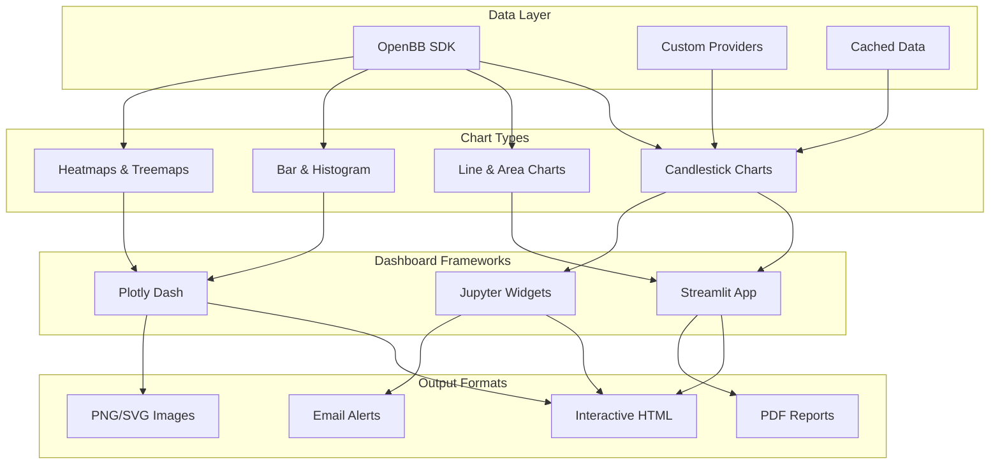

# Chapter 7: Visualization & Dashboards

Welcome to **Chapter 7: Visualization & Dashboards**. In this part of **OpenBB Tutorial: Complete Guide to Investment Research Platform**, you will build an intuitive mental model first, then move into concrete implementation details and practical production tradeoffs.


This chapter covers creating financial charts, interactive dashboards, and research reports with OpenBB. You'll learn how to build publication-quality visualizations, real-time monitoring dashboards, and automated report generation systems.

## 🎯 What You'll Learn

- Financial charting with Plotly and Matplotlib
- Interactive dashboards with Streamlit and Dash
- Automated report generation
- Real-time monitoring displays
- Custom chart templates and themes

## 📊 Visualization Architecture



## 📈 Financial Charting

### Candlestick Charts with Plotly

```python
import plotly.graph_objects as go
from plotly.subplots import make_subplots
import pandas as pd
import numpy as np
from openbb import obb


def create_candlestick_chart(
    symbol: str,
    start_date: str,
    end_date: str,
    indicators: list = None,
) -> go.Figure:
    """Create a professional candlestick chart with indicators"""

    # Fetch data
    data = obb.equity.price.historical(
        symbol, start_date=start_date, end_date=end_date
    ).to_dataframe()

    # Create subplots: price + volume
    fig = make_subplots(
        rows=2, cols=1,
        shared_xaxes=True,
        vertical_spacing=0.03,
        row_heights=[0.75, 0.25],
        subplot_titles=(f"{symbol} Price", "Volume"),
    )

    # Candlestick chart
    fig.add_trace(
        go.Candlestick(
            x=data.index,
            open=data['open'],
            high=data['high'],
            low=data['low'],
            close=data['close'],
            name="OHLC",
            increasing_line_color="#26a69a",
            decreasing_line_color="#ef5350",
        ),
        row=1, col=1,
    )

    # Add indicators
    if indicators and "sma_20" in indicators:
        sma_20 = data['close'].rolling(20).mean()
        fig.add_trace(
            go.Scatter(
                x=data.index, y=sma_20,
                name="SMA(20)",
                line=dict(color="#ff9800", width=1.5),
            ),
            row=1, col=1,
        )

    if indicators and "sma_50" in indicators:
        sma_50 = data['close'].rolling(50).mean()
        fig.add_trace(
            go.Scatter(
                x=data.index, y=sma_50,
                name="SMA(50)",
                line=dict(color="#2196f3", width=1.5),
            ),
            row=1, col=1,
        )

    if indicators and "bollinger" in indicators:
        bb_mid = data['close'].rolling(20).mean()
        bb_std = data['close'].rolling(20).std()
        bb_upper = bb_mid + 2 * bb_std
        bb_lower = bb_mid - 2 * bb_std

        fig.add_trace(
            go.Scatter(
                x=data.index, y=bb_upper, name="BB Upper",
                line=dict(color="rgba(128,128,128,0.5)", dash="dash"),
            ),
            row=1, col=1,
        )
        fig.add_trace(
            go.Scatter(
                x=data.index, y=bb_lower, name="BB Lower",
                line=dict(color="rgba(128,128,128,0.5)", dash="dash"),
                fill="tonexty",
                fillcolor="rgba(128,128,128,0.1)",
            ),
            row=1, col=1,
        )

    # Volume bars
    colors = [
        "#26a69a" if data['close'].iloc[i] >= data['open'].iloc[i]
        else "#ef5350"
        for i in range(len(data))
    ]
    fig.add_trace(
        go.Bar(
            x=data.index, y=data['volume'],
            name="Volume",
            marker_color=colors,
            opacity=0.7,
        ),
        row=2, col=1,
    )

    # Layout
    fig.update_layout(
        title=f"{symbol} - Technical Analysis Chart",
        template="plotly_dark",
        height=700,
        xaxis_rangeslider_visible=False,
        showlegend=True,
        legend=dict(x=0.01, y=0.99),
    )

    return fig

# Usage
chart = create_candlestick_chart(
    "AAPL", "2023-06-01", "2023-12-31",
    indicators=["sma_20", "sma_50", "bollinger"]
)
chart.show()
```

### Multi-Panel Technical Analysis Chart

```python
def create_technical_dashboard(
    symbol: str, start_date: str, end_date: str
) -> go.Figure:
    """Create a multi-panel technical analysis chart"""

    data = obb.equity.price.historical(
        symbol, start_date=start_date, end_date=end_date
    ).to_dataframe()

    # Calculate indicators
    data['sma_20'] = data['close'].rolling(20).mean()
    data['ema_12'] = data['close'].ewm(span=12).mean()
    data['ema_26'] = data['close'].ewm(span=26).mean()
    data['macd'] = data['ema_12'] - data['ema_26']
    data['macd_signal'] = data['macd'].ewm(span=9).mean()
    data['macd_hist'] = data['macd'] - data['macd_signal']

    # RSI
    delta = data['close'].diff()
    gain = delta.where(delta > 0, 0).rolling(14).mean()
    loss = (-delta.where(delta < 0, 0)).rolling(14).mean()
    rs = gain / loss
    data['rsi'] = 100 - (100 / (1 + rs))

    # Create 4-panel chart
    fig = make_subplots(
        rows=4, cols=1,
        shared_xaxes=True,
        vertical_spacing=0.02,
        row_heights=[0.45, 0.15, 0.20, 0.20],
        subplot_titles=("Price", "Volume", "MACD", "RSI"),
    )

    # Panel 1: Candlestick + Moving Averages
    fig.add_trace(
        go.Candlestick(
            x=data.index,
            open=data['open'], high=data['high'],
            low=data['low'], close=data['close'],
            name="OHLC",
        ),
        row=1, col=1,
    )
    fig.add_trace(
        go.Scatter(x=data.index, y=data['sma_20'], name="SMA(20)",
                   line=dict(color="#ff9800", width=1)),
        row=1, col=1,
    )

    # Panel 2: Volume
    fig.add_trace(
        go.Bar(x=data.index, y=data['volume'], name="Volume",
               marker_color="rgba(100,100,200,0.5)"),
        row=2, col=1,
    )

    # Panel 3: MACD
    macd_colors = [
        "#26a69a" if v >= 0 else "#ef5350"
        for v in data['macd_hist']
    ]
    fig.add_trace(
        go.Bar(x=data.index, y=data['macd_hist'], name="MACD Histogram",
               marker_color=macd_colors),
        row=3, col=1,
    )
    fig.add_trace(
        go.Scatter(x=data.index, y=data['macd'], name="MACD",
                   line=dict(color="#2196f3", width=1.5)),
        row=3, col=1,
    )
    fig.add_trace(
        go.Scatter(x=data.index, y=data['macd_signal'], name="Signal",
                   line=dict(color="#ff5722", width=1.5)),
        row=3, col=1,
    )

    # Panel 4: RSI
    fig.add_trace(
        go.Scatter(x=data.index, y=data['rsi'], name="RSI(14)",
                   line=dict(color="#9c27b0", width=1.5)),
        row=4, col=1,
    )
    fig.add_hline(y=70, line_dash="dash", line_color="red",
                  annotation_text="Overbought", row=4, col=1)
    fig.add_hline(y=30, line_dash="dash", line_color="green",
                  annotation_text="Oversold", row=4, col=1)

    fig.update_layout(
        title=f"{symbol} - Technical Analysis Dashboard",
        template="plotly_dark",
        height=900,
        xaxis_rangeslider_visible=False,
        showlegend=True,
    )

    return fig

# Usage
dashboard = create_technical_dashboard("AAPL", "2023-01-01", "2023-12-31")
dashboard.show()
```

## 📊 Portfolio Visualization

### Portfolio Allocation Charts

```python
class PortfolioVisualizer:
    """Visualize portfolio composition and performance"""

    def __init__(self, holdings: dict, returns: pd.DataFrame):
        self.holdings = holdings
        self.returns = returns

    def allocation_pie(self) -> go.Figure:
        """Create portfolio allocation pie chart"""
        labels = list(self.holdings.keys())
        values = list(self.holdings.values())

        fig = go.Figure(data=[
            go.Pie(
                labels=labels,
                values=values,
                hole=0.4,
                textinfo='label+percent',
                marker=dict(
                    colors=[
                        '#2196f3', '#4caf50', '#ff9800', '#9c27b0',
                        '#f44336', '#00bcd4', '#ffeb3b', '#795548',
                    ]
                ),
            )
        ])

        fig.update_layout(
            title="Portfolio Allocation",
            template="plotly_dark",
            height=500,
        )
        return fig

    def performance_chart(self, benchmark: pd.Series = None) -> go.Figure:
        """Create cumulative performance chart"""
        weights = np.array(list(self.holdings.values())) / 100
        portfolio_returns = self.returns.dot(weights)
        cumulative = (1 + portfolio_returns).cumprod() * 100

        fig = go.Figure()

        fig.add_trace(
            go.Scatter(
                x=cumulative.index, y=cumulative.values,
                name="Portfolio",
                line=dict(color="#2196f3", width=2),
                fill="tozeroy",
                fillcolor="rgba(33,150,243,0.1)",
            )
        )

        if benchmark is not None:
            bench_cum = (1 + benchmark).cumprod() * 100
            fig.add_trace(
                go.Scatter(
                    x=bench_cum.index, y=bench_cum.values,
                    name="Benchmark",
                    line=dict(color="#ff9800", width=2, dash="dash"),
                )
            )

        fig.update_layout(
            title="Cumulative Performance (Indexed to 100)",
            template="plotly_dark",
            height=500,
            yaxis_title="Value ($100 invested)",
            xaxis_title="Date",
        )
        return fig

    def drawdown_chart(self) -> go.Figure:
        """Visualize portfolio drawdowns"""
        weights = np.array(list(self.holdings.values())) / 100
        portfolio_returns = self.returns.dot(weights)
        cumulative = (1 + portfolio_returns).cumprod()
        peak = cumulative.expanding().max()
        drawdown = (cumulative - peak) / peak * 100

        fig = go.Figure()

        fig.add_trace(
            go.Scatter(
                x=drawdown.index, y=drawdown.values,
                name="Drawdown",
                line=dict(color="#f44336", width=1.5),
                fill="tozeroy",
                fillcolor="rgba(244,67,54,0.2)",
            )
        )

        fig.update_layout(
            title="Portfolio Drawdown",
            template="plotly_dark",
            height=400,
            yaxis_title="Drawdown (%)",
        )
        return fig

    def correlation_heatmap(self) -> go.Figure:
        """Create correlation heatmap of portfolio assets"""
        corr = self.returns.corr()

        fig = go.Figure(data=go.Heatmap(
            z=corr.values,
            x=corr.columns,
            y=corr.columns,
            colorscale="RdBu_r",
            zmid=0,
            text=corr.round(2).values,
            texttemplate="%{text}",
            textfont={"size": 12},
        ))

        fig.update_layout(
            title="Asset Correlation Matrix",
            template="plotly_dark",
            height=500,
            width=600,
        )
        return fig

# Usage
holdings = {
    "AAPL": 25, "MSFT": 20, "GOOGL": 15,
    "AMZN": 15, "NVDA": 10, "JPM": 8, "JNJ": 7,
}

# Fetch returns
returns = pd.DataFrame()
for symbol in holdings:
    data = obb.equity.price.historical(
        symbol, start_date="2023-01-01", end_date="2023-12-31"
    ).to_dataframe()
    returns[symbol] = data['close'].pct_change()
returns = returns.dropna()

viz = PortfolioVisualizer(holdings, returns)
viz.allocation_pie().show()
viz.performance_chart().show()
viz.drawdown_chart().show()
viz.correlation_heatmap().show()
```

## 🖥️ Interactive Dashboards

### Streamlit Dashboard

```python
"""
OpenBB Research Dashboard - streamlit_app.py
Run with: streamlit run streamlit_app.py
"""
import streamlit as st
import plotly.graph_objects as go
from plotly.subplots import make_subplots
import pandas as pd
import numpy as np
from openbb import obb
from datetime import datetime, timedelta


# Page configuration
st.set_page_config(
    page_title="OpenBB Research Dashboard",
    page_icon="📊",
    layout="wide",
)

st.title("📊 OpenBB Investment Research Dashboard")

# Sidebar controls
st.sidebar.header("Settings")

symbol = st.sidebar.text_input("Symbol", value="AAPL")
start_date = st.sidebar.date_input(
    "Start Date",
    value=datetime.now() - timedelta(days=365)
)
end_date = st.sidebar.date_input("End Date", value=datetime.now())
indicators = st.sidebar.multiselect(
    "Technical Indicators",
    ["SMA(20)", "SMA(50)", "EMA(12)", "Bollinger Bands", "VWAP"],
    default=["SMA(20)", "SMA(50)"]
)

# Fetch data
@st.cache_data(ttl=300)
def fetch_data(sym, start, end):
    data = obb.equity.price.historical(
        sym, start_date=str(start), end_date=str(end)
    ).to_dataframe()
    return data

try:
    data = fetch_data(symbol, start_date, end_date)
except Exception as e:
    st.error(f"Error fetching data: {e}")
    st.stop()

# Key metrics row
col1, col2, col3, col4, col5 = st.columns(5)

current_price = data['close'].iloc[-1]
prev_price = data['close'].iloc[-2]
change = current_price - prev_price
change_pct = (change / prev_price) * 100

col1.metric("Price", f"${current_price:.2f}", f"{change_pct:+.2f}%")
col2.metric("Volume", f"{data['volume'].iloc[-1]:,.0f}")
col3.metric("52W High", f"${data['high'].max():.2f}")
col4.metric("52W Low", f"${data['low'].min():.2f}")
col5.metric("Avg Volume", f"{data['volume'].mean():,.0f}")

# Main chart
st.subheader(f"{symbol} Price Chart")

fig = make_subplots(
    rows=2, cols=1, shared_xaxes=True,
    vertical_spacing=0.03, row_heights=[0.75, 0.25],
)

fig.add_trace(
    go.Candlestick(
        x=data.index, open=data['open'],
        high=data['high'], low=data['low'],
        close=data['close'], name="OHLC",
    ),
    row=1, col=1,
)

if "SMA(20)" in indicators:
    sma20 = data['close'].rolling(20).mean()
    fig.add_trace(
        go.Scatter(x=data.index, y=sma20, name="SMA(20)",
                   line=dict(color="#ff9800", width=1)),
        row=1, col=1,
    )

if "SMA(50)" in indicators:
    sma50 = data['close'].rolling(50).mean()
    fig.add_trace(
        go.Scatter(x=data.index, y=sma50, name="SMA(50)",
                   line=dict(color="#2196f3", width=1)),
        row=1, col=1,
    )

fig.add_trace(
    go.Bar(x=data.index, y=data['volume'], name="Volume",
           marker_color="rgba(100,100,200,0.5)"),
    row=2, col=1,
)

fig.update_layout(
    template="plotly_dark", height=600,
    xaxis_rangeslider_visible=False,
)
st.plotly_chart(fig, use_container_width=True)

# Analysis columns
left_col, right_col = st.columns(2)

with left_col:
    st.subheader("Performance Summary")
    returns = data['close'].pct_change()
    metrics = {
        "Daily Return (avg)": f"{returns.mean() * 100:.3f}%",
        "Daily Volatility": f"{returns.std() * 100:.3f}%",
        "Annual Return": f"{returns.mean() * 252 * 100:.2f}%",
        "Annual Volatility": f"{returns.std() * np.sqrt(252) * 100:.2f}%",
        "Sharpe Ratio": f"{(returns.mean() * 252) / (returns.std() * np.sqrt(252)):.3f}",
        "Max Drawdown": f"{((data['close'] / data['close'].expanding().max()) - 1).min() * 100:.2f}%",
    }
    for key, value in metrics.items():
        st.write(f"**{key}:** {value}")

with right_col:
    st.subheader("Return Distribution")
    fig_hist = go.Figure(data=[
        go.Histogram(
            x=returns.dropna() * 100,
            nbinsx=50,
            marker_color="#2196f3",
            name="Daily Returns",
        )
    ])
    fig_hist.update_layout(
        template="plotly_dark", height=300,
        xaxis_title="Return (%)", yaxis_title="Count",
    )
    st.plotly_chart(fig_hist, use_container_width=True)
```

### Plotly Dash Application

```python
"""
OpenBB Dash Dashboard - dash_app.py
Run with: python dash_app.py
"""
import dash
from dash import dcc, html, Input, Output, callback
import plotly.graph_objects as go
import pandas as pd
from openbb import obb

app = dash.Dash(__name__, title="OpenBB Dashboard")

app.layout = html.Div([
    html.H1("OpenBB Financial Dashboard", style={"textAlign": "center"}),

    html.Div([
        html.Div([
            html.Label("Symbol:"),
            dcc.Input(id="symbol-input", value="AAPL", type="text"),
        ], style={"display": "inline-block", "marginRight": "20px"}),

        html.Div([
            html.Label("Period:"),
            dcc.Dropdown(
                id="period-dropdown",
                options=[
                    {"label": "1 Month", "value": "1M"},
                    {"label": "3 Months", "value": "3M"},
                    {"label": "6 Months", "value": "6M"},
                    {"label": "1 Year", "value": "1Y"},
                ],
                value="6M",
                style={"width": "200px"},
            ),
        ], style={"display": "inline-block", "marginRight": "20px"}),

        html.Div([
            html.Label("Chart Type:"),
            dcc.RadioItems(
                id="chart-type",
                options=[
                    {"label": "Candlestick", "value": "candle"},
                    {"label": "Line", "value": "line"},
                    {"label": "Area", "value": "area"},
                ],
                value="candle",
                inline=True,
            ),
        ], style={"display": "inline-block"}),
    ], style={"padding": "20px", "textAlign": "center"}),

    # Main chart
    dcc.Graph(id="main-chart", style={"height": "500px"}),

    # Additional panels
    html.Div([
        dcc.Graph(id="volume-chart", style={"width": "50%", "display": "inline-block"}),
        dcc.Graph(id="returns-chart", style={"width": "50%", "display": "inline-block"}),
    ]),
])

@callback(
    [Output("main-chart", "figure"),
     Output("volume-chart", "figure"),
     Output("returns-chart", "figure")],
    [Input("symbol-input", "value"),
     Input("period-dropdown", "value"),
     Input("chart-type", "value")],
)
def update_charts(symbol, period, chart_type):
    """Update all charts based on inputs"""
    from datetime import datetime, timedelta

    period_map = {"1M": 30, "3M": 90, "6M": 180, "1Y": 365}
    days = period_map.get(period, 180)
    end = datetime.now()
    start = end - timedelta(days=days)

    data = obb.equity.price.historical(
        symbol, start_date=str(start.date()), end_date=str(end.date())
    ).to_dataframe()

    # Main chart
    main_fig = go.Figure()
    if chart_type == "candle":
        main_fig.add_trace(go.Candlestick(
            x=data.index, open=data['open'],
            high=data['high'], low=data['low'],
            close=data['close'], name=symbol,
        ))
    elif chart_type == "line":
        main_fig.add_trace(go.Scatter(
            x=data.index, y=data['close'], name=symbol,
            line=dict(color="#2196f3", width=2),
        ))
    else:
        main_fig.add_trace(go.Scatter(
            x=data.index, y=data['close'], name=symbol,
            fill="tozeroy", fillcolor="rgba(33,150,243,0.2)",
            line=dict(color="#2196f3", width=2),
        ))
    main_fig.update_layout(
        title=f"{symbol} Price",
        template="plotly_dark",
        xaxis_rangeslider_visible=False,
    )

    # Volume chart
    vol_fig = go.Figure(data=[
        go.Bar(x=data.index, y=data['volume'],
               marker_color="rgba(100,100,200,0.7)")
    ])
    vol_fig.update_layout(title="Volume", template="plotly_dark")

    # Returns distribution
    returns = data['close'].pct_change().dropna() * 100
    ret_fig = go.Figure(data=[
        go.Histogram(x=returns, nbinsx=50, marker_color="#4caf50")
    ])
    ret_fig.update_layout(
        title="Return Distribution (%)",
        template="plotly_dark",
    )

    return main_fig, vol_fig, ret_fig

if __name__ == "__main__":
    app.run(debug=True, port=8050)
```

## 📄 Automated Report Generation

### PDF Report Builder

```python
from datetime import datetime
import io

class ResearchReportGenerator:
    """Generate automated research reports"""

    def __init__(self, symbol: str):
        self.symbol = symbol
        self.data = {}
        self.charts = []

    def gather_data(self, start_date: str, end_date: str):
        """Gather all data needed for the report"""
        self.data['prices'] = obb.equity.price.historical(
            self.symbol, start_date=start_date, end_date=end_date
        ).to_dataframe()

        try:
            self.data['profile'] = obb.equity.profile(
                self.symbol
            ).to_dataframe().iloc[0]
        except Exception:
            self.data['profile'] = {}

        try:
            self.data['ratios'] = obb.equity.fundamental.ratios(
                self.symbol
            ).to_dataframe().iloc[0]
        except Exception:
            self.data['ratios'] = {}

        return self

    def build_price_chart(self) -> go.Figure:
        """Build price chart for the report"""
        df = self.data['prices']

        fig = make_subplots(
            rows=2, cols=1, shared_xaxes=True,
            row_heights=[0.7, 0.3], vertical_spacing=0.05,
        )

        fig.add_trace(
            go.Candlestick(
                x=df.index, open=df['open'], high=df['high'],
                low=df['low'], close=df['close'], name="OHLC",
            ),
            row=1, col=1,
        )

        sma20 = df['close'].rolling(20).mean()
        sma50 = df['close'].rolling(50).mean()
        fig.add_trace(
            go.Scatter(x=df.index, y=sma20, name="SMA(20)",
                       line=dict(color="#ff9800", width=1)),
            row=1, col=1,
        )
        fig.add_trace(
            go.Scatter(x=df.index, y=sma50, name="SMA(50)",
                       line=dict(color="#2196f3", width=1)),
            row=1, col=1,
        )

        fig.add_trace(
            go.Bar(x=df.index, y=df['volume'], name="Volume",
                   marker_color="rgba(100,100,200,0.5)"),
            row=2, col=1,
        )

        fig.update_layout(
            title=f"{self.symbol} - Price Analysis",
            template="plotly_white",
            height=600,
            xaxis_rangeslider_visible=False,
        )

        self.charts.append(fig)
        return fig

    def build_performance_summary(self) -> dict:
        """Build performance summary section"""
        df = self.data['prices']
        returns = df['close'].pct_change()

        return {
            "period_return": f"{((df['close'].iloc[-1] / df['close'].iloc[0]) - 1) * 100:.2f}%",
            "annualized_return": f"{returns.mean() * 252 * 100:.2f}%",
            "volatility": f"{returns.std() * np.sqrt(252) * 100:.2f}%",
            "sharpe_ratio": f"{(returns.mean() * 252) / (returns.std() * np.sqrt(252)):.3f}",
            "max_drawdown": f"{((df['close'] / df['close'].expanding().max()) - 1).min() * 100:.2f}%",
            "high": f"${df['high'].max():.2f}",
            "low": f"${df['low'].min():.2f}",
            "avg_volume": f"{df['volume'].mean():,.0f}",
        }

    def generate_html_report(self) -> str:
        """Generate complete HTML report"""
        self.build_price_chart()
        performance = self.build_performance_summary()
        profile = self.data.get('profile', {})

        report_date = datetime.now().strftime("%Y-%m-%d %H:%M")

        html = f"""
        <!DOCTYPE html>
        <html>
        <head>
            <title>{self.symbol} Research Report</title>
            <style>
                body {{ font-family: Arial, sans-serif; margin: 40px; color: #333; }}
                h1 {{ color: #1a237e; border-bottom: 2px solid #1a237e; }}
                h2 {{ color: #283593; margin-top: 30px; }}
                .metric-grid {{ display: grid; grid-template-columns: repeat(4, 1fr); gap: 15px; }}
                .metric-card {{
                    background: #f5f5f5; border-radius: 8px;
                    padding: 15px; text-align: center;
                }}
                .metric-value {{ font-size: 24px; font-weight: bold; color: #1a237e; }}
                .metric-label {{ font-size: 12px; color: #666; }}
                table {{ border-collapse: collapse; width: 100%; margin: 20px 0; }}
                th, td {{ border: 1px solid #ddd; padding: 8px; text-align: left; }}
                th {{ background-color: #1a237e; color: white; }}
                .footer {{ margin-top: 40px; font-size: 11px; color: #999; }}
            </style>
        </head>
        <body>
            <h1>{self.symbol} - Investment Research Report</h1>
            <p><strong>Report Date:</strong> {report_date}</p>

            <h2>Performance Summary</h2>
            <div class="metric-grid">
        """

        for label, value in performance.items():
            clean_label = label.replace("_", " ").title()
            html += f"""
                <div class="metric-card">
                    <div class="metric-value">{value}</div>
                    <div class="metric-label">{clean_label}</div>
                </div>
            """

        html += """
            </div>

            <h2>Price Chart</h2>
            <div id="chart"></div>

            <div class="footer">
                <p>Generated by OpenBB Research Platform</p>
                <p>Disclaimer: This report is for informational purposes only
                and does not constitute investment advice.</p>
            </div>
        </body>
        </html>
        """

        return html

    def save_report(self, filepath: str = None):
        """Save report to file"""
        if filepath is None:
            filepath = f"{self.symbol}_report_{datetime.now().strftime('%Y%m%d')}.html"

        html = self.generate_html_report()
        with open(filepath, 'w') as f:
            f.write(html)
        print(f"Report saved: {filepath}")

# Usage
report = ResearchReportGenerator("AAPL")
report.gather_data("2023-01-01", "2023-12-31")
report.save_report()
```

## 📊 Chart Template Library

### Reusable Chart Templates

| Template | Use Case | Components |
|:---------|:---------|:-----------|
| **Technical Analysis** | Trading decisions | Candlestick, volume, indicators |
| **Portfolio Overview** | Allocation review | Pie chart, performance, drawdown |
| **Sector Heatmap** | Market breadth | Treemap, color-coded returns |
| **Correlation Matrix** | Diversification | Heatmap, clustering |
| **Risk Dashboard** | Risk monitoring | VaR chart, distribution, drawdown |

```python
class ChartTemplates:
    """Reusable chart templates for financial visualization"""

    @staticmethod
    def sector_treemap(sector_data: dict) -> go.Figure:
        """Create sector performance treemap"""
        labels = list(sector_data.keys())
        values = [abs(v) for v in sector_data.values()]
        changes = list(sector_data.values())

        colors = [
            "#26a69a" if c >= 0 else "#ef5350"
            for c in changes
        ]

        fig = go.Figure(go.Treemap(
            labels=[f"{l}<br>{c:+.2f}%" for l, c in zip(labels, changes)],
            parents=[""] * len(labels),
            values=values,
            marker=dict(colors=colors),
            textinfo="label",
        ))

        fig.update_layout(
            title="Sector Performance",
            template="plotly_dark",
            height=500,
        )
        return fig

    @staticmethod
    def risk_gauge(var_95: float, portfolio_value: float) -> go.Figure:
        """Create risk gauge chart"""
        var_amount = portfolio_value * (var_95 / 100)

        fig = go.Figure(go.Indicator(
            mode="gauge+number+delta",
            value=var_95,
            title={"text": f"Value at Risk (95%)<br>${var_amount:,.0f}"},
            delta={"reference": 2.0},
            gauge={
                "axis": {"range": [0, 5]},
                "bar": {"color": "#2196f3"},
                "steps": [
                    {"range": [0, 1.5], "color": "#4caf50"},
                    {"range": [1.5, 3.0], "color": "#ff9800"},
                    {"range": [3.0, 5.0], "color": "#f44336"},
                ],
                "threshold": {
                    "line": {"color": "red", "width": 4},
                    "thickness": 0.75,
                    "value": var_95,
                },
            },
        ))

        fig.update_layout(template="plotly_dark", height=350)
        return fig

# Usage
sector_perf = {
    "Technology": 2.3, "Healthcare": -0.8, "Financials": 1.5,
    "Energy": -1.2, "Consumer": 0.9, "Industrial": 0.4,
    "Utilities": -0.3, "Real Estate": -1.5,
}
ChartTemplates.sector_treemap(sector_perf).show()
ChartTemplates.risk_gauge(2.1, 1000000).show()
```

## 🎯 Best Practices

### Visualization Guidelines

1. **Clarity First**
   - Remove chart junk and unnecessary decorations
   - Use clear axis labels and titles
   - Choose appropriate chart types for the data

2. **Color Usage**
   - Green for positive, red for negative (financial convention)
   - Use color-blind friendly palettes for accessibility
   - Consistent color coding across related charts

3. **Interactivity**
   - Add hover tooltips with detailed information
   - Enable zoom and pan for time series
   - Include date range selectors for long datasets

4. **Performance**
   - Cache data to avoid redundant API calls
   - Use WebGL rendering for large datasets
   - Downsample data for overview charts

5. **Responsiveness**
   - Design for different screen sizes
   - Use relative sizing for chart dimensions
   - Test on both desktop and mobile viewports

## 🏆 Achievement Unlocked!

Congratulations! You've mastered:

- ✅ Professional candlestick and technical charts with Plotly
- ✅ Multi-panel technical analysis dashboards
- ✅ Portfolio visualization (allocation, performance, drawdowns)
- ✅ Interactive Streamlit and Dash dashboards
- ✅ Automated HTML research report generation
- ✅ Reusable chart template library

## 🚀 What's Next?

Ready to deploy to production? Let's explore [Chapter 8: Production Deployment](08-enterprise-deployment.md) to learn about API deployment, scheduling, automation, and enterprise patterns.

---

**Practice what you've learned:**
1. Build a candlestick chart with Bollinger Bands for your portfolio
2. Create a Streamlit dashboard for real-time stock monitoring
3. Generate an automated research report for a watchlist
4. Build a portfolio allocation visualization with drill-down
5. Design a sector heatmap for daily market overview

*Built with insights from the [OpenBB](https://github.com/OpenBB-finance/OpenBB) project.*

## What Problem Does This Solve?

Most teams struggle here because the hard part is not writing more code, but deciding clear boundaries for `self`, `close`, `symbol` so behavior stays predictable as complexity grows.

In practical terms, this chapter helps you avoid three common failures:

- coupling core logic too tightly to one implementation path
- missing the handoff boundaries between setup, execution, and validation
- shipping changes without clear rollback or observability strategy

After working through this chapter, you should be able to reason about `Chapter 7: Visualization & Dashboards` as an operating subsystem inside **OpenBB Tutorial: Complete Guide to Investment Research Platform**, with explicit contracts for inputs, state transitions, and outputs.

Use the implementation notes around `color`, `returns`, `index` as your checklist when adapting these patterns to your own repository.

## How it Works Under the Hood

Under the hood, `Chapter 7: Visualization & Dashboards` usually follows a repeatable control path:

1. **Context bootstrap**: initialize runtime config and prerequisites for `self`.
2. **Input normalization**: shape incoming data so `close` receives stable contracts.
3. **Core execution**: run the main logic branch and propagate intermediate state through `symbol`.
4. **Policy and safety checks**: enforce limits, auth scopes, and failure boundaries.
5. **Output composition**: return canonical result payloads for downstream consumers.
6. **Operational telemetry**: emit logs/metrics needed for debugging and performance tuning.

When debugging, walk this sequence in order and confirm each stage has explicit success/failure conditions.

## Source Walkthrough

Use the following upstream sources to verify implementation details while reading this chapter:

- [GitHub Repository](https://github.com/OpenBB-finance/OpenBB)
  Why it matters: authoritative reference on `GitHub Repository` (github.com).
- [Extension Marketplace](https://github.com/OpenBB-finance/OpenBB/tree/develop/openbb_platform/extensions)
  Why it matters: authoritative reference on `Extension Marketplace` (github.com).
- [AI Codebase Knowledge Builder](https://github.com/johnxie/awesome-code-docs)
  Why it matters: authoritative reference on `AI Codebase Knowledge Builder` (github.com).

Suggested trace strategy:
- search upstream code for `self` and `close` to map concrete implementation paths
- compare docs claims against actual runtime/config code before reusing patterns in production

## Chapter Connections

- [Tutorial Index](index.md)
- [Previous Chapter: Chapter 6: Custom Data Sources](06-research-automation.md)
- [Next Chapter: Chapter 8: Production Deployment](08-enterprise-deployment.md)
- [Main Catalog](../../README.md#-tutorial-catalog)
- [A-Z Tutorial Directory](../../discoverability/tutorial-directory.md)
