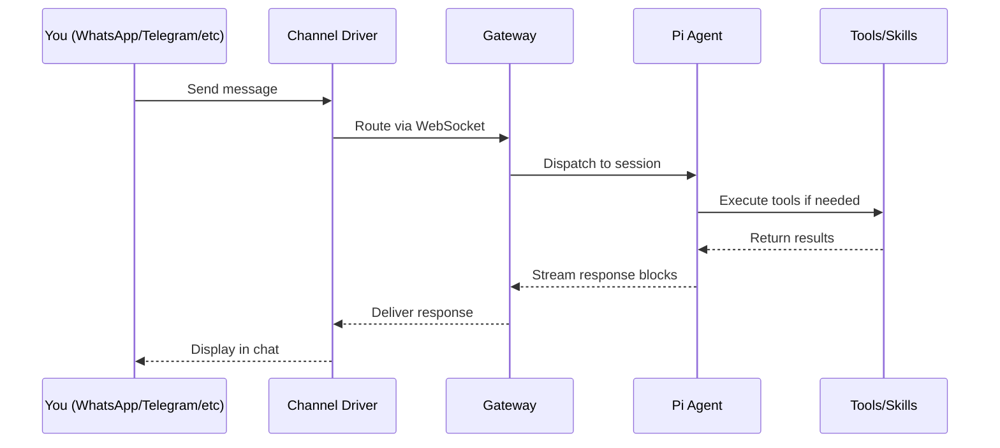

# Chapter 1: Getting Started with OpenClaw

## Introduction

OpenClaw is a self-hosted personal AI assistant that meets you where you already communicate — WhatsApp, Telegram, Slack, Discord, iMessage, and more. Rather than switching to a new AI app, OpenClaw plugs into your existing messaging channels and provides persistent memory, task automation, browser control, and a rich skills platform — all running on your own hardware.

This chapter covers installation, configuration, and getting your first conversation running.

## System Requirements

| Requirement | Minimum | Recommended |
|-------------|---------|-------------|
| **Node.js** | 22.x | Latest LTS |
| **RAM** | 2 GB | 8 GB+ |
| **Storage** | 500 MB | 2 GB+ (with browser) |
| **OS** | macOS 13+, Ubuntu 22.04+, Windows 11 (WSL2) | macOS 14+ |
| **Network** | Internet for API calls | Tailscale for remote access |

## Installation

### Quick Install (npm)

The fastest path to a running OpenClaw instance:

```bash
# Install globally
npm install -g openclaw@latest

# Verify installation
openclaw --version
```

### Development Install (from source)

For contributing or deep customization:

```bash
# Clone the repository
git clone https://github.com/openclaw/openclaw.git
cd openclaw

# Install dependencies (pnpm monorepo)
pnpm install

# Build all packages
pnpm build

# Start in development mode
pnpm dev
```

### Docker Install

For isolated, reproducible deployments:

```bash
# Pull the official image
docker pull openclaw/openclaw:latest

# Run with environment variables
docker run -d \
  --name openclaw \
  -p 18789:18789 \
  -v openclaw-data:/data \
  -e ANTHROPIC_API_KEY=sk-ant-... \
  openclaw/openclaw:latest
```

## Architecture at a Glance

Before configuring, it helps to understand how the pieces fit:



The **Gateway** is the central hub — a local WebSocket server at `ws://127.0.0.1:18789`. Every channel driver connects to it, and the Pi Agent runtime processes messages through it.

## Initial Configuration

### The Setup Wizard

On first launch, OpenClaw runs an interactive setup wizard:

```bash
openclaw setup
```

This walks you through:

1. **API Key Configuration** — Enter your Anthropic or OpenAI key
2. **Channel Selection** — Choose which messaging platforms to connect
3. **Identity Setup** — Set your assistant's name and personality
4. **Security Mode** — Configure pairing for unknown senders

### Manual Configuration

Configuration lives in `~/.openclaw/config.yaml` (or the `OPENCLAW_CONFIG` environment variable):

```yaml
# ~/.openclaw/config.yaml

# AI Provider Configuration
providers:
  anthropic:
    api_key: "sk-ant-..."
    model: "claude-sonnet-4-20250514"
    max_tokens: 8192
  openai:
    api_key: "sk-..."
    model: "gpt-4o"
    # Failover: use OpenAI if Anthropic is down
    failover: true

# Agent Identity
agent:
  name: "Claw"
  personality: "helpful, concise, proactive"
  timezone: "America/New_York"

# Memory Configuration
memory:
  persistence: true
  storage_path: "~/.openclaw/memory"
  max_context_tokens: 128000
  prune_after_days: 90

# Gateway Settings
gateway:
  host: "127.0.0.1"
  port: 18789
  expose_via_tailscale: false
```

### Environment Variables

All configuration can also be set via environment variables:

```bash
export ANTHROPIC_API_KEY="sk-ant-..."
export OPENAI_API_KEY="sk-..."
export OPENCLAW_PORT=18789
export OPENCLAW_AGENT_NAME="Claw"
export OPENCLAW_MEMORY_PATH="~/.openclaw/memory"
```

## Connecting Your First Channel

### WhatsApp (Most Popular)

WhatsApp uses the Baileys library for the Web API connection:

```bash
# Start OpenClaw with WhatsApp channel
openclaw start --channel whatsapp
```

On first run, a QR code appears in your terminal. Scan it with your phone's WhatsApp (Linked Devices > Link a Device). Once paired, messages sent to your WhatsApp number route through OpenClaw.

```
┌──────────────────────────┐
│  ▄▄▄▄▄ █▀█ █▄▀▄  ▄▄▄▄▄  │
│  █   █ █▄▀▄█ █▀█ █   █  │
│  █▄▄▄█ █ █▄▀▄▀▄█ █▄▄▄█  │
│  ▄▄▄▄▄▄▄█ █ █▄█▄▄▄▄▄▄▄  │
│  Scan with WhatsApp       │
│  Linked Devices > Link    │
└──────────────────────────┘
```

### Telegram

Telegram uses the grammY framework with a Bot Token:

```bash
# Create a bot via @BotFather on Telegram
# Then configure the token:
openclaw channel add telegram --token "123456:ABC-DEF..."

# Start with Telegram enabled
openclaw start --channel telegram
```

### Slack

Slack uses the Bolt framework and requires a Slack App:

```bash
# After creating a Slack App at api.slack.com:
openclaw channel add slack \
  --bot-token "xoxb-..." \
  --app-token "xapp-..." \
  --signing-secret "..."

openclaw start --channel slack
```

### Discord

Discord uses discord.js with a Bot Token:

```bash
# After creating a Discord Application at discord.dev:
openclaw channel add discord --token "..."

openclaw start --channel discord
```

### Multiple Channels Simultaneously

OpenClaw can connect to all channels at once:

```bash
openclaw start --channel whatsapp,telegram,slack,discord
```

Or specify in config:

```yaml
channels:
  whatsapp:
    enabled: true
  telegram:
    enabled: true
    token: "123456:ABC-DEF..."
  slack:
    enabled: true
    bot_token: "xoxb-..."
  discord:
    enabled: true
    token: "..."
```

## First Conversation

Once connected, test your setup by sending a message through your chosen channel:

```
You: Hello! Are you working?

Claw: Yes, I'm running and connected to your WhatsApp.
      I can help with tasks, answer questions, browse the
      web, manage your calendar, and more. What would you
      like to do?
```

### Testing Tool Capabilities

Try some built-in capabilities:

```
You: What time is it in Tokyo?

Claw: It's currently 2:34 AM JST (Japan Standard Time)
      on Thursday, January 30, 2026.

You: Search for the latest news about TypeScript 6.0

Claw: [Browses the web and returns relevant results]

You: Remind me to review the PR tomorrow at 10am

Claw: ✓ Reminder set for tomorrow (Jan 31) at 10:00 AM EST:
      "Review the PR"
```

## Project Structure

Understanding the monorepo layout helps navigate the codebase:

```
openclaw/
├── src/                     # Core source code
│   ├── gateway/             # WebSocket control plane
│   ├── agents/              # Pi Agent runtime
│   ├── channels/            # Channel drivers
│   │   ├── whatsapp/        # Baileys-based WhatsApp
│   │   ├── telegram/        # grammY-based Telegram
│   │   ├── slack/           # Bolt-based Slack
│   │   ├── discord/         # discord.js-based Discord
│   │   ├── signal/          # Signal integration
│   │   ├── imessage/        # iMessage bridge
│   │   └── web/             # WebChat interface
│   ├── memory/              # Persistent memory system
│   ├── browser/             # Chrome CDP integration
│   ├── canvas-host/         # Live Canvas rendering
│   ├── security/            # Pairing, sandboxing
│   ├── sessions/            # Session management
│   ├── providers/           # AI model providers
│   ├── cron/                # Scheduled automation
│   ├── tts/                 # Text-to-speech
│   ├── media/               # Media processing
│   └── cli/                 # CLI interface
├── apps/                    # Native companion apps
│   ├── macos/               # Swift menu bar app
│   ├── ios/                 # Swift iOS app
│   └── android/             # Kotlin Android app
├── skills/                  # 50+ bundled skills
│   ├── github/
│   ├── notion/
│   ├── obsidian/
│   ├── spotify/
│   └── ...
├── packages/                # Shared packages
├── extensions/              # Extension modules
├── docker-compose.yml       # Docker deployment
└── pnpm-workspace.yaml      # Monorepo config
```

## CLI Commands Reference

| Command | Description |
|---------|-------------|
| `openclaw setup` | Run the interactive setup wizard |
| `openclaw start` | Start the assistant with configured channels |
| `openclaw start --channel <name>` | Start with specific channel(s) |
| `openclaw channel add <type>` | Add a new channel connection |
| `openclaw channel list` | List configured channels |
| `openclaw channel remove <name>` | Remove a channel |
| `openclaw skill list` | List available skills |
| `openclaw skill enable <name>` | Enable a specific skill |
| `openclaw config set <key> <value>` | Update configuration |
| `openclaw status` | Show running status and connections |
| `openclaw logs` | Stream live logs |
| `openclaw stop` | Gracefully stop the assistant |

## Troubleshooting Common Issues

### WhatsApp Connection Drops

```bash
# Check connection status
openclaw status --channel whatsapp

# Force re-pair (generates new QR code)
openclaw channel repair whatsapp
```

### API Key Issues

```bash
# Verify API key is valid
openclaw config verify

# Test with a specific provider
openclaw test --provider anthropic
```

### Port Conflicts

```bash
# Check if port 18789 is in use
lsof -i :18789

# Use a different port
openclaw start --port 18790
```

### Memory/Performance

```bash
# Check memory usage
openclaw status --verbose

# Clear old sessions
openclaw memory prune --older-than 30d
```

## Summary

| Concept | Key Takeaway |
|---------|-------------|
| **Installation** | `npm install -g openclaw@latest` for quick start; Docker for production |
| **Architecture** | Gateway-centric: channels → WebSocket → agent → tools |
| **Configuration** | `~/.openclaw/config.yaml` or environment variables |
| **Channels** | 14+ supported; WhatsApp, Telegram, Slack, Discord most popular |
| **Multi-Channel** | Run all channels simultaneously from one instance |
| **CLI** | Full command set for setup, channel management, and monitoring |

---

**Next Steps**: [Chapter 2: Gateway Architecture](02-gateway-architecture.md) — Dive into the WebSocket control plane that coordinates all of OpenClaw's components.

---

*Built with insights from the [OpenClaw repository](https://github.com/openclaw/openclaw) and community documentation.*
