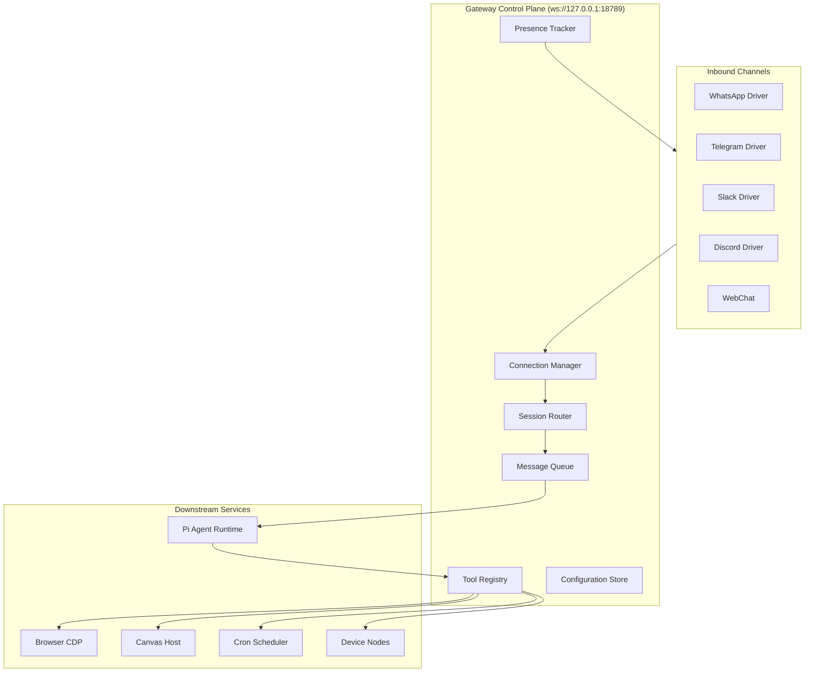
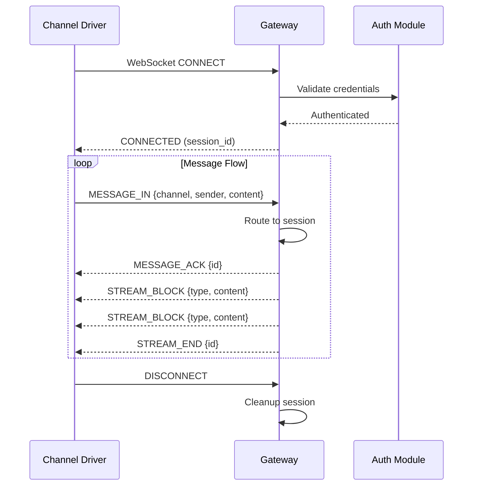

# Chapter 2: Gateway Architecture

Welcome to **Chapter 2: Gateway Architecture**. In this part of **OpenClaw: Deep Dive Tutorial**, you will build an intuitive mental model first, then move into concrete implementation details and practical production tradeoffs.


## Introduction

The Gateway is OpenClaw's central nervous system — a local WebSocket server that acts as the control plane for every component. All channel drivers, the agent runtime, tools, and device nodes communicate through the Gateway. Understanding this architecture is essential for debugging, extending, and operating OpenClaw effectively.

## Gateway Overview



The Gateway binds to `ws://127.0.0.1:18789` by default and handles:

- **Connection management** — Authenticating and tracking channel drivers
- **Session routing** — Directing messages to the correct agent session
- **Message queuing** — Buffering and ordering messages
- **Tool coordination** — Dispatching tool calls and collecting results
- **Streaming** — Block-level response streaming back to channels
- **Presence tracking** — Monitoring which channels/users are active

## WebSocket Protocol

### Connection Lifecycle



### Message Types

The Gateway uses a typed message protocol over WebSocket:

```typescript
// Core message envelope
interface GatewayMessage {
  type: MessageType;
  id: string;           // Unique message ID
  timestamp: number;    // Unix milliseconds
  session_id?: string;  // Target session
  payload: unknown;     // Type-specific data
}

// Inbound message types (channel → gateway)
enum InboundType {
  MESSAGE_IN = "message_in",       // User message
  PRESENCE_UPDATE = "presence",     // User typing/online status
  REACTION = "reaction",            // Message reaction
  CHANNEL_STATUS = "channel_status" // Channel connect/disconnect
}

// Outbound message types (gateway → channel)
enum OutboundType {
  MESSAGE_ACK = "message_ack",     // Acknowledge receipt
  STREAM_BLOCK = "stream_block",   // Streaming response block
  STREAM_END = "stream_end",       // Stream complete
  TOOL_STATUS = "tool_status",     // Tool execution status
  ERROR = "error"                   // Error response
}
```

### Block Streaming

OpenClaw streams responses as typed blocks rather than raw text. This enables rich content delivery:

```typescript
// Block types in the streaming protocol
interface StreamBlock {
  block_id: string;
  block_type: BlockType;
  content: string;
  metadata?: Record<string, unknown>;
}

enum BlockType {
  TEXT = "text",           // Plain text paragraph
  CODE = "code",           // Code block with language
  MARKDOWN = "markdown",   // Formatted markdown
  TOOL_CALL = "tool_call", // Tool invocation indicator
  TOOL_RESULT = "tool_result", // Tool execution result
  CANVAS = "canvas",       // Canvas UI push
  IMAGE = "image",         // Image attachment
  AUDIO = "audio",         // Voice message
  STATUS = "status"        // Status indicator
}
```

## Session Router

The Session Router determines which agent session handles each incoming message. OpenClaw supports three session modes:

### Session Types

```typescript
enum SessionMode {
  // Direct 1:1 conversation — one session per user
  MAIN = "main",

  // Group chat — one session per channel/group
  GROUP = "group",

  // Sequential processing — messages queued and processed one at a time
  QUEUE = "queue"
}

interface Session {
  id: string;
  mode: SessionMode;
  channel: string;
  participants: string[];
  created_at: number;
  last_active: number;
  context_window: Message[];
  memory_refs: string[];       // Links to long-term memory
  tool_permissions: string[];  // Allowed tools for this session
}
```

### Routing Logic

```typescript
// Simplified session routing
function routeMessage(message: InboundMessage): Session {
  const key = buildSessionKey(message);

  // Check for existing session
  let session = sessionStore.get(key);

  if (!session) {
    // Create new session based on context
    session = createSession({
      mode: inferSessionMode(message),
      channel: message.channel,
      participants: [message.sender],
    });
    sessionStore.set(key, session);
  }

  // Update session activity
  session.last_active = Date.now();

  // Group sessions have activation rules
  if (session.mode === SessionMode.GROUP) {
    if (!shouldActivateInGroup(message, session)) {
      return null; // Don't respond in group unless activated
    }
  }

  return session;
}

// Group activation: respond only when mentioned or reply-chained
function shouldActivateInGroup(
  message: InboundMessage,
  session: Session
): boolean {
  const agentName = config.agent.name.toLowerCase();

  return (
    message.content.toLowerCase().includes(`@${agentName}`) ||
    message.is_reply_to_agent ||
    message.is_direct_mention ||
    session.explicit_activation
  );
}
```

## Connection Manager

The Connection Manager handles WebSocket lifecycle for all connected clients:

```typescript
class ConnectionManager {
  private connections: Map<string, WebSocket> = new Map();
  private heartbeats: Map<string, NodeJS.Timeout> = new Map();

  async handleConnection(ws: WebSocket, request: IncomingMessage) {
    const clientId = this.authenticate(request);
    if (!clientId) {
      ws.close(4001, "Unauthorized");
      return;
    }

    this.connections.set(clientId, ws);

    // Start heartbeat monitoring
    this.heartbeats.set(clientId, setInterval(() => {
      if (ws.readyState === WebSocket.OPEN) {
        ws.ping();
      }
    }, 30_000));

    ws.on("message", (data) => this.handleMessage(clientId, data));
    ws.on("close", () => this.handleDisconnect(clientId));
    ws.on("error", (err) => this.handleError(clientId, err));

    // Notify the client of successful connection
    this.send(clientId, {
      type: "connected",
      id: crypto.randomUUID(),
      timestamp: Date.now(),
      payload: { client_id: clientId }
    });
  }

  send(clientId: string, message: GatewayMessage) {
    const ws = this.connections.get(clientId);
    if (ws?.readyState === WebSocket.OPEN) {
      ws.send(JSON.stringify(message));
    }
  }

  broadcast(message: GatewayMessage, exclude?: string) {
    for (const [id, ws] of this.connections) {
      if (id !== exclude && ws.readyState === WebSocket.OPEN) {
        ws.send(JSON.stringify(message));
      }
    }
  }
}
```

## Message Queue

Messages are queued to handle backpressure when the agent is busy processing:

```typescript
class MessageQueue {
  private queues: Map<string, QueuedMessage[]> = new Map();
  private processing: Set<string> = new Set();

  async enqueue(sessionId: string, message: InboundMessage) {
    if (!this.queues.has(sessionId)) {
      this.queues.set(sessionId, []);
    }

    this.queues.get(sessionId)!.push({
      message,
      enqueued_at: Date.now(),
      priority: this.calculatePriority(message)
    });

    // Sort by priority (higher = processed first)
    this.queues.get(sessionId)!.sort(
      (a, b) => b.priority - a.priority
    );

    // Start processing if not already running
    if (!this.processing.has(sessionId)) {
      this.processQueue(sessionId);
    }
  }

  private async processQueue(sessionId: string) {
    this.processing.add(sessionId);

    while (this.queues.get(sessionId)?.length) {
      const item = this.queues.get(sessionId)!.shift()!;

      try {
        await this.dispatchToAgent(sessionId, item.message);
      } catch (err) {
        this.handleProcessingError(sessionId, item, err);
      }
    }

    this.processing.delete(sessionId);
  }

  private calculatePriority(message: InboundMessage): number {
    // Direct mentions get higher priority
    if (message.is_direct_mention) return 10;
    // Replies to agent get medium priority
    if (message.is_reply_to_agent) return 5;
    // Regular messages
    return 1;
  }
}
```

## Tool Registry

The Tool Registry manages all available tools and coordinates their execution:

```typescript
interface ToolDefinition {
  name: string;
  description: string;
  parameters: JSONSchema;
  handler: ToolHandler;
  permissions: string[];     // Required permission scopes
  timeout_ms: number;        // Execution timeout
  sandbox: boolean;          // Run in Docker sandbox?
}

class ToolRegistry {
  private tools: Map<string, ToolDefinition> = new Map();

  register(tool: ToolDefinition) {
    this.tools.set(tool.name, tool);
  }

  async execute(
    toolName: string,
    params: Record<string, unknown>,
    session: Session
  ): Promise<ToolResult> {
    const tool = this.tools.get(toolName);
    if (!tool) {
      throw new ToolNotFoundError(toolName);
    }

    // Check session has permission to use this tool
    this.checkPermissions(tool, session);

    // Validate parameters against schema
    this.validateParams(tool, params);

    // Execute with timeout
    const result = await Promise.race([
      tool.handler(params, session),
      this.timeout(tool.timeout_ms)
    ]);

    return result;
  }

  // List tools available to a specific session
  getAvailableTools(session: Session): ToolDefinition[] {
    return Array.from(this.tools.values()).filter(tool =>
      tool.permissions.every(p =>
        session.tool_permissions.includes(p)
      )
    );
  }
}
```

## Presence Tracking

The Gateway tracks user presence across channels:

```typescript
interface PresenceState {
  user_id: string;
  channel: string;
  status: "online" | "typing" | "idle" | "offline";
  last_seen: number;
}

class PresenceTracker {
  private states: Map<string, PresenceState> = new Map();

  update(userId: string, channel: string, status: string) {
    const key = `${channel}:${userId}`;
    this.states.set(key, {
      user_id: userId,
      channel,
      status: status as PresenceState["status"],
      last_seen: Date.now()
    });

    // Notify agent of presence changes
    // (e.g., user started typing → agent can prepare)
    this.emit("presence_change", this.states.get(key));
  }

  isActive(userId: string, channel: string): boolean {
    const state = this.states.get(`${channel}:${userId}`);
    if (!state) return false;
    // Consider active if seen in last 5 minutes
    return Date.now() - state.last_seen < 300_000;
  }
}
```

## Configuration Store

The Gateway manages runtime configuration that can be updated without restart:

```typescript
class ConfigStore {
  private config: Map<string, unknown> = new Map();
  private watchers: Map<string, Set<ConfigWatcher>> = new Map();

  get<T>(key: string): T | undefined {
    return this.config.get(key) as T;
  }

  set(key: string, value: unknown) {
    const oldValue = this.config.get(key);
    this.config.set(key, value);

    // Notify watchers of changes
    this.watchers.get(key)?.forEach(watcher =>
      watcher(value, oldValue)
    );
  }

  watch(key: string, callback: ConfigWatcher) {
    if (!this.watchers.has(key)) {
      this.watchers.set(key, new Set());
    }
    this.watchers.get(key)!.add(callback);
  }
}
```

## Gateway Lifecycle

The full startup and shutdown sequence:

```typescript
class Gateway {
  private server: WebSocketServer;
  private connectionManager: ConnectionManager;
  private sessionRouter: SessionRouter;
  private messageQueue: MessageQueue;
  private toolRegistry: ToolRegistry;
  private presenceTracker: PresenceTracker;

  async start() {
    // 1. Load configuration
    await this.loadConfig();

    // 2. Initialize subsystems
    this.toolRegistry = new ToolRegistry();
    this.registerBuiltinTools();

    this.sessionRouter = new SessionRouter();
    this.messageQueue = new MessageQueue();
    this.presenceTracker = new PresenceTracker();

    // 3. Start WebSocket server
    this.server = new WebSocketServer({
      host: this.config.host,
      port: this.config.port,
    });

    this.connectionManager = new ConnectionManager();
    this.server.on("connection",
      (ws, req) => this.connectionManager.handleConnection(ws, req)
    );

    // 4. Initialize agent runtime
    await this.initializeAgent();

    // 5. Load and connect channel drivers
    await this.loadChannelDrivers();

    // 6. Start cron scheduler
    await this.startCronScheduler();

    console.log(`Gateway listening on ws://${this.config.host}:${this.config.port}`);
  }

  async shutdown() {
    // Graceful shutdown sequence
    console.log("Shutting down...");

    // 1. Stop accepting new connections
    this.server.close();

    // 2. Disconnect channel drivers gracefully
    await this.disconnectChannels();

    // 3. Drain message queue
    await this.messageQueue.drain();

    // 4. Persist session state
    await this.sessionRouter.persistAll();

    // 5. Close agent runtime
    await this.shutdownAgent();

    console.log("Shutdown complete");
  }
}
```

## Exposing the Gateway Remotely

By default, the Gateway only listens on localhost. For remote access (e.g., running OpenClaw on a server while device nodes are elsewhere), you can expose it via Tailscale:

```yaml
# config.yaml — Tailscale Serve (private tailnet only)
gateway:
  expose_via_tailscale: true
  tailscale_mode: "serve"   # Only accessible within your tailnet

# Or Tailscale Funnel (public-facing)
gateway:
  expose_via_tailscale: true
  tailscale_mode: "funnel"  # Accessible from the internet
```

```bash
# Manual Tailscale Serve setup
tailscale serve --bg https+insecure://127.0.0.1:18789

# Verify
tailscale serve status
```

## Debugging the Gateway

### Enable Debug Logging

```bash
# Verbose gateway logs
OPENCLAW_LOG_LEVEL=debug openclaw start

# Log specific subsystems
OPENCLAW_LOG_GATEWAY=trace openclaw start
OPENCLAW_LOG_ROUTER=debug openclaw start
```

### WebSocket Inspection

```bash
# Connect to gateway directly with wscat
npx wscat -c ws://127.0.0.1:18789

# Monitor message flow
openclaw logs --filter gateway
```

### Gateway Health Check

```typescript
// Health endpoint (HTTP, not WebSocket)
// GET http://127.0.0.1:18789/health
{
  "status": "healthy",
  "uptime_seconds": 3600,
  "connected_channels": ["whatsapp", "telegram"],
  "active_sessions": 3,
  "queued_messages": 0,
  "registered_tools": 47,
  "memory_usage_mb": 245
}
```

## Summary

| Component | Purpose |
|-----------|---------|
| **WebSocket Server** | Central communication hub at `ws://127.0.0.1:18789` |
| **Connection Manager** | Handles client auth, heartbeats, disconnect cleanup |
| **Session Router** | Maps incoming messages to agent sessions (main/group/queue) |
| **Message Queue** | Buffers and prioritizes messages under load |
| **Tool Registry** | Manages tool discovery, permissions, and execution |
| **Presence Tracker** | Monitors user online/typing/idle states |
| **Config Store** | Runtime-updateable configuration with watchers |
| **Tailscale Integration** | Secure remote access via Serve or Funnel |

---

**Next Steps**: [Chapter 3: Channel Drivers](03-channel-drivers.md) — Learn how OpenClaw integrates with WhatsApp, Telegram, Slack, Discord, and other messaging platforms.

---

*Built with insights from the [OpenClaw repository](https://github.com/openclaw/openclaw) and community documentation.*

## What Problem Does This Solve?

Most teams struggle here because the hard part is not writing more code, but deciding clear boundaries for `message`, `session`, `channel` so behavior stays predictable as complexity grows.

In practical terms, this chapter helps you avoid three common failures:

- coupling core logic too tightly to one implementation path
- missing the handoff boundaries between setup, execution, and validation
- shipping changes without clear rollback or observability strategy

After working through this chapter, you should be able to reason about `Chapter 2: Gateway Architecture` as an operating subsystem inside **OpenClaw: Deep Dive Tutorial**, with explicit contracts for inputs, state transitions, and outputs.

Use the implementation notes around `sessionId`, `tool`, `clientId` as your checklist when adapting these patterns to your own repository.

## How it Works Under the Hood

Under the hood, `Chapter 2: Gateway Architecture` usually follows a repeatable control path:

1. **Context bootstrap**: initialize runtime config and prerequisites for `message`.
2. **Input normalization**: shape incoming data so `session` receives stable contracts.
3. **Core execution**: run the main logic branch and propagate intermediate state through `channel`.
4. **Policy and safety checks**: enforce limits, auth scopes, and failure boundaries.
5. **Output composition**: return canonical result payloads for downstream consumers.
6. **Operational telemetry**: emit logs/metrics needed for debugging and performance tuning.

When debugging, walk this sequence in order and confirm each stage has explicit success/failure conditions.

## Source Walkthrough

Use the following upstream sources to verify implementation details while reading this chapter:

- [OpenClaw](https://github.com/openclaw/openclaw)
  Why it matters: authoritative reference on `OpenClaw` (github.com).

Suggested trace strategy:
- search upstream code for `message` and `session` to map concrete implementation paths
- compare docs claims against actual runtime/config code before reusing patterns in production

## Chapter Connections

- [Tutorial Index](index.md)
- [Previous Chapter: Chapter 1: Getting Started with OpenClaw](01-getting-started.md)
- [Next Chapter: Chapter 3: Channel Drivers](03-channel-drivers.md)
- [Main Catalog](../../README.md#-tutorial-catalog)
- [A-Z Tutorial Directory](../../discoverability/tutorial-directory.md)
