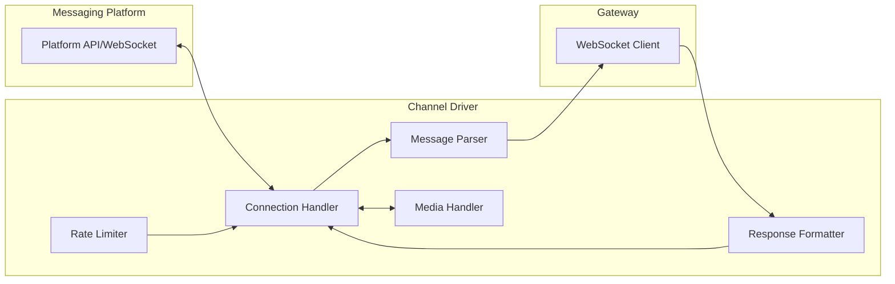

# Chapter 3: Channel Drivers

## Introduction

Channel drivers are OpenClaw's adapters that bridge between messaging platforms and the Gateway. Each driver handles platform-specific authentication, message format translation, rate limiting, media handling, and delivery confirmation. OpenClaw supports 14+ channels — this chapter examines the driver architecture and the most popular implementations.

## Driver Architecture



## Base Driver Interface

All channel drivers implement a common interface:

```typescript
interface ChannelDriver {
  // Identity
  readonly name: string;
  readonly platform: Platform;

  // Lifecycle
  connect(): Promise<void>;
  disconnect(): Promise<void>;
  isConnected(): boolean;

  // Message handling
  onMessage(handler: MessageHandler): void;
  sendMessage(target: string, message: OutboundMessage): Promise<DeliveryReceipt>;

  // Media
  uploadMedia(media: MediaAttachment): Promise<string>;
  downloadMedia(mediaId: string): Promise<Buffer>;

  // Platform-specific features
  getCapabilities(): ChannelCapabilities;
}

interface ChannelCapabilities {
  max_message_length: number;
  supports_markdown: boolean;
  supports_reactions: boolean;
  supports_threads: boolean;
  supports_voice: boolean;
  supports_media: MediaType[];
  supports_buttons: boolean;
  supports_typing_indicator: boolean;
  chunk_strategy: "split" | "truncate" | "paginate";
}
```

## Channel Comparison

| Channel | Library | Max Length | Markdown | Threads | Media | Voice |
|---------|---------|-----------|----------|---------|-------|-------|
| **WhatsApp** | Baileys | 4,096 | Partial | ✓ | ✓ | ✓ |
| **Telegram** | grammY | 4,096 | Full | ✓ | ✓ | ✓ |
| **Slack** | Bolt | 40,000 | Slack fmt | ✓ | ✓ | ✗ |
| **Discord** | discord.js | 2,000 | Full | ✓ | ✓ | ✓ |
| **iMessage** | AppleScript | Unlimited | ✗ | ✗ | ✓ | ✗ |
| **Signal** | signal-cli | 6,000 | ✗ | ✓ | ✓ | ✓ |
| **Teams** | Bot Framework | 28,000 | Adaptive | ✓ | ✓ | ✗ |
| **WebChat** | Built-in | Unlimited | Full | ✗ | ✓ | ✓ |

## WhatsApp Driver (Baileys)

The most popular channel driver, using the Baileys library for WhatsApp Web API:

```typescript
class WhatsAppDriver implements ChannelDriver {
  readonly name = "whatsapp";
  readonly platform = Platform.WHATSAPP;
  private socket: WASocket | null = null;
  private store: AuthenticationState;

  async connect() {
    // Load or create authentication state
    this.store = await useMultiFileAuthState(
      path.join(config.dataDir, "whatsapp-auth")
    );

    // Create WhatsApp socket connection
    this.socket = makeWASocket({
      auth: this.store.state,
      printQRInTerminal: true,
      browser: ["OpenClaw", "Desktop", "1.0.0"],
      syncFullHistory: false,
      markOnlineOnConnect: false,
    });

    // Handle connection updates
    this.socket.ev.on("connection.update", (update) => {
      const { connection, lastDisconnect, qr } = update;

      if (qr) {
        // Display QR code for pairing
        this.emitQRCode(qr);
      }

      if (connection === "close") {
        const shouldReconnect =
          (lastDisconnect?.error as Boom)?.output?.statusCode !==
          DisconnectReason.loggedOut;

        if (shouldReconnect) {
          this.connect(); // Auto-reconnect
        }
      }

      if (connection === "open") {
        this.emit("connected");
      }
    });

    // Save credentials on update
    this.socket.ev.on("creds.update", this.store.saveCreds);

    // Handle incoming messages
    this.socket.ev.on("messages.upsert", ({ messages }) => {
      for (const msg of messages) {
        if (!msg.key.fromMe && msg.message) {
          this.handleIncoming(msg);
        }
      }
    });
  }

  private async handleIncoming(raw: WAMessage) {
    const parsed: InboundMessage = {
      id: raw.key.id!,
      channel: "whatsapp",
      sender: raw.key.remoteJid!,
      sender_name: raw.pushName || "Unknown",
      content: this.extractContent(raw),
      is_group: raw.key.remoteJid!.endsWith("@g.us"),
      is_reply_to_agent: this.isReplyToSelf(raw),
      is_direct_mention: this.isMentioned(raw),
      timestamp: raw.messageTimestamp as number,
      media: await this.extractMedia(raw),
    };

    this.messageHandler(parsed);
  }

  async sendMessage(
    target: string,
    message: OutboundMessage
  ): Promise<DeliveryReceipt> {
    if (!this.socket) throw new Error("Not connected");

    // WhatsApp has a 4096 char limit — chunk if necessary
    const chunks = this.chunkMessage(message.content, 4096);

    for (const chunk of chunks) {
      await this.socket.sendMessage(target, {
        text: this.formatForWhatsApp(chunk),
      });

      // Rate limit between chunks
      if (chunks.length > 1) {
        await sleep(500);
      }
    }

    return { delivered: true, channel: "whatsapp", target };
  }

  private formatForWhatsApp(text: string): string {
    // Convert markdown to WhatsApp formatting
    return text
      .replace(/\*\*(.*?)\*\*/g, "*$1*")     // Bold
      .replace(/__(.*?)__/g, "_$1_")           // Italic
      .replace(/~~(.*?)~~/g, "~$1~")           // Strikethrough
      .replace(/```(\w*)\n([\s\S]*?)```/g,     // Code blocks
        "```$2```")
      .replace(/`(.*?)`/g, "```$1```");        // Inline code
  }

  getCapabilities(): ChannelCapabilities {
    return {
      max_message_length: 4096,
      supports_markdown: true,  // WhatsApp subset
      supports_reactions: true,
      supports_threads: true,   // Via replies
      supports_voice: true,
      supports_media: ["image", "video", "audio", "document"],
      supports_buttons: true,   // List messages
      supports_typing_indicator: true,
      chunk_strategy: "split",
    };
  }
}
```

## Telegram Driver (grammY)

Telegram offers the richest feature set via the Bot API:

```typescript
class TelegramDriver implements ChannelDriver {
  readonly name = "telegram";
  readonly platform = Platform.TELEGRAM;
  private bot: Bot;

  async connect() {
    this.bot = new Bot(config.channels.telegram.token);

    // Register message handler
    this.bot.on("message:text", async (ctx) => {
      const parsed: InboundMessage = {
        id: String(ctx.message.message_id),
        channel: "telegram",
        sender: String(ctx.from.id),
        sender_name: ctx.from.first_name,
        content: ctx.message.text,
        is_group: ctx.chat.type !== "private",
        is_reply_to_agent: ctx.message.reply_to_message?.from?.id === this.bot.botInfo.id,
        is_direct_mention: this.isBotMentioned(ctx),
        timestamp: ctx.message.date,
        thread_id: ctx.message.message_thread_id
          ? String(ctx.message.message_thread_id) : undefined,
      };

      this.messageHandler(parsed);
    });

    // Handle media messages
    this.bot.on("message:photo", (ctx) => this.handleMedia(ctx, "image"));
    this.bot.on("message:voice", (ctx) => this.handleMedia(ctx, "audio"));
    this.bot.on("message:document", (ctx) => this.handleMedia(ctx, "document"));

    // Handle callback queries (button presses)
    this.bot.on("callback_query:data", async (ctx) => {
      await this.handleCallback(ctx);
    });

    // Start polling (or webhook in production)
    if (config.channels.telegram.webhook_url) {
      await this.bot.api.setWebhook(config.channels.telegram.webhook_url);
    } else {
      this.bot.start();
    }
  }

  async sendMessage(
    target: string,
    message: OutboundMessage
  ): Promise<DeliveryReceipt> {
    const chatId = Number(target);

    // Telegram supports full Markdown natively
    await this.bot.api.sendMessage(chatId, message.content, {
      parse_mode: "MarkdownV2",
      reply_to_message_id: message.reply_to
        ? Number(message.reply_to) : undefined,
    });

    return { delivered: true, channel: "telegram", target };
  }

  // Telegram supports inline keyboards for interactive responses
  async sendWithButtons(
    target: string,
    text: string,
    buttons: Button[][]
  ) {
    await this.bot.api.sendMessage(Number(target), text, {
      parse_mode: "MarkdownV2",
      reply_markup: {
        inline_keyboard: buttons.map(row =>
          row.map(btn => ({
            text: btn.label,
            callback_data: btn.action,
          }))
        ),
      },
    });
  }
}
```

## Slack Driver (Bolt)

Slack's Bolt framework provides event-driven handling:

```typescript
class SlackDriver implements ChannelDriver {
  readonly name = "slack";
  readonly platform = Platform.SLACK;
  private app: App;

  async connect() {
    this.app = new App({
      token: config.channels.slack.bot_token,
      appToken: config.channels.slack.app_token,
      socketMode: true,  // Use Socket Mode for simplicity
      signingSecret: config.channels.slack.signing_secret,
    });

    // Handle direct messages and mentions
    this.app.event("message", async ({ message, say, client }) => {
      if (message.subtype) return; // Skip system messages

      const parsed: InboundMessage = {
        id: message.ts!,
        channel: "slack",
        sender: message.user!,
        sender_name: await this.getUserName(client, message.user!),
        content: message.text!,
        is_group: message.channel_type === "group"
          || message.channel_type === "channel",
        is_reply_to_agent: false,
        is_direct_mention: this.isMentioned(message.text!),
        timestamp: Number(message.ts),
        thread_id: message.thread_ts,
      };

      this.messageHandler(parsed);
    });

    // Handle app mentions specifically
    this.app.event("app_mention", async ({ event }) => {
      const parsed: InboundMessage = {
        id: event.ts,
        channel: "slack",
        sender: event.user,
        content: event.text.replace(/<@[A-Z0-9]+>/g, "").trim(),
        is_group: true,
        is_direct_mention: true,
        timestamp: Number(event.ts),
        thread_id: event.thread_ts,
      };

      this.messageHandler(parsed);
    });

    await this.app.start();
  }

  async sendMessage(
    target: string,
    message: OutboundMessage
  ): Promise<DeliveryReceipt> {
    // Slack uses its own markdown-like format (mrkdwn)
    const formatted = this.convertToSlackFormat(message.content);

    await this.app.client.chat.postMessage({
      channel: target,
      text: formatted,
      mrkdwn: true,
      thread_ts: message.thread_id,
      // Slack supports rich Block Kit layouts
      blocks: this.buildBlocks(message),
    });

    return { delivered: true, channel: "slack", target };
  }

  private convertToSlackFormat(markdown: string): string {
    return markdown
      .replace(/\*\*(.*?)\*\*/g, "*$1*")       // Bold
      .replace(/\[(.*?)\]\((.*?)\)/g, "<$2|$1>") // Links
      .replace(/```(\w+)\n/g, "```\n")           // Code blocks (no lang)
      .replace(/^> (.*)/gm, "> $1");             // Blockquotes
  }
}
```

## Discord Driver (discord.js)

Discord provides rich embed and interaction support:

```typescript
class DiscordDriver implements ChannelDriver {
  readonly name = "discord";
  readonly platform = Platform.DISCORD;
  private client: Client;

  async connect() {
    this.client = new Client({
      intents: [
        GatewayIntentBits.Guilds,
        GatewayIntentBits.GuildMessages,
        GatewayIntentBits.MessageContent,
        GatewayIntentBits.DirectMessages,
      ],
      partials: [Partials.Channel], // For DMs
    });

    this.client.on("messageCreate", async (msg) => {
      if (msg.author.bot) return; // Ignore bot messages

      const parsed: InboundMessage = {
        id: msg.id,
        channel: "discord",
        sender: msg.author.id,
        sender_name: msg.author.displayName,
        content: msg.content,
        is_group: msg.guild !== null,
        is_reply_to_agent: msg.reference?.messageId
          ? await this.isOwnMessage(msg.reference.messageId, msg.channel)
          : false,
        is_direct_mention: msg.mentions.has(this.client.user!.id),
        timestamp: msg.createdTimestamp,
        thread_id: msg.channel.isThread()
          ? msg.channel.id : undefined,
      };

      this.messageHandler(parsed);
    });

    await this.client.login(config.channels.discord.token);
  }

  async sendMessage(
    target: string,
    message: OutboundMessage
  ): Promise<DeliveryReceipt> {
    const channel = await this.client.channels.fetch(target);
    if (!channel?.isTextBased()) {
      throw new Error(`Channel ${target} is not text-based`);
    }

    // Discord has a 2000 char limit — chunk long messages
    const chunks = this.chunkMessage(message.content, 2000);

    for (const chunk of chunks) {
      await (channel as TextChannel).send({
        content: chunk,
        reply: message.reply_to
          ? { messageReference: message.reply_to } : undefined,
      });
    }

    return { delivered: true, channel: "discord", target };
  }
}
```

## Message Chunking

Long responses must be split according to each platform's limits:

```typescript
class MessageChunker {
  /**
   * Split a message into chunks that respect platform limits.
   * Prefers splitting at paragraph boundaries, then sentences,
   * then word boundaries — never mid-word.
   */
  static chunk(text: string, maxLength: number): string[] {
    if (text.length <= maxLength) return [text];

    const chunks: string[] = [];
    let remaining = text;

    while (remaining.length > 0) {
      if (remaining.length <= maxLength) {
        chunks.push(remaining);
        break;
      }

      // Find the best split point
      let splitAt = maxLength;

      // Try paragraph boundary first
      const paragraphBreak = remaining.lastIndexOf("\n\n", maxLength);
      if (paragraphBreak > maxLength * 0.5) {
        splitAt = paragraphBreak;
      } else {
        // Try sentence boundary
        const sentenceBreak = remaining.lastIndexOf(". ", maxLength);
        if (sentenceBreak > maxLength * 0.5) {
          splitAt = sentenceBreak + 1;
        } else {
          // Fall back to word boundary
          const wordBreak = remaining.lastIndexOf(" ", maxLength);
          if (wordBreak > maxLength * 0.3) {
            splitAt = wordBreak;
          }
        }
      }

      chunks.push(remaining.slice(0, splitAt).trim());
      remaining = remaining.slice(splitAt).trim();
    }

    return chunks;
  }

  /**
   * Preserve code blocks when chunking — never split mid-block.
   */
  static chunkWithCodeBlocks(text: string, maxLength: number): string[] {
    const codeBlockRegex = /```[\s\S]*?```/g;
    const blocks = text.split(codeBlockRegex);
    const codeBlocks = text.match(codeBlockRegex) || [];

    const chunks: string[] = [];
    let current = "";

    for (let i = 0; i < blocks.length; i++) {
      const textPart = blocks[i];
      const codePart = codeBlocks[i] || "";

      if ((current + textPart + codePart).length > maxLength) {
        if (current) chunks.push(current.trim());
        current = textPart + codePart;
      } else {
        current += textPart + codePart;
      }
    }

    if (current) chunks.push(current.trim());
    return chunks;
  }
}
```

## iMessage Driver

iMessage uses AppleScript on macOS for send/receive:

```typescript
class IMessageDriver implements ChannelDriver {
  readonly name = "imessage";
  readonly platform = Platform.IMESSAGE;

  async connect() {
    // iMessage uses file system watching for new messages
    // via the chat.db SQLite database
    this.startDatabaseWatcher();
  }

  private startDatabaseWatcher() {
    const dbPath = path.join(
      os.homedir(),
      "Library/Messages/chat.db"
    );

    // Watch for new rows in the message table
    const watcher = new SQLiteWatcher(dbPath, {
      table: "message",
      interval: 1000,  // Poll every second
    });

    watcher.on("new_row", async (row) => {
      if (row.is_from_me) return;

      const parsed: InboundMessage = {
        id: String(row.ROWID),
        channel: "imessage",
        sender: row.handle_id,
        content: row.text,
        is_group: row.cache_roomnames !== null,
        timestamp: row.date / 1e9 + 978307200, // Apple epoch
      };

      this.messageHandler(parsed);
    });
  }

  async sendMessage(
    target: string,
    message: OutboundMessage
  ): Promise<DeliveryReceipt> {
    // Use AppleScript to send via Messages.app
    const script = `
      tell application "Messages"
        set targetService to 1st account whose service type = iMessage
        set targetBuddy to participant "${target}" of targetService
        send "${this.escapeAppleScript(message.content)}" to targetBuddy
      end tell
    `;

    await execAppleScript(script);
    return { delivered: true, channel: "imessage", target };
  }
}
```

## Channel Driver Registration

Drivers register with the Gateway at startup:

```typescript
class ChannelManager {
  private drivers: Map<string, ChannelDriver> = new Map();

  async loadDrivers(enabledChannels: string[]) {
    const driverMap: Record<string, new () => ChannelDriver> = {
      whatsapp: WhatsAppDriver,
      telegram: TelegramDriver,
      slack: SlackDriver,
      discord: DiscordDriver,
      imessage: IMessageDriver,
      signal: SignalDriver,
      teams: TeamsDriver,
      webchat: WebChatDriver,
      matrix: MatrixDriver,
      line: LineDriver,
      googlechat: GoogleChatDriver,
    };

    for (const channelName of enabledChannels) {
      const DriverClass = driverMap[channelName];
      if (!DriverClass) {
        console.warn(`Unknown channel: ${channelName}`);
        continue;
      }

      const driver = new DriverClass();

      // Connect message handler to gateway
      driver.onMessage((message) => {
        gateway.routeMessage(message);
      });

      try {
        await driver.connect();
        this.drivers.set(channelName, driver);
        console.log(`Channel connected: ${channelName}`);
      } catch (err) {
        console.error(`Failed to connect ${channelName}:`, err);
      }
    }
  }

  async disconnectAll() {
    for (const [name, driver] of this.drivers) {
      await driver.disconnect();
      console.log(`Channel disconnected: ${name}`);
    }
  }
}
```

## Intelligent Message Routing

When a message arrives, the system decides how to handle it based on context:

```typescript
interface RoutingDecision {
  action: "process" | "ignore" | "queue" | "redirect";
  reason: string;
  session_id?: string;
}

function routeChannelMessage(
  message: InboundMessage,
  driver: ChannelDriver
): RoutingDecision {
  // Direct messages always get processed
  if (!message.is_group) {
    return {
      action: "process",
      reason: "direct_message",
      session_id: `main:${message.channel}:${message.sender}`
    };
  }

  // Group messages — check activation rules
  if (message.is_direct_mention) {
    return {
      action: "process",
      reason: "mentioned",
      session_id: `group:${message.channel}:${message.group_id}`
    };
  }

  if (message.is_reply_to_agent) {
    return {
      action: "process",
      reason: "reply_chain",
      session_id: `group:${message.channel}:${message.group_id}`
    };
  }

  // Ignore unmentioned group messages
  return {
    action: "ignore",
    reason: "not_activated"
  };
}
```

## Summary

| Concept | Key Takeaway |
|---------|-------------|
| **Driver Interface** | Common contract: `connect`, `disconnect`, `sendMessage`, `getCapabilities` |
| **WhatsApp (Baileys)** | QR code pairing, 4K char limit, WhatsApp-subset formatting |
| **Telegram (grammY)** | Full Markdown, inline keyboards, webhook/polling modes |
| **Slack (Bolt)** | Socket Mode, Block Kit, mrkdwn formatting, 40K char limit |
| **Discord (discord.js)** | 2K char limit, embeds, thread support, intent-based |
| **iMessage** | AppleScript send, SQLite DB watch for receive |
| **Chunking** | Smart splitting at paragraph/sentence/word boundaries |
| **Routing** | Direct → always process; Group → mention/reply-gated |

---

**Next Steps**: [Chapter 4: Agent Runtime](04-agent-runtime.md) — Explore the Pi Agent system that powers OpenClaw's reasoning, tool use, and response generation.

---

*Built with insights from the [OpenClaw repository](https://github.com/openclaw/openclaw) and community documentation.*
