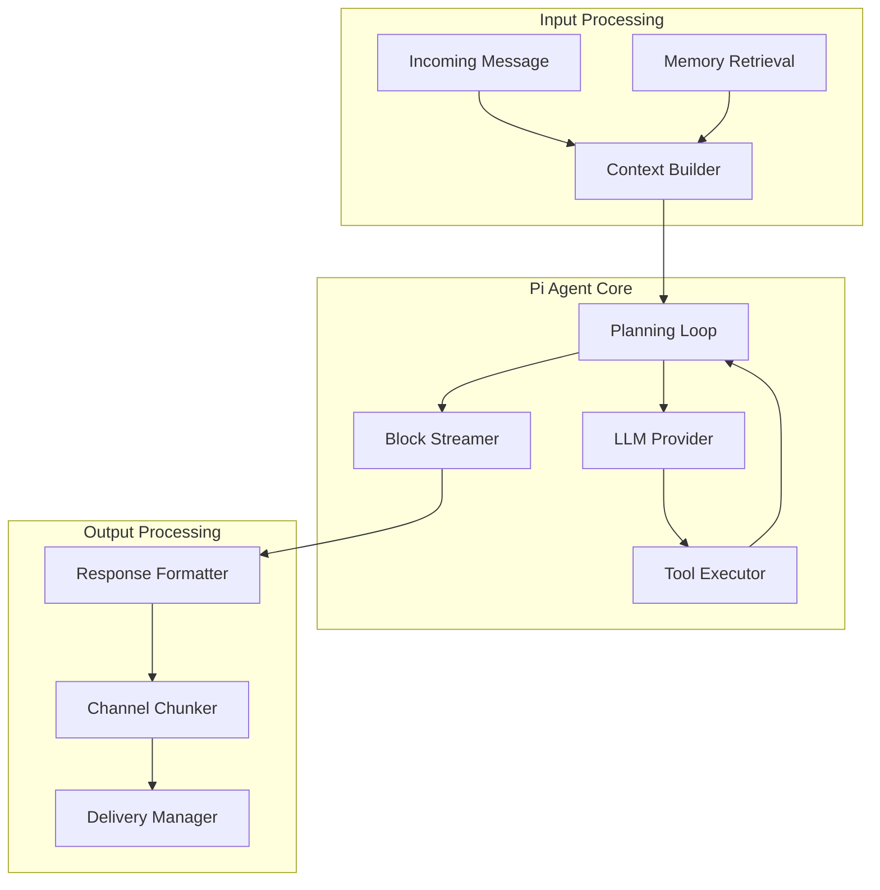

# Chapter 4: Agent Runtime

Welcome to **Chapter 4: Agent Runtime**. In this part of **OpenClaw: Deep Dive Tutorial**, you will build an intuitive mental model first, then move into concrete implementation details and practical production tradeoffs.


## Introduction

The Pi Agent is OpenClaw's brain — the runtime that processes messages, reasons about tasks, calls tools, and generates responses. It runs in RPC mode with tool streaming, block streaming, multi-model support, and session-based context management. This chapter explores how the agent thinks, acts, and communicates.

## Agent Architecture



## Agent Lifecycle

A single message passes through these stages:

```typescript
class PiAgent {
  private providers: ModelProviderRegistry;
  private toolRegistry: ToolRegistry;
  private memoryStore: MemoryStore;

  /**
   * Process an incoming message through the full agent pipeline.
   */
  async processMessage(
    message: InboundMessage,
    session: Session
  ): AsyncGenerator<StreamBlock> {
    // Stage 1: Build context
    const context = await this.buildContext(message, session);

    // Stage 2: Run the agent loop (may involve multiple LLM calls)
    const response = this.runAgentLoop(context, session);

    // Stage 3: Stream response blocks
    yield* response;

    // Stage 4: Post-processing (memory updates, etc.)
    await this.postProcess(message, session);
  }
}
```

## Context Building

Before each LLM call, the agent assembles a rich context window:

```typescript
interface AgentContext {
  system_prompt: string;
  conversation_history: Message[];
  memory_context: MemoryEntry[];
  available_tools: ToolDefinition[];
  session_metadata: SessionMetadata;
  user_profile: UserProfile;
}

class ContextBuilder {
  async build(
    message: InboundMessage,
    session: Session
  ): Promise<AgentContext> {
    // 1. Load the system prompt (agent personality + instructions)
    const systemPrompt = this.buildSystemPrompt(session);

    // 2. Retrieve conversation history for this session
    const history = session.context_window.slice(
      -this.config.max_history_messages
    );

    // 3. Retrieve relevant long-term memories
    const memories = await this.memoryStore.retrieve({
      query: message.content,
      user_id: message.sender,
      limit: 10,
      relevance_threshold: 0.7,
    });

    // 4. Get available tools for this session
    const tools = this.toolRegistry.getAvailableTools(session);

    // 5. Load user profile (preferences, timezone, name)
    const profile = await this.loadUserProfile(message.sender);

    return {
      system_prompt: systemPrompt,
      conversation_history: history,
      memory_context: memories,
      available_tools: tools,
      session_metadata: session.metadata,
      user_profile: profile,
    };
  }

  private buildSystemPrompt(session: Session): string {
    const { agent } = this.config;

    return `You are ${agent.name}, a personal AI assistant.
Personality: ${agent.personality}
Current time: ${new Date().toISOString()}
Timezone: ${agent.timezone}
Channel: ${session.channel}
Session type: ${session.mode}

You have access to tools for web browsing, file management,
calendar, email, and various integrations. Use them proactively
when they would help the user.

Remember previous conversations and user preferences.
Be concise in messaging channels — users expect chat-length responses.`;
  }
}
```

## The Agent Loop

The core reasoning loop supports multi-turn tool use:

```typescript
class AgentLoop {
  /**
   * Run the agent loop: LLM generates text or tool calls,
   * tools execute and return results, LLM continues until
   * it produces a final response (no more tool calls).
   */
  async *run(
    context: AgentContext,
    session: Session
  ): AsyncGenerator<StreamBlock> {
    let messages = this.formatMessages(context);
    let iteration = 0;
    const maxIterations = 10;

    while (iteration < maxIterations) {
      iteration++;

      // Call the LLM
      const llmResponse = await this.callLLM(messages, context);

      // Process each content block in the response
      for (const block of llmResponse.content) {
        if (block.type === "text") {
          // Stream text blocks to the user
          yield {
            block_id: crypto.randomUUID(),
            block_type: BlockType.TEXT,
            content: block.text,
          };
        }

        if (block.type === "tool_use") {
          // Notify user that a tool is being used
          yield {
            block_id: crypto.randomUUID(),
            block_type: BlockType.TOOL_CALL,
            content: `Using ${block.name}...`,
            metadata: { tool: block.name, input: block.input },
          };

          // Execute the tool
          const result = await this.executeTool(
            block.name,
            block.input,
            session
          );

          // Stream tool result
          yield {
            block_id: crypto.randomUUID(),
            block_type: BlockType.TOOL_RESULT,
            content: this.summarizeResult(result),
            metadata: { tool: block.name },
          };

          // Add tool result to messages for next iteration
          messages.push({
            role: "assistant",
            content: llmResponse.content,
          });
          messages.push({
            role: "user",
            content: [{
              type: "tool_result",
              tool_use_id: block.id,
              content: JSON.stringify(result),
            }],
          });
        }
      }

      // If no tool calls, the agent is done
      const hasToolCalls = llmResponse.content.some(
        (b) => b.type === "tool_use"
      );
      if (!hasToolCalls) break;
    }
  }
}
```

## Multi-Model Support

OpenClaw supports multiple AI providers with automatic failover:

```typescript
interface ModelProvider {
  name: string;
  models: string[];
  call(request: LLMRequest): Promise<LLMResponse>;
  stream(request: LLMRequest): AsyncGenerator<LLMChunk>;
  isAvailable(): Promise<boolean>;
}

class ModelProviderRegistry {
  private providers: ModelProvider[] = [];
  private primary: ModelProvider;
  private usage: Map<string, UsageStats> = new Map();

  register(provider: ModelProvider, isPrimary = false) {
    this.providers.push(provider);
    if (isPrimary) this.primary = provider;
  }

  async call(request: LLMRequest): Promise<LLMResponse> {
    // Try primary provider first
    try {
      if (await this.primary.isAvailable()) {
        const response = await this.primary.call(request);
        this.trackUsage(this.primary.name, request, response);
        return response;
      }
    } catch (err) {
      console.warn(`Primary provider failed: ${err.message}`);
    }

    // Failover to other providers
    for (const provider of this.providers) {
      if (provider === this.primary) continue;
      try {
        if (await provider.isAvailable()) {
          console.log(`Failing over to ${provider.name}`);
          const response = await provider.call(request);
          this.trackUsage(provider.name, request, response);
          return response;
        }
      } catch (err) {
        console.warn(`Failover ${provider.name} failed: ${err.message}`);
      }
    }

    throw new Error("All providers unavailable");
  }

  // API key rotation for rate limit management
  private apiKeyPool: Map<string, string[]> = new Map();

  getNextKey(provider: string): string {
    const keys = this.apiKeyPool.get(provider) || [];
    if (keys.length === 0) throw new Error(`No keys for ${provider}`);

    // Round-robin key selection
    const key = keys.shift()!;
    keys.push(key);
    return key;
  }
}
```

### Provider Implementations

```typescript
class AnthropicProvider implements ModelProvider {
  name = "anthropic";
  models = ["claude-sonnet-4-20250514", "claude-haiku-35-20241022"];

  async call(request: LLMRequest): Promise<LLMResponse> {
    const client = new Anthropic({
      apiKey: this.registry.getNextKey("anthropic"),
    });

    const response = await client.messages.create({
      model: request.model || "claude-sonnet-4-20250514",
      max_tokens: request.max_tokens || 8192,
      system: request.system,
      messages: request.messages,
      tools: request.tools,
    });

    return this.normalizeResponse(response);
  }

  async *stream(request: LLMRequest): AsyncGenerator<LLMChunk> {
    const client = new Anthropic({
      apiKey: this.registry.getNextKey("anthropic"),
    });

    const stream = await client.messages.stream({
      model: request.model || "claude-sonnet-4-20250514",
      max_tokens: request.max_tokens || 8192,
      system: request.system,
      messages: request.messages,
      tools: request.tools,
    });

    for await (const event of stream) {
      yield this.normalizeChunk(event);
    }
  }
}

class OpenAIProvider implements ModelProvider {
  name = "openai";
  models = ["gpt-4o", "gpt-4o-mini"];

  async call(request: LLMRequest): Promise<LLMResponse> {
    const client = new OpenAI({
      apiKey: this.registry.getNextKey("openai"),
    });

    const response = await client.chat.completions.create({
      model: request.model || "gpt-4o",
      max_tokens: request.max_tokens || 8192,
      messages: this.convertMessages(request),
      tools: this.convertTools(request.tools),
    });

    return this.normalizeResponse(response);
  }
}
```

## Block Streaming

Responses stream as typed blocks for rich rendering:

```typescript
class BlockStreamer {
  private gateway: Gateway;
  private session: Session;

  /**
   * Stream agent output blocks to the appropriate channel.
   * Handles buffering, formatting, and delivery.
   */
  async streamToChannel(
    blocks: AsyncGenerator<StreamBlock>,
    session: Session
  ) {
    let buffer = "";
    let lastFlush = Date.now();
    const flushInterval = 100; // ms between flushes

    for await (const block of blocks) {
      switch (block.block_type) {
        case BlockType.TEXT:
          // Buffer text and flush periodically
          buffer += block.content;
          if (Date.now() - lastFlush > flushInterval) {
            await this.flush(buffer, session);
            buffer = "";
            lastFlush = Date.now();
          }
          break;

        case BlockType.TOOL_CALL:
          // Flush any pending text first
          if (buffer) {
            await this.flush(buffer, session);
            buffer = "";
          }
          // Show typing indicator during tool execution
          await this.sendTypingIndicator(session);
          break;

        case BlockType.TOOL_RESULT:
          // Optionally show tool results inline
          if (this.config.show_tool_results) {
            await this.sendToolResult(block, session);
          }
          break;

        case BlockType.CANVAS:
          // Push to Canvas UI
          await this.pushToCanvas(block, session);
          break;
      }
    }

    // Flush remaining buffer
    if (buffer) {
      await this.flush(buffer, session);
    }
  }

  private async sendTypingIndicator(session: Session) {
    const driver = this.getDriver(session.channel);
    if (driver.getCapabilities().supports_typing_indicator) {
      await driver.sendTypingIndicator(session.target);
    }
  }
}
```

## Tool Execution

The agent can call tools during its reasoning loop:

```typescript
class ToolExecutor {
  private registry: ToolRegistry;
  private sandboxManager: SandboxManager;

  async execute(
    toolName: string,
    params: Record<string, unknown>,
    session: Session
  ): Promise<ToolResult> {
    const tool = this.registry.get(toolName);

    // Determine execution environment
    if (tool.sandbox) {
      return this.executeInSandbox(tool, params, session);
    }

    return this.executeDirect(tool, params, session);
  }

  private async executeDirect(
    tool: ToolDefinition,
    params: Record<string, unknown>,
    session: Session
  ): Promise<ToolResult> {
    const startTime = Date.now();

    try {
      const result = await Promise.race([
        tool.handler(params, { session, config: this.config }),
        this.timeout(tool.timeout_ms),
      ]);

      return {
        success: true,
        data: result,
        duration_ms: Date.now() - startTime,
        tool: tool.name,
      };
    } catch (err) {
      return {
        success: false,
        error: err.message,
        duration_ms: Date.now() - startTime,
        tool: tool.name,
      };
    }
  }

  private async executeInSandbox(
    tool: ToolDefinition,
    params: Record<string, unknown>,
    session: Session
  ): Promise<ToolResult> {
    // Create isolated Docker container for execution
    const sandbox = await this.sandboxManager.create({
      image: "openclaw/sandbox:latest",
      timeout_ms: tool.timeout_ms,
      memory_mb: 256,
      network: tool.needs_network,
    });

    try {
      const result = await sandbox.execute(tool.name, params);
      return { success: true, data: result, tool: tool.name };
    } finally {
      await sandbox.destroy();
    }
  }
}
```

## Response Post-Processing

After generating a response, the agent updates memory and session state:

```typescript
class PostProcessor {
  async process(
    message: InboundMessage,
    response: AgentResponse,
    session: Session
  ) {
    // 1. Update conversation history
    session.context_window.push(
      { role: "user", content: message.content, timestamp: Date.now() },
      { role: "assistant", content: response.text, timestamp: Date.now() }
    );

    // 2. Prune context window if too long
    await this.pruneContextWindow(session);

    // 3. Extract and store memories
    await this.extractMemories(message, response, session);

    // 4. Update user profile if new info learned
    await this.updateUserProfile(message, response);

    // 5. Track usage metrics
    this.trackMetrics(response);
  }

  private async extractMemories(
    message: InboundMessage,
    response: AgentResponse,
    session: Session
  ) {
    // Use the LLM to identify memorable information
    const extraction = await this.llm.call({
      system: `Extract any facts, preferences, or important information
               from this conversation that should be remembered long-term.
               Return as JSON array of {fact, category, importance}.`,
      messages: [{
        role: "user",
        content: `User said: "${message.content}"
                  Assistant responded: "${response.text}"`,
      }],
    });

    const memories = JSON.parse(extraction.text);
    for (const memory of memories) {
      await this.memoryStore.store({
        user_id: message.sender,
        fact: memory.fact,
        category: memory.category,
        importance: memory.importance,
        source_session: session.id,
        timestamp: Date.now(),
      });
    }
  }
}
```

## Error Handling and Recovery

The agent handles failures gracefully:

```typescript
class AgentErrorHandler {
  async handleError(
    error: Error,
    context: ErrorContext
  ): Promise<StreamBlock[]> {
    // Rate limit errors — switch provider
    if (error instanceof RateLimitError) {
      return this.retryWithFailover(context);
    }

    // Tool execution errors — report and continue
    if (error instanceof ToolExecutionError) {
      return [{
        block_id: crypto.randomUUID(),
        block_type: BlockType.TEXT,
        content: `I encountered an issue with ${error.toolName}: ${error.message}. Let me try a different approach.`,
      }];
    }

    // Context too long — summarize and retry
    if (error instanceof ContextLengthError) {
      await this.summarizeAndPruneContext(context.session);
      return this.retry(context);
    }

    // Unknown errors — apologize and log
    console.error("Unhandled agent error:", error);
    return [{
      block_id: crypto.randomUUID(),
      block_type: BlockType.TEXT,
      content: "I ran into an unexpected issue. Could you try again?",
    }];
  }
}
```

## Summary

| Component | Purpose |
|-----------|---------|
| **Context Builder** | Assembles system prompt, history, memories, tools, and user profile |
| **Agent Loop** | Multi-turn reasoning: LLM call → tool use → LLM call → response |
| **Multi-Model** | Anthropic/OpenAI with failover and key rotation |
| **Block Streaming** | Typed response blocks (text, code, tool_call, canvas) |
| **Tool Executor** | Direct or sandboxed tool execution with timeouts |
| **Post-Processor** | Memory extraction, context pruning, profile updates |
| **Error Handler** | Graceful recovery for rate limits, tool failures, context overflow |

---

**Next Steps**: [Chapter 5: Memory & Sessions](05-memory-sessions.md) — Explore how OpenClaw remembers you across conversations and manages persistent context.

---

*Built with insights from the [OpenClaw repository](https://github.com/openclaw/openclaw) and community documentation.*

## What Problem Does This Solve?

Most teams struggle here because the hard part is not writing more code, but deciding clear boundaries for `session`, `tool`, `request` so behavior stays predictable as complexity grows.

In practical terms, this chapter helps you avoid three common failures:

- coupling core logic too tightly to one implementation path
- missing the handoff boundaries between setup, execution, and validation
- shipping changes without clear rollback or observability strategy

After working through this chapter, you should be able to reason about `Chapter 4: Agent Runtime` as an operating subsystem inside **OpenClaw: Deep Dive Tutorial**, with explicit contracts for inputs, state transitions, and outputs.

Use the implementation notes around `response`, `message`, `content` as your checklist when adapting these patterns to your own repository.

## How it Works Under the Hood

Under the hood, `Chapter 4: Agent Runtime` usually follows a repeatable control path:

1. **Context bootstrap**: initialize runtime config and prerequisites for `session`.
2. **Input normalization**: shape incoming data so `tool` receives stable contracts.
3. **Core execution**: run the main logic branch and propagate intermediate state through `request`.
4. **Policy and safety checks**: enforce limits, auth scopes, and failure boundaries.
5. **Output composition**: return canonical result payloads for downstream consumers.
6. **Operational telemetry**: emit logs/metrics needed for debugging and performance tuning.

When debugging, walk this sequence in order and confirm each stage has explicit success/failure conditions.

## Source Walkthrough

Use the following upstream sources to verify implementation details while reading this chapter:

- [OpenClaw](https://github.com/openclaw/openclaw)
  Why it matters: authoritative reference on `OpenClaw` (github.com).

Suggested trace strategy:
- search upstream code for `session` and `tool` to map concrete implementation paths
- compare docs claims against actual runtime/config code before reusing patterns in production

## Chapter Connections

- [Tutorial Index](index.md)
- [Previous Chapter: Chapter 3: Channel Drivers](03-channel-drivers.md)
- [Next Chapter: Chapter 5: Memory & Sessions](05-memory-sessions.md)
- [Main Catalog](../../README.md#-tutorial-catalog)
- [A-Z Tutorial Directory](../../discoverability/tutorial-directory.md)
