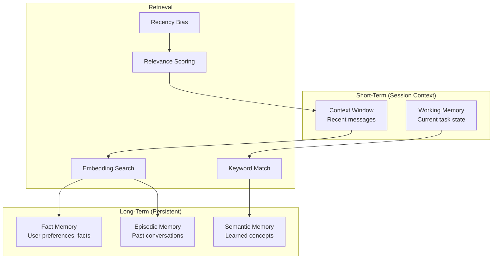
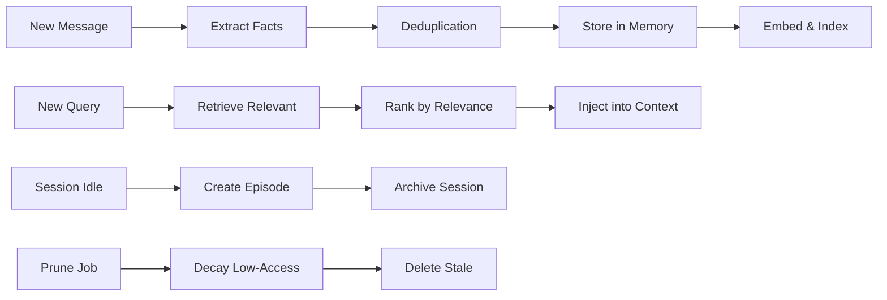

# Chapter 5: Memory & Sessions

## Introduction

One of OpenClaw's defining features is persistent memory — the assistant remembers your preferences, past conversations, and important facts across sessions and even across channels. This chapter explores the memory architecture, session management, and context strategies that make this possible.

## Memory Architecture



## Memory Types

### Short-Term: Context Window

The context window holds the most recent conversation turns:

```typescript
interface ContextWindow {
  messages: Message[];
  max_tokens: number;       // e.g., 128,000 for Claude
  current_tokens: number;
  summary: string | null;   // Compressed older context
}

class ContextWindowManager {
  private windows: Map<string, ContextWindow> = new Map();

  getOrCreate(sessionId: string): ContextWindow {
    if (!this.windows.has(sessionId)) {
      this.windows.set(sessionId, {
        messages: [],
        max_tokens: this.config.max_context_tokens,
        current_tokens: 0,
        summary: null,
      });
    }
    return this.windows.get(sessionId)!;
  }

  async addMessage(sessionId: string, message: Message) {
    const window = this.getOrCreate(sessionId);
    const tokens = this.countTokens(message.content);

    window.messages.push(message);
    window.current_tokens += tokens;

    // If approaching limit, compress older messages
    if (window.current_tokens > window.max_tokens * 0.8) {
      await this.compress(sessionId);
    }
  }

  /**
   * Compress older messages into a summary to free token budget.
   * Keeps the most recent messages intact for coherent conversation.
   */
  private async compress(sessionId: string) {
    const window = this.getOrCreate(sessionId);
    const keepRecent = 20; // Keep last 20 messages verbatim

    if (window.messages.length <= keepRecent) return;

    // Messages to summarize
    const toSummarize = window.messages.slice(
      0,
      window.messages.length - keepRecent
    );

    // Generate summary via LLM
    const summary = await this.llm.call({
      system: "Summarize this conversation concisely, preserving key facts, decisions, and context needed for continuity.",
      messages: [{
        role: "user",
        content: toSummarize.map(m =>
          `[${m.role}]: ${m.content}`
        ).join("\n"),
      }],
    });

    // Replace old messages with summary
    window.summary = window.summary
      ? `${window.summary}\n\n${summary.text}`
      : summary.text;

    window.messages = window.messages.slice(-keepRecent);
    window.current_tokens = this.countTokens(
      window.summary + window.messages.map(m => m.content).join("")
    );
  }
}
```

### Long-Term: Fact Memory

Facts are discrete pieces of information about users:

```typescript
interface FactEntry {
  id: string;
  user_id: string;
  fact: string;              // "Prefers dark mode"
  category: FactCategory;
  importance: number;        // 1-10
  confidence: number;        // 0-1
  source_session: string;
  created_at: number;
  last_accessed: number;
  access_count: number;
  embedding: number[];       // For semantic search
}

enum FactCategory {
  PREFERENCE = "preference",     // "Likes Python over JS"
  PERSONAL = "personal",         // "Lives in NYC"
  WORK = "work",                 // "Works at Acme Corp"
  HABIT = "habit",               // "Usually works late"
  RELATIONSHIP = "relationship", // "Has a dog named Max"
  TECHNICAL = "technical",       // "Uses VS Code"
  SCHEDULE = "schedule",         // "Meeting every Tuesday 2pm"
}

class FactMemory {
  private db: Database;
  private embedder: Embedder;

  async store(entry: Omit<FactEntry, "id" | "embedding">) {
    // Generate embedding for semantic search
    const embedding = await this.embedder.embed(entry.fact);

    // Check for contradictions with existing facts
    const existing = await this.findSimilar(entry.user_id, entry.fact);
    if (existing && existing.similarity > 0.9) {
      // Update existing fact instead of duplicating
      await this.update(existing.id, {
        fact: entry.fact,
        confidence: Math.max(existing.confidence, entry.confidence),
        last_accessed: Date.now(),
      });
      return;
    }

    // Store new fact
    await this.db.insert("facts", {
      ...entry,
      id: crypto.randomUUID(),
      embedding,
      created_at: Date.now(),
      last_accessed: Date.now(),
      access_count: 0,
    });
  }

  async retrieve(query: RetrievalQuery): Promise<FactEntry[]> {
    const queryEmbedding = await this.embedder.embed(query.query);

    // Semantic search with relevance scoring
    const results = await this.db.query(`
      SELECT *,
        (1 - cosine_distance(embedding, $1)) as similarity,
        importance * 0.3 +
        similarity * 0.5 +
        recency_score(last_accessed) * 0.2 as relevance
      FROM facts
      WHERE user_id = $2
        AND similarity > $3
      ORDER BY relevance DESC
      LIMIT $4
    `, [queryEmbedding, query.user_id, query.relevance_threshold, query.limit]);

    // Update access metadata
    for (const result of results) {
      await this.db.update("facts", result.id, {
        last_accessed: Date.now(),
        access_count: result.access_count + 1,
      });
    }

    return results;
  }
}
```

### Long-Term: Episodic Memory

Episodic memory stores summaries of past conversation episodes:

```typescript
interface Episode {
  id: string;
  user_id: string;
  session_id: string;
  summary: string;
  topics: string[];
  key_decisions: string[];
  outcome: string;
  timestamp: number;
  duration_minutes: number;
  message_count: number;
  embedding: number[];
}

class EpisodicMemory {
  /**
   * When a session ends or goes idle, create an episode summary.
   */
  async createEpisode(session: Session) {
    const summary = await this.llm.call({
      system: `Summarize this conversation as a past episode. Include:
               - What was discussed
               - Key decisions made
               - Any action items or outcomes
               - Emotional tone
               Format as concise narrative.`,
      messages: [{
        role: "user",
        content: session.context_window
          .map(m => `[${m.role}]: ${m.content}`)
          .join("\n"),
      }],
    });

    const topics = await this.extractTopics(session);

    await this.store({
      user_id: session.participants[0],
      session_id: session.id,
      summary: summary.text,
      topics,
      key_decisions: await this.extractDecisions(session),
      outcome: await this.extractOutcome(session),
      timestamp: session.created_at,
      duration_minutes: (Date.now() - session.created_at) / 60_000,
      message_count: session.context_window.length,
    });
  }

  /**
   * Retrieve relevant past episodes for context enrichment.
   */
  async recall(query: string, userId: string): Promise<Episode[]> {
    const embedding = await this.embedder.embed(query);

    return this.db.query(`
      SELECT *, (1 - cosine_distance(embedding, $1)) as relevance
      FROM episodes
      WHERE user_id = $2
      ORDER BY relevance DESC
      LIMIT 5
    `, [embedding, userId]);
  }
}
```

## Session Management

### Session Types

```typescript
enum SessionMode {
  /**
   * MAIN: Direct 1:1 conversation.
   * One session per user per channel.
   * Full tool access, persistent memory.
   */
  MAIN = "main",

  /**
   * GROUP: Channel/group chat.
   * One session per group. Activated by mention or reply.
   * Limited tool access (configurable per group).
   * Docker sandbox for code execution.
   */
  GROUP = "group",

  /**
   * QUEUE: Sequential processing mode.
   * Messages processed one at a time in order.
   * Used for high-throughput channels or automation.
   */
  QUEUE = "queue",
}
```

### Session Persistence

Sessions persist across restarts:

```typescript
class SessionStore {
  private db: Database;
  private cache: Map<string, Session> = new Map();

  async get(sessionId: string): Promise<Session | null> {
    // Check in-memory cache first
    if (this.cache.has(sessionId)) {
      return this.cache.get(sessionId)!;
    }

    // Load from disk
    const data = await this.db.get("sessions", sessionId);
    if (!data) return null;

    const session = this.deserialize(data);
    this.cache.set(sessionId, session);
    return session;
  }

  async save(session: Session) {
    this.cache.set(session.id, session);

    // Persist to disk (debounced — doesn't write on every message)
    this.debouncedWrite(session.id, this.serialize(session));
  }

  /**
   * Prune old sessions to free storage.
   */
  async prune(maxAge: number) {
    const cutoff = Date.now() - maxAge;

    const expired = await this.db.query(
      "SELECT id FROM sessions WHERE last_active < $1",
      [cutoff]
    );

    for (const { id } of expired) {
      // Create episodic memory before pruning
      const session = await this.get(id);
      if (session) {
        await this.episodicMemory.createEpisode(session);
      }

      await this.db.delete("sessions", id);
      this.cache.delete(id);
    }

    return expired.length;
  }
}
```

### Session Isolation (Groups)

Group sessions have stricter isolation:

```typescript
class GroupSessionManager {
  /**
   * Create an isolated session for a group chat.
   * Each group gets its own context, tools, and permissions.
   */
  createGroupSession(
    channel: string,
    groupId: string
  ): Session {
    return {
      id: `group:${channel}:${groupId}`,
      mode: SessionMode.GROUP,
      channel,
      participants: [],
      created_at: Date.now(),
      last_active: Date.now(),
      context_window: [],
      memory_refs: [],
      tool_permissions: this.getGroupPermissions(groupId),
      isolation: {
        // Code execution in Docker sandbox
        sandbox: true,
        // No access to personal files
        file_access: false,
        // Limited browser access
        browser_access: "read_only",
        // No access to other users' memories
        cross_user_memory: false,
      },
    };
  }

  private getGroupPermissions(groupId: string): string[] {
    // Default group permissions — more restrictive than 1:1
    return [
      "web_search",
      "web_browse",
      "code_execute_sandboxed",
      "weather",
      "calculator",
    ];
    // Notably excludes: file_system, email, calendar, personal_integrations
  }
}
```

## Memory Retrieval Pipeline

When building context for an LLM call, relevant memories are retrieved:

```typescript
class MemoryRetriever {
  private factMemory: FactMemory;
  private episodicMemory: EpisodicMemory;

  /**
   * Retrieve all relevant memories for a given query and user.
   * Combines fact memory, episodic memory, and recency signals.
   */
  async retrieve(params: {
    query: string;
    userId: string;
    sessionId: string;
    limit: number;
  }): Promise<MemoryContext> {
    // Parallel retrieval from all memory stores
    const [facts, episodes] = await Promise.all([
      this.factMemory.retrieve({
        query: params.query,
        user_id: params.userId,
        limit: params.limit,
        relevance_threshold: 0.6,
      }),
      this.episodicMemory.recall(params.query, params.userId),
    ]);

    // Format for injection into system prompt
    return {
      facts: facts.map(f => `- ${f.fact} (${f.category})`).join("\n"),
      episodes: episodes.map(e =>
        `[${new Date(e.timestamp).toLocaleDateString()}] ${e.summary}`
      ).join("\n\n"),
      formatted: this.formatForPrompt(facts, episodes),
    };
  }

  private formatForPrompt(
    facts: FactEntry[],
    episodes: Episode[]
  ): string {
    let prompt = "";

    if (facts.length > 0) {
      prompt += "## What I Know About You\n";
      prompt += facts.map(f => `- ${f.fact}`).join("\n");
      prompt += "\n\n";
    }

    if (episodes.length > 0) {
      prompt += "## Recent Conversations\n";
      prompt += episodes.map(e =>
        `- ${new Date(e.timestamp).toLocaleDateString()}: ${e.summary}`
      ).join("\n");
    }

    return prompt;
  }
}
```

## Memory Lifecycle



### Memory Decay

Memories that aren't accessed gradually decay:

```typescript
class MemoryDecayManager {
  /**
   * Run periodic decay to prevent memory bloat.
   * Low-importance, rarely-accessed memories fade.
   */
  async runDecay() {
    const allFacts = await this.db.query(
      "SELECT * FROM facts WHERE last_accessed < $1",
      [Date.now() - 30 * 24 * 60 * 60 * 1000] // 30 days
    );

    for (const fact of allFacts) {
      const decayFactor = this.calculateDecay(fact);

      if (decayFactor < 0.1) {
        // Memory has decayed below threshold — archive
        await this.archive(fact);
        await this.db.delete("facts", fact.id);
      } else {
        // Reduce confidence
        await this.db.update("facts", fact.id, {
          confidence: fact.confidence * decayFactor,
        });
      }
    }
  }

  private calculateDecay(fact: FactEntry): number {
    const daysSinceAccess =
      (Date.now() - fact.last_accessed) / (24 * 60 * 60 * 1000);

    // Exponential decay modified by importance and access frequency
    const baseDecay = Math.exp(-daysSinceAccess / 90); // 90-day half-life
    const importanceBoost = fact.importance / 10;       // 0-1
    const accessBoost = Math.min(fact.access_count / 20, 1); // Cap at 20

    return baseDecay * (1 + importanceBoost + accessBoost) / 3;
  }
}
```

## Cross-Channel Memory

A key feature: memories persist across channels. A fact learned in WhatsApp is available in Telegram:

```typescript
class CrossChannelMemory {
  /**
   * User identity is unified across channels.
   * The same user on WhatsApp and Telegram shares one memory store.
   */
  async resolveUserId(
    channel: string,
    channelUserId: string
  ): Promise<string> {
    // Check if this channel user is linked to a unified ID
    const mapping = await this.db.get("user_mappings", {
      channel,
      channel_user_id: channelUserId,
    });

    if (mapping) return mapping.unified_id;

    // Create new unified ID
    const unifiedId = crypto.randomUUID();
    await this.db.insert("user_mappings", {
      channel,
      channel_user_id: channelUserId,
      unified_id: unifiedId,
    });

    return unifiedId;
  }

  /**
   * Link two channel identities to the same user.
   * "Hey, I'm also @john on Telegram" → links WhatsApp + Telegram.
   */
  async linkIdentities(
    unifiedId: string,
    channel: string,
    channelUserId: string
  ) {
    await this.db.insert("user_mappings", {
      channel,
      channel_user_id: channelUserId,
      unified_id: unifiedId,
    });
  }
}
```

## Summary

| Concept | Key Takeaway |
|---------|-------------|
| **Context Window** | Recent messages kept verbatim; older ones compressed into summaries |
| **Fact Memory** | Discrete facts about users with semantic embeddings and decay |
| **Episodic Memory** | Conversation summaries created when sessions end or idle |
| **Session Modes** | Main (1:1), Group (isolated), Queue (sequential) |
| **Session Persistence** | Sessions survive restarts via disk-backed store |
| **Group Isolation** | Sandboxed execution, restricted tools, no cross-user memory |
| **Memory Retrieval** | Parallel semantic search across facts and episodes |
| **Memory Decay** | Unused memories gradually fade; high-importance ones persist |
| **Cross-Channel** | Unified user identity — memories shared across all channels |

---

**Next Steps**: [Chapter 6: Skills & Tools](06-skills-tools.md) — Explore OpenClaw's extensible skill platform, built-in tools, browser control, and Live Canvas.

---

*Built with insights from the [OpenClaw repository](https://github.com/openclaw/openclaw) and community documentation.*
