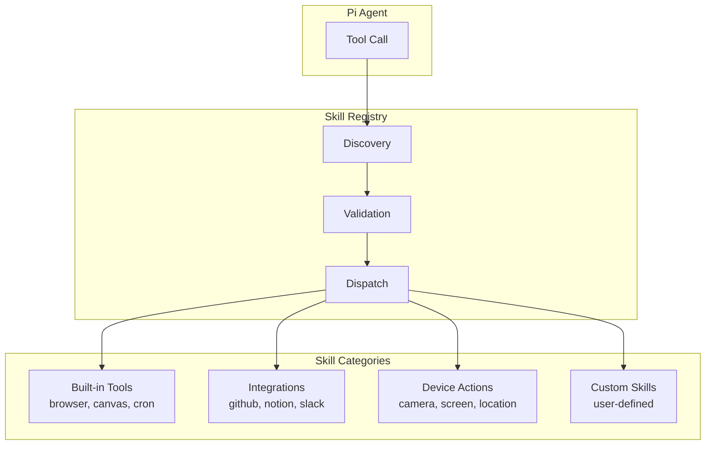

# Chapter 6: Skills & Tools

## Introduction

OpenClaw ships with 50+ built-in skills and a rich tool system that gives the agent capabilities beyond text generation — web browsing, file management, browser automation, Live Canvas rendering, and integrations with services like GitHub, Notion, Spotify, and more. This chapter covers the skill architecture, built-in tools, and how to create custom skills.

## Skills Architecture



## Skill Definition

Every skill follows a standard interface:

```typescript
interface SkillDefinition {
  // Metadata
  name: string;
  description: string;
  version: string;
  author: string;
  category: SkillCategory;

  // Tool definitions exposed to the agent
  tools: ToolDefinition[];

  // Lifecycle hooks
  onLoad?: () => Promise<void>;
  onUnload?: () => Promise<void>;

  // Configuration schema
  config_schema?: JSONSchema;

  // Required permissions
  permissions: Permission[];
}

interface ToolDefinition {
  name: string;
  description: string;  // Shown to the LLM
  parameters: JSONSchema;
  handler: (params: any, context: ToolContext) => Promise<any>;
  examples?: ToolExample[];
}

enum SkillCategory {
  PRODUCTIVITY = "productivity",
  DEVELOPMENT = "development",
  COMMUNICATION = "communication",
  MEDIA = "media",
  AUTOMATION = "automation",
  SYSTEM = "system",
}
```

## Built-in Skills Overview

| Skill | Category | Tools | Description |
|-------|----------|-------|-------------|
| **browser** | system | `browse`, `screenshot`, `click`, `type` | CDP browser control |
| **canvas** | system | `canvas_push`, `canvas_clear` | Live Canvas UI |
| **cron** | automation | `cron_create`, `cron_list`, `cron_delete` | Scheduled tasks |
| **webhook** | automation | `webhook_create`, `webhook_trigger` | HTTP webhooks |
| **code** | development | `code_run`, `code_analyze` | Code execution |
| **file** | system | `file_read`, `file_write`, `file_list` | File system access |
| **github** | development | `gh_issue`, `gh_pr`, `gh_repo` | GitHub integration |
| **notion** | productivity | `notion_page`, `notion_db`, `notion_search` | Notion integration |
| **obsidian** | productivity | `obsidian_note`, `obsidian_search` | Obsidian vault access |
| **spotify** | media | `spotify_play`, `spotify_search`, `spotify_queue` | Spotify control |
| **1password** | system | `onepassword_get`, `onepassword_search` | Password manager |
| **apple-notes** | productivity | `notes_create`, `notes_search` | Apple Notes |
| **apple-reminders** | productivity | `reminder_create`, `reminder_list` | Apple Reminders |
| **trello** | productivity | `trello_card`, `trello_board`, `trello_list` | Trello boards |
| **weather** | system | `weather_current`, `weather_forecast` | Weather data |
| **web-search** | system | `web_search` | Web search |
| **coding-agent** | development | `code_agent_run` | Autonomous coding |

## Browser Control (CDP)

The browser skill provides full Chrome DevTools Protocol integration:

```typescript
class BrowserSkill implements SkillDefinition {
  name = "browser";
  category = SkillCategory.SYSTEM;

  tools: ToolDefinition[] = [
    {
      name: "browse",
      description: "Navigate to a URL and return the page content as markdown",
      parameters: {
        type: "object",
        properties: {
          url: { type: "string", description: "URL to navigate to" },
          wait_for: { type: "string", description: "CSS selector to wait for" },
          extract: { type: "string", enum: ["text", "markdown", "html", "screenshot"] },
        },
        required: ["url"],
      },
      handler: async (params, context) => {
        const page = await this.browser.newPage();

        try {
          await page.goto(params.url, { waitUntil: "networkidle2" });

          if (params.wait_for) {
            await page.waitForSelector(params.wait_for, { timeout: 10_000 });
          }

          switch (params.extract || "markdown") {
            case "markdown":
              return await this.extractMarkdown(page);
            case "text":
              return await page.evaluate(() => document.body.innerText);
            case "html":
              return await page.content();
            case "screenshot":
              const buffer = await page.screenshot({ type: "png" });
              return { type: "image", data: buffer.toString("base64") };
          }
        } finally {
          await page.close();
        }
      },
    },

    {
      name: "browser_action",
      description: "Perform an action on the current browser page (click, type, scroll)",
      parameters: {
        type: "object",
        properties: {
          action: { type: "string", enum: ["click", "type", "scroll", "select", "hover"] },
          selector: { type: "string", description: "CSS selector for the target element" },
          value: { type: "string", description: "Value to type or select" },
        },
        required: ["action", "selector"],
      },
      handler: async (params, context) => {
        const page = this.browser.currentPage();

        switch (params.action) {
          case "click":
            await page.click(params.selector);
            break;
          case "type":
            await page.type(params.selector, params.value!);
            break;
          case "scroll":
            await page.evaluate((sel) => {
              document.querySelector(sel)?.scrollIntoView();
            }, params.selector);
            break;
        }

        // Return page state after action
        return {
          url: page.url(),
          title: await page.title(),
          content: await this.extractMarkdown(page),
        };
      },
    },
  ];

  private browser: Browser;

  async onLoad() {
    this.browser = await puppeteer.launch({
      headless: true,
      args: ["--no-sandbox", "--disable-setuid-sandbox"],
    });
  }

  async onUnload() {
    await this.browser.close();
  }
}
```

## Live Canvas

The Canvas is an agent-to-UI (A2UI) system where the agent pushes rendered content:

```typescript
class CanvasSkill implements SkillDefinition {
  name = "canvas";
  category = SkillCategory.SYSTEM;

  tools: ToolDefinition[] = [
    {
      name: "canvas_push",
      description: "Push content to the Live Canvas UI. Supports HTML, markdown, charts, and interactive elements.",
      parameters: {
        type: "object",
        properties: {
          content_type: {
            type: "string",
            enum: ["html", "markdown", "chart", "table", "form", "code"],
          },
          content: { type: "string", description: "The content to render" },
          title: { type: "string", description: "Canvas panel title" },
          replace: { type: "boolean", description: "Replace existing content or append" },
        },
        required: ["content_type", "content"],
      },
      handler: async (params, context) => {
        const canvasId = context.session.canvas_id || this.createCanvas(context);

        await this.gateway.send(canvasId, {
          type: "canvas_update",
          payload: {
            content_type: params.content_type,
            content: params.content,
            title: params.title,
            replace: params.replace ?? true,
          },
        });

        return { canvas_id: canvasId, status: "updated" };
      },
    },

    {
      name: "canvas_clear",
      description: "Clear the Live Canvas",
      parameters: { type: "object", properties: {} },
      handler: async (params, context) => {
        if (context.session.canvas_id) {
          await this.gateway.send(context.session.canvas_id, {
            type: "canvas_clear",
          });
        }
        return { status: "cleared" };
      },
    },
  ];
}
```

## Cron & Webhooks

Schedule recurring tasks and handle incoming HTTP triggers:

```typescript
class CronSkill implements SkillDefinition {
  name = "cron";
  category = SkillCategory.AUTOMATION;

  tools: ToolDefinition[] = [
    {
      name: "cron_create",
      description: "Schedule a recurring task. Uses standard cron syntax.",
      parameters: {
        type: "object",
        properties: {
          schedule: { type: "string", description: "Cron expression (e.g., '0 9 * * *' for daily at 9am)" },
          task: { type: "string", description: "Description of what to do when triggered" },
          channel: { type: "string", description: "Which channel to send results to" },
        },
        required: ["schedule", "task"],
      },
      handler: async (params, context) => {
        const job = await this.scheduler.create({
          schedule: params.schedule,
          task: params.task,
          channel: params.channel || context.session.channel,
          user_id: context.session.participants[0],
          created_by_session: context.session.id,
        });

        return {
          job_id: job.id,
          next_run: job.nextRun().toISOString(),
          schedule: params.schedule,
        };
      },
    },

    {
      name: "cron_list",
      description: "List all scheduled tasks",
      parameters: { type: "object", properties: {} },
      handler: async (params, context) => {
        const jobs = await this.scheduler.listForUser(
          context.session.participants[0]
        );
        return jobs.map(j => ({
          id: j.id,
          schedule: j.schedule,
          task: j.task,
          next_run: j.nextRun().toISOString(),
          last_run: j.lastRun?.toISOString(),
        }));
      },
    },
  ];
}

class WebhookSkill implements SkillDefinition {
  name = "webhook";
  category = SkillCategory.AUTOMATION;

  tools: ToolDefinition[] = [
    {
      name: "webhook_create",
      description: "Create an HTTP webhook endpoint that triggers agent actions",
      parameters: {
        type: "object",
        properties: {
          name: { type: "string", description: "Webhook name" },
          action: { type: "string", description: "What to do when triggered" },
          secret: { type: "string", description: "Shared secret for validation" },
        },
        required: ["name", "action"],
      },
      handler: async (params, context) => {
        const webhook = await this.webhookManager.create({
          name: params.name,
          action: params.action,
          secret: params.secret,
          user_id: context.session.participants[0],
          url: `${this.config.webhook_base_url}/hooks/${crypto.randomUUID()}`,
        });

        return {
          webhook_id: webhook.id,
          url: webhook.url,
          secret: webhook.secret,
        };
      },
    },
  ];
}
```

## GitHub Skill

Full GitHub integration via the GitHub API:

```typescript
class GitHubSkill implements SkillDefinition {
  name = "github";
  category = SkillCategory.DEVELOPMENT;

  tools: ToolDefinition[] = [
    {
      name: "gh_issue_create",
      description: "Create a GitHub issue",
      parameters: {
        type: "object",
        properties: {
          repo: { type: "string", description: "owner/repo" },
          title: { type: "string" },
          body: { type: "string" },
          labels: { type: "array", items: { type: "string" } },
        },
        required: ["repo", "title"],
      },
      handler: async (params, context) => {
        const [owner, repo] = params.repo.split("/");
        const issue = await this.octokit.rest.issues.create({
          owner,
          repo,
          title: params.title,
          body: params.body,
          labels: params.labels,
        });
        return {
          number: issue.data.number,
          url: issue.data.html_url,
        };
      },
    },

    {
      name: "gh_pr_list",
      description: "List open pull requests for a repository",
      parameters: {
        type: "object",
        properties: {
          repo: { type: "string", description: "owner/repo" },
          state: { type: "string", enum: ["open", "closed", "all"] },
        },
        required: ["repo"],
      },
      handler: async (params, context) => {
        const [owner, repo] = params.repo.split("/");
        const prs = await this.octokit.rest.pulls.list({
          owner,
          repo,
          state: params.state || "open",
        });
        return prs.data.map(pr => ({
          number: pr.number,
          title: pr.title,
          author: pr.user?.login,
          url: pr.html_url,
          created: pr.created_at,
        }));
      },
    },
  ];
}
```

## Creating Custom Skills

### Skill File Structure

```
skills/
├── my-custom-skill/
│   ├── index.ts          # Skill definition
│   ├── package.json      # Dependencies
│   ├── config.schema.json # Configuration schema
│   └── README.md
```

### Example: Custom Weather Skill

```typescript
// skills/weather/index.ts
import { SkillDefinition, ToolContext } from "@openclaw/sdk";

const weatherSkill: SkillDefinition = {
  name: "weather",
  description: "Get current weather and forecasts",
  version: "1.0.0",
  author: "openclaw",
  category: "system",
  permissions: ["network"],

  config_schema: {
    type: "object",
    properties: {
      api_key: {
        type: "string",
        description: "OpenWeatherMap API key",
      },
      default_units: {
        type: "string",
        enum: ["metric", "imperial"],
        default: "metric",
      },
    },
    required: ["api_key"],
  },

  tools: [
    {
      name: "weather_current",
      description: "Get current weather for a location",
      parameters: {
        type: "object",
        properties: {
          location: {
            type: "string",
            description: "City name or coordinates",
          },
          units: {
            type: "string",
            enum: ["metric", "imperial"],
          },
        },
        required: ["location"],
      },
      handler: async (params: any, context: ToolContext) => {
        const config = context.skillConfig;
        const units = params.units || config.default_units;

        const response = await fetch(
          `https://api.openweathermap.org/data/2.5/weather?` +
          `q=${encodeURIComponent(params.location)}` +
          `&units=${units}` +
          `&appid=${config.api_key}`
        );

        const data = await response.json();

        return {
          location: data.name,
          temperature: data.main.temp,
          feels_like: data.main.feels_like,
          humidity: data.main.humidity,
          description: data.weather[0].description,
          wind_speed: data.wind.speed,
          units,
        };
      },

      examples: [
        {
          input: { location: "New York" },
          output: {
            location: "New York",
            temperature: 5.2,
            description: "partly cloudy",
          },
        },
      ],
    },
  ],
};

export default weatherSkill;
```

### Installing Custom Skills

```bash
# Install from local directory
openclaw skill install ./skills/my-custom-skill

# Install from npm
openclaw skill install @openclaw/skill-weather

# Install from GitHub
openclaw skill install github:username/openclaw-skill-myskill

# Enable the skill
openclaw skill enable weather

# Configure it
openclaw skill config weather --set api_key=abc123
```

## Device Node Actions

On companion apps (macOS, iOS, Android), device-specific actions are available:

```typescript
class DeviceNodeSkill implements SkillDefinition {
  name = "device";
  category = SkillCategory.SYSTEM;

  tools: ToolDefinition[] = [
    {
      name: "device_screenshot",
      description: "Take a screenshot of the current screen",
      handler: async (params, context) => {
        return context.deviceNode.invoke("screenshot", {});
      },
    },
    {
      name: "device_camera",
      description: "Capture a photo from the device camera",
      handler: async (params, context) => {
        return context.deviceNode.invoke("camera", { facing: "rear" });
      },
    },
    {
      name: "device_location",
      description: "Get the device's current GPS location",
      handler: async (params, context) => {
        return context.deviceNode.invoke("location", {});
      },
    },
    {
      name: "device_notification",
      description: "Send a system notification",
      parameters: {
        type: "object",
        properties: {
          title: { type: "string" },
          body: { type: "string" },
        },
        required: ["title", "body"],
      },
      handler: async (params, context) => {
        return context.deviceNode.invoke("notification", params);
      },
    },
  ];
}
```

## Summary

| Concept | Key Takeaway |
|---------|-------------|
| **Skill Interface** | Standard structure: metadata, tools, lifecycle hooks, config schema |
| **50+ Built-in Skills** | GitHub, Notion, Obsidian, Spotify, 1Password, Apple Notes, and more |
| **Browser Control** | Full CDP integration for web browsing and automation |
| **Live Canvas** | Agent-to-UI rendering for rich content display |
| **Cron & Webhooks** | Scheduled tasks and HTTP triggers for automation |
| **Custom Skills** | Create, install from npm/GitHub, configure via CLI |
| **Device Actions** | Camera, screenshot, location, notifications on companion apps |

---

**Next Steps**: [Chapter 7: Security & Networking](07-security-networking.md) — Explore OpenClaw's security model including pairing, sandboxing, and Tailscale networking.

---

*Built with insights from the [OpenClaw repository](https://github.com/openclaw/openclaw) and community documentation.*
