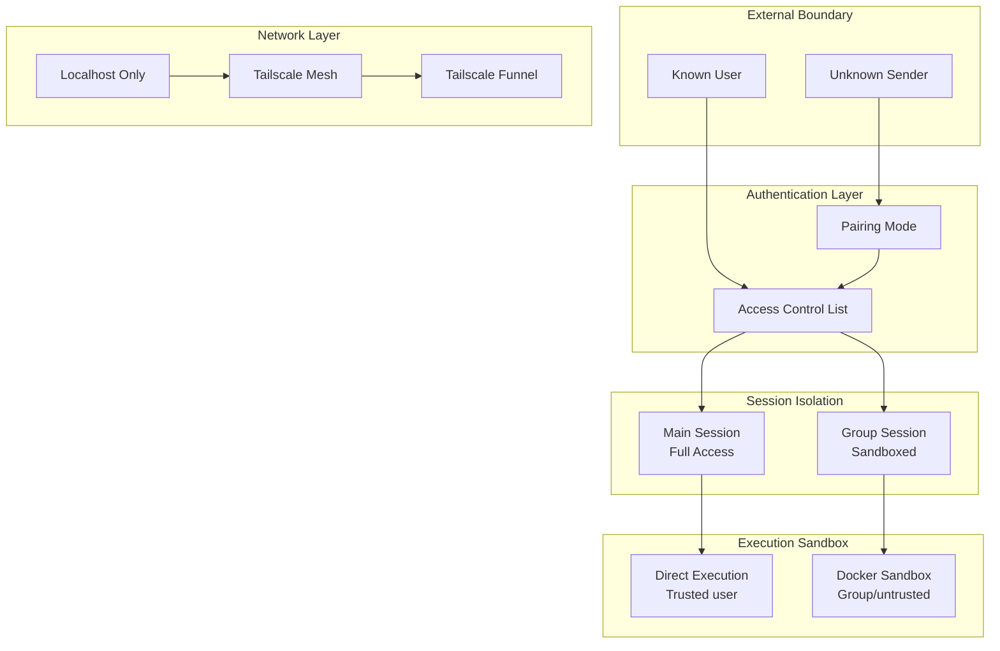
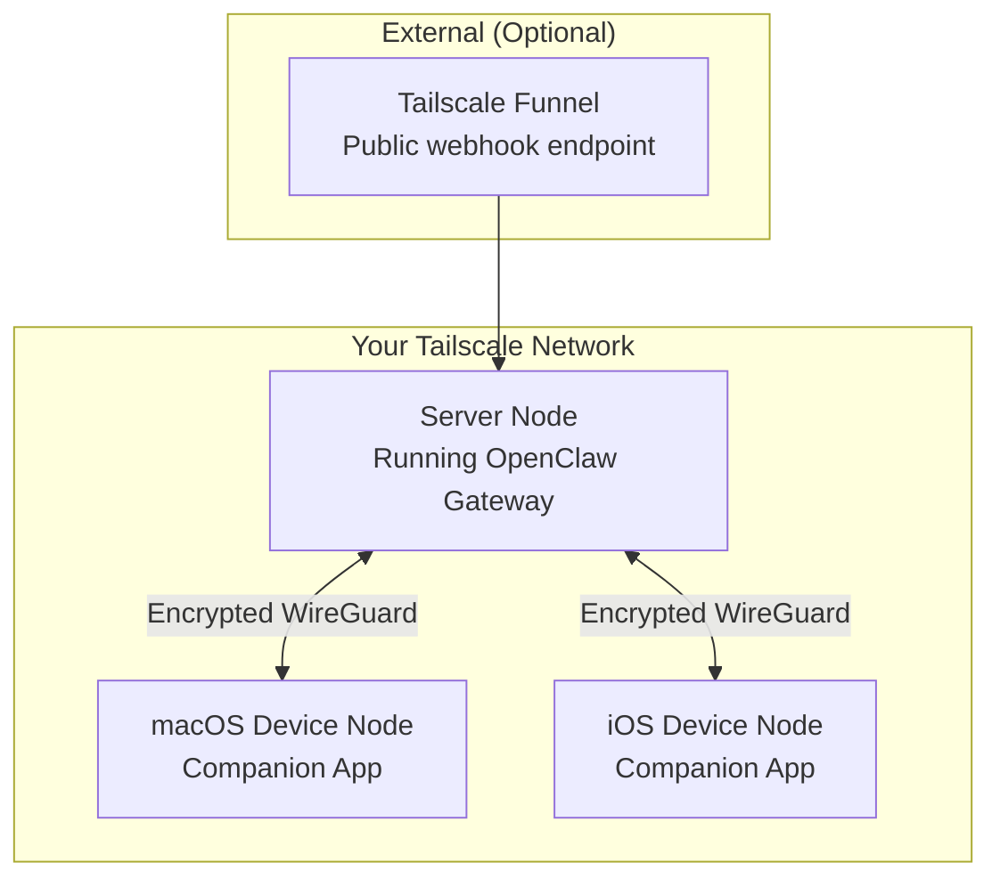

# Chapter 7: Security & Networking

## Introduction

Running a personal AI assistant that connects to your messaging channels, accesses your files, and controls your browser demands serious security. OpenClaw implements a defense-in-depth approach: pairing mode for unknown senders, per-session Docker sandboxing, TCC permission management on macOS, and secure networking via Tailscale. This chapter covers the full security model.

## Security Architecture



## Pairing Mode

When OpenClaw receives a message from an unknown sender, it enters pairing mode:

```typescript
interface PairingConfig {
  enabled: boolean;
  mode: "approve" | "challenge" | "auto_reject";
  challenge_method: "code" | "passphrase";
  code_length: number;
  code_expiry_seconds: number;
  max_attempts: number;
  notify_owner: boolean;
}

class PairingManager {
  private pendingPairs: Map<string, PairingRequest> = new Map();

  async handleUnknownSender(
    message: InboundMessage,
    session: Session
  ): Promise<PairingResult> {
    const config = this.config.pairing;

    if (!config.enabled) {
      // Auto-reject unknown senders
      return { action: "reject", reason: "pairing_disabled" };
    }

    switch (config.mode) {
      case "approve":
        return this.requestOwnerApproval(message);

      case "challenge":
        return this.issueChallenge(message);

      case "auto_reject":
        return { action: "reject", reason: "auto_rejected" };
    }
  }

  private async requestOwnerApproval(
    message: InboundMessage
  ): Promise<PairingResult> {
    // Notify the owner on their primary channel
    await this.notifyOwner({
      type: "pairing_request",
      sender: message.sender,
      sender_name: message.sender_name,
      channel: message.channel,
      message_preview: message.content.slice(0, 100),
      actions: ["approve", "reject", "block"],
    });

    // Queue the request
    this.pendingPairs.set(message.sender, {
      sender: message.sender,
      channel: message.channel,
      requested_at: Date.now(),
      status: "pending",
    });

    // Respond to the unknown sender
    return {
      action: "pending",
      response: "I've notified my owner about your message. Please wait for approval.",
    };
  }

  private async issueChallenge(
    message: InboundMessage
  ): Promise<PairingResult> {
    const code = this.generateCode(this.config.pairing.code_length);

    this.pendingPairs.set(message.sender, {
      sender: message.sender,
      channel: message.channel,
      challenge_code: code,
      attempts: 0,
      expires_at: Date.now() + this.config.pairing.code_expiry_seconds * 1000,
      status: "challenged",
    });

    // Show the code to the owner
    await this.notifyOwner({
      type: "pairing_challenge",
      sender: message.sender,
      code,
    });

    return {
      action: "challenge",
      response: `Please ask the device owner for the pairing code and reply with it.`,
    };
  }

  async verifyChallenge(
    sender: string,
    code: string
  ): Promise<boolean> {
    const request = this.pendingPairs.get(sender);
    if (!request || request.status !== "challenged") return false;

    if (Date.now() > request.expires_at) {
      this.pendingPairs.delete(sender);
      return false;
    }

    request.attempts++;
    if (request.attempts > this.config.pairing.max_attempts) {
      this.pendingPairs.delete(sender);
      await this.blockSender(sender);
      return false;
    }

    if (code === request.challenge_code) {
      // Pairing successful — add to ACL
      await this.aclManager.addUser(sender, request.channel);
      this.pendingPairs.delete(sender);
      return true;
    }

    return false;
  }
}
```

## Access Control

After pairing, users are managed via an Access Control List:

```typescript
interface UserPermission {
  user_id: string;
  channels: string[];
  role: UserRole;
  permissions: Permission[];
  tool_access: string[];      // Specific tools allowed
  rate_limit: RateLimit;
  paired_at: number;
  last_active: number;
}

enum UserRole {
  OWNER = "owner",     // Full access, can manage other users
  TRUSTED = "trusted", // Full tool access, no admin
  LIMITED = "limited",  // Restricted tool access
  BLOCKED = "blocked",  // No access
}

enum Permission {
  FILE_READ = "file:read",
  FILE_WRITE = "file:write",
  BROWSER = "browser",
  CODE_EXECUTE = "code:execute",
  CRON = "cron",
  WEBHOOK = "webhook",
  INTEGRATIONS = "integrations",
  ADMIN = "admin",
}

class ACLManager {
  async checkPermission(
    userId: string,
    permission: Permission
  ): Promise<boolean> {
    const user = await this.getUser(userId);
    if (!user) return false;
    if (user.role === UserRole.BLOCKED) return false;
    if (user.role === UserRole.OWNER) return true;

    return user.permissions.includes(permission);
  }

  async checkToolAccess(
    userId: string,
    toolName: string
  ): Promise<boolean> {
    const user = await this.getUser(userId);
    if (!user) return false;
    if (user.role === UserRole.OWNER) return true;

    // Check explicit tool access list
    return user.tool_access.includes(toolName)
      || user.tool_access.includes("*");
  }
}
```

## Docker Sandboxing

Code execution and untrusted operations run in isolated Docker containers:

```typescript
interface SandboxConfig {
  image: string;            // Docker image
  memory_mb: number;        // Memory limit
  cpu_count: number;        // CPU limit
  timeout_ms: number;       // Execution timeout
  network: boolean;         // Network access
  readonly_fs: boolean;     // Read-only filesystem
  mount_paths: string[];    // Allowed mount points
}

class SandboxManager {
  private docker: Docker;
  private activeSandboxes: Map<string, Container> = new Map();

  /**
   * Create an isolated execution environment.
   */
  async create(config: SandboxConfig): Promise<Sandbox> {
    const container = await this.docker.createContainer({
      Image: config.image,
      HostConfig: {
        Memory: config.memory_mb * 1024 * 1024,
        NanoCpus: config.cpu_count * 1e9,
        NetworkMode: config.network ? "bridge" : "none",
        ReadonlyRootfs: config.readonly_fs,
        SecurityOpt: ["no-new-privileges"],
        PidsLimit: 100,
        // Drop all capabilities except what's needed
        CapDrop: ["ALL"],
        CapAdd: ["NET_BIND_SERVICE"],
        // Seccomp profile for additional syscall filtering
        SecurityOpt: [
          "no-new-privileges",
          `seccomp=${this.seccompProfile}`,
        ],
        Binds: config.mount_paths.map(p =>
          `${p}:${p}:ro`  // Read-only mounts
        ),
      },
      // Resource limits
      Tty: false,
      StopTimeout: Math.ceil(config.timeout_ms / 1000),
    });

    await container.start();
    const sandboxId = container.id;
    this.activeSandboxes.set(sandboxId, container);

    return {
      id: sandboxId,
      execute: async (command: string, input?: string) => {
        return this.executeInContainer(container, command, input, config.timeout_ms);
      },
      destroy: async () => {
        await container.stop({ t: 1 });
        await container.remove({ force: true });
        this.activeSandboxes.delete(sandboxId);
      },
    };
  }

  private async executeInContainer(
    container: Container,
    command: string,
    input: string | undefined,
    timeoutMs: number
  ): Promise<ExecutionResult> {
    const exec = await container.exec({
      Cmd: ["sh", "-c", command],
      AttachStdout: true,
      AttachStderr: true,
      AttachStdin: !!input,
    });

    const stream = await exec.start({
      hijack: true,
      stdin: !!input,
    });

    if (input) {
      stream.write(input);
      stream.end();
    }

    return new Promise((resolve, reject) => {
      const timeout = setTimeout(() => {
        reject(new Error("Execution timed out"));
      }, timeoutMs);

      let stdout = "";
      let stderr = "";

      stream.on("data", (chunk: Buffer) => {
        // Docker multiplexes stdout/stderr in stream
        const type = chunk[0]; // 1 = stdout, 2 = stderr
        const data = chunk.slice(8).toString();
        if (type === 1) stdout += data;
        else stderr += data;
      });

      stream.on("end", () => {
        clearTimeout(timeout);
        resolve({ stdout, stderr, exit_code: 0 });
      });
    });
  }

  /**
   * Emergency cleanup: destroy all running sandboxes.
   */
  async destroyAll() {
    for (const [id, container] of this.activeSandboxes) {
      try {
        await container.stop({ t: 1 });
        await container.remove({ force: true });
      } catch (err) {
        console.error(`Failed to destroy sandbox ${id}:`, err);
      }
    }
    this.activeSandboxes.clear();
  }
}
```

## macOS TCC Permissions

On macOS, OpenClaw manages Transparency, Consent, and Control (TCC) permissions:

```typescript
class TCCManager {
  /**
   * Check and request macOS TCC permissions needed for skills.
   */
  async ensurePermissions(skills: string[]): Promise<PermissionStatus[]> {
    const required = this.getRequiredPermissions(skills);
    const results: PermissionStatus[] = [];

    for (const perm of required) {
      const granted = await this.checkPermission(perm);
      if (!granted) {
        // Prompt user to grant permission
        await this.requestPermission(perm);
      }
      results.push({
        permission: perm,
        granted: await this.checkPermission(perm),
      });
    }

    return results;
  }

  private getRequiredPermissions(skills: string[]): MacOSPermission[] {
    const perms: MacOSPermission[] = [];

    if (skills.includes("device_screenshot")) {
      perms.push(MacOSPermission.SCREEN_RECORDING);
    }
    if (skills.includes("device_camera")) {
      perms.push(MacOSPermission.CAMERA);
    }
    if (skills.includes("device_location")) {
      perms.push(MacOSPermission.LOCATION);
    }
    if (skills.includes("apple-notes")) {
      perms.push(MacOSPermission.CONTACTS); // Notes uses Contacts framework
    }
    if (skills.includes("apple-reminders")) {
      perms.push(MacOSPermission.REMINDERS);
    }

    return perms;
  }
}
```

## Tailscale Networking

OpenClaw uses Tailscale for secure remote access and multi-device networking:



### Remote Gateway Configuration

```yaml
# Server node (runs the Gateway + Agent)
networking:
  mode: "tailscale"
  tailscale:
    # Expose Gateway to your tailnet
    serve:
      enabled: true
      port: 18789
      protocol: "https"

    # Optionally expose webhooks publicly via Funnel
    funnel:
      enabled: true
      path: "/hooks"
      allowed_origins: ["github.com", "stripe.com"]

    # Device node connections
    device_nodes:
      - name: "macbook"
        tailscale_ip: "100.64.0.2"
        capabilities: ["screenshot", "camera", "notifications", "tts"]
      - name: "iphone"
        tailscale_ip: "100.64.0.3"
        capabilities: ["camera", "location", "notifications"]
```

### Device Node Communication

```typescript
class DeviceNodeManager {
  private nodes: Map<string, DeviceNode> = new Map();

  /**
   * Invoke an action on a remote device node.
   * Communication happens over Tailscale (WireGuard encrypted).
   */
  async invoke(
    nodeName: string,
    action: string,
    params: Record<string, unknown>
  ): Promise<unknown> {
    const node = this.nodes.get(nodeName);
    if (!node) throw new Error(`Unknown device node: ${nodeName}`);

    if (!node.capabilities.includes(action)) {
      throw new Error(
        `Device ${nodeName} does not support action: ${action}`
      );
    }

    // RPC call over Tailscale
    const response = await fetch(
      `https://${node.tailscaleIp}:${node.port}/invoke`,
      {
        method: "POST",
        headers: {
          "Content-Type": "application/json",
          "Authorization": `Bearer ${node.authToken}`,
        },
        body: JSON.stringify({ action, params }),
      }
    );

    return response.json();
  }
}
```

## Rate Limiting

Protection against abuse and runaway tool usage:

```typescript
class RateLimiter {
  private buckets: Map<string, TokenBucket> = new Map();

  constructor(private config: RateLimitConfig) {}

  async check(userId: string, action: string): Promise<boolean> {
    const key = `${userId}:${action}`;
    let bucket = this.buckets.get(key);

    if (!bucket) {
      bucket = new TokenBucket(
        this.config.limits[action] || this.config.default_limit
      );
      this.buckets.set(key, bucket);
    }

    return bucket.tryConsume(1);
  }
}

class TokenBucket {
  private tokens: number;
  private lastRefill: number;

  constructor(private config: BucketConfig) {
    this.tokens = config.capacity;
    this.lastRefill = Date.now();
  }

  tryConsume(count: number): boolean {
    this.refill();
    if (this.tokens >= count) {
      this.tokens -= count;
      return true;
    }
    return false;
  }

  private refill() {
    const now = Date.now();
    const elapsed = (now - this.lastRefill) / 1000;
    this.tokens = Math.min(
      this.config.capacity,
      this.tokens + elapsed * this.config.refill_rate
    );
    this.lastRefill = now;
  }
}
```

## Input Sanitization

All user input is sanitized before processing:

```typescript
class InputSanitizer {
  /**
   * Sanitize user input to prevent injection attacks.
   * Particularly important for tool parameters.
   */
  sanitize(input: string, context: SanitizeContext): string {
    let sanitized = input;

    // Prevent prompt injection attempts
    sanitized = this.stripSystemPromptMarkers(sanitized);

    // Sanitize for shell execution
    if (context.target === "shell") {
      sanitized = this.sanitizeForShell(sanitized);
    }

    // Sanitize for file paths
    if (context.target === "filepath") {
      sanitized = this.sanitizeFilePath(sanitized);
    }

    return sanitized;
  }

  private sanitizeForShell(input: string): string {
    // Remove dangerous shell metacharacters
    return input.replace(/[;&|`$(){}[\]<>!]/g, "");
  }

  private sanitizeFilePath(input: string): string {
    // Prevent path traversal
    const normalized = path.normalize(input);
    if (normalized.includes("..")) {
      throw new SecurityError("Path traversal detected");
    }

    // Ensure within allowed directories
    const allowedPaths = this.config.allowed_file_paths;
    if (!allowedPaths.some(p => normalized.startsWith(p))) {
      throw new SecurityError("Access to path denied");
    }

    return normalized;
  }
}
```

## Audit Logging

All security-relevant events are logged:

```typescript
class AuditLogger {
  async log(event: AuditEvent) {
    const entry = {
      timestamp: new Date().toISOString(),
      event_type: event.type,
      user_id: event.userId,
      channel: event.channel,
      action: event.action,
      tool: event.tool,
      parameters: this.redactSensitive(event.parameters),
      result: event.result,
      ip_address: event.ipAddress,
      session_id: event.sessionId,
    };

    // Write to audit log file
    await this.appendToLog(entry);

    // Alert on suspicious events
    if (this.isSuspicious(event)) {
      await this.alertOwner(entry);
    }
  }

  private isSuspicious(event: AuditEvent): boolean {
    return (
      event.type === "pairing_attempt" ||
      event.type === "permission_denied" ||
      event.type === "rate_limit_exceeded" ||
      event.type === "sandbox_escape_attempt"
    );
  }
}
```

## Summary

| Concept | Key Takeaway |
|---------|-------------|
| **Pairing Mode** | Unknown senders must pair via owner approval or challenge code |
| **Access Control** | Role-based (owner/trusted/limited/blocked) with per-tool permissions |
| **Docker Sandboxing** | Group chat and untrusted code runs in isolated containers |
| **macOS TCC** | Native permission management for camera, screen, location, etc. |
| **Tailscale** | Encrypted mesh networking for multi-device and remote access |
| **Rate Limiting** | Token bucket rate limiting per user per action |
| **Input Sanitization** | Shell, filepath, and prompt injection protection |
| **Audit Logging** | All security events logged with suspicious activity alerts |

---

**Next Steps**: [Chapter 8: Production Deployment](08-production-deployment.md) — Deploy OpenClaw for reliable, always-on operation with Docker, monitoring, scaling, and multi-device orchestration.

---

*Built with insights from the [OpenClaw repository](https://github.com/openclaw/openclaw) and community documentation.*
