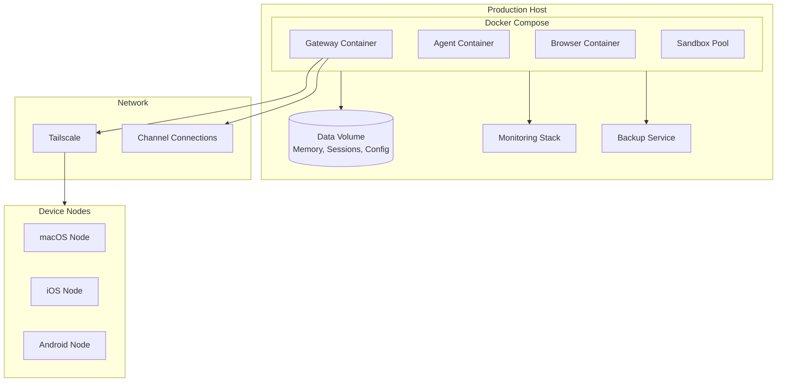
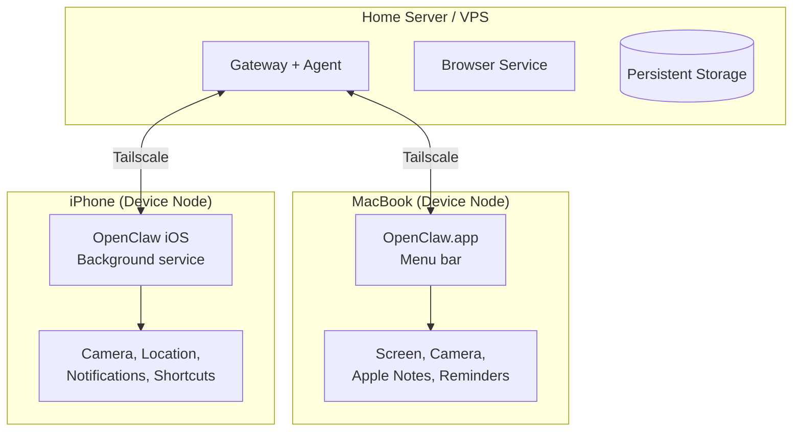

# Chapter 8: Production Deployment

Welcome to **Chapter 8: Production Deployment**. In this part of **OpenClaw: Deep Dive Tutorial**, you will build an intuitive mental model first, then move into concrete implementation details and practical production tradeoffs.


## Introduction

Running OpenClaw as an always-on personal assistant requires production-grade deployment — reliable process management, monitoring, resource management, backup strategies, and multi-device orchestration. This chapter covers everything needed to run OpenClaw in production.

## Production Architecture



## Docker Compose Deployment

The recommended production setup uses Docker Compose:

```yaml
# docker-compose.yml
version: "3.8"

services:
  gateway:
    image: openclaw/openclaw:latest
    container_name: openclaw-gateway
    restart: unless-stopped
    ports:
      - "127.0.0.1:18789:18789"
    volumes:
      - openclaw-data:/data
      - ./config.yaml:/app/config.yaml:ro
    environment:
      - ANTHROPIC_API_KEY=${ANTHROPIC_API_KEY}
      - OPENAI_API_KEY=${OPENAI_API_KEY}
      - OPENCLAW_LOG_LEVEL=info
      - NODE_ENV=production
    healthcheck:
      test: ["CMD", "curl", "-f", "http://localhost:18789/health"]
      interval: 30s
      timeout: 10s
      retries: 3
      start_period: 30s
    deploy:
      resources:
        limits:
          memory: 2G
          cpus: "2.0"
        reservations:
          memory: 512M
          cpus: "0.5"
    logging:
      driver: json-file
      options:
        max-size: "50m"
        max-file: "5"

  browser:
    image: openclaw/sandbox-browser:latest
    container_name: openclaw-browser
    restart: unless-stopped
    shm_size: "1gb"
    security_opt:
      - no-new-privileges:true
    deploy:
      resources:
        limits:
          memory: 1G
          cpus: "1.0"

  # Sandbox pool for code execution
  sandbox-pool:
    image: openclaw/sandbox:latest
    container_name: openclaw-sandbox
    restart: unless-stopped
    security_opt:
      - no-new-privileges:true
    read_only: true
    tmpfs:
      - /tmp:size=100M
    deploy:
      resources:
        limits:
          memory: 512M
          cpus: "0.5"

volumes:
  openclaw-data:
    driver: local
```

### Environment File

```bash
# .env (never commit this file)
ANTHROPIC_API_KEY=sk-ant-...
OPENAI_API_KEY=sk-...
TELEGRAM_BOT_TOKEN=123456:ABC-DEF...
SLACK_BOT_TOKEN=xoxb-...
SLACK_APP_TOKEN=xapp-...
DISCORD_BOT_TOKEN=...
```

### Production Configuration

```yaml
# config.yaml
providers:
  anthropic:
    api_key: "${ANTHROPIC_API_KEY}"
    model: "claude-sonnet-4-20250514"
    max_tokens: 8192
    failover_enabled: true
  openai:
    api_key: "${OPENAI_API_KEY}"
    model: "gpt-4o"
    failover: true

agent:
  name: "Claw"
  personality: "helpful, concise, proactive"
  timezone: "America/New_York"

memory:
  persistence: true
  storage_path: "/data/memory"
  max_context_tokens: 128000
  prune_after_days: 90
  backup_enabled: true

gateway:
  host: "0.0.0.0"
  port: 18789
  max_connections: 50

channels:
  whatsapp:
    enabled: true
    reconnect_delay_ms: 5000
    max_reconnect_attempts: 10
  telegram:
    enabled: true
    token: "${TELEGRAM_BOT_TOKEN}"
    webhook_url: "https://your-host.ts.net/telegram"
  slack:
    enabled: true
    bot_token: "${SLACK_BOT_TOKEN}"
    app_token: "${SLACK_APP_TOKEN}"

security:
  pairing:
    enabled: true
    mode: "challenge"
    code_length: 6
    code_expiry_seconds: 300
  rate_limiting:
    enabled: true
    default_messages_per_minute: 20
    default_tool_calls_per_minute: 10
  sandbox:
    enabled: true
    image: "openclaw/sandbox:latest"
    timeout_ms: 30000
    memory_mb: 256

logging:
  level: "info"
  file: "/data/logs/openclaw.log"
  max_size_mb: 100
  max_files: 10
  audit:
    enabled: true
    file: "/data/logs/audit.log"
```

## Systemd Service (Non-Docker)

For bare-metal installations:

```ini
# /etc/systemd/system/openclaw.service
[Unit]
Description=OpenClaw Personal AI Assistant
After=network-online.target
Wants=network-online.target

[Service]
Type=simple
User=openclaw
Group=openclaw
WorkingDirectory=/opt/openclaw
ExecStart=/usr/bin/node /opt/openclaw/dist/index.js
Restart=always
RestartSec=10
StartLimitIntervalSec=300
StartLimitBurst=5

# Security hardening
NoNewPrivileges=true
ProtectSystem=strict
ProtectHome=true
ReadWritePaths=/opt/openclaw/data
PrivateTmp=true

# Environment
EnvironmentFile=/opt/openclaw/.env

# Resource limits
LimitNOFILE=65536
MemoryMax=2G
CPUQuota=200%

# Logging
StandardOutput=journal
StandardError=journal
SyslogIdentifier=openclaw

[Install]
WantedBy=multi-user.target
```

```bash
# Enable and start
sudo systemctl enable openclaw
sudo systemctl start openclaw

# Check status
sudo systemctl status openclaw

# View logs
sudo journalctl -u openclaw -f
```

## Monitoring

### Health Checks

```typescript
class HealthMonitor {
  async getHealthStatus(): Promise<HealthReport> {
    const checks = await Promise.allSettled([
      this.checkGateway(),
      this.checkAgent(),
      this.checkChannels(),
      this.checkMemory(),
      this.checkDiskSpace(),
    ]);

    return {
      status: checks.every(c => c.status === "fulfilled") ? "healthy" : "degraded",
      timestamp: new Date().toISOString(),
      uptime_seconds: process.uptime(),
      checks: {
        gateway: this.extractResult(checks[0]),
        agent: this.extractResult(checks[1]),
        channels: this.extractResult(checks[2]),
        memory: this.extractResult(checks[3]),
        disk: this.extractResult(checks[4]),
      },
      metrics: await this.getMetrics(),
    };
  }

  private async getMetrics(): Promise<Metrics> {
    return {
      memory_usage_mb: process.memoryUsage().heapUsed / 1024 / 1024,
      active_sessions: this.sessionStore.activeCount(),
      queued_messages: this.messageQueue.length(),
      connected_channels: this.channelManager.connectedCount(),
      registered_tools: this.toolRegistry.count(),
      messages_processed_24h: await this.getMessageCount24h(),
      tool_calls_24h: await this.getToolCallCount24h(),
      avg_response_time_ms: await this.getAvgResponseTime(),
      error_rate_24h: await this.getErrorRate24h(),
    };
  }
}
```

### Prometheus Metrics

```typescript
class MetricsExporter {
  private registry: Registry;

  constructor() {
    this.registry = new Registry();

    // Message counters
    this.messagesReceived = new Counter({
      name: "openclaw_messages_received_total",
      help: "Total messages received",
      labelNames: ["channel"],
      registers: [this.registry],
    });

    this.messagesProcessed = new Counter({
      name: "openclaw_messages_processed_total",
      help: "Total messages processed",
      labelNames: ["channel", "status"],
      registers: [this.registry],
    });

    // Response time histogram
    this.responseTime = new Histogram({
      name: "openclaw_response_time_seconds",
      help: "Response time in seconds",
      labelNames: ["channel"],
      buckets: [0.5, 1, 2, 5, 10, 30, 60],
      registers: [this.registry],
    });

    // Tool execution
    this.toolExecutions = new Counter({
      name: "openclaw_tool_executions_total",
      help: "Total tool executions",
      labelNames: ["tool", "status"],
      registers: [this.registry],
    });

    // Active sessions gauge
    this.activeSessions = new Gauge({
      name: "openclaw_active_sessions",
      help: "Currently active sessions",
      labelNames: ["mode"],
      registers: [this.registry],
    });

    // LLM token usage
    this.tokensUsed = new Counter({
      name: "openclaw_tokens_used_total",
      help: "Total LLM tokens consumed",
      labelNames: ["provider", "type"],
      registers: [this.registry],
    });
  }

  // Expose metrics endpoint
  async getMetrics(): Promise<string> {
    return this.registry.metrics();
  }
}
```

### Alerting

```yaml
# alerts.yaml (Prometheus Alertmanager)
groups:
  - name: openclaw
    rules:
      - alert: OpenClawDown
        expr: up{job="openclaw"} == 0
        for: 2m
        labels:
          severity: critical
        annotations:
          summary: "OpenClaw is down"

      - alert: HighErrorRate
        expr: rate(openclaw_messages_processed_total{status="error"}[5m]) > 0.1
        for: 5m
        labels:
          severity: warning

      - alert: ChannelDisconnected
        expr: openclaw_active_sessions{mode="channel"} < 1
        for: 5m
        labels:
          severity: warning

      - alert: HighMemoryUsage
        expr: process_resident_memory_bytes{job="openclaw"} > 1.5e9
        for: 10m
        labels:
          severity: warning

      - alert: HighResponseTime
        expr: histogram_quantile(0.95, openclaw_response_time_seconds) > 30
        for: 5m
        labels:
          severity: warning
```

## Backup & Recovery

### Automated Backups

```typescript
class BackupManager {
  private config: BackupConfig;

  /**
   * Create a full backup of all OpenClaw data.
   */
  async createBackup(): Promise<BackupResult> {
    const timestamp = new Date().toISOString().replace(/[:.]/g, "-");
    const backupDir = path.join(this.config.backup_path, timestamp);

    await fs.mkdir(backupDir, { recursive: true });

    // Backup memory store
    await this.backupMemory(path.join(backupDir, "memory"));

    // Backup sessions
    await this.backupSessions(path.join(backupDir, "sessions"));

    // Backup configuration
    await this.backupConfig(path.join(backupDir, "config"));

    // Backup channel auth state
    await this.backupChannelAuth(path.join(backupDir, "channels"));

    // Compress
    const archivePath = `${backupDir}.tar.gz`;
    await this.compress(backupDir, archivePath);
    await fs.rm(backupDir, { recursive: true });

    // Cleanup old backups
    await this.cleanupOldBackups();

    return {
      path: archivePath,
      size_bytes: (await fs.stat(archivePath)).size,
      timestamp,
    };
  }

  async restore(archivePath: string) {
    // Extract backup
    const tempDir = await this.extract(archivePath);

    // Restore in order: config → channels → memory → sessions
    await this.restoreConfig(path.join(tempDir, "config"));
    await this.restoreChannelAuth(path.join(tempDir, "channels"));
    await this.restoreMemory(path.join(tempDir, "memory"));
    await this.restoreSessions(path.join(tempDir, "sessions"));

    await fs.rm(tempDir, { recursive: true });
  }

  private async cleanupOldBackups() {
    const backups = await fs.readdir(this.config.backup_path);
    const sorted = backups
      .filter(f => f.endsWith(".tar.gz"))
      .sort()
      .reverse();

    // Keep only the configured number of backups
    for (const backup of sorted.slice(this.config.max_backups)) {
      await fs.rm(
        path.join(this.config.backup_path, backup),
        { force: true }
      );
    }
  }
}
```

### Cron Backup Schedule

```yaml
# config.yaml
backup:
  enabled: true
  path: "/data/backups"
  schedule: "0 2 * * *"    # Daily at 2 AM
  max_backups: 30           # Keep 30 days
  include:
    - memory
    - sessions
    - config
    - channel_auth
```

## Scaling Considerations

### Horizontal Scaling

OpenClaw is designed for single-user operation, but can be scaled for multiple users:

```yaml
# Multi-user deployment with separate instances
version: "3.8"

services:
  # Each user gets their own OpenClaw instance
  openclaw-user1:
    image: openclaw/openclaw:latest
    volumes:
      - user1-data:/data
    environment:
      - ANTHROPIC_API_KEY=${USER1_API_KEY}
      - OPENCLAW_PORT=18789

  openclaw-user2:
    image: openclaw/openclaw:latest
    volumes:
      - user2-data:/data
    environment:
      - ANTHROPIC_API_KEY=${USER2_API_KEY}
      - OPENCLAW_PORT=18790

  # Reverse proxy for routing
  nginx:
    image: nginx:alpine
    ports:
      - "443:443"
    volumes:
      - ./nginx.conf:/etc/nginx/nginx.conf:ro
```

### Resource Planning

| Users | RAM | CPU | Disk | Network |
|-------|-----|-----|------|---------|
| 1 (personal) | 1-2 GB | 1 core | 5 GB | 100 Mbps |
| 1 (heavy use) | 2-4 GB | 2 cores | 20 GB | 100 Mbps |
| 5 (family) | 8 GB | 4 cores | 50 GB | 500 Mbps |
| 10 (team) | 16 GB | 8 cores | 100 GB | 1 Gbps |

## Update Strategy

```bash
# Check for updates
openclaw update check

# Backup before update
openclaw backup create

# Update (npm)
npm update -g openclaw@latest

# Update (Docker)
docker compose pull
docker compose up -d

# Verify after update
openclaw status
openclaw health
```

### Zero-Downtime Updates (Docker)

```bash
# Pull new image
docker compose pull

# Recreate only the gateway (channels reconnect automatically)
docker compose up -d --no-deps gateway

# Verify health
docker compose exec gateway curl -f http://localhost:18789/health
```

## Multi-Device Orchestration

Running OpenClaw across multiple devices:



### Device Node Configuration

```yaml
# On the server (main gateway)
device_nodes:
  macbook-pro:
    tailscale_ip: "100.64.0.2"
    port: 18790
    capabilities:
      - screenshot
      - camera
      - notifications
      - tts
      - apple_notes
      - apple_reminders
    priority: 1  # Preferred for desktop actions

  iphone:
    tailscale_ip: "100.64.0.3"
    port: 18790
    capabilities:
      - camera
      - location
      - notifications
      - shortcuts
    priority: 2  # Preferred for mobile actions
```

## Production Checklist

```markdown
## Pre-Deployment
- [ ] API keys configured and tested
- [ ] Channel connections verified
- [ ] Security: pairing mode enabled
- [ ] Security: sandbox enabled for group chats
- [ ] Rate limiting configured
- [ ] Audit logging enabled

## Infrastructure
- [ ] Docker Compose or systemd service configured
- [ ] Health checks configured (30s interval)
- [ ] Resource limits set (memory, CPU)
- [ ] Log rotation configured
- [ ] Persistent volume for /data

## Monitoring
- [ ] Health endpoint accessible
- [ ] Prometheus metrics exported
- [ ] Alerting rules configured
- [ ] Dashboard created (Grafana)

## Backup
- [ ] Automated daily backups
- [ ] Backup retention policy (30 days)
- [ ] Restore procedure tested

## Networking
- [ ] Gateway bound to localhost (not 0.0.0.0)
- [ ] Tailscale configured for remote access
- [ ] Firewall rules applied
- [ ] TLS for all external connections

## Updates
- [ ] Update procedure documented
- [ ] Pre-update backup automated
- [ ] Rollback procedure tested
```

## Summary

| Concept | Key Takeaway |
|---------|-------------|
| **Docker Compose** | Recommended deployment with gateway, browser, and sandbox containers |
| **Systemd** | Alternative for bare-metal with security hardening |
| **Monitoring** | Health checks, Prometheus metrics, Grafana dashboards |
| **Alerting** | Rules for downtime, errors, disconnections, high memory |
| **Backup** | Automated daily backups with 30-day retention |
| **Scaling** | Single-user by design; multi-user via separate instances |
| **Updates** | Zero-downtime via Docker rolling recreate |
| **Multi-Device** | Server gateway + device nodes via Tailscale mesh |

---

This concludes the OpenClaw Deep Dive tutorial. You now have a comprehensive understanding of OpenClaw's architecture — from the Gateway control plane and channel drivers to the agent runtime, memory system, skills platform, security model, and production deployment.

---

*Built with insights from the [OpenClaw repository](https://github.com/openclaw/openclaw) and community documentation.*

## What Problem Does This Solve?

Most teams struggle here because the hard part is not writing more code, but deciding clear boundaries for `openclaw`, `config`, `memory` so behavior stays predictable as complexity grows.

In practical terms, this chapter helps you avoid three common failures:

- coupling core logic too tightly to one implementation path
- missing the handoff boundaries between setup, execution, and validation
- shipping changes without clear rollback or observability strategy

After working through this chapter, you should be able to reason about `Chapter 8: Production Deployment` as an operating subsystem inside **OpenClaw: Deep Dive Tutorial**, with explicit contracts for inputs, state transitions, and outputs.

Use the implementation notes around `path`, `enabled`, `join` as your checklist when adapting these patterns to your own repository.

## How it Works Under the Hood

Under the hood, `Chapter 8: Production Deployment` usually follows a repeatable control path:

1. **Context bootstrap**: initialize runtime config and prerequisites for `openclaw`.
2. **Input normalization**: shape incoming data so `config` receives stable contracts.
3. **Core execution**: run the main logic branch and propagate intermediate state through `memory`.
4. **Policy and safety checks**: enforce limits, auth scopes, and failure boundaries.
5. **Output composition**: return canonical result payloads for downstream consumers.
6. **Operational telemetry**: emit logs/metrics needed for debugging and performance tuning.

When debugging, walk this sequence in order and confirm each stage has explicit success/failure conditions.

## Source Walkthrough

Use the following upstream sources to verify implementation details while reading this chapter:

- [OpenClaw](https://github.com/openclaw/openclaw)
  Why it matters: authoritative reference on `OpenClaw` (github.com).

Suggested trace strategy:
- search upstream code for `openclaw` and `config` to map concrete implementation paths
- compare docs claims against actual runtime/config code before reusing patterns in production

## Chapter Connections

- [Tutorial Index](index.md)
- [Previous Chapter: Chapter 7: Security & Networking](07-security-networking.md)
- [Main Catalog](../../README.md#-tutorial-catalog)
- [A-Z Tutorial Directory](../../discoverability/tutorial-directory.md)
