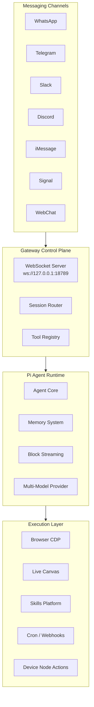

# OpenClaw: Deep Dive Tutorial

> **Project**: [OpenClaw](https://github.com/openclaw/openclaw) — Your own personal AI assistant. Any OS. Any Platform.

## What Is OpenClaw?

OpenClaw is an open-source, self-hosted personal AI assistant that connects to the messaging channels you already use — WhatsApp, Telegram, Slack, Discord, iMessage, Signal, and more. Everything runs locally, meaning your data stays on your hardware.

| Feature | Description |
|---------|-------------|
| **14+ Channels** | WhatsApp, Telegram, Slack, Discord, Signal, iMessage, Teams, and more |
| **Persistent Memory** | Long-term context, preferences, and history across sessions |
| **Task Automation** | Scripts, browser control, calendar, email, cron, webhooks |
| **Voice** | Speak and listen on macOS, iOS, Android via ElevenLabs TTS |
| **Live Canvas** | Agent-to-UI rendering with real-time content push |
| **50+ Skills** | 1Password, GitHub, Notion, Obsidian, Spotify, Trello, and more |
| **Multi-Model** | Claude and GPT support with failover and key rotation |
| **Security-First** | Pairing mode, Docker sandboxing, TCC permission management |

## Architecture Overview

## Tutorial Structure

| Chapter | Topic | What You'll Learn |
|---------|-------|-------------------|
| [1. Getting Started](01-getting-started.md) | Installation & Setup | Install OpenClaw, configure API keys, pair your first channel |
| [2. Gateway Architecture](02-gateway-architecture.md) | Control Plane | WebSocket server, session routing, message lifecycle |
| [3. Channel Drivers](03-channel-drivers.md) | Messaging Integration | WhatsApp/Telegram/Slack/Discord drivers, message routing |
| [4. Agent Runtime](04-agent-runtime.md) | Pi Agent System | Agent lifecycle, tool streaming, block streaming, multi-model |
| [5. Memory & Sessions](05-memory-sessions.md) | Persistence | Long-term memory, session types, context management |
| [6. Skills & Tools](06-skills-tools.md) | Extensibility | Skill platform, built-in tools, browser control, Canvas |
| [7. Security & Networking](07-security-networking.md) | Security Model | Pairing, sandboxing, Tailscale, remote gateway topology |
| [8. Production Deployment](08-production-deployment.md) | Operations | Docker, monitoring, scaling, multi-device orchestration |

## Tech Stack

| Component | Technology |
|-----------|-----------|
| **Core Runtime** | TypeScript, Node.js >= 22 |
| **macOS/iOS App** | Swift |
| **Android App** | Kotlin |
| **Build System** | pnpm monorepo |
| **WhatsApp** | Baileys |
| **Telegram** | grammY |
| **Slack** | Bolt |
| **Discord** | discord.js |
| **Browser** | Chrome DevTools Protocol (CDP) |
| **Networking** | Tailscale Serve / Funnel |
| **Sandboxing** | Docker |

## Prerequisites

- Node.js >= 22
- pnpm (for development)
- An Anthropic or OpenAI API key
- At least one messaging platform account (WhatsApp, Telegram, etc.)
- macOS, Linux, or Windows (via WSL2)

---

Ready to begin? Start with [Chapter 1: Getting Started](01-getting-started.md).

---

*Built with insights from the [OpenClaw repository](https://github.com/openclaw/openclaw) and community documentation.*
